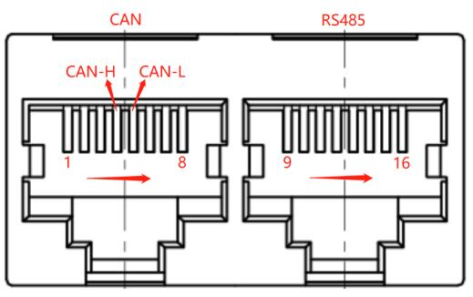
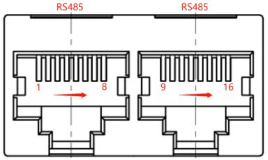
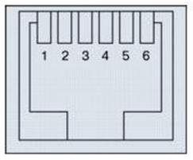

# Specification Confirmation

<table>
  <tr>
    <td>Customer Name</td>
    <td colspan="4">Gobel Power</td>
  </tr>
  <tr>
    <td>Customer Model</td>
    <td colspan="4"></td>
  </tr>
  <tr>
    <td>Customer Part Number</td>
    <td colspan="4"></td>
  </tr>
  <tr>
    <td>Product Model</td>
    <td colspan="4">P16S200A-ZL51706L20-K4-IOB</td>
  </tr>
  <tr>
    <td>Version</td>
    <td colspan="4">1.4</td>
  </tr>
  <tr>
    <td>Date</td>
    <td colspan="4">2025-11-10</td>
  </tr>
  <tr>
    <td rowspan="19">Accessories List</td>
    <td>No.</td>
    <td>Name</td>
    <td>Model</td>
    <td>Quantity</td>
  </tr>
  <tr>
    <td>1</td>
    <td>Protection Board</td>
    <td>P16S200A-51706-1.4</td>
    <td>1 piece</td>
  </tr>
  <tr>
    <td>2</td>
    <td>Display Board</td>
    <td>MD32K4-20666-3.0</td>
    <td>1 piece</td>
  </tr>
  <tr>
    <td>3</td>
    <td>Interface Board</td>
    <td>IOB-31834B-1.0</td>
    <td>1 piece</td>
  </tr>
  <tr>
    <td>4</td>
    <td>Screw</td>
    <td>M5*10 Screw</td>
    <td>4 pcs</td>
  </tr>
  <tr>
    <td>5</td>
    <td>Terminal Block</td>
    <td>KF2EDG-Y-3.81-4P-1G</td>
    <td>1 pc</td>
  </tr>
  <tr>
    <td>6</td>
    <td>Terminal Block</td>
    <td>KF2EDG-Y-3.81-2P-1G</td>
    <td>1 pc</td>
  </tr>
  <tr>
    <td>7</td>
    <td>Cable</td>
    <td>6P-300mm-6P-2.5X-1.1</td>
    <td>1 set</td>
  </tr>
  <tr>
    <td>8</td>
    <td>Cable</td>
    <td>10P(2.0S)-300mm-10P(2.5X)-1.1</td>
    <td>1 set</td>
  </tr>
  <tr>
    <td>9</td>
    <td>Cable</td>
    <td>10Px2-300mm-10Px2-2.5S-1.0</td>
    <td>1 set</td>
  </tr>
  <tr>
    <td>10</td>
    <td>Cable</td>
    <td>420mm-2P-2.5S-R19A-1.1</td>
    <td>1 set</td>
  </tr>
  <tr>
    <td>11</td>
    <td>Cable</td>
    <td>3.5P-245mm-tin-16AWG-1.0</td>
    <td>1 piece</td>
  </tr>
  <tr>
    <td>12</td>
    <td>Cable</td>
    <td>5P-500mm-5P-2.5X-1.1</td>
    <td>1 set</td>
  </tr>
  <tr>
    <td>13</td>
    <td>Cable</td>
    <td>500mm-3P-3.81-tin-1.0</td>
    <td>1 set</td>
  </tr>
  <tr>
    <td>14</td>
    <td>Cable</td>
    <td>P16S200A-ZL51706-Sampling Line 1-1.0</td>
    <td>1 set</td>
  </tr>
  <tr>
    <td>15</td>
    <td>Cable</td>
    <td>P16S200A-ZL51706-Sampling Line 2-1.0</td>
    <td>1 set</td>
  </tr>
  <tr>
    <td>16</td>
    <td>Cable</td>
    <td>P16S200A-ZL51706-Sampling Line 3-1.0</td>
    <td>1 set</td>
  </tr>
  <tr>
    <td>17</td>
    <td>Cable</td>
    <td>P16S200A-ZL51706-Sampling Line 4-1.0</td>
    <td>1 set</td>
  </tr>
  <tr>
    <td>18</td>
    <td>Cable</td>
    <td>3P-500mm-3P-2.5S-1.0</td>
    <td>1 set</td>
  </tr>
  <tr>
    <td colspan="3">Peicheng</td>
    <td colspan="2">Customer Confirmation</td>
  </tr>
  <tr>
    <td>Prepared by:</td>
    <td colspan="2">Wu Yibing</td>
    <td>Reviewed by:</td>
    <td></td>
  </tr>
  <tr>
    <td>Approved by:</td>
    <td colspan="2">Lu Junxiong</td>
    <td>Approved by:</td>
    <td></td>
  </tr>
</table>

# Contents

1. Introduction ........................................................................................................................................................................ 4
2. Features ................................................................................................................................................................ 4
3. Functional Block Diagram (For reference only, subject to the actual product) ........................................................................................................ 4
4. Environmental Requirements ................................................................................................................................................................ 5
5. Parameter Configuration ................................................................................................................................................................ 5
    5.1 Basic Parameter Settings ................................................................................................................................................ 5
    5.2 Basic Configuration ........................................................................................................................................................ 7
6. Main Function Description ........................................................................................................................................................ 10
    6.1 LED Indicator Description (Note: Logic reference below when selecting LED lights; logic reference in appendix when selecting light strips) ................................. 10
    6.2 Buzzer Action Description ............................................................................................................................................ 11
    6.3 Key Description ........................................................................................................................................................ 11
    6.4 Sleep and Wake-up .................................................................................................................................................... 11
    6.5 Balancing Condition Description ................................................................................................................................................ 12
7. Communication Description ................................................................................................................................................................ 12
    7.1 CAN Communication ........................................................................................................................................................ 12
    7.2 RS232 Communication .................................................................................................................................................... 12
    7.3 RS485 Communication .................................................................................................................................................... 12
    7.4 Parallel RS485 Communication ............................................................................................................................................ 12
    7.5 DIP Switch (Note: Logic reference below when selecting manual encoding) .................................................................................... 12
    7.6 Parallel Automatic Encoding (Default to automatic encoding when DIP is 0) ........................................................................................ 14
8. Interface Description ................................................................................................................................................................ 14
    8.1 Communication Interface Illustration ................................................................................................................................................ 14
    8.2 Interface Definition Description ................................................................................................................................................ 14
    8.3 Installation and Connection Description ................................................................................................................................................ 17
9. Physical Diagram and Dimensional Drawing .................................................................................................................................................... 18
10. Precautions for Use ...................................................................................................................................................... 22
11. Appendix ...................................................................................................................................................................... 23
    11.1 Colorful LED Lighting Logic .................................................................................................................................. 23
    11.2 MAP Table .......................................................................................................................................................... 24

Document Change Summary

<table>
  <tr>
    <th>Date</th>
    <th>Version</th>
    <th>Revision Description</th>
    <th>Prepared by</th>
    <th>Approved by</th>
  </tr>
  <tr>
    <td>2025-07-10</td>
    <td>1.0</td>
    <td>First edition issued.</td>
    <td>Wu Yibing</td>
    <td>Lu Junxiong</td>
  </tr>
  <tr>
    <td>2025-07-14</td>
    <td>1.1</td>
    <td>Software Changes: 1. Added customer-supplied Victron CAN protocol, upload data as required, and set as the default CAN protocol.</td>
    <td>Wu Yibing</td>
    <td>Lu Junxiong</td>
  </tr>
  <tr>
    <td>2025-09-09</td>
    <td>1.2</td>
    <td>Hardware/Software Changes: 1. Removed on-board Bluetooth WiFi module; customer to use external WiFi module.</td>
    <td>Wu Yibing</td>
    <td>Lu Junxiong</td>
  </tr>
  <tr>
    <td>2025-10-15</td>
    <td>1.3</td>
    <td>Software Changes: 1. J75 interface 232 protocol modified; 2. Supports 63 batteries in parallel; Accessories Changes: 1. Sampling line model changed, marked in yellow.</td>
    <td>Wu Yibing</td>
    <td>Lu Junxiong</td>
  </tr>
  <tr>
    <td>2025-11-10</td>
    <td>1.4</td>
    <td>Software Changes: 1. Active equalization logic adjustment; 2. Other requirements [17] modified.</td>
    <td>Wu Yibing</td>
    <td>Lu Junxiong</td>
  </tr>
  <tr>
    <td></td>
    <td></td>
    <td></td>
    <td></td>
    <td></td>
  </tr>
  <tr>
    <td></td>
    <td></td>
    <td></td>
    <td></td>
    <td></td>
  </tr>
  <tr>
    <td></td>
    <td></td>
    <td></td>
    <td></td>
    <td></td>
  </tr>
  <tr>
    <td></td>
    <td></td>
    <td></td>
    <td></td>
    <td></td>
  </tr>
  <tr>
    <td></td>
    <td></td>
    <td></td>
    <td></td>
    <td></td>
  </tr>
  <tr>
    <td></td>
    <td></td>
    <td></td>
    <td></td>
    <td></td>
  </tr>
  <tr>
    <td></td>
    <td></td>
    <td></td>
    <td></td>
    <td></td>
  </tr>
  <tr>
    <td></td>
    <td></td>
    <td></td>
    <td></td>
    <td></td>
  </tr>
  <tr>
    <td></td>
    <td></td>
    <td></td>
    <td></td>
    <td></td>
  </tr>
  <tr>
    <td></td>
    <td></td>
    <td></td>
    <td></td>
    <td></td>
  </tr>
  <tr>
    <td></td>
    <td></td>
    <td></td>
    <td></td>
    <td></td>
  </tr>
  <tr>
    <td></td>
    <td></td>
    <td></td>
    <td></td>
    <td></td>
  </tr>
  <tr>
    <td></td>
    <td></td>
    <td></td>
    <td></td>
    <td></td>
  </tr>
  <tr>
    <td></td>
    <td></td>
    <td></td>
    <td></td>
    <td></td>
  </tr>
  <tr>
    <td></td>
    <td></td>
    <td></td>
    <td></td>
    <td></td>
  </tr>
  <tr>
    <td></td>
    <td></td>
    <td></td>
    <td></td>
    <td></td>
  </tr>
  <tr>
    <td></td>
    <td></td>
    <td></td>
    <td></td>
    <td></td>
  </tr>
  <tr>
    <td></td>
    <td></td>
    <td></td>
    <td></td>
    <td></td>
  </tr>
  <tr>
    <td></td>
    <td></td>
    <td></td>
    <td></td>
    <td></td>
  </tr>
  <tr>
    <td></td>
    <td></td>
    <td></td>
    <td></td>
    <td></td>
  </tr>
</table>

# 1. Introduction

BMS (Battery Management System) is a system that monitors and controls the state of the battery so that the battery can be used safely and for a long term. The main purpose is to intelligently manage and maintain each battery unit, monitor the status of the battery, prevent the battery from overcharging and over-discharging, so as to extend the service life of the battery. This product is suitable for household energy storage batteries.

# 2. Features

- It has 16-channel cell voltage and total voltage detection, overcharge and over-discharge alarm and protection functions. The static voltage sampling accuracy can reach ≤10mV at room temperature.
- It has charge and discharge current detection, charge and discharge overcurrent alarm and protection functions. The charging current is displayed as positive, and the discharging current is displayed as negative. The current sampling accuracy can reach ≤2%@FS at room temperature. Reserved charge and discharge current detection, charge and discharge overcurrent alarm and protection functions. The charging current is displayed as positive, and the discharging current is displayed as negative. The current sampling accuracy can reach ≤2%@FS at room temperature.
- It has 4-channel cell temperature detection, cell high and low temperature alarm and protection functions. The temperature sampling accuracy can reach ≤2℃ at room temperature.
- With short-circuit protection function.
- With charge balancing function.
- Supports cell capacity estimation function. The full charge capacity, current capacity, and design capacity of the battery pack can be set through the upper computer, and the capacity can be automatically updated after a complete charge and discharge cycle.
- Supports upper computer software control function, which can conveniently set protection parameters such as overcharge, over-discharge, charge/discharge current, over-temperature, and under-temperature, as well as parameters such as capacity, sleep, and equilibrium through the upper computer software.
- It has RS232, RS485, and CAN communication interfaces.
- Has multiple sleep and wake-up modes.
- Has functions such as reset switch and automatic encoding.
- It has LCD interface (optional), charging current limiting, buzzer, LED and other functions.
- Supports online upgrade.

# 3. Functional Block Diagram (For reference only, subject to the actual product)

# 4. Environmental Requirements

<table>
  <tr>
    <th>Item</th>
    <th>Parameter</th>
    <th>Unit</th>
  </tr>
  <tr>
    <td>Operating Temperature</td>
    <td>-20 ～ 60</td>
    <td>℃</td>
  </tr>
  <tr>
    <td>Storage Temperature</td>
    <td>-20 ～ 75</td>
    <td>℃</td>
  </tr>
  <tr>
    <td>Operating Humidity</td>
    <td>10 ～ 85</td>
    <td>%RH</td>
  </tr>
  <tr>
    <td>Storage Humidity</td>
    <td>10 ～ 85</td>
    <td>%RH</td>
  </tr>
</table>

# 5. Parameter Configuration

## 5.1 Basic Parameter Settings

<table>
  <tr>
    <th>No.</th>
    <th colspan="2">Indicator Item</th>
    <th>Factory Default Parameter</th>
    <th>Settable?</th>
    <th>Remarks</th>
  </tr>
  <tr>
    <td rowspan="6">1</td>
    <td rowspan="3">Cell Overcharge Protection</td>
    <td>Cell Overcharge Alarm Voltage</td>
    <td>3600mV</td>
    <td>Yes</td>
    <td></td>
  </tr>
  <tr>
    <td>Cell Overcharge Protection Voltage</td>
    <td>3650mV</td>
    <td>Yes</td>
    <td></td>
  </tr>
  <tr>
    <td>Cell Overcharge Protection Delay</td>
    <td>1.0S</td>
    <td>Yes</td>
    <td></td>
  </tr>
  <tr>
    <td rowspan="3">Cell Overvoltage Protection Release</td>
    <td>Cell Overcharge Protection Release Voltage</td>
    <td>3400mV</td>
    <td>Yes</td>
    <td></td>
  </tr>
  <tr>
    <td>Capacity Release</td>
    <td>SOC < 96%</td>
    <td>Yes</td>
    <td></td>
  </tr>
  <tr>
    <td>Discharge Release</td>
    <td colspan="2">Discharge Current > 2A</td>
    <td></td>
  </tr>
  <tr>
    <td rowspan="5">2</td>
    <td rowspan="3">Cell Over-discharge Protection</td>
    <td>Cell Over-discharge Alarm Voltage</td>
    <td>2600mV</td>
    <td>Yes</td>
    <td></td>
  </tr>
  <tr>
    <td>Cell Over-discharge Protection Voltage</td>
    <td>2500mV</td>
    <td>Yes</td>
    <td></td>
  </tr>
  <tr>
    <td>Cell Over-discharge Protection Delay</td>
    <td>1.0S</td>
    <td>Yes</td>
    <td></td>
  </tr>
  <tr>
    <td rowspan="2">Cell Over-discharge Protection Release</td>
    <td>Cell Over-discharge Protection Release Voltage</td>
    <td>2900mV</td>
    <td>Yes</td>
    <td></td>
  </tr>
  <tr>
    <td>Release when charging</td>
    <td colspan="2">Can be activated by connecting charger</td>
    <td></td>
  </tr>
  <tr>
    <td rowspan="6">3</td>
    <td rowspan="3">Total Overcharge Protection</td>
    <td>Total Overcharge Alarm Voltage</td>
    <td>56.5V</td>
    <td>Yes</td>
    <td></td>
  </tr>
  <tr>
    <td>Total Overcharge Protection Voltage</td>
    <td>58.4V</td>
    <td>Yes</td>
    <td></td>
  </tr>
  <tr>
    <td>Total Overcharge Protection Delay</td>
    <td>1.0S</td>
    <td>Yes</td>
    <td></td>
  </tr>
  <tr>
    <td rowspan="3">Total Overvoltage Protection Release</td>
    <td>Total Overcharge Protection Release Voltage</td>
    <td>54.4V</td>
    <td>Yes</td>
    <td></td>
  </tr>
  <tr>
    <td>Capacity Release</td>
    <td>SOC < 96%</td>
    <td>Yes</td>
    <td></td>
  </tr>
  <tr>
    <td>Discharge Release</td>
    <td colspan="2">Discharge Current > 2A</td>
    <td></td>
  </tr>
  <tr>
    <td rowspan="5">4</td>
    <td rowspan="3">Total Over-discharge Protection</td>
    <td>Total Over-discharge Alarm Voltage</td>
    <td>44V</td>
    <td>Yes</td>
    <td></td>
  </tr>
  <tr>
    <td>Total Over-discharge Protection Voltage</td>
    <td>40V</td>
    <td>Yes</td>
    <td></td>
  </tr>
  <tr>
    <td>Total Over-discharge Protection Delay</td>
    <td>1.0S</td>
    <td>Yes</td>
    <td></td>
  </tr>
  <tr>
    <td rowspan="2">Total Over-discharge Protection Release</td>
    <td>Total Over-discharge Protection Release Voltage</td>
    <td>46.5V</td>
    <td>Yes</td>
    <td></td>
  </tr>
  <tr>
    <td>Release when charging</td>
    <td colspan="2">Can be activated by connecting charger</td>
    <td></td>
  </tr>
  <tr>
    <td rowspan="5">5</td>
    <td rowspan="3">Charging Overcurrent Protection</td>
    <td>Charging Overcurrent Alarm Current</td>
    <td>145A</td>
    <td>Yes</td>
    <td rowspan="5">Occurring 10 consecutive times will lock this state; no automatic release</td>
  </tr>
  <tr>
    <td>Charging Overcurrent 1 Protection Current</td>
    <td>210A</td>
    <td>Yes</td>
  </tr>
  <tr>
    <td>Charging Overcurrent Protection Delay</td>
    <td>1.0S</td>
    <td>Yes</td>
  </tr>
  <tr>
    <td rowspan="2">Charging Overcurrent Protection Release</td>
    <td>Automatic Release</td>
    <td colspan="2">Automatic release after 1min</td>
  </tr>
  <tr>
    <td>Discharge Release</td>
    <td colspan="2">Discharge Current > 1A</td>
  </tr>
  <tr>
    <td rowspan="5">6</td>
    <td rowspan="3">Discharge Overcurrent 1 Protection</td>
    <td>Discharge Overcurrent 1 Alarm Current</td>
    <td>155A</td>
    <td>Yes</td>
    <td rowspan="5">Occurring 10 consecutive times will lock this state; no automatic release</td>
  </tr>
  <tr>
    <td>Discharge Overcurrent 1 Protection Current</td>
    <td>210A</td>
    <td>Yes</td>
  </tr>
  <tr>
    <td>Discharge Overcurrent 1 Protection Delay</td>
    <td>1.0S</td>
    <td>Yes</td>
  </tr>
  <tr>
    <td rowspan="2">Discharge Overcurrent 1 Protection Release</td>
    <td>Automatic Release</td>
    <td colspan="2">Automatic release after 1min</td>
  </tr>
  <tr>
    <td>Charging Release</td>
    <td colspan="2">Charging Current > 1A</td>
  </tr>
  <tr>
    <td rowspan="3">7</td>
    <td rowspan="2">Discharge Overcurrent 2</td>
    <td>Discharge Overcurrent 2 Protection Current</td>
    <td>≥250A</td>
    <td>Yes</td>
    <td rowspan="3">Occurring 10 consecutive times will lock this state; no automatic release</td>
  </tr>
  <tr>
    <td>Discharge Overcurrent 2 Protection Delay</td>
    <td>500mS</td>
    <td>Yes</td>
  </tr>
  <tr>
    <td>Discharge Overcurrent 2 Protection Release</td>
    <td>Automatic Release</td>
    <td colspan="2">Automatic release after 1min</td>
  </tr>
  <tr>
    <td rowspan="3">8</td>
    <td rowspan="3">Short Circuit Protection</td>
    <td>Charging Release</td>
    <td colspan="2">Charging Current > 1A</td>
    <td></td>
  </tr>
  <tr>
    <td>Short Circuit Protection Function</td>
    <td colspan="2">Yes (Function enabled by default)</td>
    <td rowspan="2">Occurring 10 consecutive times will lock this state; no automatic release</td>
  </tr>
  <tr>
    <td>Short Circuit Protection Release</td>
    <td colspan="2">When there is charging, short circuit protection release; after load removal, it will release automatically</td>
  </tr>
  <tr>
    <td rowspan="3">9</td>
    <td rowspan="3">MOS High Temperature Protection</td>
    <td>MOS Overtemperature Alarm Temperature</td>
    <td>90℃</td>
    <td>Yes</td>
    <td></td>
  </tr>
  <tr>
    <td>MOS Overtemperature Protection Temperature</td>
    <td>115℃</td>
    <td>Yes</td>
    <td></td>
  </tr>
  <tr>
    <td>MOS Protection Release Temperature</td>
    <td>85℃</td>
    <td>Yes</td>
    <td></td>
  </tr>
  <tr>
    <td rowspan="12">10</td>
    <td rowspan="12">Cell Temperature Protection</td>
    <td>Charging Low Temperature Alarm Temperature</td>
    <td>5℃</td>
    <td>Yes</td>
    <td></td>
  </tr>
  <tr>
    <td>Charging Low Temperature Protection Temperature</td>
    <td>0℃</td>
    <td>Yes</td>
    <td></td>
  </tr>
  <tr>
    <td>Charging Low Temperature Protection Release Temperature</td>
    <td>10℃</td>
    <td>Yes</td>
    <td></td>
  </tr>
  <tr>
    <td>Charging High Temperature Alarm Temperature</td>
    <td>50℃</td>
    <td>Yes</td>
    <td></td>
  </tr>
  <tr>
    <td>Charging High Temperature Protection Temperature</td>
    <td>55℃</td>
    <td>Yes</td>
    <td></td>
  </tr>
  <tr>
    <td>Charging High Temperature Protection Release Temperature</td>
    <td>50℃</td>
    <td>Yes</td>
    <td></td>
  </tr>
  <tr>
    <td>Discharge Low Temperature Alarm Temperature</td>
    <td>-15℃</td>
    <td>Yes</td>
    <td></td>
  </tr>
  <tr>
    <td>Discharge Low Temperature Protection Temperature</td>
    <td>-20℃</td>
    <td>Yes</td>
    <td></td>
  </tr>
  <tr>
    <td>Discharge Low Temperature Protection Release Temperature</td>
    <td>-15℃</td>
    <td>Yes</td>
    <td></td>
  </tr>
  <tr>
    <td>Discharge High Temperature Alarm Temperature</td>
    <td>50℃</td>
    <td>Yes</td>
    <td></td>
  </tr>
  <tr>
    <td>Discharge High Temperature Protection Temperature</td>
    <td>55℃</td>
    <td>Yes</td>
    <td></td>
  </tr>
  <tr>
    <td>Discharge High Temperature Protection Release Temperature</td>
    <td>50℃</td>
    <td>Yes</td>
    <td></td>
  </tr>
  <tr>
    <td rowspan="6">11</td>
    <td rowspan="6">Ambient Temperature Alarm</td>
    <td>Ambient Low Temperature Alarm Temperature</td>
    <td>-20℃</td>
    <td>Yes</td>
    <td></td>
  </tr>
  <tr>
    <td>Ambient Low Temperature Protection Temperature</td>
    <td>-30℃</td>
    <td>Yes</td>
    <td></td>
  </tr>
  <tr>
    <td>Ambient Low Temperature Protection Release Temperature</td>
    <td>-20℃</td>
    <td>Yes</td>
    <td></td>
  </tr>
  <tr>
    <td>Ambient High Temperature Alarm Temperature</td>
    <td>55℃</td>
    <td>Yes</td>
    <td></td>
  </tr>
  <tr>
    <td>Ambient High Temperature Protection Temperature</td>
    <td>65℃</td>
    <td>Yes</td>
    <td></td>
  </tr>
  <tr>
    <td>Ambient High Temperature Protection Release Temperature</td>
    <td>55℃</td>
    <td>Yes</td>
    <td></td>
  </tr>
  <tr>
    <td rowspan="2">12</td>
    <td rowspan="2">Current Consumption</td>
    <td>Self-consumption Current During Operation</td>
    <td colspan="2">≤45mA</td>
    <td></td>
  </tr>
  <tr>
    <td>Low Power Mode Current</td>
    <td colspan="2">≤200μA</td>
    <td></td>
  </tr>
  <tr>
    <td rowspan="2">13</td>
    <td rowspan="2">Balancing Function</td>
    <td>Balancing Turn-on Voltage</td>
    <td>> 3400mV</td>
    <td>Yes</td>
    <td></td>
  </tr>
  <tr>
    <td>Turn-on Voltage Difference</td>
    <td>> 30mV</td>
    <td>Yes</td>
    <td></td>
  </tr>
  <tr>
    <td>14</td>
    <td>Capacity Default Setting</td>
    <td>Low Battery Alarm Threshold</td>
    <td>SOC < 5%</td>
    <td>Yes</td>
    <td>No alarm during charging</td>
  </tr>
  <tr>
    <td rowspan="2">15</td>
    <td rowspan="2">Sleep Function</td>
    <td>Sleep Voltage</td>
    <td>< 3150mV</td>
    <td>Yes</td>
    <td></td>
  </tr>
  <tr>
    <td>Delay Time</td>
    <td>5min</td>
    <td>Yes</td>
    <td></td>
  </tr>
  <tr>
    <td>16</td>
    <td>Cell Failure Protection</td>
    <td>Cell Voltage Difference</td>
    <td>> 1V Protection</td>
    <td>No</td>
    <td>Charging not allowed</td>
  </tr>
  <tr>
    <td rowspan="2">17</td>
    <td rowspan="2">Full Charge Judgment</td>
    <td>Full Charge Voltage</td>
    <td>≥55.2V</td>
    <td>Yes</td>
    <td rowspan="2">Update SOC to 100%</td>
  </tr>
  <tr>
    <td>Cut-off Current</td>
    <td>≤5A</td>
    <td>Yes</td>
  </tr>
</table>

Note: The above parameter settings are standard settings at 25℃ ambient temperature; performance at different temperatures will vary.

## 5.2 Basic Configuration

<table>
  <tr>
    <th rowspan="18">Function</th>
    <td>Storage</td>
    <td colspan="3">□None □Store 400 entries ☑Store 10,000 entries</td>
  </tr>
  <tr>
    <td>Cell Capacity</td>
    <td colspan="3">□50AH □100AH □150AH □200AH ☑ 280 AH</td>
  </tr>
  <tr>
    <td>Display Interface</td>
    <td colspan="3">□None □Chinese Intelligent □English Intelligent ☑Yes</td>
  </tr>
  <tr>
    <td>Charge Current Limiting</td>
    <td colspan="3">□None □5A □10A ☑20A □ A Definition: Enabled when charging current > 200A</td>
  </tr>
  <tr>
    <td>Dry Contact</td>
    <td colspan="3">□None ☑Yes Definition: Dry Contact 1-PIN1 to PIN2: Normally Open, Closed during fault protection; Dry Contact 2-PIN3 to PIN4: Normally Open, Closed during low battery alarm.</td>
  </tr>
  <tr>
    <td>Heating Film Interface</td>
    <td colspan="3">□None ☑Yes (Heating film socket not soldered; customer provides socket and solders it; other hardware circuits remains) Definition: Heating film turn-on temperature link (Charging Low Temperature Alarm Temperature + 1), Heating film turn-off temperature link charging low temperature protection release temperature. When BMS enters charging low temperature protection state, charging MOS is turned off, adding heating film request charging current to 10A (separate from regular request charging current); in standby, if battery shows charging low temperature protection state, heating film request charging current is 10A * number of charging low temperature protection states; can be modified by upper computer.</td>
  </tr>
  <tr>
    <td>CAN Parallel</td>
    <td colspan="3">☑No □Yes Definition:</td>
  </tr>
  <tr>
    <td>Tripper Interface</td>
    <td colspan="3">□None ☑Yes Definition: 1. After charging MOS is turned off, if charging current is detected, starts after 8S duration. 2. After discharging MOS is turned off, if discharging current is detected, starts after 8S duration.</td>
  </tr>
  <tr>
    <td>Certification Function Interface</td>
    <td>☑MCU External Watchdog</td>
    <td>☑Dual Total Voltage Detection</td>
    <td>☑Dual Current Detection</td>
  </tr>
  <tr>
    <td>Low Power Switch</td>
    <td colspan="3">□No ☑Yes</td>
  </tr>
  <tr>
    <td>Buzzer</td>
    <td colspan="3">□No ☑Yes</td>
  </tr>
  <tr>
    <td>Positioning Function Interface</td>
    <td colspan="3">□No ☑Yes</td>
  </tr>
  <tr>
    <td>Bluetooth & WIFI</td>
    <td colspan="3">□No ☑Yes</td>
  </tr>
  <tr>
    <td>Light Strip Interface</td>
    <td colspan="3">□No ☑Yes</td>
  </tr>
  <tr>
    <td>DIP Switch</td>
    <td colspan="3">□No □2-bit □4-bit ☑6-bit ☑Auto Encoding</td>
  </tr>
  <tr>
    <td>LED Light</td>
    <td colspan="3">□None ☑ALM ☑RUN ☑ON/OFF ☑SOC 6 pcs</td>
  </tr>
  <tr>
    <td>Sampling Socket</td>
    <td colspan="3">☑Vertical □Horizontal</td>
  </tr>
  <tr>
    <td>Barcode</td>
    <td colspan="3">□1D Code □QR Code</td>
  </tr>
  <tr>
    <th rowspan="3">Communication</th>
    <td>Communication Interface</td>
    <td colspan="3">☑RS232 ☑RS485 ☑Parallel RS485 ☑CAN</td>
  </tr>
  <tr>
    <td>Parallel Mode</td>
    <td colspan="3">□None ☑RS485 □CAN</td>
  </tr>
  <tr>
    <td>Upgrade Mode</td>
    <td colspan="3">☑RS232 □RS485</td>
  </tr>
  <tr>
    <th rowspan="5">Other Requirements</th>
    <td>1</td>
    <td colspan="3">Auto encoding allows master to wake up slave; slave can wake up automatically after master wakes up.</td>
  </tr>
  <tr>
    <td>2</td>
    <td colspan="3">LED and light strip function logic compatible (choose one).</td>
  </tr>
  <tr>
    <td>3</td>
    <td colspan="3">Manual encoding and auto encoding compatibility (choose one).</td>
  </tr>
  <tr>
    <td>4</td>
    <td colspan="3">Active balancing maximum supports 2A.</td>
  </tr>
  <tr>
    <td>5</td>
    <td colspan="3">Added customer-supplied MAP table, see appendix; Table values are coefficients (please ignore units); Standalone: Requested Charging Current = Coefficient in Table X 2 X Charging Overcurrent Alarm Value;</td>
  </tr>
</table>

<table>
  <tr>
    <th rowspan="18">Other Requirements</th>
    <td>6</td>
    <td>Requested Discharging Current = Coefficient X Discharge Overcurrent 1 Alarm Value; Parallel: Check requested current of each unit separately, then take the minimum current and multiply by (Number of Parallel Units - Number of Protected Units). Add Protocols: RS485: Pengcheng CAN: Schneider, Victron, Pengcheng, SMA, Tenergy Innovation, Must, Ginlong, Sorede, TBB, Megarevo</td>
  </tr>
  <tr>
    <td>7</td>
    <td>Add heating film function: Definition: Heating film turn-on temperature link (Charging Low Temperature Alarm Temperature + 1), Heating film turn-off temperature link charging low temperature protection release temperature, can be modified by upper computer.</td>
  </tr>
  <tr>
    <td>8</td>
    <td>Heating film socket on motherboard not soldered (customer provides socket and solders it personally).</td>
  </tr>
  <tr>
    <td>9</td>
    <td>BMS must support parallel protocol functions.</td>
  </tr>
  <tr>
    <td>10</td>
    <td>Realized full charge judgment voltage changed to "Full Charge Judgment Voltage - 0.5V", Requested Charging Voltage = Original Full Charge Judgment Voltage.</td>
  </tr>
  <tr>
    <td>11</td>
    <td>1. In 010-Victron CAN 2021.01.07 (Victron) protocol, when balancing is enabled, cancel BMS uploading inverter voltage alarm value. 2. In 001-PYLON CAN Inverter EMS protocol, modify logic marker 1 and 2 ranges: Forced charge marker 1's Bit5 is Low Battery Alarm Value - Low Battery Alarm Value + 2%; Forced charge marker 2's Bit4 is Low Battery Alarm Value + 1 - Low Battery Alarm Value + 3%; Forced charge off: Low Battery Alarm Value + 10%.</td>
  </tr>
  <tr>
    <td>12</td>
    <td>BMS enables self-consumption when not in sleep state, disabled in sleep state; power is 7W.</td>
  </tr>
  <tr>
    <td>13</td>
    <td>RS232 baud rate modified to 115200.</td>
  </tr>
  <tr>
    <td>14</td>
    <td>Supports multi-protocol selection, see upper computer protocol selection interface for details.</td>
  </tr>
  <tr>
    <td>15</td>
    <td>Import Haiyu standard SOC algorithm.</td>
  </tr>
  <tr>
    <td>16</td>
    <td>Requested logic: 1. Trigger once for 5S only when conditions are first met. If SOC is greater than intermittent charging threshold, request "low requested voltage" from inverter; otherwise, under normal conditions, request "normal requested voltage" from inverter. 2. Intermittent charging threshold: Take Gap Charge Threshold value, default 95 (settable). 3. Low requested voltage: Take Pack OVP Release value (settable). 4. Normal requested voltage: Take Pack FullCharge Voltage value (settable).</td>
  </tr>
  <tr>
    <td>17</td>
    <td>Aim: 1. When battery SOC is lower than a certain value (TSOC), request maximum discharging current = -10 from inverter. 2. When battery voltage is lower than a certain value (PACK_UV_ALARM), request maximum discharging current = 0 from inverter.  Definition: SOC: Current battery SOC (take average SOC of all packs). VOL: Current battery voltage (take average voltage of all packs). SOC_LOW_ALARM: SOC Low Alarm (%) value in software settings (take master setting value). PACK_UV_ALARM: Pack UV Alarm (V) value in software settings (take master setting value). TSOC: A variable. TSOC_STATE: Indicates whether current maximum discharging current request to inverter is -10 due to SOC, default is 0. TVOL_STATE: Indicates whether current maximum discharging current request to inverter is 0 due to voltage, default is 0. Baseline Maximum Discharging Current: DCG_OC_ALARM value in software settings * MAP coefficient, used as maximum discharging current requested from inverter.</td>
  </tr>
  <tr>
    <td>17</td>
    <td>TSOC Value: 1. When SOC_LOW_ALARM <= 5%, TSOC is fixed at SOC_LOW_ALARM (aim is to leave a port so as not to use TSOC dynamic change logic). 2. When SOC_LOW_ALARM > 5%, TSOC value will change.  TSOC Speed Change: 1. If battery does not trigger full charge condition for multiple consecutive days: At 96 hours and above, increase TSOC to 50%. At 192 hours and above, increase TSOC to 70%. 2. Once full charge condition is triggered, TSOC is reset to SOC_LOW_ALARM.  Request Maximum Discharging Current from Inverter: 1. If SOC < TSOC, set TSOC_STATE = 1. 2. If VOL < PACK_UV_ALARM, set TVOL_STATE = 1. 3. If TVOL_STATE = 1, request maximum discharging current = 0 from inverter. 4. If TVOL_STATE = 0 and TSOC_STATE = 1, request maximum discharging current = -10 from inverter. Recovery of Requested Maximum Discharging Current from Inverter: 1. If SOC > TSOC + 20%, set TSOC_STATE = 0. 2. If VOL > PACK_UV_ALARM + 3V, set TVOL_STATE = 0. 3. If TSOC_STATE = 0 and TVOL_STATE = 0, request maximum discharging current = Baseline Maximum Discharging Current from inverter.</td>
  </tr>
  <tr>
    <td>18</td>
    <td>When paralleled, upload total voltage and total current to inverter.</td>
  </tr>
  <tr>
    <td>19</td>
    <td>Remove on-board Bluetooth WIFI module; J75 external Bluetooth WIFI interface needs to retain circuit and socket; customer to use external WIFI module. J75-External Bluetooth WIFI interface made into RS232 protocol, baud rate 115200.</td>
  </tr>
  <tr>
    <td>20</td>
    <td>Supports 63 batteries in parallel.</td>
  </tr>
  <tr>
    <td>21</td>
    <td>Added Weijiamo multi-CAN protocol, corresponding internal protocol number: 010-Victron_CAN_2023.09.22, and set as default CAN protocol. BMS Upload Data Requirements: 0x35E upload: Gobel 0x370 upload: Gobel 0x371 upload: Power 0x360 report padding 0x378 report cumulative charge/discharge capacity</td>
  </tr>
  <tr>
    <td>22</td>
    <td>J75-External Bluetooth WIFI interface RS232 protocol modification: Change normal response RTN = 0x00 to RTN = Cmd (Bms received command code).</td>
  </tr>
  <tr>
    <th rowspan="18">Other Requirements</th>
    <td>23</td>
    <td>Modify active balancing strategy: Balancing turn-on voltage value locked according to balancing turn-on voltage (settable via upper computer), as shown below: a. Static turn-on condition: Gmax > Balancing Turn-on Voltage AND Voltage Difference > 30mv. b. Static turn-off condition: Gmax < Balancing Turn-on Voltage OR Voltage Difference < 20mv. c. Charging turn-on condition: Gmax > Balancing Turn-on Voltage AND Voltage Difference > 50mv. d. Charging turn-off condition: Gmax < Balancing Turn-on Voltage OR Voltage Difference < 40mv. e. Turn-on/turn-off voltage difference increases by 1mv every 500 cycles, maximum 20mv. f. Maximum operation time for one turn-on is 1H; after turning off balancing, must wait 10min for next turn-on. g. Battery quantity follows 16S logic. h. Does not start if average voltage > 3625mv. j. Does not start if voltage difference > 1000mv. k. Does not start during high temperature alarm. l. Does not start during fault. m. Does not start during temperature protection. n. Can start during overvoltage protection; does not start during undervoltage protection. o. Remove logic for not starting when current > 0.5C. p. Defined as static when current < 2A. q. Judge whether to turn on or change balancing battery every minute.</td>
  </tr>
</table>

## 6. Main Function Description

### 6.1 LED Indicator Description (Note: Logic reference below when selecting LED lights; logic reference in appendix when selecting light strips)

Table 1 LED Operating Status Indication

<table>
  <tr>
    <th rowspan="2">Status</th>
    <th rowspan="2">Normal/Alarm/Protection</th>
    <th rowspan="2">ON/OFF</th>
    <th rowspan="2">RUN</th>
    <th rowspan="2">ALM</th>
    <th colspan="6">Power Indication LED</th>
    <th rowspan="2">Description</th>
  </tr>
  <tr>
    <th>L6 ●</th>
    <th>L5 ●</th>
    <th>L4 ●</th>
    <th>L3 ●</th>
    <th>L2 ●</th>
    <th>L1 ●</th>
  </tr>
  <tr>
    <td>Power Off</td>
    <td>Sleep</td>
    <td>Off</td>
    <td>Off</td>
    <td>Off</td>
    <td>Off</td>
    <td>Off</td>
    <td>Off</td>
    <td>Off</td>
    <td>Off</td>
    <td>Off</td>
    <td>All Off</td>
  </tr>
  <tr>
    <td rowspan="2">Standby</td>
    <td>Normal</td>
    <td>Always On</td>
    <td>Flash 1</td>
    <td>Off</td>
    <td colspan="6" rowspan="2">According to power indication</td>
    <td>Standby state</td>
  </tr>
  <tr>
    <td>Alarm</td>
    <td>Always On</td>
    <td>Flash 1</td>
    <td>Flash 3</td>
    <td>Module Low Voltage</td>
  </tr>
  <tr>
    <td rowspan="3">Charging</td>
    <td>Normal</td>
    <td>Always On</td>
    <td>Always On</td>
    <td>Off</td>
    <td colspan="6" rowspan="2">According to power indication (Highest indicator flashes L2)</td>
    <td>Highest power LED flashes (Flash 2), ALM does not flash during overcharge alarm</td>
  </tr>
  <tr>
    <td>Alarm</td>
    <td>Always On</td>
    <td>Always On</td>
    <td>Flash 3</td>
    <td></td>
  </tr>
  <tr>
    <td>Overcharge Protection</td>
    <td>Always On</td>
    <td>Always On</td>
    <td>Off</td>
    <td>Always On</td>
    <td>Always On</td>
    <td>Always On</td>
    <td>Always On</td>
    <td>Always On</td>
    <td>Always On</td>
    <td>If no mains power, indicators switch to standby state</td>
  </tr>
  <tr>
    <td rowspan="3">Discharging</td>
    <td>Temperature, Overcurrent, Failure Protection</td>
    <td>Always On</td>
    <td>Off</td>
    <td>Always On</td>
    <td>Off</td>
    <td>Off</td>
    <td>Off</td>
    <td>Off</td>
    <td>Off</td>
    <td>Off</td>
    <td>Stop Charging</td>
  </tr>
  <tr>
    <td>Normal</td>
    <td>Always On</td>
    <td>Flash 3</td>
    <td>Off</td>
    <td colspan="6" rowspan="2">According to power indication</td>
    <td></td>
  </tr>
  <tr>
    <td>Alarm</td>
    <td>Always On</td>
    <td>Flash 3</td>
    <td>Flash 3</td>
    <td></td>
  </tr>
  <tr>
    <td></td>
    <td>Undervoltage Protection</td>
    <td>Always On</td>
    <td>Off</td>
    <td>Off</td>
    <td>Off</td>
    <td>Off</td>
    <td>Off</td>
    <td>Off</td>
    <td>Off</td>
    <td>Off</td>
    <td>Stop Discharging</td>
  </tr>
  <tr>
    <td></td>
    <td>Temperature, Overcurrent, Short Circuit, Failure Protection</td>
    <td>Always On</td>
    <td>Off</td>
    <td>Always On</td>
    <td>Off</td>
    <td>Off</td>
    <td>Off</td>
    <td>Off</td>
    <td>Off</td>
    <td>Off</td>
    <td>Stop Discharging</td>
  </tr>
  <tr>
    <td>Failure</td>
    <td></td>
    <td>Off</td>
    <td>Off</td>
    <td>Always On</td>
    <td>Off</td>
    <td>Off</td>
    <td>Off</td>
    <td>Off</td>
    <td>Off</td>
    <td>Off</td>
    <td>Stop Charging and Discharging</td>
  </tr>
</table>

Table 2 Capacity Indication Description

<table>
  <tr>
    <th colspan="2">Status</th>
    <th colspan="6">Charging</th>
    <th colspan="6">Discharging</th>
  </tr>
  <tr>
    <td colspan="2">Capacity Indicator</td>
    <td>L6 ●</td>
    <td>L5 ●</td>
    <td>L4 ●</td>
    <td>L3 ●</td>
    <td>L2 ●</td>
    <td>L1 ●</td>
    <td>L6 ●</td>
    <td>L5 ●</td>
    <td>L4 ●</td>
    <td>L3 ●</td>
    <td>L2 ●</td>
    <td>L1 ●</td>
  </tr>
  <tr>
    <td>Power (%)</td>
    <td>0% ~ 17%</td>
    <td>Off</td>
    <td>Off</td>
    <td>Off</td>
    <td>Off</td>
    <td>Off</td>
    <td>Flash 2</td>
    <td>Off</td>
    <td>Off</td>
    <td>Off</td>
    <td>Off</td>
    <td>Off</td>
    <td>Always On</td>
  </tr>
  <tr>
    <td></td>
    <td>18% ~ 33%</td>
    <td>Off</td>
    <td>Off</td>
    <td>Off</td>
    <td>Off</td>
    <td>Flash 2</td>
    <td>Always On</td>
    <td>Off</td>
    <td>Off</td>
    <td>Off</td>
    <td>Off</td>
    <td>Always On</td>
    <td>Always On</td>
  </tr>
  <tr>
    <td></td>
    <td>34% ~ 50%</td>
    <td>Off</td>
    <td>Off</td>
    <td>Off</td>
    <td>Flash 2</td>
    <td>Always On</td>
    <td>Always On</td>
    <td>Off</td>
    <td>Off</td>
    <td>Off</td>
    <td>Always On</td>
    <td>Always On</td>
    <td>Always On</td>
  </tr>
  <tr>
    <td></td>
    <td>51% ~ 66%</td>
    <td>Off</td>
    <td>Off</td>
    <td>Flash 2</td>
    <td>Always On</td>
    <td>Always On</td>
    <td>Always On</td>
    <td>Off</td>
    <td>Off</td>
    <td>Always On</td>
    <td>Always On</td>
    <td>Always On</td>
    <td>Always On</td>
  </tr>
  <tr>
    <td></td>
    <td>67% ~ 83%</td>
    <td>Off</td>
    <td>Flash 2</td>
    <td>Always On</td>
    <td>Always On</td>
    <td>Always On</td>
    <td>Always On</td>
    <td>Off</td>
    <td>Always On</td>
    <td>Always On</td>
    <td>Always On</td>
    <td>Always On</td>
    <td>Always On</td>
  </tr>
  <tr>
    <td></td>
    <td>84% ~ 100%</td>
    <td>Flash 2</td>
    <td>Always On</td>
    <td>Always On</td>
    <td>Always On</td>
    <td>Always On</td>
    <td>Always On</td>
    <td>Always On</td>
    <td>Always On</td>
    <td>Always On</td>
    <td>Always On</td>
    <td>Always On</td>
    <td>Always On</td>
  </tr>
  <tr>
    <td colspan="2">Run Indicator ●</td>
    <td colspan="6">Always On</td>
    <td colspan="6">Flash (Flash 3)</td>
  </tr>
</table>

Table 3 LED Flash Description

<table>
  <tr>
    <th>Flash Mode</th>
    <th>On</th>
    <th>Off</th>
  </tr>
  <tr>
    <td>Flash 1</td>
    <td>0.25S</td>
    <td>3.75S</td>
  </tr>
  <tr>
    <td>Flash 2</td>
    <td>0.5S</td>
    <td>0.5S</td>
  </tr>
  <tr>
    <td>Flash 3</td>
    <td>0.5S</td>
    <td>1.5S</td>
  </tr>
</table>

### 6.2 Buzzer Action Description

1) During fault, beep for 0.25S every 1S;
2) During protection, beep for 0.25S every 2S (except overvoltage protection);
3) During alarm, beep for 0.25S every 3S (except overvoltage alarm);
4) Buzzer function can be enabled or disabled via upper computer; factory default is disabled.

### 6.3 Key Description

When BMS is in sleep state, press and hold key (3~6S) then release; protection board activates, LED indicators light up sequentially from "RUN" for 0.5s.
When BMS is in active state, press and hold key (3~6S) then release; protection board sleeps, LED indicators light up sequentially from lowest power light for 0.5s.
When BMS is in active state, press and hold key (6~10S) then release; protection board resets, all LED lights light up simultaneously for 1.5s.
**After BMS is reset, parameters and functions set via upper computer are still retained. If you need to restore initial parameters, you can use "Restore Default Values" in upper computer, but relevant operation records and storage data will not change (such as power, cycle counts, protection records, etc.).**

### 6.4 Sleep and Wake-up

#### Sleep

When any of the following conditions are met, system enters low power mode:

1) Single cell or total over-discharge protection not released within 30 seconds.
2) Press and hold key (3~6S), then release.
3) Lowest cell voltage is below sleep voltage, and no communication, no protection, no balancing, and no current conditions persist for the sleep delay time.
4) Standby time exceeds 24 hours (no communication, no charge/discharge, no mains power access).
5) Force shutdown via upper computer software.
   Before entering sleep, ensure no external voltage is connected to input terminal; otherwise, low power mode cannot be entered.

#### Wake-up

When system is in low power mode, if any of the following conditions are met, system will exit low power mode and enter normal operation mode:

1) Connect charger; charger output voltage must be greater than 48V.
2) Press and hold reset key (3~6S), then release.
3) RS232 communication activation.
   **Note: After entering low power mode due to cell or total over-discharge protection, wake up every 4 hours periodically to turn on charge MOS; if charging is possible, exit sleep state and enter normal charging; if failed to charge after 10 consecutive automatic wake-ups, it will no longer wake up automatically.**

### 6.5 Balancing Condition Description

a. Static turn-on condition: Gmax > Balancing Turn-on Voltage AND Voltage Difference > 30mv.
b. Static turn-off condition: Gmax < Balancing Turn-on Voltage OR Voltage Difference < 20mv.
c. Charge/discharge turn-on condition: Gmax > Balancing Turn-on Voltage Value AND Voltage Difference > 50mv.
d. Charge/discharge turn-off condition: Gmax < Balancing Turn-on Voltage Value OR Voltage Difference < 40mv.
Note: Balancing turn-on voltage value is bound to passive balancing turn-on voltage (settable via upper computer).

# 7. Communication Description

## 7.1 CAN Communication

CAN communication, default baud rate 500K. This interface is used to communicate with the inverter. When the battery is the master, it can summarize slave data and communicate with the inverter.

## 7.2 RS232 Communication

BMS can communicate with the upper computer through the RS232 interface, thereby monitoring various battery information including voltage, current, temperature, status, and production information through the upper computer software. Default baud rate is 115200bps.

## 7.3 RS485 Communication

Independent RS485 interface, default baud rate is 9600bps. This interface is used to communicate with the inverter, with the monitoring equipment acting as the master, summarizing slave data for inverter communication.

## 7.4 Parallel RS485 Communication

Parallel RS485 communication, default baud rate is 9600bps. If communication with monitoring equipment via RS485 is required, the monitoring equipment acts as the master, polling data based on addresses. Address setting range is 1～15.

## 7.5 DIP Switch (Note: Logic reference below when selecting manual encoding)

When PACKs are used in parallel, different PACKs can be distinguished by setting addresses via the DIP switch on the BMS. Avoid setting identical addresses. The definition of the BMS DIP switch is shown in the table below.

<table>
  <tr>
    <th rowspan="2">Address</th>
    <th colspan="6">DIP Switch Position</th>
  </tr>
  <tr>
    <td>#1</td>
    <td>#2</td>
    <td>#3</td>
    <td>#4</td>
    <td>#5</td>
    <td>#6</td>
  </tr>
  <tr>
    <td>0</td>
    <td>OFF</td>
    <td>OFF</td>
    <td>OFF</td>
    <td>OFF</td>
    <td>OFF</td>
    <td>OFF</td>
  </tr>
  <tr>
    <td>1</td>
    <td>ON</td>
    <td>OFF</td>
    <td>OFF</td>
    <td>OFF</td>
    <td>OFF</td>
    <td>OFF</td>
  </tr>
  <tr>
    <td>2</td>
    <td>OFF</td>
    <td>ON</td>
    <td>OFF</td>
    <td>OFF</td>
    <td>OFF</td>
    <td>OFF</td>
  </tr>
  <tr>
    <td>3</td>
    <td>ON</td>
    <td>ON</td>
    <td>OFF</td>
    <td>OFF</td>
    <td>OFF</td>
    <td>OFF</td>
  </tr>
  <tr>
    <td>4</td>
    <td>OFF</td>
    <td>OFF</td>
    <td>ON</td>
    <td>OFF</td>
    <td>OFF</td>
    <td>OFF</td>
  </tr>
  <tr>
    <td>5</td>
    <td>ON</td>
    <td>OFF</td>
    <td>ON</td>
    <td>OFF</td>
    <td>OFF</td>
    <td>OFF</td>
  </tr>
  <tr>
    <td>6</td>
    <td>OFF</td>
    <td>ON</td>
    <td>ON</td>
    <td>OFF</td>
    <td>OFF</td>
    <td>OFF</td>
  </tr>
  <tr>
    <td>7</td>
    <td>ON</td>
    <td>ON</td>
    <td>ON</td>
    <td>OFF</td>
    <td>OFF</td>
    <td>OFF</td>
  </tr>
  <tr>
    <td>8</td>
    <td>OFF</td>
    <td>OFF</td>
    <td>OFF</td>
    <td>ON</td>
    <td>OFF</td>
    <td>OFF</td>
  </tr>
  <tr>
    <td>9</td>
    <td>ON</td>
    <td>OFF</td>
    <td>OFF</td>
    <td>ON</td>
    <td>OFF</td>
    <td>OFF</td>
  </tr>
  <tr>
    <td>10</td>
    <td>OFF</td>
    <td>ON</td>
    <td>OFF</td>
    <td>ON</td>
    <td>OFF</td>
    <td>OFF</td>
  </tr>
  <tr>
    <td>11</td>
    <td>ON</td>
    <td>ON</td>
    <td>OFF</td>
    <td>ON</td>
    <td>OFF</td>
    <td>OFF</td>
  </tr>
  <tr>
    <td>12</td>
    <td>OFF</td>
    <td>OFF</td>
    <td>ON</td>
    <td>ON</td>
    <td>OFF</td>
    <td>OFF</td>
  </tr>
  <tr>
    <td>13</td>
    <td>ON</td>
    <td>OFF</td>
    <td>ON</td>
    <td>ON</td>
    <td>OFF</td>
    <td>OFF</td>
  </tr>
  <tr>
    <td>14</td>
    <td>OFF</td>
    <td>ON</td>
    <td>ON</td>
    <td>ON</td>
    <td>OFF</td>
    <td>OFF</td>
  </tr>
  <tr>
    <td>15</td>
    <td>ON</td>
    <td>ON</td>
    <td>ON</td>
    <td>ON</td>
    <td>OFF</td>
    <td>OFF</td>
  </tr>
  <tr>
    <td>16</td>
    <td>OFF</td>
    <td>OFF</td>
    <td>OFF</td>
    <td>OFF</td>
    <td>ON</td>
    <td>OFF</td>
  </tr>
  <tr>
    <td>17</td>
    <td>ON</td>
    <td>OFF</td>
    <td>OFF</td>
    <td>OFF</td>
    <td>ON</td>
    <td>OFF</td>
  </tr>
  <tr>
    <td>18</td>
    <td>OFF</td>
    <td>ON</td>
    <td>OFF</td>
    <td>OFF</td>
    <td>ON</td>
    <td>OFF</td>
  </tr>
  <tr>
    <td>19</td>
    <td>ON</td>
    <td>ON</td>
    <td>OFF</td>
    <td>OFF</td>
    <td>ON</td>
    <td>OFF</td>
  </tr>
  <tr>
    <td>20</td>
    <td>OFF</td>
    <td>OFF</td>
    <td>ON</td>
    <td>OFF</td>
    <td>ON</td>
    <td>OFF</td>
  </tr>
  <tr>
    <td>21</td>
    <td>ON</td>
    <td>OFF</td>
    <td>ON</td>
    <td>OFF</td>
    <td>ON</td>
    <td>OFF</td>
  </tr>
  <tr>
    <td>22</td>
    <td>OFF</td>
    <td>ON</td>
    <td>ON</td>
    <td>OFF</td>
    <td>ON</td>
    <td>OFF</td>
  </tr>
  <tr>
    <td>23</td>
    <td>ON</td>
    <td>ON</td>
    <td>ON</td>
    <td>OFF</td>
    <td>ON</td>
    <td>OFF</td>
  </tr>
  <tr>
    <td>24</td>
    <td>OFF</td>
    <td>OFF</td>
    <td>OFF</td>
    <td>ON</td>
    <td>ON</td>
    <td>OFF</td>
  </tr>
  <tr>
    <td>25</td>
    <td>ON</td>
    <td>OFF</td>
    <td>OFF</td>
    <td>ON</td>
    <td>ON</td>
    <td>OFF</td>
  </tr>
  <tr>
    <td>26</td>
    <td>OFF</td>
    <td>ON</td>
    <td>OFF</td>
    <td>ON</td>
    <td>ON</td>
    <td>OFF</td>
  </tr>
  <tr>
    <td>27</td>
    <td>ON</td>
    <td>ON</td>
    <td>OFF</td>
    <td>ON</td>
    <td>ON</td>
    <td>OFF</td>
  </tr>
  <tr>
    <td>28</td>
    <td>OFF</td>
    <td>OFF</td>
    <td>ON</td>
    <td>ON</td>
    <td>ON</td>
    <td>OFF</td>
  </tr>
  <tr>
    <td>29</td>
    <td>ON</td>
    <td>OFF</td>
    <td>ON</td>
    <td>ON</td>
    <td>ON</td>
    <td>OFF</td>
  </tr>
  <tr>
    <td>30</td>
    <td>OFF</td>
    <td>ON</td>
    <td>ON</td>
    <td>ON</td>
    <td>ON</td>
    <td>OFF</td>
  </tr>
  <tr>
    <td>31</td>
    <td>ON</td>
    <td>ON</td>
    <td>ON</td>
    <td>ON</td>
    <td>ON</td>
    <td>OFF</td>
  </tr>
  <tr>
    <td>32</td>
    <td>OFF</td>
    <td>OFF</td>
    <td>OFF</td>
    <td>OFF</td>
    <td>OFF</td>
    <td>ON</td>
  </tr>
  <tr>
    <td>33</td>
    <td>ON</td>
    <td>OFF</td>
    <td>OFF</td>
    <td>OFF</td>
    <td>OFF</td>
    <td>ON</td>
  </tr>
  <tr>
    <td>34</td>
    <td>OFF</td>
    <td>ON</td>
    <td>OFF</td>
    <td>OFF</td>
    <td>OFF</td>
    <td>ON</td>
  </tr>
  <tr>
    <td>35</td>
    <td>ON</td>
    <td>ON</td>
    <td>OFF</td>
    <td>OFF</td>
    <td>OFF</td>
    <td>ON</td>
  </tr>
  <tr>
    <td>36</td>
    <td>OFF</td>
    <td>OFF</td>
    <td>ON</td>
    <td>OFF</td>
    <td>OFF</td>
    <td>ON</td>
  </tr>
  <tr>
    <td>37</td>
    <td>ON</td>
    <td>OFF</td>
    <td>ON</td>
    <td>OFF</td>
    <td>OFF</td>
    <td>ON</td>
  </tr>
  <tr>
    <td>38</td>
    <td>OFF</td>
    <td>ON</td>
    <td>ON</td>
    <td>OFF</td>
    <td>OFF</td>
    <td>ON</td>
  </tr>
  <tr>
    <td>39</td>
    <td>ON</td>
    <td>ON</td>
    <td>ON</td>
    <td>OFF</td>
    <td>OFF</td>
    <td>ON</td>
  </tr>
  <tr>
    <td>40</td>
    <td>OFF</td>
    <td>OFF</td>
    <td>OFF</td>
    <td>ON</td>
    <td>OFF</td>
    <td>ON</td>
  </tr>
  <tr>
    <td>41</td>
    <td>ON</td>
    <td>OFF</td>
    <td>OFF</td>
    <td>ON</td>
    <td>OFF</td>
    <td>ON</td>
  </tr>
  <tr>
    <td>42</td>
    <td>OFF</td>
    <td>ON</td>
    <td>OFF</td>
    <td>ON</td>
    <td>OFF</td>
    <td>ON</td>
  </tr>
  <tr>
    <td>43</td>
    <td>ON</td>
    <td>ON</td>
    <td>OFF</td>
    <td>ON</td>
    <td>OFF</td>
    <td>ON</td>
  </tr>
  <tr>
    <td>44</td>
    <td>OFF</td>
    <td>OFF</td>
    <td>ON</td>
    <td>ON</td>
    <td>OFF</td>
    <td>ON</td>
  </tr>
  <tr>
    <td>45</td>
    <td>ON</td>
    <td>OFF</td>
    <td>ON</td>
    <td>ON</td>
    <td>OFF</td>
    <td>ON</td>
  </tr>
  <tr>
    <td>46</td>
    <td>OFF</td>
    <td>ON</td>
    <td>ON</td>
    <td>ON</td>
    <td>OFF</td>
    <td>ON</td>
  </tr>
  <tr>
    <td>47</td>
    <td>ON</td>
    <td>ON</td>
    <td>ON</td>
    <td>ON</td>
    <td>OFF</td>
    <td>ON</td>
  </tr>
  <tr>
    <td>48</td>
    <td>OFF</td>
    <td>OFF</td>
    <td>OFF</td>
    <td>OFF</td>
    <td>ON</td>
    <td>ON</td>
  </tr>
  <tr>
    <td>49</td>
    <td>ON</td>
    <td>OFF</td>
    <td>OFF</td>
    <td>OFF</td>
    <td>ON</td>
    <td>ON</td>
  </tr>
  <tr>
    <td>50</td>
    <td>OFF</td>
    <td>ON</td>
    <td>OFF</td>
    <td>OFF</td>
    <td>ON</td>
    <td>ON</td>
  </tr>
  <tr>
    <td>51</td>
    <td>ON</td>
    <td>ON</td>
    <td>OFF</td>
    <td>OFF</td>
    <td>ON</td>
    <td>ON</td>
  </tr>
  <tr>
    <td>52</td>
    <td>OFF</td>
    <td>OFF</td>
    <td>ON</td>
    <td>OFF</td>
    <td>ON</td>
    <td>ON</td>
  </tr>
  <tr>
    <td>53</td>
    <td>ON</td>
    <td>OFF</td>
    <td>ON</td>
    <td>OFF</td>
    <td>ON</td>
    <td>ON</td>
  </tr>
  <tr>
    <td>54</td>
    <td>OFF</td>
    <td>ON</td>
    <td>ON</td>
    <td>OFF</td>
    <td>ON</td>
    <td>ON</td>
  </tr>
  <tr>
    <td>55</td>
    <td>ON</td>
    <td>ON</td>
    <td>ON</td>
    <td>OFF</td>
    <td>ON</td>
    <td>ON</td>
  </tr>
  <tr>
    <td>56</td>
    <td>OFF</td>
    <td>OFF</td>
    <td>OFF</td>
    <td>ON</td>
    <td>ON</td>
    <td>ON</td>
  </tr>
  <tr>
    <td>57</td>
    <td>ON</td>
    <td>OFF</td>
    <td>OFF</td>
    <td>ON</td>
    <td>ON</td>
    <td>ON</td>
  </tr>
  <tr>
    <td>58</td>
    <td>OFF</td>
    <td>ON</td>
    <td>OFF</td>
    <td>ON</td>
    <td>ON</td>
    <td>ON</td>
  </tr>
  <tr>
    <td>59</td>
    <td>ON</td>
    <td>ON</td>
    <td>OFF</td>
    <td>ON</td>
    <td>ON</td>
    <td>ON</td>
  </tr>
  <tr>
    <td>60</td>
    <td>OFF</td>
    <td>OFF</td>
    <td>ON</td>
    <td>ON</td>
    <td>ON</td>
    <td>ON</td>
  </tr>
  <tr>
    <td>61</td>
    <td>ON</td>
    <td>OFF</td>
    <td>ON</td>
    <td>ON</td>
    <td>ON</td>
    <td>ON</td>
  </tr>
  <tr>
    <td>62</td>
    <td>OFF</td>
    <td>ON</td>
    <td>ON</td>
    <td>ON</td>
    <td>ON</td>
    <td>ON</td>
  </tr>
  <tr>
    <td>63</td>
    <td>ON</td>
    <td>ON</td>
    <td>ON</td>
    <td>ON</td>
    <td>ON</td>
    <td>ON</td>
  </tr>
</table>

## 7.6 Parallel Automatic Encoding (Default to automatic encoding when DIP is 0)

After the communication parallel lines are connected, the system master board performs automatic encoding after power-on (order of master/slave power-on does not matter; master will continuously auto-encode after power-on). If encoding fails, all indicators of corresponding standalone unit flash simultaneously.

# 8. Interface Description

## 8.1 Communication Interface Illustration

> Interface Board Interface Illustration

<table>
  <tr>
    <td></td>
    <td></td>
  </tr>
  <tr>
    <td>CAN and RS485 Interface</td>
    <td>Dry Contact</td>
  </tr>
  <tr>
    <td></td>
    <td></td>
  </tr>
  <tr>
    <td>Parallel Communication Port</td>
    <td>RS232 Communication Interface</td>
  </tr>
</table>

## 8.2 Interface Definition Description

> Interface board communication interface, pin definitions are as follows:

<table>
  <tr>
    <th colspan="2">RS232 Communication Interface--Using 6P6C Vertical RJ11 Socket</th>
  </tr>
  <tr>
    <th>RJ11 Pin</th>
    <th>Definition Description</th>
  </tr>
  <tr>
    <td>2</td>
    <td>NC</td>
  </tr>
  <tr>
    <td>3</td>
    <td>TX (Standalone board)</td>
  </tr>
  <tr>
    <td>4</td>
    <td>RX (Standalone board)</td>
  </tr>
  <tr>
    <td>5</td>
    <td>GND</td>
  </tr>
</table>

<table>
  <tr>
    <th colspan="2">CAN--Using 8P8C Vertical RJ45 Socket</th>
    <th colspan="2">RS485--Using 8P8C Vertical RJ45 Socket</th>
  </tr>
  <tr>
    <th>RJ45 Pin</th>
    <th>Definition Description</th>
    <th>RJ45 Pin</th>
    <th>Definition Description</th>
  </tr>
  <tr>
    <td>1, 7, 3, 6, 8</td>
    <td>NC</td>
    <td>9, 16</td>
    <td>RS485-B1</td>
  </tr>
  <tr>
    <td>5</td>
    <td>CANL</td>
    <td>10, 15</td>
    <td>RS485-A1</td>
  </tr>
  <tr>
    <td>4</td>
    <td>CANH</td>
    <td>11, 14</td>
    <td>GND</td>
  </tr>
  <tr>
    <td>2</td>
    <td>GND</td>
    <td>12, 13</td>
    <td>NC</td>
  </tr>
</table>

<table>
  <tr>
    <th colspan="2">RS485--Using 8P8C Vertical RJ45 Socket</th>
    <th colspan="2">RS485--Using 8P8C Vertical RJ45 Socket</th>
  </tr>
  <tr>
    <td>RJ45 Pin</td>
    <td>Definition Description</td>
    <td>RJ45 Pin</td>
    <td>Definition Description</td>
  </tr>
  <tr>
    <td>1, 8</td>
    <td>RS485-B</td>
    <td>9, 16</td>
    <td>RS485-B</td>
  </tr>
  <tr>
    <td>2, 7</td>
    <td>RS485-A</td>
    <td>10, 15</td>
    <td>RS485-A</td>
  </tr>
  <tr>
    <td>3, 6</td>
    <td>GND</td>
    <td>11, 14</td>
    <td>GND</td>
  </tr>
  <tr>
    <td>4</td>
    <td>GND</td>
    <td>13</td>
    <td>UP_IN</td>
  </tr>
  <tr>
    <td>5</td>
    <td>DN_OP+</td>
    <td>12</td>
    <td>GND</td>
  </tr>
</table>

> Protection board interface, pin definitions are as follows:

### 1) Sampling Interface

<table>
  <tr>
    <th>Interface</th>
    <th colspan="4">Description</th>
  </tr>
  <tr>
    <td>B+</td>
    <td colspan="4">Battery Positive, used to supply power to BMS;</td>
  </tr>
  <tr>
    <td>B-</td>
    <td colspan="4">Battery Negative;</td>
  </tr>
  <tr>
    <td>P-</td>
    <td colspan="4">Battery PACK Negative (Same port for charge/discharge);</td>
  </tr>
  <tr>
    <td rowspan="14">Cell & Temperature</td>
    <td>JA2-1</td>
    <td>BT12</td>
    <td>JA1-1</td>
    <td>BT16</td>
  </tr>
  <tr>
    <td>JA2-2</td>
    <td>BT11</td>
    <td>JA1-2</td>
    <td>BT15</td>
  </tr>
  <tr>
    <td>JA2-3</td>
    <td>BT10</td>
    <td>JA1-3</td>
    <td>BT14</td>
  </tr>
  <tr>
    <td>JA2-4</td>
    <td>BT9</td>
    <td>JA1-4</td>
    <td>BT13</td>
  </tr>
  <tr>
    <td>JA2-5</td>
    <td>BT8</td>
    <td>JA1-5</td>
    <td>GND</td>
  </tr>
  <tr>
    <td>JA2-6</td>
    <td>GND</td>
    <td>JA1-6</td>
    <td>NT4</td>
  </tr>
  <tr>
    <td>JA2-7</td>
    <td>NT3</td>
    <td></td>
    <td></td>
  </tr>
  <tr>
    <td>JA4-1</td>
    <td>BT4</td>
    <td>JA3-1</td>
    <td>BT8</td>
  </tr>
  <tr>
    <td>JA4-2</td>
    <td>BT3</td>
    <td>JA3-2</td>
    <td>BT7</td>
  </tr>
  <tr>
    <td>JA4-3</td>
    <td>BT2</td>
    <td>JA3-3</td>
    <td>BT6</td>
  </tr>
  <tr>
    <td>JA4-4</td>
    <td>BT1</td>
    <td>JA3-4</td>
    <td>BT5</td>
  </tr>
  <tr>
    <td>JA4-5</td>
    <td>BT0</td>
    <td>JA3-5</td>
    <td>GND</td>
  </tr>
  <tr>
    <td>JA4-6</td>
    <td>GND</td>
    <td>JA3-6</td>
    <td>NT2</td>
  </tr>
  <tr>
    <td>JA4-7</td>
    <td>NT1</td>
    <td></td>
    <td></td>
  </tr>
  <tr>
    <td colspan="5">Note: Pin numbering is for easy sorting; please refer to the structure diagram for specific signal PIN locations.</td>
  </tr>
</table>

### 2) External Interface

<table>
  <tr>
    <th>Interface</th>
    <th>Pin No.</th>
    <th>Signal</th>
    <th>Description</th>
    <th>Remarks</th>
  </tr>
  <tr>
    <td rowspan="14">J8 Interface Board Interface</td>
    <td>Pin1:</td>
    <td>CANH</td>
    <td rowspan="2">CAN Communication Interface</td>
    <td>PCS Communication Interface</td>
  </tr>
  <tr>
    <td>Pin2:</td>
    <td>CANL</td>
    <td></td>
  </tr>
  <tr>
    <td>Pin3:</td>
    <td>GND_CAN</td>
    <td>GND_CAN</td>
    <td></td>
  </tr>
  <tr>
    <td>Pin4:</td>
    <td>GND</td>
    <td rowspan="3">RS4851 Communication Interface</td>
    <td rowspan="3">PCS Communication Interface</td>
  </tr>
  <tr>
    <td>Pin5:</td>
    <td>RS485A1</td>
  </tr>
  <tr>
    <td>Pin6:</td>
    <td>RS485B1</td>
  </tr>
  <tr>
    <td>Pin7:</td>
    <td>GND</td>
    <td rowspan="2">Protection Board Negative</td>
    <td></td>
  </tr>
  <tr>
    <td>Pin8:</td>
    <td>GND</td>
    <td></td>
  </tr>
  <tr>
    <td>Pin9:</td>
    <td>lamp6</td>
    <td>Indicator 6 Positive</td>
    <td>50% LED</td>
  </tr>
  <tr>
    <td>Pin10:</td>
    <td>K1</td>
    <td>DIP Switch 1 Positive</td>
    <td></td>
  </tr>
  <tr>
    <td>Pin11:</td>
    <td>lamp5</td>
    <td>Indicator 5 Positive</td>
    <td>66% LED</td>
  </tr>
  <tr>
    <td>Pin12:</td>
    <td>K2</td>
    <td>DIP Switch 2 Positive</td>
    <td></td>
  </tr>
  <tr>
    <td>Pin13:</td>
    <td>lamp4</td>
    <td>Indicator 4 Positive</td>
    <td>83% LED</td>
  </tr>
  <tr>
    <td>Pin14:</td>
    <td>K3</td>
    <td>DIP Switch 3 Positive</td>
    <td></td>
  </tr>
  <tr>
    <td rowspan="10">J7 Interface Board Interface</td>
    <td>Pin15:</td>
    <td>lamp3</td>
    <td>Indicator 3 Positive</td>
    <td>100% LED</td>
  </tr>
  <tr>
    <td>Pin16:</td>
    <td>K4</td>
    <td>DIP Switch 4 Positive</td>
    <td></td>
  </tr>
  <tr>
    <td>Pin17:</td>
    <td>lamp2</td>
    <td>Indicator 2 Positive</td>
    <td>ALM LED</td>
  </tr>
  <tr>
    <td>Pin18:</td>
    <td>PW_OFF1</td>
    <td>Weak Current Switch 1 Positive</td>
    <td></td>
  </tr>
  <tr>
    <td>Pin19:</td>
    <td>lamp1</td>
    <td>Indicator 1 Positive</td>
    <td>RUN LED</td>
  </tr>
  <tr>
    <td>Pin20:</td>
    <td>NRSTM</td>
    <td>Reset Key Positive</td>
    <td></td>
  </tr>
  <tr>
    <td>Pin1:</td>
    <td>GND</td>
    <td>Protection Board Negative</td>
    <td></td>
  </tr>
  <tr>
    <td>Pin2:</td>
    <td>K6</td>
    <td>DIP Switch 6 Positive</td>
    <td>NC</td>
  </tr>
  <tr>
    <td>Pin3:</td>
    <td>K5</td>
    <td>DIP Switch 5 Positive</td>
    <td>NC</td>
  </tr>
  <tr>
    <td>Pin4:</td>
    <td>lamp9</td>
    <td>Indicator 9 Positive</td>
    <td>ON/OFF LED</td>
  </tr>
  <tr>
    <td rowspan="6">J7 Interface Board Interface</td>
    <td>Pin5:</td>
    <td>lamp8</td>
    <td>Indicator 8 Positive</td>
    <td>17% LED</td>
  </tr>
  <tr>
    <td>Pin6:</td>
    <td>lamp7</td>
    <td>Indicator 7 Positive</td>
    <td>33% LED</td>
  </tr>
  <tr>
    <td>Pin7:</td>
    <td>COM2</td>
    <td rowspan="2">Dry Contact 2</td>
    <td></td>
  </tr>
  <tr>
    <td>Pin8:</td>
    <td>NO2</td>
    <td></td>
  </tr>
  <tr>
    <td>Pin9:</td>
    <td>COM1</td>
    <td rowspan="2">Dry Contact 1</td>
    <td></td>
  </tr>
  <tr>
    <td>Pin10:</td>
    <td>NO1</td>
    <td></td>
  </tr>
  <tr>
    <td rowspan="6">J1 RS485 Communication</td>
    <td>Pin1:</td>
    <td>GND</td>
    <td>Communication Ground</td>
    <td></td>
  </tr>
  <tr>
    <td>Pin2:</td>
    <td>GND</td>
    <td>Communication Ground</td>
    <td></td>
  </tr>
  <tr>
    <td>Pin3:</td>
    <td>RS232_TX</td>
    <td rowspan="2">RS232 Communication Signal</td>
    <td></td>
  </tr>
  <tr>
    <td>Pin4:</td>
    <td>RS232_RX</td>
    <td></td>
  </tr>
  <tr>
    <td>Pin5:</td>
    <td>RS485A</td>
    <td rowspan="2">RS485 Communication Signal</td>
    <td></td>
  </tr>
  <tr>
    <td>Pin6:</td>
    <td>RS485B</td>
    <td></td>
  </tr>
  <tr>
    <td colspan="5">Note: Pin numbering is for easy sorting; please refer to the structure diagram for specific signal PIN locations.</td>
  </tr>
</table>

### 3) Other Interfaces

<table>
  <tr>
    <th>Interface</th>
    <th>Pin No.</th>
    <th>Signal</th>
    <th>Description</th>
    <th>Remarks</th>
  </tr>
  <tr>
    <td rowspan="5">J5 GPS Board Interface (NC)</td>
    <td>Pin1:</td>
    <td>GPRS_B+</td>
    <td>Battery Positive (BMS No Control Circuit)</td>
    <td></td>
  </tr>
  <tr>
    <td>Pin2:</td>
    <td>GND</td>
    <td>GPS Ground</td>
    <td></td>
  </tr>
  <tr>
    <td>Pin3:</td>
    <td>13V</td>
    <td>13V</td>
    <td></td>
  </tr>
  <tr>
    <td>Pin4:</td>
    <td>GPRS_TX</td>
    <td rowspan="2">GPS Communication Signal</td>
    <td></td>
  </tr>
  <tr>
    <td>Pin5:</td>
    <td>GPRS_RX</td>
    <td></td>
  </tr>
  <tr>
    <td rowspan="3">J9 Tripper</td>
    <td>Pin1:</td>
    <td>B+</td>
    <td>Tripper Drive Positive</td>
    <td></td>
  </tr>
  <tr>
    <td>Pin2:</td>
    <td>CON_EN</td>
    <td>Tripper Drive Negative</td>
    <td></td>
  </tr>
  <tr>
    <td>Pin3:</td>
    <td>POS-REV</td>
    <td>Tripper Drive Feedback</td>
    <td></td>
  </tr>
  <tr>
    <td rowspan="2">J10 Weak Current Switch</td>
    <td>Pin1:</td>
    <td>GND</td>
    <td>Weak Current Switch Negative</td>
    <td></td>
  </tr>
  <tr>
    <td>Pin2:</td>
    <td>PW-OFF1</td>
    <td>Weak Current Switch Detection Signal</td>
    <td></td>
  </tr>
  <tr>
    <td rowspan="3">J11 Auto Encoding</td>
    <td>Pin1:</td>
    <td>UP_IN+</td>
    <td>Auto Encoding Input Signal</td>
    <td></td>
  </tr>
  <tr>
    <td>Pin2:</td>
    <td>GND</td>
    <td>Auto Encoding Ground</td>
    <td></td>
  </tr>
  <tr>
    <td>Pin3:</td>
    <td>DN_OP+</td>
    <td>Auto Encoding Output Signal</td>
    <td></td>
  </tr>
  <tr>
    <td rowspan="2">J12 Dual Current Detection</td>
    <td>Pin1:</td>
    <td>DISLC+</td>
    <td rowspan="2">Dual Current Detection Signal</td>
    <td></td>
  </tr>
  <tr>
    <td>Pin2:</td>
    <td>CHARC-</td>
    <td></td>
  </tr>
  <tr>
    <td rowspan="3">J13 Light Strip Communication</td>
    <td>Pin1:</td>
    <td>GND</td>
    <td>Light Strip Communication Ground</td>
    <td></td>
  </tr>
  <tr>
    <td>Pin2:</td>
    <td>DOUT</td>
    <td>Light Strip Signal Output</td>
    <td></td>
  </tr>
  <tr>
    <td>Pin3:</td>
    <td>5V</td>
    <td>Light Strip Power Supply</td>
    <td></td>
  </tr>
  <tr>
    <td rowspan="3">J75 External Bluetooth WIFI Interface</td>
    <td>Pin1:</td>
    <td>GND</td>
    <td>Ground</td>
    <td></td>
  </tr>
  <tr>
    <td>Pin2:</td>
    <td>5V</td>
    <td>External Bluetooth-232 Communication Power Supply</td>
    <td></td>
  </tr>
  <tr>
    <td>Pin3:</td>
    <td>RS232_TX</td>
    <td>External Bluetooth-232 Communication Signal</td>
    <td></td>
  </tr>
  <tr>
    <td rowspan="2">P3 WIFI Interface</td>
    <td>Pin4:</td>
    <td>RS232_RX</td>
    <td></td>
    <td></td>
  </tr>
  <tr>
    <td>Pin1:</td>
    <td>GND</td>
    <td>Reserved: Ground</td>
    <td></td>
  </tr>
  <tr>
    <td></td>
    <td>Pin2:</td>
    <td>WIFI_RST</td>
    <td>Reserved: WIFI Pairing Key</td>
    <td></td>
  </tr>
  <tr>
    <td rowspan="2">JH1 Heating Film</td>
    <td>Pin1:</td>
    <td>B+</td>
    <td>Heating Film Output Positive</td>
    <td></td>
  </tr>
  <tr>
    <td>Pin2:</td>
    <td>P-</td>
    <td>Heating Film Output Negative</td>
    <td></td>
  </tr>
  <tr>
    <td rowspan="2">JH2 Heating Film</td>
    <td>Pin1:</td>
    <td>B+</td>
    <td>Heating Film Output Positive</td>
    <td></td>
  </tr>
  <tr>
    <td>Pin2:</td>
    <td>P-</td>
    <td>Heating Film Output Negative</td>
    <td></td>
  </tr>
  <tr>
    <td colspan="5">Note: Pin numbering is for easy sorting; please refer to the structure diagram for specific signal PIN locations.</td>
  </tr>
</table>

### 4) Display Interface

<table>
  <tr>
    <th>Interface</th>
    <th>Pin No.</th>
    <th>Signal</th>
    <th>Description</th>
    <th>Remarks</th>
  </tr>
  <tr>
    <td rowspan="4">J6 5V Display Communication</td>
    <td>Pin1:</td>
    <td>GND</td>
    <td>Communication Ground</td>
    <td></td>
  </tr>
  <tr>
    <td>Pin2:</td>
    <td>5V</td>
    <td>Display Power Supply</td>
    <td></td>
  </tr>
  <tr>
    <td>Pin3:</td>
    <td>LCD_RX1</td>
    <td rowspan="2">Display Communication Signal</td>
    <td></td>
  </tr>
  <tr>
    <td>Pin4:</td>
    <td>LCD_RT1</td>
    <td></td>
  </tr>
  <tr>
    <td rowspan="5">J2/J4 Display Interface</td>
    <td>Pin1:</td>
    <td>GND</td>
    <td rowspan="2">Reserved: Ground</td>
    <td rowspan="5">Vertical, Horizontal optional</td>
  </tr>
  <tr>
    <td>Pin2:</td>
    <td>GND</td>
  </tr>
  <tr>
    <td>Pin3:</td>
    <td>13V</td>
    <td>Reserved: Display Power Supply</td>
  </tr>
  <tr>
    <td>Pin4:</td>
    <td>LCD_RX1</td>
    <td rowspan="2">Reserved: Display Signal</td>
  </tr>
  <tr>
    <td>Pin5:</td>
    <td>LCD_TX1</td>
  </tr>
  <tr>
    <td rowspan="5">J3 Display Interface</td>
    <td>Pin1:</td>
    <td>GND</td>
    <td rowspan="2">Ground</td>
    <td></td>
  </tr>
  <tr>
    <td>Pin2:</td>
    <td>GND</td>
    <td></td>
  </tr>
  <tr>
    <td>Pin3:</td>
    <td>13V</td>
    <td>Display Power Supply</td>
    <td></td>
  </tr>
  <tr>
    <td>Pin4:</td>
    <td>LCD_RX1</td>
    <td rowspan="2">Display Signal</td>
    <td></td>
  </tr>
  <tr>
    <td>Pin5:</td>
    <td>LCD_TX1</td>
  </tr>
  <tr>
    <td colspan="5">Note: Pin numbering is for easy sorting; please refer to the structure diagram for specific signal PIN locations.</td>
  </tr>
</table>

## 8.3 Installation and Connection Instructions

There is a strict sequence requirement on the protection board. Connect B-, P-, B+, P+ in sequence, then plug in the battery sampling line connectors in order from low to high. Load or charger can only be applied after all connection lines are installed.

When removing, unplug the charger or load first, remove the battery sampling line connectors in order from high to low, and finally remove B+, P+, B-, P-.

# 9. Physical and Dimensional Drawings

### 1) Reference Physical Drawings (For reference only, subject to physical product)

> Protection Board

> Interface Board

➢ Display Screen

### 2) Protection Board Dimensional Drawing (For reference only, subject to structural drawing)

### 3) Display Screen Dimensional Drawing (For reference only, subject to structural drawing)

### 4) Interface Board Dimensional Drawing (For reference only, subject to structural drawing)

# 10. Precautions for Use

- When welding battery leads, there must be no misconnection or reverse connection. If misconnected, the circuit board may be damaged and must be re-tested and qualified before use.
- During assembly, the protection board should not directly contact the cell surface to avoid damaging the cells. Assembly must be firm and reliable.
- During use, ensure that lead ends, soldering irons, solder, etc., do not touch components on the circuit board, otherwise the circuit board may be damaged.
- During use, pay attention to anti-static, moisture-proof, and waterproof measures.
- During use, please follow design parameters and operating conditions, and do not exceed values in this specification, otherwise the protection board may be damaged.
- After combining the battery pack and protection board, if no voltage output or failure to charge is found upon initial power-on, please check whether the wiring is correct.

# 11. Appendix

## 11.1 Colorful LED Lamp Lighting Logic

➢ Light Strip Distribution

<table>
  <tr>
    <th>Run-Led</th>
    <th>Alarm-Led</th>
    <th>Led-10</th>
    <th>Led-09</th>
    <th>Led-08</th>
    <th>Led-07</th>
    <th>Led-06</th>
    <th>Led-05</th>
    <th>Led-04</th>
    <th>Led-03</th>
    <th>Led-02</th>
    <th>Led-01</th>
  </tr>
  <tr>
    <td rowspan="2">RUN Lamp</td>
    <td rowspan="2">ALM Lamp</td>
    <td colspan="10">SOC Capacity Lamp</td>
  </tr>
  <tr>
    <td>100%</td>
    <td>90%</td>
    <td>80%</td>
    <td>70%</td>
    <td>60%</td>
    <td>50%</td>
    <td>40%</td>
    <td>30%</td>
    <td>20%</td>
    <td>10%</td>
  </tr>
</table>

➢ Light Usage Classification

There are a total of 12 R-G-LED lamps on the lamp board, each can display multiple colors such as red, yellow, blue, and green. According to usage, they are classified into 3 major categories:

Status Indicator Table

<table>
  <tr>
    <th>Status</th>
    <th>Led1</th>
    <th>Led2</th>
    <th>Led3</th>
    <th>Led4</th>
    <th>Led5</th>
    <th>Led6</th>
    <th>Led7</th>
    <th>Led8</th>
    <th>Led9</th>
    <th>Led10</th>
    <th>ALM</th>
    <th>RUN</th>
  </tr>
  <tr>
    <td>Power-on Self-test</td>
    <td colspan="12">LED colors light up in sequence; after all are lit, all turn off and change to the next color, direction from left to right</td>
  </tr>
  <tr>
    <td>Fault Status</td>
    <td colspan="10">Normal SOC display</td>
    <td>Steady On</td>
    <td>Off</td>
  </tr>
  <tr>
    <td rowspan="3">Protection Status</td>
    <td colspan="10" rowspan="2">Normal SOC display</td>
    <td>Flash 1S</td>
    <td rowspan="2">Steady On</td>
  </tr>
  <tr>
    <td>Overvoltage: Off</td>
  </tr>
  <tr>
    <td colspan="10">All lamps off in undervoltage protection status</td>
    <td>Off</td>
    <td rowspan="3">Off</td>
  </tr>
  <tr>
    <td rowspan="2">Alarm Status</td>
    <td colspan="10" rowspan="2">Normal SOC display</td>
    <td>Flash 1s</td>
  </tr>
  <tr>
    <td>Overvoltage: Off</td>
  </tr>
  <tr>
    <td>Charging Status</td>
    <td colspan="10">Display SOC, scrolling from current SOC lamp to full charge SOC lamp</td>
    <td>-</td>
    <td>Flash 1S</td>
  </tr>
  <tr>
    <td>Discharging Status</td>
    <td colspan="10">Display SOC, current SOC lamp flashes every 2 seconds</td>
    <td>-</td>
    <td>Flash 1S</td>
  </tr>
  <tr>
    <td>Idle Status</td>
    <td colspan="10">Display SOC</td>
    <td>-</td>
    <td>Steady On</td>
  </tr>
  <tr>
    <td>Power-off Status</td>
    <td colspan="12">Scrolling from left to right in sequence, all turn off at the end</td>
  </tr>
</table>

## 11.2 MAP Table

Continuous Charging Power Table/C: Multiply all numbers below by 2, then multiply by charging overcurrent alarm value, as requested current.

<table>
  <tr>
    <th>Ambient Temperature (℃)</th>
    <th>-20</th>
    <th>-10</th>
    <th>0</th>
    <th>5</th>
    <th>10</th>
    <th>15</th>
    <th>20</th>
    <th>25</th>
    <th>30</th>
    <th>35</th>
    <th>40</th>
    <th>45</th>
    <th>50</th>
    <th>55</th>
  </tr>
  <tr>
    <td>SOC:0%</td>
    <td rowspan="11" colspan="2">0 Cannot Charge</td>
    <td>0.00</td>
    <td>0.20</td>
    <td>0.50</td>
    <td>0.50</td>
    <td>0.50</td>
    <td>0.50</td>
    <td>0.50</td>
    <td>0.50</td>
    <td>0.50</td>
    <td>0.50</td>
    <td>0.50</td>
    <td>0.50</td>
  </tr>
  <tr>
    <td>SOC:10%</td>
    <td>0.00</td>
    <td>0.20</td>
    <td>0.50</td>
    <td>0.50</td>
    <td>0.50</td>
    <td>0.50</td>
    <td>0.50</td>
    <td>0.50</td>
    <td>0.50</td>
    <td>0.50</td>
    <td>0.50</td>
    <td>0.50</td>
  </tr>
  <tr>
    <td>SOC:20%</td>
    <td>0.00</td>
    <td>0.20</td>
    <td>0.50</td>
    <td>0.50</td>
    <td>0.50</td>
    <td>0.50</td>
    <td>0.50</td>
    <td>0.50</td>
    <td>0.50</td>
    <td>0.50</td>
    <td>0.50</td>
    <td>0.50</td>
  </tr>
  <tr>
    <td>SOC:30%</td>
    <td>0.00</td>
    <td>0.20</td>
    <td>0.40</td>
    <td>0.50</td>
    <td>0.50</td>
    <td>0.50</td>
    <td>0.50</td>
    <td>0.50</td>
    <td>0.50</td>
    <td>0.50</td>
    <td>0.50</td>
    <td>0.40</td>
  </tr>
  <tr>
    <td>SOC:40%</td>
    <td>0.00</td>
    <td>0.20</td>
    <td>0.40</td>
    <td>0.50</td>
    <td>0.50</td>
    <td>0.50</td>
    <td>0.50</td>
    <td>0.50</td>
    <td>0.50</td>
    <td>0.50</td>
    <td>0.50</td>
    <td>0.40</td>
  </tr>
  <tr>
    <td>SOC:50%</td>
    <td>0.00</td>
    <td>0.20</td>
    <td>0.30</td>
    <td>0.50</td>
    <td>0.50</td>
    <td>0.50</td>
    <td>0.50</td>
    <td>0.50</td>
    <td>0.50</td>
    <td>0.50</td>
    <td>0.50</td>
    <td>0.35</td>
  </tr>
  <tr>
    <td>SOC:60%</td>
    <td>0.00</td>
    <td>0.20</td>
    <td>0.30</td>
    <td>0.50</td>
    <td>0.50</td>
    <td>0.50</td>
    <td>0.50</td>
    <td>0.50</td>
    <td>0.50</td>
    <td>0.50</td>
    <td>0.50</td>
    <td>0.35</td>
  </tr>
  <tr>
    <td>SOC:70%</td>
    <td>0.00</td>
    <td>0.15</td>
    <td>0.30</td>
    <td>0.50</td>
    <td>0.50</td>
    <td>0.50</td>
    <td>0.50</td>
    <td>0.50</td>
    <td>0.50</td>
    <td>0.50</td>
    <td>0.45</td>
    <td>0.30</td>
  </tr>
  <tr>
    <td>SOC:80%</td>
    <td>0.00</td>
    <td>0.10</td>
    <td>0.20</td>
    <td>0.40</td>
    <td>0.50</td>
    <td>0.50</td>
    <td>0.50</td>
    <td>0.50</td>
    <td>0.50</td>
    <td>0.50</td>
    <td>0.40</td>
    <td>0.30</td>
  </tr>
  <tr>
    <td>SOC:90%</td>
    <td>0.00</td>
    <td>0.10</td>
    <td>0.20</td>
    <td>0.20</td>
    <td>0.50</td>
    <td>0.50</td>
    <td>0.50</td>
    <td>0.50</td>
    <td>0.50</td>
    <td>0.30</td>
    <td>0.20</td>
    <td>0.20</td>
  </tr>
  <tr>
    <td>SOC:100%</td>
    <td>0.00</td>
    <td>0.10</td>
    <td>0.10</td>
    <td>0.20</td>
    <td>0.20</td>
    <td>0.30</td>
    <td>0.30</td>
    <td>0.30</td>
    <td>0.30</td>
    <td>0.20</td>
    <td>0.15</td>
    <td>0.10</td>
  </tr>
</table>

Continuous Discharging Power Table/C: Multiply values below by discharging overcurrent alarm value, as requested discharge current.

<table>
  <tr>
    <th>Ambient Temperature (℃)</th>
    <th>-30</th>
    <th>-20</th>
    <th>-15</th>
    <th>-10</th>
    <th>-5</th>
    <th>0</th>
    <th>5</th>
    <th>10</th>
    <th>15</th>
    <th>20</th>
    <th>25</th>
    <th>30</th>
    <th>35</th>
    <th>40</th>
    <th>45</th>
    <th>50</th>
    <th>55</th>
  </tr>
  <tr>
    <td>SOC:0%</td>
    <td rowspan="11">Cannot Discharge</td>
    <td>0.00</td>
    <td>0.00</td>
    <td>0.00</td>
    <td>0.00</td>
    <td>0.00</td>
    <td>0.00</td>
    <td>0.00</td>
    <td>0.00</td>
    <td>0.00</td>
    <td>0.00</td>
    <td>0.00</td>
    <td>0.00</td>
    <td>0.00</td>
    <td>0.00</td>
    <td>0.00</td>
    <td>0.00</td>
  </tr>
  <tr>
    <td>SOC:10%</td>
    <td>0.10</td>
    <td>0.20</td>
    <td>0.30</td>
    <td>0.30</td>
    <td>0.40</td>
    <td>0.40</td>
    <td>0.50</td>
    <td>0.60</td>
    <td>0.60</td>
    <td>0.60</td>
    <td>0.60</td>
    <td>0.60</td>
    <td>0.60</td>
    <td>0.50</td>
    <td>0.50</td>
    <td>0.35</td>
  </tr>
  <tr>
    <td>SOC:20%</td>
    <td>0.20</td>
    <td>0.30</td>
    <td>0.50</td>
    <td>0.50</td>
    <td>0.60</td>
    <td>0.60</td>
    <td>0.70</td>
    <td>0.80</td>
    <td>0.80</td>
    <td>0.80</td>
    <td>0.80</td>
    <td>0.80</td>
    <td>0.80</td>
    <td>0.70</td>
    <td>0.60</td>
    <td>0.45</td>
  </tr>
  <tr>
    <td>SOC:30%</td>
    <td>0.30</td>
    <td>0.40</td>
    <td>0.60</td>
    <td>0.60</td>
    <td>0.70</td>
    <td>0.70</td>
    <td>0.80</td>
    <td>0.90</td>
    <td>0.90</td>
    <td>0.90</td>
    <td>0.90</td>
    <td>0.90</td>
    <td>0.90</td>
    <td>0.80</td>
    <td>0.60</td>
    <td>0.50</td>
  </tr>
  <tr>
    <td>SOC:40%</td>
    <td>0.40</td>
    <td>0.50</td>
    <td>0.70</td>
    <td>0.70</td>
    <td>0.80</td>
    <td>0.80</td>
    <td>1.00</td>
    <td>1.00</td>
    <td>1.00</td>
    <td>1.00</td>
    <td>1.00</td>
    <td>1.00</td>
    <td>1.00</td>
    <td>0.90</td>
    <td>0.60</td>
    <td>0.50</td>
  </tr>
  <tr>
    <td>SOC:50%</td>
    <td>0.40</td>
    <td>0.50</td>
    <td>0.70</td>
    <td>0.70</td>
    <td>0.80</td>
    <td>0.80</td>
    <td>1.00</td>
    <td>1.00</td>
    <td>1.00</td>
    <td>1.00</td>
    <td>1.00</td>
    <td>1.00</td>
    <td>1.00</td>
    <td>0.90</td>
    <td>0.70</td>
    <td>0.50</td>
  </tr>
  <tr>
    <td>SOC:60%</td>
    <td>0.50</td>
    <td>0.60</td>
    <td>0.70</td>
    <td>0.70</td>
    <td>0.80</td>
    <td>0.80</td>
    <td>1.00</td>
    <td>1.00</td>
    <td>1.00</td>
    <td>1.00</td>
    <td>1.00</td>
    <td>1.00</td>
    <td>1.00</td>
    <td>0.90</td>
    <td>0.70</td>
    <td>0.50</td>
  </tr>
  <tr>
    <td>SOC:70%</td>
    <td>0.50</td>
    <td>0.60</td>
    <td>0.70</td>
    <td>0.80</td>
    <td>0.80</td>
    <td>1.00</td>
    <td>1.00</td>
    <td>1.00</td>
    <td>1.00</td>
    <td>1.00</td>
    <td>1.00</td>
    <td>1.00</td>
    <td>1.00</td>
    <td>1.00</td>
    <td>0.70</td>
    <td>0.60</td>
  </tr>
  <tr>
    <td>SOC:80%</td>
    <td>0.50</td>
    <td>0.60</td>
    <td>0.70</td>
    <td>0.80</td>
    <td>0.80</td>
    <td>1.00</td>
    <td>1.00</td>
    <td>1.00</td>
    <td>1.00</td>
    <td>1.00</td>
    <td>1.00</td>
    <td>1.00</td>
    <td>1.00</td>
    <td>1.00</td>
    <td>0.80</td>
    <td>0.60</td>
  </tr>
  <tr>
    <td>SOC:90%</td>
    <td>0.50</td>
    <td>0.60</td>
    <td>0.70</td>
    <td>0.80</td>
    <td>0.80</td>
    <td>1.00</td>
    <td>1.00</td>
    <td>1.00</td>
    <td>1.00</td>
    <td>1.00</td>
    <td>1.00</td>
    <td>1.00</td>
    <td>1.00</td>
    <td>1.00</td>
    <td>0.80</td>
    <td>0.60</td>
  </tr>
  <tr>
    <td>SOC:100%</td>
    <td>0.50</td>
    <td>0.60</td>
    <td>0.70</td>
    <td>0.80</td>
    <td>0.80</td>
    <td>1.00</td>
    <td>1.00</td>
    <td>1.00</td>
    <td>1.00</td>
    <td>1.00</td>
    <td>1.00</td>
    <td>1.00</td>
    <td>1.00</td>
    <td>1.00</td>
    <td>0.80</td>
    <td>0.60</td>
  </tr>
</table>

