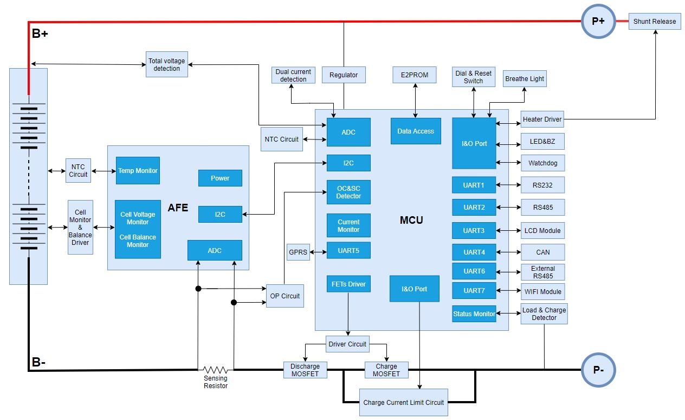
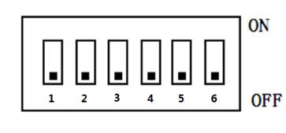
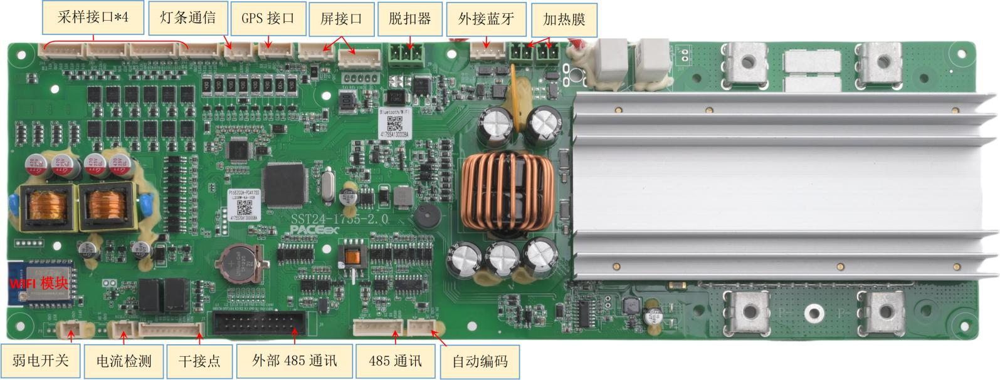
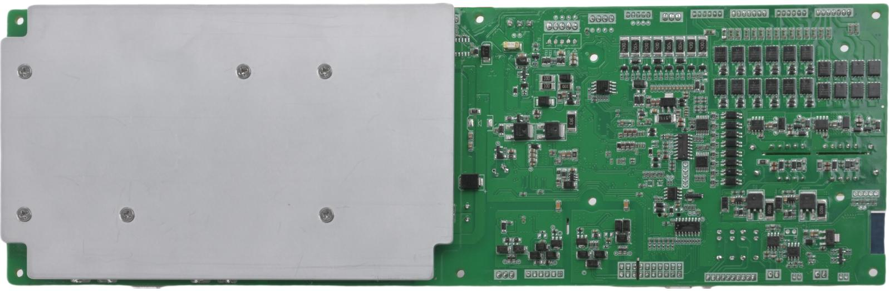
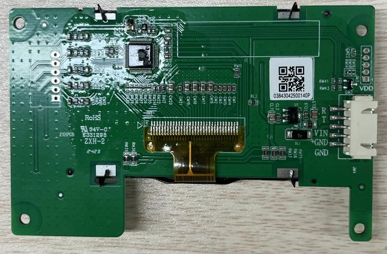
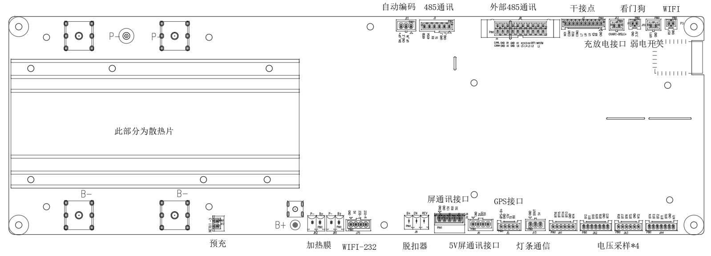
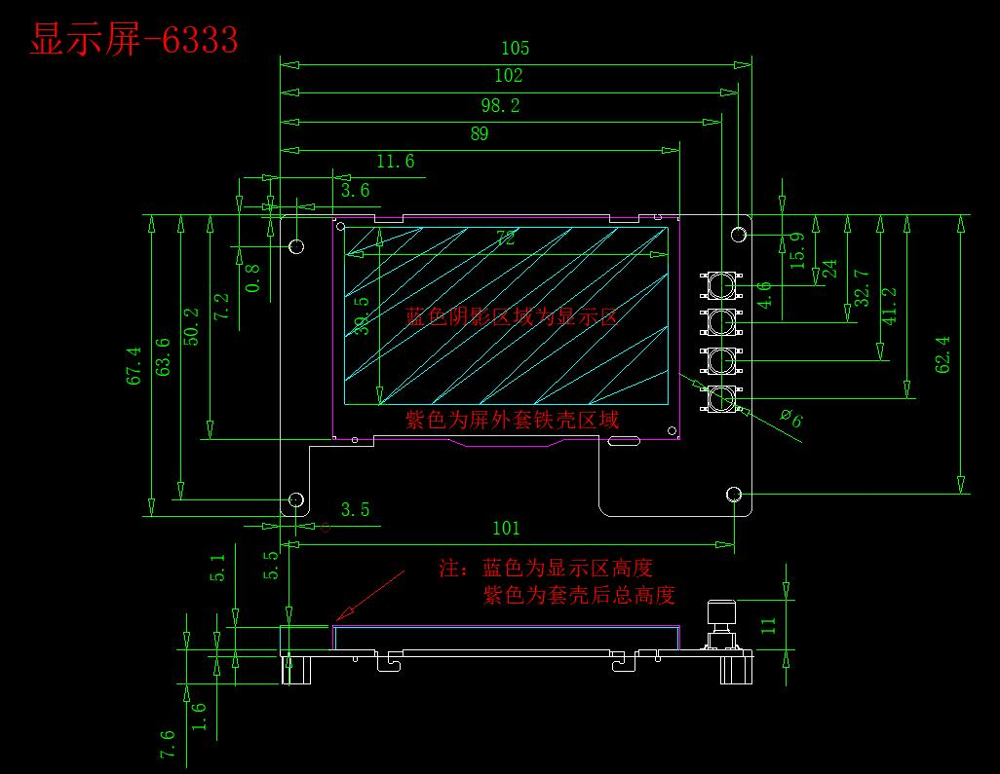

# GP-PC200B BMS Datasheet

## Specification Confirmation

<table>
  <tr>
    <td>Customer Name</td>
    <td colspan="3">Dongguan Zhongling Technology Co., Ltd.</td>
  </tr>
  <tr>
    <td>Customer Model</td>
    <td colspan="3"></td>
  </tr>
  <tr>
    <td>Customer Part Number</td>
    <td colspan="3"></td>
  </tr>
  <tr>
    <td>Product Model</td>
    <td colspan="3">P16S200A-ZL51706L20-K4-IOB</td>
  </tr>
  <tr>
    <td>Version</td>
    <td colspan="3">1.4</td>
  </tr>
  <tr>
    <td>Date</td>
    <td colspan="3">2025-11-10</td>
  </tr>
  <tr>
    <td rowspan="19">Accessories List</td>
    <td>No.</td>
    <td>Name</td>
    <td>Model</td>
    <td>Quantity</td>
  </tr>
  <tr>
    <td>1</td>
    <td>Protection Board</td>
    <td>P16S200A-51706-1.4</td>
    <td>1 pc</td>
  </tr>
  <tr>
    <td>2</td>
    <td>Display Board</td>
    <td>MD32K4-20666-3.0</td>
    <td>1 pc</td>
  </tr>
  <tr>
    <td>3</td>
    <td>Interface Board</td>
    <td>IOB-31834B-1.0</td>
    <td>1 pc</td>
  </tr>
  <tr>
    <td>4</td>
    <td>Screws</td>
    <td>M5*10 Screws</td>
    <td>4 pcs</td>
  </tr>
  <tr>
    <td>5</td>
    <td>Wiring Terminal</td>
    <td>KF2EDG-Y-3.81-4P-1G</td>
    <td>1 pc</td>
  </tr>
  <tr>
    <td>6</td>
    <td>Wiring Terminal</td>
    <td>KF2EDG-Y-3.81-2P-1G</td>
    <td>1 pc</td>
  </tr>
  <tr>
    <td>7</td>
    <td>Cable</td>
    <td>6P-300mm-6P-2.5X-1.1</td>
    <td>1 pc</td>
  </tr>
  <tr>
    <td>8</td>
    <td>Cable</td>
    <td>10P(2.0S)-300mm-10P(2.5X)-1.1</td>
    <td>1 pc</td>
  </tr>
  <tr>
    <td>9</td>
    <td>Cable</td>
    <td>10Px2-300mm-10Px2-2.5S-1.0</td>
    <td>1 pc</td>
  </tr>
  <tr>
    <td>10</td>
    <td>Cable</td>
    <td>420mm-2P-2.5S-R19A-1.1</td>
    <td>1 pc</td>
  </tr>
  <tr>
    <td>11</td>
    <td>Cable</td>
    <td>3.5P-245mm-tin-16AWG-1.0</td>
    <td>1 pc</td>
  </tr>
  <tr>
    <td>12</td>
    <td>Cable</td>
    <td>5P-500mm-5P-2.5X-1.1</td>
    <td>1 pc</td>
  </tr>
  <tr>
    <td>13</td>
    <td>Cable</td>
    <td>500mm-3P-3.81-tin-1.0</td>
    <td>1 pc</td>
  </tr>
  <tr>
    <td>14</td>
    <td>Cable</td>
    <td>P16S200A-ZL51706-Sampling Cable 1-1.0</td>
    <td>1 pc</td>
  </tr>
  <tr>
    <td>15</td>
    <td>Cable</td>
    <td>P16S200A-ZL51706-Sampling Cable 2-1.0</td>
    <td>1 pc</td>
  </tr>
  <tr>
    <td>16</td>
    <td>Cable</td>
    <td>P16S200A-ZL51706-Sampling Cable 3-1.0</td>
    <td>1 pc</td>
  </tr>
  <tr>
    <td>17</td>
    <td>Cable</td>
    <td>P16S200A-ZL51706-Sampling Cable 4-1.0</td>
    <td>1 pc</td>
  </tr>
  <tr>
    <td>18</td>
    <td>Cable</td>
    <td>3P-500mm-3P-2.5S-1.0</td>
    <td>1 pc</td>
  </tr>
  <tr>
    <td colspan="2">PeiCheng</td>
    <td colspan="2">Customer Confirmation</td>
  </tr>
  <tr>
    <td>Prepared By:</td>
    <td>Wu Yibing</td>
    <td>Reviewed By:</td>
    <td></td>
  </tr>
  <tr>
    <td>Approved By:</td>
    <td>Lu Junxiong</td>
    <td>Approved By:</td>
    <td></td>
  </tr>
</table>

## Document Change Summary

<table>
  <tr>
    <th>Date</th>
    <th>Version</th>
    <th>Revision Description</th>
    <th>Prepared By</th>
    <th>Approved By</th>
  </tr>
  <tr>
    <td>2025-07-10</td>
    <td>1.0</td>
    <td>Initial release.</td>
    <td>Wu Yibing</td>
    <td>Lu Junxiong</td>
  </tr>
  <tr>
    <td>2025-07-14</td>
    <td>1.1</td>
    <td>Software changes: 1. Added customer-provided Victor CAN protocol, data upload as required, set as default CAN protocol.</td>
    <td>Wu Yibing</td>
    <td>Lu Junxiong</td>
  </tr>
  <tr>
    <td>2025-09-09</td>
    <td>1.2</td>
    <td>Hardware and software changes: 1. Removed onboard Bluetooth WiFi module, customer to use external WiFi module.</td>
    <td>Wu Yibing</td>
    <td>Lu Junxiong</td>
  </tr>
  <tr>
    <td>2025-10-15</td>
    <td>1.3</td>
    <td>Software changes: 1. J75 interface 232 protocol modification; 2. Support for 63 battery units in parallel; Accessories changes: 1. Sampling cable model changed, highlighted in yellow.</td>
    <td>Wu Yibing</td>
    <td>Lu Junxiong</td>
  </tr>
  <tr>
    <td>2025-11-10</td>
    <td>1.4</td>
    <td>Software changes: 1. Active balancing logic adjustment; 2. Other requirement [17] modifications.</td>
    <td>Wu Yibing</td>
    <td>Lu Junxiong</td>
  </tr>
  <tr>
    <td></td>
    <td></td>
    <td></td>
    <td></td>
    <td></td>
  </tr>
  <tr>
    <td></td>
    <td></td>
    <td></td>
    <td></td>
    <td></td>
  </tr>
  <tr>
    <td></td>
    <td></td>
    <td></td>
    <td></td>
    <td></td>
  </tr>
  <tr>
    <td></td>
    <td></td>
    <td></td>
    <td></td>
    <td></td>
  </tr>
  <tr>
    <td></td>
    <td></td>
    <td></td>
    <td></td>
    <td></td>
  </tr>
  <tr>
    <td></td>
    <td></td>
    <td></td>
    <td></td>
    <td></td>
  </tr>
  <tr>
    <td></td>
    <td></td>
    <td></td>
    <td></td>
    <td></td>
  </tr>
  <tr>
    <td></td>
    <td></td>
    <td></td>
    <td></td>
    <td></td>
  </tr>
  <tr>
    <td></td>
    <td></td>
    <td></td>
    <td></td>
    <td></td>
  </tr>
  <tr>
    <td></td>
    <td></td>
    <td></td>
    <td></td>
    <td></td>
  </tr>
  <tr>
    <td></td>
    <td></td>
    <td></td>
    <td></td>
    <td></td>
  </tr>
  <tr>
    <td></td>
    <td></td>
    <td></td>
    <td></td>
    <td></td>
  </tr>
  <tr>
    <td></td>
    <td></td>
    <td></td>
    <td></td>
    <td></td>
  </tr>
  <tr>
    <td></td>
    <td></td>
    <td></td>
    <td></td>
    <td></td>
  </tr>
  <tr>
    <td></td>
    <td></td>
    <td></td>
    <td></td>
    <td></td>
  </tr>
  <tr>
    <td></td>
    <td></td>
    <td></td>
    <td></td>
    <td></td>
  </tr>
  <tr>
    <td></td>
    <td></td>
    <td></td>
    <td></td>
    <td></td>
  </tr>
  <tr>
    <td></td>
    <td></td>
    <td></td>
    <td></td>
    <td></td>
  </tr>
  <tr>
    <td></td>
    <td></td>
    <td></td>
    <td></td>
    <td></td>
  </tr>
  <tr>
    <td></td>
    <td></td>
    <td></td>
    <td></td>
    <td></td>
  </tr>
  <tr>
    <td></td>
    <td></td>
    <td></td>
    <td></td>
    <td></td>
  </tr>
  <tr>
    <td></td>
    <td></td>
    <td></td>
    <td></td>
    <td></td>
  </tr>
  <tr>
    <td></td>
    <td></td>
    <td></td>
    <td></td>
    <td></td>
  </tr>
</table>

## 1. Introduction

BMS (Battery Management System) is a system that monitors and controls battery status, enabling batteries to be used safely and for extended periods. Its main purpose is to intelligently manage and maintain each battery cell, monitor battery status, prevent overcharging and over-discharging, and extend battery lifespan. This product is suitable for residential energy storage batteries.

## 2. Features

- Equipped with 16-cell voltage and total voltage detection, overcharge, over-discharge alarm and protection functions. Static voltage sampling accuracy can reach &le;10mV at room temperature.
- Equipped with charge and discharge current detection, charge and discharge overcurrent alarm and protection functions. Charging current displays as positive, discharge current displays as negative. Current sampling accuracy can reach &le;2%@FS at room temperature.
- Reserved charge and discharge current detection, charge and discharge overcurrent alarm and protection functions. Charging current displays as positive, discharge current displays as negative. Current sampling accuracy can reach &le;2%@FS at room temperature.
- Equipped with 4-channel cell temperature detection, cell high and low temperature alarm and protection functions. Temperature sampling accuracy can reach &le;2&deg;C at room temperature.
- Equipped with short circuit protection function.
- Equipped with charge balancing function.
- Supports cell capacity estimation function. Battery pack full charge capacity, current capacity, and design capacity can be set via host computer software. Capacity can be automatically updated after completing a full charge-discharge cycle.
- Supports host computer software control function, allowing convenient setting of protection parameters such as overcharge, over-discharge, charge/discharge current, high temperature, low temperature, etc., as well as parameters like capacity, sleep, balancing, etc.
- Equipped with RS232, RS485, CAN communication interfaces.
- Supports multiple sleep and wake-up modes.
- Equipped with reset switch, automatic encoding and other functions.
- Equipped with LCD interface (optional), charge current limiting, buzzer, LED and other functions.
- Supports online upgrade.

## 3. Functional Block Diagram (For reference only, subject to product)

## 4. Environmental Requirements

<table>
  <tr>
    <th>Item</th>
    <th>Parameter</th>
    <th>Unit</th>
  </tr>
  <tr>
    <td>Operating Temperature</td>
    <td>-20 /~ 60</td>
    <td>°C</td>
  </tr>
  <tr>
    <td>Storage Temperature</td>
    <td>-20 /~ 75</td>
    <td>°C</td>
  </tr>
  <tr>
    <td>Operating Humidity</td>
    <td>10 /~ 85</td>
    <td>%RH</td>
  </tr>
  <tr>
    <td>Storage Humidity</td>
    <td>10 /~ 85</td>
    <td>%RH</td>
  </tr>
</table>

## 5. Parameter Configuration

### 5.1 Basic Parameter Settings

<table>
  <tr>
    <th>No.</th>
    <th colspan="2">Parameter Item</th>
    <th>Factory Default</th>
    <th>Configurable</th>
    <th>Remarks</th>
  </tr>
  <tr>
    <td rowspan="6">1</td>
    <td rowspan="3">Cell Overcharge Protection</td>
    <td>Cell Overcharge Alarm Voltage</td>
    <td>3600mV</td>
    <td>Configurable</td>
    <td></td>
  </tr>
  <tr>
    <td>Cell Overcharge Protection Voltage</td>
    <td>3650mV</td>
    <td>Configurable</td>
    <td></td>
  </tr>
  <tr>
    <td>Cell Overcharge Protection Delay</td>
    <td>1.0S</td>
    <td>Configurable</td>
    <td></td>
  </tr>
  <tr>
    <td rowspan="3">Cell Overvoltage Protection Release</td>
    <td>Cell Overcharge Protection Release Voltage</td>
    <td>3400mV</td>
    <td>Configurable</td>
    <td></td>
  </tr>
  <tr>
    <td>Capacity Release</td>
    <td>SOC &lt; 96%</td>
    <td>Configurable</td>
    <td></td>
  </tr>
  <tr>
    <td>Discharge Release</td>
    <td colspan="2">Discharge Current &gt; 2A</td>
    <td></td>
  </tr>
  <tr>
    <td rowspan="5">2</td>
    <td rowspan="3">Cell Overdischarge Protection</td>
    <td>Cell Overdischarge Alarm Voltage</td>
    <td>2600mV</td>
    <td>Configurable</td>
    <td></td>
  </tr>
  <tr>
    <td>Cell Overdischarge Protection Voltage</td>
    <td>2500mV</td>
    <td>Configurable</td>
    <td></td>
  </tr>
  <tr>
    <td>Cell Overdischarge Protection Delay</td>
    <td>1.0S</td>
    <td>Configurable</td>
    <td></td>
  </tr>
  <tr>
    <td rowspan="2">Cell Overdischarge Protection Release</td>
    <td>Cell Overdischarge Protection Release Voltage</td>
    <td>2900mV</td>
    <td>Configurable</td>
    <td></td>
  </tr>
  <tr>
    <td>Release on Charging</td>
    <td colspan="2">Can be activated by connecting charger</td>
    <td></td>
  </tr>
  <tr>
    <td rowspan="6">3</td>
    <td rowspan="3">Total Overcharge Protection</td>
    <td>Total Overcharge Alarm Voltage</td>
    <td>56.5V</td>
    <td>Configurable</td>
    <td></td>
  </tr>
  <tr>
    <td>Total Overcharge Protection Voltage</td>
    <td>58.4V</td>
    <td>Configurable</td>
    <td></td>
  </tr>
  <tr>
    <td>Total Overcharge Protection Delay</td>
    <td>1.0S</td>
    <td>Configurable</td>
    <td></td>
  </tr>
  <tr>
    <td rowspan="3">Total Overvoltage Protection Release</td>
    <td>Total Overcharge Protection Release Voltage</td>
    <td>54.4V</td>
    <td>Configurable</td>
    <td></td>
  </tr>
  <tr>
    <td>Capacity Release</td>
    <td>SOC &lt; 96%</td>
    <td>Configurable</td>
    <td></td>
  </tr>
  <tr>
    <td>Discharge Release</td>
    <td colspan="2">Discharge Current &gt; 2A</td>
    <td></td>
  </tr>
  <tr>
    <td rowspan="5">4</td>
    <td rowspan="3">Total Overdischarge Protection</td>
    <td>Total Overdischarge Alarm Voltage</td>
    <td>44V</td>
    <td>Configurable</td>
    <td></td>
  </tr>
  <tr>
    <td>Total Overdischarge Protection Voltage</td>
    <td>40V</td>
    <td>Configurable</td>
    <td></td>
  </tr>
  <tr>
    <td>Total Overdischarge Protection Delay</td>
    <td>1.0S</td>
    <td>Configurable</td>
    <td></td>
  </tr>
  <tr>
    <td rowspan="2">Total Overdischarge Protection Release</td>
    <td>Total Overdischarge Protection Release Voltage</td>
    <td>46.5V</td>
    <td>Configurable</td>
    <td></td>
  </tr>
  <tr>
    <td>Release on Charging</td>
    <td colspan="2">Can be activated by connecting charger</td>
    <td></td>
  </tr>
  <tr>
    <td rowspan="5">5</td>
    <td rowspan="3">Charge Overcurrent Protection</td>
    <td>Charge Overcurrent Alarm Current</td>
    <td>145A</td>
    <td>Configurable</td>
    <td rowspan="5">If occurring 10 times consecutively, the state will be locked and cannot be automatically released</td>
  </tr>
  <tr>
    <td>Charge Overcurrent Protection Current</td>
    <td>210A</td>
    <td>Configurable</td>
  </tr>
  <tr>
    <td>Charge Overcurrent Protection Delay</td>
    <td>1.0S</td>
    <td>Configurable</td>
  </tr>
  <tr>
    <td rowspan="2">Charge Overcurrent Protection Release</td>
    <td>Auto Release</td>
    <td colspan="2">Auto release after 1min</td>
  </tr>
  <tr>
    <td>Discharge Release</td>
    <td colspan="2">Discharge Current &gt; 1A</td>
  </tr>
  <tr>
    <td rowspan="5">6</td>
    <td rowspan="3">Discharge Overcurrent 1 Protection</td>
    <td>Discharge Overcurrent 1 Alarm Current</td>
    <td>155A</td>
    <td>Configurable</td>
    <td rowspan="5">If occurring 10 times consecutively, the state will be locked and cannot be automatically released</td>
  </tr>
  <tr>
    <td>Discharge Overcurrent 1 Protection Current</td>
    <td>210A</td>
    <td>Configurable</td>
  </tr>
  <tr>
    <td>Discharge Overcurrent 1 Protection Delay</td>
    <td>1.0S</td>
    <td>Configurable</td>
  </tr>
  <tr>
    <td rowspan="2">Discharge Overcurrent 1 Protection Release</td>
    <td>Auto Release</td>
    <td colspan="2">Auto release after 1min</td>
  </tr>
  <tr>
    <td>Charge Release</td>
    <td colspan="2">Charge Current &gt; 1A</td>
  </tr>
  <tr>
    <td rowspan="2">7</td>
    <td rowspan="2">Discharge Overcurrent 2</td>
    <td>Discharge Overcurrent 2 Protection Current</td>
    <td>&ge;250A</td>
    <td>Configurable</td>
    <td rowspan="4">If occurring 10 times consecutively, the state will be locked and cannot be automatically released</td>
  </tr>
  <tr>
    <td>Discharge Overcurrent 2 Protection Delay</td>
    <td>500mS</td>
    <td>Configurable</td>
  </tr>
  <tr>
    <td></td>
    <td rowspan="2">Discharge Overcurrent 2 Protection Release</td>
    <td>Auto Release</td>
    <td colspan="2">Auto release after 1min</td>
  </tr>
  <tr>
    <td></td>
    <td>Charge Release</td>
    <td colspan="2">Charge Current &gt; 1A</td>
  </tr>
  <tr>
    <td rowspan="3">8</td>
    <td rowspan="3">Short Circuit Protection</td>
    <td>Short Circuit Protection Function</td>
    <td colspan="2">Yes (Enabled by default)</td>
    <td rowspan="3">If occurring 10 times consecutively, the state will be locked and cannot be automatically released</td>
  </tr>
  <tr>
    <td rowspan="2">Short Circuit Protection Release</td>
    <td colspan="2">Short circuit protection releases when charging is present</td>
  </tr>
  <tr>
    <td colspan="2">Automatically releases after load removal</td>
  </tr>
  <tr>
    <td rowspan="3">9</td>
    <td rowspan="3">MOS High Temperature Protection</td>
    <td>MOS Overtemperature Alarm Temperature</td>
    <td>90°C</td>
    <td>Configurable</td>
    <td></td>
  </tr>
  <tr>
    <td>MOS Overtemperature Protection Temperature</td>
    <td>115°C</td>
    <td>Configurable</td>
    <td></td>
  </tr>
  <tr>
    <td>MOS Protection Release Temperature</td>
    <td>85°C</td>
    <td>Configurable</td>
    <td></td>
  </tr>
  <tr>
    <td rowspan="12">10</td>
    <td rowspan="12">Cell Temperature Protection</td>
    <td>Charge Low Temperature Alarm Temperature</td>
    <td>5°C</td>
    <td>Configurable</td>
    <td></td>
  </tr>
  <tr>
    <td>Charge Low Temperature Protection Temperature</td>
    <td>0°C</td>
    <td>Configurable</td>
    <td></td>
  </tr>
  <tr>
    <td>Charge Low Temperature Protection Release Temperature</td>
    <td>10°C</td>
    <td>Configurable</td>
    <td></td>
  </tr>
  <tr>
    <td>Charge High Temperature Alarm Temperature</td>
    <td>50°C</td>
    <td>Configurable</td>
    <td></td>
  </tr>
  <tr>
    <td>Charge High Temperature Protection Temperature</td>
    <td>55°C</td>
    <td>Configurable</td>
    <td></td>
  </tr>
  <tr>
    <td>Charge High Temperature Protection Release Temperature</td>
    <td>50°C</td>
    <td>Configurable</td>
    <td></td>
  </tr>
  <tr>
    <td>Discharge Low Temperature Alarm Temperature</td>
    <td>-15°C</td>
    <td>Configurable</td>
    <td></td>
  </tr>
  <tr>
    <td>Discharge Low Temperature Protection Temperature</td>
    <td>-20°C</td>
    <td>Configurable</td>
    <td></td>
  </tr>
  <tr>
    <td>Discharge Low Temperature Protection Release Temperature</td>
    <td>-15°C</td>
    <td>Configurable</td>
    <td></td>
  </tr>
  <tr>
    <td>Discharge High Temperature Alarm Temperature</td>
    <td>50°C</td>
    <td>Configurable</td>
    <td></td>
  </tr>
  <tr>
    <td>Discharge High Temperature Protection Temperature</td>
    <td>55°C</td>
    <td>Configurable</td>
    <td></td>
  </tr>
  <tr>
    <td>Discharge High Temperature Protection Release Temperature</td>
    <td>50°C</td>
    <td>Configurable</td>
    <td></td>
  </tr>
  <tr>
    <td rowspan="6">11</td>
    <td rowspan="6">Ambient Temperature Alarm</td>
    <td>Ambient Low Temperature Alarm Temperature</td>
    <td>-20°C</td>
    <td>Configurable</td>
    <td></td>
  </tr>
  <tr>
    <td>Ambient Low Temperature Protection Temperature</td>
    <td>-30°C</td>
    <td>Configurable</td>
    <td></td>
  </tr>
  <tr>
    <td>Ambient Low Temperature Protection Release Temperature</td>
    <td>-20°C</td>
    <td>Configurable</td>
    <td></td>
  </tr>
  <tr>
    <td>Ambient High Temperature Alarm Temperature</td>
    <td>55°C</td>
    <td>Configurable</td>
    <td></td>
  </tr>
  <tr>
    <td>Ambient High Temperature Protection Temperature</td>
    <td>65°C</td>
    <td>Configurable</td>
    <td></td>
  </tr>
  <tr>
    <td>Ambient High Temperature Protection Release Temperature</td>
    <td>55°C</td>
    <td>Configurable</td>
    <td></td>
  </tr>
  <tr>
    <td rowspan="2">12</td>
    <td rowspan="2">Consumption Current</td>
    <td>Operating Self-consumption Current</td>
    <td colspan="2">&le;45mA</td>
    <td></td>
  </tr>
  <tr>
    <td>Low Power Mode Current</td>
    <td colspan="2">&le;200&mu;A</td>
    <td></td>
  </tr>
  <tr>
    <td rowspan="2">13</td>
    <td rowspan="2">Balancing Function</td>
    <td>Balancing Start Voltage</td>
    <td>&gt; 3400mV</td>
    <td>Configurable</td>
    <td></td>
  </tr>
  <tr>
    <td>Start Voltage Difference</td>
    <td>&gt; 30mV</td>
    <td>Configurable</td>
    <td></td>
  </tr>
  <tr>
    <td>14</td>
    <td>Default Capacity Settings</td>
    <td>Low Battery Alarm Threshold</td>
    <td>SOC &lt; 5%</td>
    <td>Configurable</td>
    <td>No alarm during charging</td>
  </tr>
  <tr>
    <td rowspan="2">15</td>
    <td rowspan="2">Sleep Function</td>
    <td>Sleep Voltage</td>
    <td>&lt; 3150mV</td>
    <td>Configurable</td>
    <td></td>
  </tr>
  <tr>
    <td>Delay Time</td>
    <td>5min</td>
    <td>Configurable</td>
    <td></td>
  </tr>
  <tr>
    <td>16</td>
    <td>Cell Failure Protection</td>
    <td>Cell Voltage Difference</td>
    <td>&gt; 1V Protection</td>
    <td>Not Configurable</td>
    <td>Charging and discharging not allowed</td>
  </tr>
  <tr>
    <td rowspan="2">17</td>
    <td rowspan="2">Full Charge Detection</td>
    <td>Full Charge Voltage</td>
    <td>&ge; 55.2V</td>
    <td>Configurable</td>
    <td rowspan="2">Update SOC to 100%</td>
  </tr>
  <tr>
    <td>Cutoff Current</td>
    <td>&le; 5A</td>
    <td>Configurable</td>
  </tr>
</table>

Note: The above parameter settings are standard settings at 25°C ambient temperature. Performance may vary at different temperatures.

### 5.2 Basic Configuration

<table>
  <tr>
    <th rowspan="14">Function</th>
    <td>Storage</td>
    <td colspan="5">□None □Store 400 □Store 10000 ☑Store 10000</td>
  </tr>
  <tr>
    <td>Battery Capacity</td>
    <td colspan="5">□50AH □100AH □150AH □200AH ☑280 AH</td>
  </tr>
  <tr>
    <td>Display Interface</td>
    <td colspan="5">□None □Chinese Smart □English Smart ☑Yes</td>
  </tr>
  <tr>
    <td>Charging Current Limit</td>
    <td colspan="5">□None □5A □10A ☑20A □ A Definition: Charging current &gt; 200A to start</td>
  </tr>
  <tr>
    <td>Dry Contact</td>
    <td colspan="5">□None ☑Yes Definition: Dry Contact 1-PIN1 to PIN2 normally open, closes during fault protection; Dry Contact 2-PIN3 to PIN4 normally open, closes on battery low alarm.</td>
  </tr>
  <tr>
    <td>Heating Film Interface</td>
    <td colspan="5">□None ☑Yes (Heating film socket not soldered, customer purchases connector and solders it themselves, other hardware circuits retained) Definition: Heating enable temperature (charging low temperature alarm temperature +1), heating film close temperature linked to charging low temperature protection release temperature. When BMS enters charging low temperature protection state, charging MOS is closed, heating film requests charging current of 10A (separate from Desay requested charging current); In parallel system, if any battery enters charging low temperature protection state, heating film requests charging current of 10A * number of charging low temperature protection states; Modifiable via上位机.</td>
  </tr>
  <tr>
    <td>CAN Parallel</td>
    <td colspan="5">☑None □Yes Definition:</td>
  </tr>
  <tr>
    <td>Fan Interface</td>
    <td colspan="5">□None ☑Yes Definition: 1. After charging MOS is closed, if charging current is detected for 8 consecutive seconds, start. 2. After discharge MOS is closed, if discharge current is detected for 8 consecutive seconds, start.</td>
  </tr>
  <tr>
    <td>Certification Function Interface</td>
    <td colspan="5">☑MCU boot watch dog ☑Dual total voltage detection ☑Dual current detection</td>
  </tr>
  <tr>
    <td>Low Voltage Switch</td>
    <td colspan="5">□None ☑Yes</td>
  </tr>
  <tr>
    <td>Buzzer</td>
    <td colspan="5">□None ☑Yes</td>
  </tr>
  <tr>
    <td>Positioning Function Interface</td>
    <td colspan="5">☑None □Yes</td>
  </tr>
  <tr>
    <td>Bluetooth&amp;WIFI</td>
    <td colspan="5">☑None □Yes</td>
  </tr>
  <tr>
    <td>Light Bar Interface</td>
    <td colspan="5">□None ☑Yes</td>
  </tr>
  <tr>
    <th rowspan="3">Communication</th>
    <td>DIP Switch</td>
    <td colspan="5">□None □1-bit □4-bit ☑6-bit ☑Auto encoding</td>
  </tr>
  <tr>
    <td>LED Indicator</td>
    <td colspan="5">□None □ALM ☑RUN ☑ON/OFF ☑SOC 6 pcs</td>
  </tr>
  <tr>
    <td>Sampling Socket</td>
    <td colspan="5">☑Vertical □Horizontal</td>
  </tr>
  <tr>
    <th rowspan="3">Other Requirements</th>
    <td>Barcode</td>
    <td colspan="5">□1D Barcode ☑2D Barcode (QR Code)</td>
  </tr>
  <tr>
    <td>Communication Interface</td>
    <td colspan="5">☑RS232 □RS485 ☑Parallel RS485 ☑CAN</td>
  </tr>
  <tr>
    <td>Parallel Method</td>
    <td colspan="5">□None □RS485 □CAN</td>
  </tr>
  <tr>
    <th rowspan="5"></th>
    <td>Upgrade Method</td>
    <td colspan="5">☑RS232 □RS485</td>
  </tr>
  <tr>
    <td>1</td>
    <td colspan="5">Auto encoding must support host waking up slaves, and slaves can automatically wake up after being woken by host.</td>
  </tr>
  <tr>
    <td>2</td>
    <td colspan="5">Choose one of LED indicator and strip light illumination logic.</td>
  </tr>
  <tr>
    <td>3</td>
    <td colspan="5">Choose one of manual encoding and auto encoding logic.</td>
  </tr>
  <tr>
    <td>4</td>
    <td colspan="5">Active balance supports maximum 2A.</td>
  </tr>
  <tr>
    <td></td>
    <td>5</td>
    <td colspan="5">New customer-provided MAP table, see attachment; Table values are coefficients (unit: micro-ohm); Single unit: Requested charging current = Table function X2X charging overcurrent warning value;</td>
  </tr>
  <tr>
    <td></td>
    <td>6</td>
    <td colspan="5">Requested discharge current = Table coefficient X Discharge overcurrent 1 warning value; Parallel system: Check requested current for each unit separately, then take the minimum current and multiply by (parallel number - protection number).</td>
  </tr>
  <tr>
    <td></td>
    <td>7</td>
    <td colspan="5">Inverter protocol: RS485: Peng Hui CAN: Schneider, Victor, DeYe, SMA, Tenega Innovation, Micle, RuiDi, SorEnd, TBB, Megare</td>
  </tr>
  <tr>
    <td></td>
    <td>8</td>
    <td colspan="5">Add heating film function: Definition: Heating enable temperature linked to (charging low temperature alarm temperature +1), heating film close temperature linked to charging low temperature protection release temperature, modifiable via上位机.</td>
  </tr>
  <tr>
    <td></td>
    <td>9</td>
    <td colspan="5">Heating film socket on main board not soldered (customer purchases connector and solders it themselves).</td>
  </tr>
  <tr>
    <td></td>
    <td>10</td>
    <td colspan="5">BMS must support screen communication protocol function.</td>
  </tr>
  <tr>
    <td></td>
    <td>11</td>
    <td colspan="5">Read parallel system total current changed to "Read parallel system total voltage - 0.5V", requested charging voltage = highest single unit voltage.</td>
  </tr>
  <tr>
    <td></td>
    <td>12</td>
    <td colspan="5">1. In 010-Victron CAN 2021.01.07(Victor) protocol, when balance is enabled, cancel the positive deviation report uploaded by BMS to inverter. 2. In 001-PYLON CAN Inverter EMS(Pylon) protocol, modify mask bits 1 and 2 range: Mask bit 1 Bit5 is charging alarm value - low battery alarm value +2%; Force bit 2 Bit4 is low battery alarm value +1% - low battery alarm value +3%; Flow charging off, low battery alarm value -10%.</td>
  </tr>
  <tr>
    <td></td>
    <td>13</td>
    <td colspan="5">BMS enables self-consumption when not in sleep state, disables when in sleep state, power consumption is 7W.</td>
  </tr>
  <tr>
    <td></td>
    <td>14</td>
    <td colspan="5">232 baud rate changed to 115200.</td>
  </tr>
  <tr>
    <td></td>
    <td>15</td>
    <td colspan="5">Support multiple bidirectional meters, see上位机 protocol selection interface for details.</td>
  </tr>
  <tr>
    <td></td>
    <td>16</td>
    <td colspan="5">Import A-Wei standard SOC algorithm.</td>
  </tr>
  <tr>
    <td></td>
    <td>17</td>
    <td colspan="5">Request logic: 1. Only when conditions are met for the first time and triggered for one hour, if SOC is greater than intermittent charging threshold, request "low request voltage" from inverter; in other normal cases, request "normal request voltage" from inverter. 2. Intermittent charging threshold: Gap Charge Threshold value, default 95 (configurable). 3. Low request voltage: Take total rest protection recovery value (Pack OVP Release) value (configurable). 4. Normal request voltage: Take battery pack end-of-charge voltage (Pack FullCharge Voltage) value (configurable). Purpose: 1. When battery SOC is below a certain value (TSOC), request maximum discharge current = -10 from inverter. 2. When battery voltage is below a certain value (PACK_UV_ALARM), request maximum discharge current = 0 from inverter.  Definition: SOC: Current battery SOC (take average SOC of all packs). VOL: Current battery voltage (take average voltage of all packs). SOC_LOW_ALARM: SOC Low Alarm low battery alarm (%) value in software settings (take host setting value). PACK_UV_ALARM: Pack UV Alarm total over-discharge alarm (V) value in software settings (take host setting value). TSOC: A variable. TSOC_STATE: Indicates whether currently requesting maximum discharge current = -10 from inverter due to low battery, default 0. TVOL_STATE: Indicates whether currently requesting maximum discharge current = 0 from inverter due to low voltage, default 0. Reference maximum discharge current: DCG_OC_ALARM discharge overcurrent alarm (A) value in software settings (MAP coefficient, requests maximum discharge current from inverter.</td>
  </tr>
  <tr>
    <td></td>
    <td>18</td>
    <td colspan="5">TSOC value: 1. When SOC_LOW_ALARM &le; 5%, TSOC fixed at SOC_LOW_ALARM (purpose is to leave a margin, thus not using TSOC dynamic change logic). 2. When SOC_LOW_ALARM &gt; 5%, TSOC value changes.  TSOC value changes: 1. If battery does not trigger discharge condition for 4 consecutive days: At 96 hours and above, raise TSOC to 50%. At 192 hours and above, raise TSOC to 70%. 2. Once discharge condition is triggered, TSOC resets to SOC_LOW_ALARM.  Request maximum discharge current from inverter: 1. If SOC &lt; TSOC, set TSOC_STATE = 1. 2. If VOL &lt; PACK_UV_ALARM, set TVOL_STATE = 1. 3. If TVOL_STATE = 1, request maximum discharge current = 0 from inverter. 4. If TVOL_STATE = 0 and TSOC_STATE = 1, request maximum discharge current = -10 from inverter. Exit request maximum discharge current from inverter: 1. If SOC &gt; TSOC + 20%, set TSOC_STATE = 0. 2. If VOL &gt; PACK_UV_ALARM + 3V, set TVOL_STATE = 0. 3. If TSOC_STATE = 0 and TVOL_STATE = 0, request maximum discharge current = reference maximum discharge current from inverter.</td>
  </tr>
  <tr>
    <td></td>
    <td>19</td>
    <td colspan="5">In parallel system, report average total battery voltage to inverter.</td>
  </tr>
  <tr>
    <td></td>
    <td>20</td>
    <td colspan="5">Excluding onboard Bluetooth WIFI module, J75 external Bluetooth WIFI interface needs to retain circuit and socket, customer provides external WIFI module. J75-External Bluetooth WIFI interface uses 232 protocol, baud rate 115200.</td>
  </tr>
  <tr>
    <td></td>
    <td>21</td>
    <td colspan="5">Support 63 batteries in parallel.</td>
  </tr>
  <tr>
    <td></td>
    <td>22</td>
    <td colspan="5">New customer-provided universal multi-CAN protocol, corresponding internal protocol number: 010-Victron CAN 2023.09.22, set as default CAN protocol. BMS upload data requirements: 0x35E upload: Gobel 0x370 upload: Gobel 0x371 upload: Power 0x360 report fill 0x378 report cumulative charge/discharge capacity</td>
  </tr>
  <tr>
    <td></td>
    <td>23</td>
    <td colspan="5">J75-External Bluetooth WIFI interface serial 232 protocol modified: Change normal response RTN = 0x00 to RTN = Cmd (Command received by BMS).</td>
  </tr>
  <tr>
    <td></td>
    <td>24</td>
    <td colspan="5">Modify active balance strategy: Balance enable changed from low voltage difference start to enable voltage (configurable via上位机), as shown below a. Resting start condition: Gmax &gt; Balance enable voltage value and voltage difference &gt; 30mV. b. Resting stop condition: Gmax &lt; Balance enable voltage value or voltage difference &lt; 20mV. c. Charge/discharge start condition: Gmax &gt; Balance enable voltage value and voltage difference &gt; 50mV. d. Charge/discharge stop condition: Gmax &lt; Balance enable voltage value or voltage difference &lt; 40mV. e. Enable/disable voltage difference increases by 1mV every 500 cycles, maximum 20mV. f. Operates for 1 hour after enable, after balance is disabled must wait 10 minutes before enabling again. g. Battery temperature above 105 exits. h. Average voltage greater than 3625mV does not start.</td>
  </tr>
  <tr>
    <td></td>
    <td></td>
    <td colspan="5">i. Voltage difference greater than 1000mV does not start. j. High temperature alarm does not start. k. Fault does not start. l. Temperature/protection does not start. m. Overvoltage protection can start, undervoltage protection does not start. n. Remove logic that does not start when current is greater than 0.5C. o. Current less than 2A is considered resting. p. Check every 1 minute whether to start or continue balance.  </td>
  </tr>
</table>

## 6. Main Function Description

### 6.1 LED Indicator Description (Note: When selecting LED lights, refer to the logic below; when selecting light bars, refer to the attachment)

Table 1 LED Working Status Indicator

<table>
  <tr>
    <th rowspan="2">Status</th>
    <th rowspan="2">Normal/Alarm/Protection</th>
    <th rowspan="2">ON/OFF</th>
    <th rowspan="2">RUN</th>
    <th rowspan="2">ALM</th>
    <th colspan="6">Capacity Indicator LED</th>
    <th rowspan="2">Description</th>
  </tr>
  <tr>
    <th>L6 ●</th>
    <th>L5 ●</th>
    <th>L4 ●</th>
    <th>L3 ●</th>
    <th>L2 ●</th>
    <th>L1 ●</th>
  </tr>
  <tr>
    <td>Power Off</td>
    <td>Sleep</td>
    <td>Off</td>
    <td>Off</td>
    <td>Off</td>
    <td>Off</td>
    <td>Off</td>
    <td>Off</td>
    <td>Off</td>
    <td>Off</td>
    <td>Off</td>
    <td>All off</td>
  </tr>
  <tr>
    <td rowspan="2">Standby</td>
    <td>Normal</td>
    <td>On</td>
    <td>Flash 1</td>
    <td>Off</td>
    <td colspan="6" rowspan="2">Based on capacity indicator</td>
    <td>Standby state</td>
  </tr>
  <tr>
    <td>Alarm</td>
    <td>On</td>
    <td>Flash 1</td>
    <td>Flash 3</td>
    <td>Low voltage alarm</td>
  </tr>
  <tr>
    <td rowspan="3">Charging</td>
    <td>Normal</td>
    <td>On</td>
    <td>On</td>
    <td>Off</td>
    <td colspan="6" rowspan="2">Based on capacity indicator (Highest capacity LED flashes 2 during charging)</td>
    <td>Highest capacity LED flashes (Flash 2), ALM does not flash during overcharge alarm</td>
  </tr>
  <tr>
    <td>Alarm</td>
    <td>On</td>
    <td>On</td>
    <td>Flash 3</td>
    <td></td>
  </tr>
  <tr>
    <td>Overcharge Protection</td>
    <td>On</td>
    <td>On</td>
    <td>Off</td>
    <td>On</td>
    <td>On</td>
    <td>On</td>
    <td>On</td>
    <td>On</td>
    <td>On</td>
    <td>If no mains power, indicator changes to standby state</td>
  </tr>
  <tr>
    <td></td>
    <td>Temperature, Overcurrent, Failure Protection</td>
    <td>On</td>
    <td>Off</td>
    <td>On</td>
    <td>Off</td>
    <td>Off</td>
    <td>Off</td>
    <td>Off</td>
    <td>Off</td>
    <td>Off</td>
    <td>Stop charging</td>
  </tr>
  <tr>
    <td rowspan="4">Discharging</td>
    <td>Normal</td>
    <td>On</td>
    <td>Flash 3</td>
    <td>Off</td>
    <td colspan="6" rowspan="2">Based on capacity indicator</td>
    <td></td>
  </tr>
  <tr>
    <td>Alarm</td>
    <td>On</td>
    <td>Flash 3</td>
    <td>Flash 3</td>
    <td></td>
  </tr>
  <tr>
    <td>Undervoltage Protection</td>
    <td>On</td>
    <td>Off</td>
    <td>Off</td>
    <td>Off</td>
    <td>Off</td>
    <td>Off</td>
    <td>Off</td>
    <td>Off</td>
    <td>Off</td>
    <td>Stop discharging</td>
  </tr>
  <tr>
    <td>Temperature, Overcurrent, Short Circuit, Failure Protection</td>
    <td>On</td>
    <td>Off</td>
    <td>On</td>
    <td>Off</td>
    <td>Off</td>
    <td>Off</td>
    <td>Off</td>
    <td>Off</td>
    <td>Off</td>
    <td>Stop discharging</td>
  </tr>
  <tr>
    <td>Failure</td>
    <td></td>
    <td>Off</td>
    <td>Off</td>
    <td>On</td>
    <td>Off</td>
    <td>Off</td>
    <td>Off</td>
    <td>Off</td>
    <td>Off</td>
    <td>Off</td>
    <td>Stop charging and discharging</td>
  </tr>
</table>

Table 2 Capacity Indicator Description

<table>
  <tr>
    <th colspan="2">Status</th>
    <th colspan="6">Charging</th>
    <th colspan="6">Discharging</th>
  </tr>
  <tr>
    <td colspan="2">Capacity Indicator LED</td>
    <td>L6 ●</td>
    <td>L5 ●</td>
    <td>L4 ●</td>
    <td>L3 ●</td>
    <td>L2 ●</td>
    <td>L1 ●</td>
    <td>L6 ●</td>
    <td>L5 ●</td>
    <td>L4 ●</td>
    <td>L3 ●</td>
    <td>L2 ●</td>
    <td>L1 ●</td>
  </tr>
  <tr>
    <td>Capacity (%)</td>
    <td>0% /~ 17%</td>
    <td>Off</td>
    <td>Off</td>
    <td>Off</td>
    <td>Off</td>
    <td>Off</td>
    <td>Flash 2</td>
    <td>Off</td>
    <td>Off</td>
    <td>Off</td>
    <td>Off</td>
    <td>Off</td>
    <td>On</td>
  </tr>
  <tr>
    <td></td>
    <td>18% /~ 33%</td>
    <td>Off</td>
    <td>Off</td>
    <td>Off</td>
    <td>Off</td>
    <td>Flash 2</td>
    <td>On</td>
    <td>Off</td>
    <td>Off</td>
    <td>Off</td>
    <td>Off</td>
    <td>On</td>
    <td>On</td>
  </tr>
  <tr>
    <td></td>
    <td>34% /~ 50%</td>
    <td>Off</td>
    <td>Off</td>
    <td>Off</td>
    <td>Flash 2</td>
    <td>On</td>
    <td>On</td>
    <td>Off</td>
    <td>Off</td>
    <td>Off</td>
    <td>On</td>
    <td>On</td>
    <td>On</td>
  </tr>
  <tr>
    <td></td>
    <td>51% /~ 66%</td>
    <td>Off</td>
    <td>Off</td>
    <td>Flash 2</td>
    <td>On</td>
    <td>On</td>
    <td>On</td>
    <td>Off</td>
    <td>Off</td>
    <td>On</td>
    <td>On</td>
    <td>On</td>
    <td>On</td>
  </tr>
  <tr>
    <td></td>
    <td>67% /~ 83%</td>
    <td>Off</td>
    <td>Flash 2</td>
    <td>On</td>
    <td>On</td>
    <td>On</td>
    <td>On</td>
    <td>Off</td>
    <td>On</td>
    <td>On</td>
    <td>On</td>
    <td>On</td>
    <td>On</td>
  </tr>
  <tr>
    <td></td>
    <td>84% /~ 100%</td>
    <td>Flash 2</td>
    <td>On</td>
    <td>On</td>
    <td>On</td>
    <td>On</td>
    <td>On</td>
    <td>On</td>
    <td>On</td>
    <td>On</td>
    <td>On</td>
    <td>On</td>
    <td>On</td>
  </tr>
  <tr>
    <td colspan="2">Running Indicator LED ●</td>
    <td colspan="6">On</td>
    <td colspan="6">Flash (Flash 3)</td>
  </tr>
</table>

Table 3 LED Flash Description

<table>
  <tr>
    <th>Flash Mode</th>
    <th>On</th>
    <th>Off</th>
  </tr>
  <tr>
    <td>Flash 1</td>
    <td>0.25S</td>
    <td>3.75S</td>
  </tr>
  <tr>
    <td>Flash 2</td>
    <td>0.5S</td>
    <td>0.5S</td>
  </tr>
  <tr>
    <td>Flash 3</td>
    <td>0.5S</td>
    <td>1.5S</td>
  </tr>
</table>

### 6.2 Buzzer Operation Description

1) In case of fault, buzz for 0.25S every 1S;
2) In protection state, buzz for 0.25S every 2S (except for overvoltage protection);
3) In alarm state, buzz for 0.25S every 3S (except for low voltage alarm);
4) The buzzer function can be enabled or disabled via the upper computer (host computer). The factory default is disabled.

### 6.3 Button Operation

When BMS is in sleep state, press the button (3/~6S) and release, the protection board is activated, and the LED indicator lights start from "RUN" and light up sequentially for 0.5 seconds each.
When BMS is in active state, press the button (3/~6S) and release, the protection board enters sleep mode, and the LED indicator lights start from the lowest battery level and light up sequentially for 0.5 seconds each.
When BMS is in active state, press the button (6/~10S) and release, the protection board is reset, and all LED lights light up simultaneously for 1.5 seconds.
**After BMS is reset, parameters and functions set via the upper computer (host computer) are still retained. If you need to restore to initial parameters, you can use the "Restore Default" function on the upper computer, but related operation records and stored data remain unchanged (such as battery level, cycle count, protection records, etc.).**

### 6.4 Sleep and Wake-up

#### Sleep
When any of the following conditions is met, the system enters low power mode:
1) Single cell or total overdischarge protection is not released within 30 seconds.
2) Press the button (3/~6S) and release.
3) The minimum cell voltage is lower than the sleep voltage, and in the absence of communication, protection, balancing, current, or charging, the duration reaches the sleep delay time.
4) Standby time exceeds 24 hours (no communication, no charge/discharge, no external power supply).
5) Forced shutdown via upper computer software.
Before entering sleep mode, ensure that no external voltage is applied to the input end, otherwise the system cannot enter low power mode.

#### Wake-up
When the system is in low power mode and any of the following conditions is met, the system will exit low power mode and enter normal operation mode:
1) Charger is connected, charger output voltage must be greater than 48V.
2) Press the reset button (3/~6S) and release.
3) RS232 communication is activated.

**Note: When entering low power mode due to single cell or total overdischarge protection, the system wakes up regularly every 4 hours to turn on the charging MOS. If charging is possible, it will exit sleep state and enter normal charging; if it fails to charge after 10 consecutive automatic wake-ups, it will no longer wake up automatically.**

### 6.5 Balance Condition Description

a. Standby activation condition: Gmax > Balance activation voltage AND voltage difference > 30mV.
b. Standby deactivation condition: Gmax < Balance activation voltage OR voltage difference < 20mV.
c. Charge/Discharge activation condition: Gmax > Balance activation voltage AND voltage difference > 50mV.
d. Charge/Discharge deactivation condition: Gmax < Balance activation voltage OR voltage difference < 40mV.
Note: The balance activation voltage is bound to the passive balance activation voltage (configurable via upper computer).

## 7. Communication Description

### 7.1 CAN Communication

CAN communication, default baud rate 500K. This interface is used for communication with inverters. When the battery pack is the master, it can aggregate slave data for communication with inverters.

### 7.2 RS232 Communication

BMS can communicate with the upper computer (host computer) via the RS232 interface, enabling monitoring of various battery information including battery voltage, current, temperature, status, and battery production information, etc. Default baud rate is 115200bps.

### 7.3 RS485 Communication

Independent RS485 interface, default baud rate is 9600bps. This interface is used for communication with inverters. The monitoring device acts as the master and can aggregate slave data for communication with inverters.

### 7.4 Parallel RS485 Communication

Parallel RS485 communication, default baud rate is 9600bps. If communication with the monitoring device via RS485 is required, the monitoring device acts as the master and polls data by address. The address setting range is 1/~15.

### 7.5 DIP Switch (Note: When manual encoding is selected, refer to the following logic)

When PACK is used in parallel, the address can be set via the DIP switch on the BMS to distinguish different PACKs. Avoid setting the same address. Refer to the table below for BMS DIP switch definitions.

<table>
  <tr>
    <th rowspan="2">Address</th>
    <th colspan="6">DIP Switch Position</th>
  </tr>
  <tr>
    <th>#1</th>
    <th>#2</th>
    <th>#3</th>
    <th>#4</th>
    <th>#5</th>
    <th>#6</th>
  </tr>
  <tr>
    <td>0</td>
    <td>OFF</td>
    <td>OFF</td>
    <td>OFF</td>
    <td>OFF</td>
    <td>OFF</td>
    <td>OFF</td>
  </tr>
  <tr>
    <td>1</td>
    <td>ON</td>
    <td>OFF</td>
    <td>OFF</td>
    <td>OFF</td>
    <td>OFF</td>
    <td>OFF</td>
  </tr>
  <tr>
    <td>2</td>
    <td>OFF</td>
    <td>ON</td>
    <td>OFF</td>
    <td>OFF</td>
    <td>OFF</td>
    <td>OFF</td>
  </tr>
  <tr>
    <td>3</td>
    <td>ON</td>
    <td>ON</td>
    <td>OFF</td>
    <td>OFF</td>
    <td>OFF</td>
    <td>OFF</td>
  </tr>
  <tr>
    <td>4</td>
    <td>OFF</td>
    <td>OFF</td>
    <td>ON</td>
    <td>OFF</td>
    <td>OFF</td>
    <td>OFF</td>
  </tr>
  <tr>
    <td>5</td>
    <td>ON</td>
    <td>OFF</td>
    <td>ON</td>
    <td>OFF</td>
    <td>OFF</td>
    <td>OFF</td>
  </tr>
  <tr>
    <td>6</td>
    <td>OFF</td>
    <td>ON</td>
    <td>ON</td>
    <td>OFF</td>
    <td>OFF</td>
    <td>OFF</td>
  </tr>
  <tr>
    <td>7</td>
    <td>ON</td>
    <td>ON</td>
    <td>ON</td>
    <td>OFF</td>
    <td>OFF</td>
    <td>OFF</td>
  </tr>
  <tr>
    <td>8</td>
    <td>OFF</td>
    <td>OFF</td>
    <td>OFF</td>
    <td>ON</td>
    <td>OFF</td>
    <td>OFF</td>
  </tr>
  <tr>
    <td>9</td>
    <td>ON</td>
    <td>OFF</td>
    <td>OFF</td>
    <td>ON</td>
    <td>OFF</td>
    <td>OFF</td>
  </tr>
  <tr>
    <td>10</td>
    <td>OFF</td>
    <td>ON</td>
    <td>OFF</td>
    <td>ON</td>
    <td>OFF</td>
    <td>OFF</td>
  </tr>
  <tr>
    <td>11</td>
    <td>ON</td>
    <td>ON</td>
    <td>OFF</td>
    <td>ON</td>
    <td>OFF</td>
    <td>OFF</td>
  </tr>
  <tr>
    <td>12</td>
    <td>OFF</td>
    <td>OFF</td>
    <td>ON</td>
    <td>ON</td>
    <td>OFF</td>
    <td>OFF</td>
  </tr>
  <tr>
    <td>13</td>
    <td>ON</td>
    <td>OFF</td>
    <td>ON</td>
    <td>ON</td>
    <td>OFF</td>
    <td>OFF</td>
  </tr>
  <tr>
    <td>14</td>
    <td>OFF</td>
    <td>ON</td>
    <td>ON</td>
    <td>ON</td>
    <td>OFF</td>
    <td>OFF</td>
  </tr>
  <tr>
    <td>15</td>
    <td>ON</td>
    <td>ON</td>
    <td>ON</td>
    <td>ON</td>
    <td>OFF</td>
    <td>OFF</td>
  </tr>
  <tr>
    <td>16</td>
    <td>OFF</td>
    <td>OFF</td>
    <td>OFF</td>
    <td>OFF</td>
    <td>ON</td>
    <td>OFF</td>
  </tr>
  <tr>
    <td>17</td>
    <td>ON</td>
    <td>OFF</td>
    <td>OFF</td>
    <td>OFF</td>
    <td>ON</td>
    <td>OFF</td>
  </tr>
  <tr>
    <td>18</td>
    <td>OFF</td>
    <td>ON</td>
    <td>OFF</td>
    <td>OFF</td>
    <td>ON</td>
    <td>OFF</td>
  </tr>
  <tr>
    <td>19</td>
    <td>ON</td>
    <td>ON</td>
    <td>OFF</td>
    <td>OFF</td>
    <td>ON</td>
    <td>OFF</td>
  </tr>
  <tr>
    <td>20</td>
    <td>OFF</td>
    <td>OFF</td>
    <td>ON</td>
    <td>OFF</td>
    <td>ON</td>
    <td>OFF</td>
  </tr>
  <tr>
    <td>21</td>
    <td>ON</td>
    <td>OFF</td>
    <td>ON</td>
    <td>OFF</td>
    <td>ON</td>
    <td>OFF</td>
  </tr>
  <tr>
    <td>22</td>
    <td>OFF</td>
    <td>ON</td>
    <td>ON</td>
    <td>OFF</td>
    <td>ON</td>
    <td>OFF</td>
  </tr>
  <tr>
    <td>23</td>
    <td>ON</td>
    <td>ON</td>
    <td>ON</td>
    <td>OFF</td>
    <td>ON</td>
    <td>OFF</td>
  </tr>
  <tr>
    <td>24</td>
    <td>OFF</td>
    <td>OFF</td>
    <td>OFF</td>
    <td>ON</td>
    <td>ON</td>
    <td>OFF</td>
  </tr>
  <tr>
    <td>25</td>
    <td>ON</td>
    <td>OFF</td>
    <td>OFF</td>
    <td>ON</td>
    <td>ON</td>
    <td>OFF</td>
  </tr>
  <tr>
    <td>26</td>
    <td>OFF</td>
    <td>ON</td>
    <td>OFF</td>
    <td>ON</td>
    <td>ON</td>
    <td>OFF</td>
  </tr>
  <tr>
    <td>27</td>
    <td>ON</td>
    <td>ON</td>
    <td>OFF</td>
    <td>ON</td>
    <td>ON</td>
    <td>OFF</td>
  </tr>
  <tr>
    <td>28</td>
    <td>OFF</td>
    <td>OFF</td>
    <td>ON</td>
    <td>ON</td>
    <td>ON</td>
    <td>OFF</td>
  </tr>
  <tr>
    <td>29</td>
    <td>ON</td>
    <td>OFF</td>
    <td>ON</td>
    <td>ON</td>
    <td>ON</td>
    <td>OFF</td>
  </tr>
  <tr>
    <td>30</td>
    <td>OFF</td>
    <td>ON</td>
    <td>ON</td>
    <td>ON</td>
    <td>ON</td>
    <td>OFF</td>
  </tr>
  <tr>
    <td>31</td>
    <td>ON</td>
    <td>ON</td>
    <td>ON</td>
    <td>ON</td>
    <td>ON</td>
    <td>OFF</td>
  </tr>
  <tr>
    <td>32</td>
    <td>OFF</td>
    <td>OFF</td>
    <td>OFF</td>
    <td>OFF</td>
    <td>OFF</td>
    <td>ON</td>
  </tr>
  <tr>
    <td>33</td>
    <td>ON</td>
    <td>OFF</td>
    <td>OFF</td>
    <td>OFF</td>
    <td>OFF</td>
    <td>ON</td>
  </tr>
  <tr>
    <td>34</td>
    <td>OFF</td>
    <td>ON</td>
    <td>OFF</td>
    <td>OFF</td>
    <td>OFF</td>
    <td>ON</td>
  </tr>
  <tr>
    <td>35</td>
    <td>ON</td>
    <td>ON</td>
    <td>OFF</td>
    <td>OFF</td>
    <td>OFF</td>
    <td>ON</td>
  </tr>
  <tr>
    <td>36</td>
    <td>OFF</td>
    <td>OFF</td>
    <td>ON</td>
    <td>OFF</td>
    <td>OFF</td>
    <td>ON</td>
  </tr>
  <tr>
    <td>37</td>
    <td>ON</td>
    <td>OFF</td>
    <td>ON</td>
    <td>OFF</td>
    <td>OFF</td>
    <td>ON</td>
  </tr>
  <tr>
    <td>38</td>
    <td>OFF</td>
    <td>ON</td>
    <td>ON</td>
    <td>OFF</td>
    <td>OFF</td>
    <td>ON</td>
  </tr>
  <tr>
    <td>39</td>
    <td>ON</td>
    <td>ON</td>
    <td>ON</td>
    <td>OFF</td>
    <td>OFF</td>
    <td>ON</td>
  </tr>
  <tr>
    <td>40</td>
    <td>OFF</td>
    <td>OFF</td>
    <td>OFF</td>
    <td>ON</td>
    <td>OFF</td>
    <td>ON</td>
  </tr>
  <tr>
    <td>41</td>
    <td>ON</td>
    <td>OFF</td>
    <td>OFF</td>
    <td>ON</td>
    <td>OFF</td>
    <td>ON</td>
  </tr>
  <tr>
    <td>42</td>
    <td>OFF</td>
    <td>ON</td>
    <td>OFF</td>
    <td>ON</td>
    <td>OFF</td>
    <td>ON</td>
  </tr>
  <tr>
    <td>43</td>
    <td>ON</td>
    <td>ON</td>
    <td>OFF</td>
    <td>ON</td>
    <td>OFF</td>
    <td>ON</td>
  </tr>
  <tr>
    <td>44</td>
    <td>OFF</td>
    <td>OFF</td>
    <td>ON</td>
    <td>ON</td>
    <td>OFF</td>
    <td>ON</td>
  </tr>
  <tr>
    <td>45</td>
    <td>ON</td>
    <td>OFF</td>
    <td>ON</td>
    <td>ON</td>
    <td>OFF</td>
    <td>ON</td>
  </tr>
  <tr>
    <td>46</td>
    <td>OFF</td>
    <td>ON</td>
    <td>ON</td>
    <td>ON</td>
    <td>OFF</td>
    <td>ON</td>
  </tr>
  <tr>
    <td>47</td>
    <td>ON</td>
    <td>ON</td>
    <td>ON</td>
    <td>ON</td>
    <td>OFF</td>
    <td>ON</td>
  </tr>
  <tr>
    <td>48</td>
    <td>OFF</td>
    <td>OFF</td>
    <td>OFF</td>
    <td>OFF</td>
    <td>ON</td>
    <td>ON</td>
  </tr>
  <tr>
    <td>49</td>
    <td>ON</td>
    <td>OFF</td>
    <td>OFF</td>
    <td>OFF</td>
    <td>ON</td>
    <td>ON</td>
  </tr>
  <tr>
    <td>50</td>
    <td>OFF</td>
    <td>ON</td>
    <td>OFF</td>
    <td>OFF</td>
    <td>ON</td>
    <td>ON</td>
  </tr>
  <tr>
    <td>51</td>
    <td>ON</td>
    <td>ON</td>
    <td>OFF</td>
    <td>OFF</td>
    <td>ON</td>
    <td>ON</td>
  </tr>
  <tr>
    <td>52</td>
    <td>OFF</td>
    <td>OFF</td>
    <td>ON</td>
    <td>OFF</td>
    <td>ON</td>
    <td>ON</td>
  </tr>
  <tr>
    <td>53</td>
    <td>ON</td>
    <td>OFF</td>
    <td>ON</td>
    <td>OFF</td>
    <td>ON</td>
    <td>ON</td>
  </tr>
  <tr>
    <td>54</td>
    <td>OFF</td>
    <td>ON</td>
    <td>ON</td>
    <td>OFF</td>
    <td>ON</td>
    <td>ON</td>
  </tr>
  <tr>
    <td>55</td>
    <td>ON</td>
    <td>ON</td>
    <td>ON</td>
    <td>OFF</td>
    <td>ON</td>
    <td>ON</td>
  </tr>
  <tr>
    <td>56</td>
    <td>OFF</td>
    <td>OFF</td>
    <td>OFF</td>
    <td>ON</td>
    <td>ON</td>
    <td>ON</td>
  </tr>
  <tr>
    <td>57</td>
    <td>ON</td>
    <td>OFF</td>
    <td>OFF</td>
    <td>ON</td>
    <td>ON</td>
    <td>ON</td>
  </tr>
  <tr>
    <td>58</td>
    <td>OFF</td>
    <td>ON</td>
    <td>OFF</td>
    <td>ON</td>
    <td>ON</td>
    <td>ON</td>
  </tr>
  <tr>
    <td>59</td>
    <td>ON</td>
    <td>ON</td>
    <td>OFF</td>
    <td>ON</td>
    <td>ON</td>
    <td>ON</td>
  </tr>
  <tr>
    <td>60</td>
    <td>OFF</td>
    <td>OFF</td>
    <td>ON</td>
    <td>ON</td>
    <td>ON</td>
    <td>ON</td>
  </tr>
  <tr>
    <td>61</td>
    <td>ON</td>
    <td>OFF</td>
    <td>ON</td>
    <td>ON</td>
    <td>ON</td>
    <td>ON</td>
  </tr>
  <tr>
    <td>62</td>
    <td>OFF</td>
    <td>ON</td>
    <td>ON</td>
    <td>ON</td>
    <td>ON</td>
    <td>ON</td>
  </tr>
  <tr>
    <td>63</td>
    <td>ON</td>
    <td>ON</td>
    <td>ON</td>
    <td>ON</td>
    <td>ON</td>
    <td>ON</td>
  </tr>
</table>

### 7.6 Parallel Auto-Encoding (When DIP switch is 0, auto-encoding is enabled by default)

After the communication parallel wiring is connected and the system master is powered on, automatic encoding is performed (the master-slave power-on sequence does not matter, the master will continuously perform auto-encoding after power-on). If encoding fails, all indicator lights on the corresponding single unit will flash together.

## 8. Interface Description

### 8.1 Communication Interface Diagram

> Interface Board Interface Diagram

<table>
  <tr>
    <td></td>
    <td></td>
  </tr>
  <tr>
    <td>CAN and RS485 Interface</td>
    <td>Dry Contact</td>
  </tr>
  <tr>
    <td></td>
    <td></td>
  </tr>
  <tr>
    <td>Parallel Communication Port</td>
    <td>RS232 Communication Interface</td>
  </tr>
</table>

### 8.2 Interface Definition Description

> Interface board communication interface, pin definitions are as follows:

<table>
  <tr>
    <th colspan="2">RS232 Communication Interface--Using 6P6C Vertical RJ11 Socket</th>
  </tr>
  <tr>
    <th>RJ11 Pin</th>
    <th>Definition</th>
  </tr>
  <tr>
    <td>2</td>
    <td>NC</td>
  </tr>
  <tr>
    <td>3</td>
    <td>TX (Single Board)</td>
  </tr>
  <tr>
    <td>4</td>
    <td>RX (Single Board)</td>
  </tr>
  <tr>
    <td>5</td>
    <td>GND</td>
  </tr>
</table>

<table>
  <tr>
    <th colspan="2">CAN--Using 8P8C Vertical RJ45 Socket</th>
    <th colspan="2">RS485--Using 8P8C Vertical RJ45 Socket</th>
  </tr>
  <tr>
    <th>RJ45 Pin</th>
    <th>Definition</th>
    <th>RJ45 Pin</th>
    <th>Definition</th>
  </tr>
  <tr>
    <td>1, 7, 3, 6, 8</td>
    <td>NC</td>
    <td>9, 16</td>
    <td>RS485-B1</td>
  </tr>
  <tr>
    <td>5</td>
    <td>CANL</td>
    <td>10, 15</td>
    <td>RS485-A1</td>
  </tr>
  <tr>
    <td>4</td>
    <td>CANH</td>
    <td>11, 14</td>
    <td>GND</td>
  </tr>
  <tr>
    <td>2</td>
    <td>GND</td>
    <td>12, 13</td>
    <td>NC</td>
  </tr>
</table>

<table>
  <tr>
    <th colspan="2">RS485--Using 8P8C Vertical RJ45 Socket</th>
    <th colspan="2">RS485--Using 8P8C Vertical RJ45 Socket</th>
  </tr>
  <tr>
    <td>RJ45 Pin</td>
    <td>Definition</td>
    <td>RJ45 Pin</td>
    <td>Definition</td>
  </tr>
  <tr>
    <td>1, 8</td>
    <td>RS485-B</td>
    <td>9, 16</td>
    <td>RS485-B</td>
  </tr>
  <tr>
    <td>2, 7</td>
    <td>RS485-A</td>
    <td>10, 15</td>
    <td>RS485-A</td>
  </tr>
  <tr>
    <td>3, 6</td>
    <td>GND</td>
    <td>11, 14</td>
    <td>GND</td>
  </tr>
  <tr>
    <td>4</td>
    <td>GND</td>
    <td>13</td>
    <td>UP_IN</td>
  </tr>
  <tr>
    <td>5</td>
    <td>DN_OP+</td>
    <td>12</td>
    <td>GND</td>
  </tr>
</table>

> Protection board interface, pin definitions are as follows:

### 1) Sampling Interface

<table>
  <tr>
    <th>Interface</th>
    <th colspan="4">Description</th>
  </tr>
  <tr>
    <td>B+</td>
    <td colspan="4">Battery positive pole, used to supply power to BMS;</td>
  </tr>
  <tr>
    <td>B-</td>
    <td colspan="4">Battery negative pole;</td>
  </tr>
  <tr>
    <td>P-</td>
    <td colspan="4">Battery PACK negative pole (charge/discharge combined port);</td>
  </tr>
  <tr>
    <td rowspan="14">Cell & Temperature</td>
    <td>JA2-1</td>
    <td>BT12</td>
    <td>JA1-1</td>
    <td>BT16</td>
  </tr>
  <tr>
    <td>JA2-2</td>
    <td>BT11</td>
    <td>JA1-2</td>
    <td>BT15</td>
  </tr>
  <tr>
    <td>JA2-3</td>
    <td>BT10</td>
    <td>JA1-3</td>
    <td>BT14</td>
  </tr>
  <tr>
    <td>JA2-4</td>
    <td>BT9</td>
    <td>JA1-4</td>
    <td>BT13</td>
  </tr>
  <tr>
    <td>JA2-5</td>
    <td>BT8</td>
    <td>JA1-5</td>
    <td>GND</td>
  </tr>
  <tr>
    <td>JA2-6</td>
    <td>GND</td>
    <td>JA1-6</td>
    <td>NT4</td>
  </tr>
  <tr>
    <td>JA2-7</td>
    <td>NT3</td>
    <td></td>
    <td></td>
  </tr>
  <tr>
    <td>JA4-1</td>
    <td>BT4</td>
    <td>JA3-1</td>
    <td>BT8</td>
  </tr>
  <tr>
    <td>JA4-2</td>
    <td>BT3</td>
    <td>JA3-2</td>
    <td>BT7</td>
  </tr>
  <tr>
    <td>JA4-3</td>
    <td>BT2</td>
    <td>JA3-3</td>
    <td>BT6</td>
  </tr>
  <tr>
    <td>JA4-4</td>
    <td>BT1</td>
    <td>JA3-4</td>
    <td>BT5</td>
  </tr>
  <tr>
    <td>JA4-5</td>
    <td>BT0</td>
    <td>JA3-5</td>
    <td>GND</td>
  </tr>
  <tr>
    <td>JA4-6</td>
    <td>GND</td>
    <td>JA3-6</td>
    <td>NT2</td>
  </tr>
  <tr>
    <td>JA4-7</td>
    <td>NT1</td>
    <td></td>
    <td></td>
  </tr>
  <tr>
    <td colspan="5">Note: Pin numbers are only for convenient ordering, please refer to the structural drawing for specific signal pins</td>
  </tr>
</table>

### 2) External Interface

<table>
  <tr>
    <th>Interface</th>
    <th>Pin Number</th>
    <th>Signal</th>
    <th>Description</th>
    <th>Remarks</th>
  </tr>
  <tr>
    <td rowspan="14">J8 Interface Board Interface</td>
    <td>Pin1:</td>
    <td>CANH</td>
    <td rowspan="2">CAN communication interface</td>
    <td>Connect to PCS communication</td>
  </tr>
  <tr>
    <td>Pin2:</td>
    <td>CANL</td>
    <td></td>
  </tr>
  <tr>
    <td>Pin3:</td>
    <td>GND_CAN</td>
    <td>GND_CAN</td>
    <td></td>
  </tr>
  <tr>
    <td>Pin4:</td>
    <td>GND</td>
    <td rowspan="3">RS4851 communication interface</td>
    <td rowspan="3">Connect to PCS communication</td>
  </tr>
  <tr>
    <td>Pin5:</td>
    <td>RS485A1</td>
  </tr>
  <tr>
    <td>Pin6:</td>
    <td>RS485B1</td>
  </tr>
  <tr>
    <td>Pin7:</td>
    <td>GND</td>
    <td rowspan="2">Protection board negative pole</td>
    <td></td>
  </tr>
  <tr>
    <td>Pin8:</td>
    <td>GND</td>
    <td></td>
  </tr>
  <tr>
    <td>Pin9:</td>
    <td>lamp6</td>
    <td>Indicator light 6 positive pole</td>
    <td>50% LED</td>
  </tr>
  <tr>
    <td>Pin10:</td>
    <td>K1</td>
    <td>DIP switch 1 positive pole</td>
    <td></td>
  </tr>
  <tr>
    <td>Pin11:</td>
    <td>lamp5</td>
    <td>Indicator light 5 positive pole</td>
    <td>66% LED</td>
  </tr>
  <tr>
    <td>Pin12:</td>
    <td>K2</td>
    <td>DIP switch 2 positive pole</td>
    <td></td>
  </tr>
  <tr>
    <td>Pin13:</td>
    <td>lamp4</td>
    <td>Indicator light 4 positive pole</td>
    <td>83% LED</td>
  </tr>
  <tr>
    <td>Pin14:</td>
    <td>K3</td>
    <td>DIP switch 3 positive pole</td>
    <td></td>
  </tr>
  <tr>
    <td rowspan="10">J7 Interface Board Interface</td>
    <td>Pin15:</td>
    <td>lamp3</td>
    <td>Indicator light 3 positive pole</td>
    <td>100% LED</td>
  </tr>
  <tr>
    <td>Pin16:</td>
    <td>K4</td>
    <td>DIP switch 4 positive pole</td>
    <td></td>
  </tr>
  <tr>
    <td>Pin17:</td>
    <td>lamp2</td>
    <td>Indicator light 2 positive pole</td>
    <td>ALM LED</td>
  </tr>
  <tr>
    <td>Pin18:</td>
    <td>PW_OFF1</td>
    <td>Low-power switch 1 positive pole</td>
    <td></td>
  </tr>
  <tr>
    <td>Pin19:</td>
    <td>lamp1</td>
    <td>Indicator light 1 positive pole</td>
    <td>RUN LED</td>
  </tr>
  <tr>
    <td>Pin20:</td>
    <td>NRSTM</td>
    <td>Reset button positive pole</td>
    <td></td>
  </tr>
  <tr>
    <td>Pin1:</td>
    <td>GND</td>
    <td>Protection board negative pole</td>
    <td></td>
  </tr>
  <tr>
    <td>Pin2:</td>
    <td>K6</td>
    <td>DIP switch 6 positive pole</td>
    <td>NC</td>
  </tr>
  <tr>
    <td>Pin3:</td>
    <td>K5</td>
    <td>DIP switch 5 positive pole</td>
    <td>NC</td>
  </tr>
  <tr>
    <td>Pin4:</td>
    <td>lamp9</td>
    <td>Indicator light 9 positive pole</td>
    <td>ON/OFF LED</td>
  </tr>
  <tr>
    <td></td>
    <td>Pin5:</td>
    <td>lamp8</td>
    <td>Indicator light 8 positive pole</td>
    <td>17%LED</td>
  </tr>
  <tr>
    <td></td>
    <td>Pin6:</td>
    <td>lamp7</td>
    <td>Indicator light 7 positive pole</td>
    <td>33% LED</td>
  </tr>
  <tr>
    <td></td>
    <td>Pin7:</td>
    <td>COM2</td>
    <td rowspan="2">Dry contact 2</td>
    <td></td>
  </tr>
  <tr>
    <td></td>
    <td>Pin8:</td>
    <td>NO2</td>
    <td></td>
  </tr>
  <tr>
    <td></td>
    <td>Pin9:</td>
    <td>COM1</td>
    <td rowspan="2">Dry contact 1</td>
    <td></td>
  </tr>
  <tr>
    <td></td>
    <td>Pin10:</td>
    <td>NO1</td>
    <td></td>
  </tr>
  <tr>
    <td rowspan="6">J1 RS485 Communication</td>
    <td>Pin1:</td>
    <td>GND</td>
    <td>Communication ground</td>
    <td></td>
  </tr>
  <tr>
    <td>Pin2:</td>
    <td>GND</td>
    <td>Communication ground</td>
    <td></td>
  </tr>
  <tr>
    <td>Pin3:</td>
    <td>RS232_TX</td>
    <td rowspan="2">RS232 communication signal</td>
    <td></td>
  </tr>
  <tr>
    <td>Pin4:</td>
    <td>RS232_RX</td>
    <td></td>
  </tr>
  <tr>
    <td>Pin5:</td>
    <td>RS485A</td>
    <td rowspan="2">RS485 communication signal</td>
    <td></td>
  </tr>
  <tr>
    <td>Pin6:</td>
    <td>RS485B</td>
    <td></td>
  </tr>
  <tr>
    <td colspan="5">Note: Pin numbers are only for convenient ordering, please refer to the structural drawing for specific signal pins</td>
  </tr>
</table>

### 3) Other Interfaces

<table>
  <tr>
    <th>Interface</th>
    <th>Pin Number</th>
    <th>Signal</th>
    <th>Description</th>
    <th>Remarks</th>
  </tr>
  <tr>
    <td rowspan="5">J5 GPS Board Interface (NC)</td>
    <td>Pin1:</td>
    <td>GPRS_B+</td>
    <td>Battery positive pole (BMS has no control circuit)</td>
    <td></td>
  </tr>
  <tr>
    <td>Pin2:</td>
    <td>GND</td>
    <td>GPS ground</td>
    <td></td>
  </tr>
  <tr>
    <td>Pin3:</td>
    <td>13V</td>
    <td>13V</td>
    <td></td>
  </tr>
  <tr>
    <td>Pin4:</td>
    <td>GPRS_TX</td>
    <td>GPS communication signal</td>
    <td></td>
  </tr>
  <tr>
    <td>Pin5:</td>
    <td>GPRS_RX</td>
    <td></td>
    <td></td>
  </tr>
  <tr>
    <td rowspan="3">J9 Trip Unit</td>
    <td>Pin1:</td>
    <td>B+</td>
    <td>Trip unit drive positive pole</td>
    <td></td>
  </tr>
  <tr>
    <td>Pin2:</td>
    <td>CON_EN</td>
    <td>Trip unit drive negative pole</td>
    <td></td>
  </tr>
  <tr>
    <td>Pin3:</td>
    <td>POS-REV</td>
    <td>Trip unit drive feedback</td>
    <td></td>
  </tr>
  <tr>
    <td rowspan="2">J10 Low-Power Switch</td>
    <td>Pin1:</td>
    <td>GND</td>
    <td>Low-power switch negative pole</td>
    <td></td>
  </tr>
  <tr>
    <td>Pin2:</td>
    <td>PW-OFF1</td>
    <td>Low-power switch detection signal</td>
    <td></td>
  </tr>
  <tr>
    <td rowspan="3">J11 Auto Coding</td>
    <td>Pin1:</td>
    <td>UP_IN+</td>
    <td>Auto coding input signal</td>
    <td></td>
  </tr>
  <tr>
    <td>Pin2:</td>
    <td>GND</td>
    <td>Auto coding ground</td>
    <td></td>
  </tr>
  <tr>
    <td>Pin3:</td>
    <td>DN_OP+</td>
    <td>Auto coding output signal</td>
    <td></td>
  </tr>
  <tr>
    <td rowspan="2">J12 Dual Current Detection</td>
    <td>Pin1:</td>
    <td>DISLC+</td>
    <td rowspan="2">Dual current detection signal</td>
    <td></td>
  </tr>
  <tr>
    <td>Pin2:</td>
    <td>CHARC-</td>
    <td></td>
  </tr>
  <tr>
    <td rowspan="3">J13 Light Strip Communication</td>
    <td>Pin1:</td>
    <td>GND</td>
    <td>Light strip communication ground</td>
    <td></td>
  </tr>
  <tr>
    <td>Pin2:</td>
    <td>DOUT</td>
    <td>Light strip signal output</td>
    <td></td>
  </tr>
  <tr>
    <td>Pin3:</td>
    <td>5V</td>
    <td>Light strip power supply</td>
    <td></td>
  </tr>
  <tr>
    <td rowspan="3">J75 External Bluetooth WIFI Interface</td>
    <td>Pin1:</td>
    <td>GND</td>
    <td>Ground</td>
    <td></td>
  </tr>
  <tr>
    <td>Pin2:</td>
    <td>5V</td>
    <td>External bluetooth-232 communication power supply</td>
    <td></td>
  </tr>
  <tr>
    <td>Pin3:</td>
    <td>RS232_TX</td>
    <td>External bluetooth-232 communication signal</td>
    <td></td>
  </tr>
  <tr>
    <td rowspan="3">P3 WIFI Interface</td>
    <td>Pin4:</td>
    <td>RS232_RX</td>
    <td></td>
    <td></td>
  </tr>
  <tr>
    <td>Pin1:</td>
    <td>GND</td>
    <td>Reserved: Ground</td>
    <td></td>
  </tr>
  <tr>
    <td>Pin2:</td>
    <td>WIFI_RST</td>
    <td>Reserved: WIFI network configuration button</td>
    <td></td>
  </tr>
  <tr>
    <td rowspan="2">JH1 Heating Film</td>
    <td>Pin1:</td>
    <td>B+</td>
    <td>Heating film output positive pole</td>
    <td></td>
  </tr>
  <tr>
    <td>Pin2:</td>
    <td>P-</td>
    <td>Heating film output negative pole</td>
    <td></td>
  </tr>
  <tr>
    <td rowspan="2">JH2 Heating Film</td>
    <td>Pin1:</td>
    <td>B+</td>
    <td>Heating film output positive pole</td>
    <td></td>
  </tr>
  <tr>
    <td>Pin2:</td>
    <td>P-</td>
    <td>Heating film output negative pole</td>
    <td></td>
  </tr>
  <tr>
    <td colspan="5">Note: Pin numbers are only for convenient ordering, please refer to the structural drawing for specific signal pins</td>
  </tr>
</table>

### 4) Screen Interface

<table>
  <tr>
    <th>Interface</th>
    <th>Pin Number</th>
    <th>Signal</th>
    <th>Description</th>
    <th>Remarks</th>
  </tr>
  <tr>
    <td rowspan="4">J6 5V Screen Communication</td>
    <td>Pin1:</td>
    <td>GND</td>
    <td>Communication ground</td>
    <td></td>
  </tr>
  <tr>
    <td>Pin2:</td>
    <td>5V</td>
    <td>Display screen power supply</td>
    <td></td>
  </tr>
  <tr>
    <td>Pin3:</td>
    <td>LCD_RX1</td>
    <td rowspan="2">Display screen communication signal</td>
    <td></td>
  </tr>
  <tr>
    <td>Pin4:</td>
    <td>LCD_RT1</td>
    <td></td>
  </tr>
  <tr>
    <td rowspan="5">J2/J4 Display Screen Interface</td>
    <td>Pin1:</td>
    <td>GND</td>
    <td rowspan="2">Reserved: Ground</td>
    <td rowspan="5">Vertical/Horizontal optional</td>
  </tr>
  <tr>
    <td>Pin2:</td>
    <td>GND</td>
  </tr>
  <tr>
    <td>Pin3:</td>
    <td>13V</td>
    <td>Reserved: Display screen power supply</td>
  </tr>
  <tr>
    <td>Pin4:</td>
    <td>LCD_RX1</td>
    <td rowspan="2">Reserved: Display screen signal</td>
  </tr>
  <tr>
    <td>Pin5:</td>
    <td>LCD_TX1</td>
  </tr>
  <tr>
    <td rowspan="5">J3 Display Screen Interface</td>
    <td>Pin1:</td>
    <td>GND</td>
    <td rowspan="2">Ground</td>
    <td></td>
  </tr>
  <tr>
    <td>Pin2:</td>
    <td>GND</td>
    <td></td>
  </tr>
  <tr>
    <td>Pin3:</td>
    <td>13V</td>
    <td>Display screen power supply</td>
    <td></td>
  </tr>
  <tr>
    <td>Pin4:</td>
    <td>LCD_RX1</td>
    <td rowspan="2">Display screen signal</td>
    <td></td>
  </tr>
  <tr>
    <td>Pin5:</td>
    <td>LCD_TX1</td>
    <td></td>
  </tr>
  <tr>
    <td colspan="5">Note: Pin numbers are only for convenient ordering, please refer to the structural drawing for specific signal pins</td>
  </tr>
</table>

### 8.3 Installation and Connection Instructions

The protection board has strict sequence requirements. Connect B-, P-, B+, P+ in order, then insert the battery sampling cable connectors from low to high. Only after all cables are installed can the charger or load be connected.

When removing, first unplug the charger or load, then remove the battery sampling cable connectors from high to low in order, and finally remove B+, P+, B-, P-.

## 9. Physical Diagram and Dimensional Drawing

### 1) Reference Physical Diagram (for reference only, subject to actual product)

#### Protection Board

#### Interface Board

- Display Screen

### 9. Physical Diagram and Dimensional Drawing

#### 2) Protection Board Dimensional Drawing (for reference only, subject to structural drawing)

### 3) Display Screen Dimensional Drawing (for reference only, subject to structural drawing)

#### 4) Interface Board Dimensional Drawing (for reference only, subject to structural drawing)

## 10. Precautions for Use

- When soldering battery leads, there must be no wrong connection or reverse connection. If a mistake has been made, this circuit board may be damaged and must be re-tested and qualified before use.
- During assembly, the protection board should not directly contact the cell surface to avoid damaging the cells. Assembly must be firm and reliable.
- During use, be careful not to let wire ends, soldering irons, solder, etc. touch the components on the circuit board, otherwise the circuit board may be damaged.
- Pay attention to static electricity, moisture, and water prevention during use.
- During use, please follow the design parameters and usage conditions, and do not exceed the values in this specification, otherwise the protection board may be damaged.
- After combining the battery pack and protection board, if no voltage output or inability to charge is found during initial power-on, please check if the wiring is correct.

## 11. Appendix

### 11.1 Colorful LED Light On Logic

#### Light Strip Distribution

<table>
  <tr>
    <th>Run-Led</th>
    <th>Alarm-Led</th>
    <th>Led-10</th>
    <th>Led-09</th>
    <th>Led-08</th>
    <th>Led-07</th>
    <th>Led-06</th>
    <th>Led-05</th>
    <th>Led-04</th>
    <th>Led-03</th>
    <th>Led-02</th>
    <th>Led-01</th>
  </tr>
  <tr>
    <td rowspan="2">Run灯</td>
    <td rowspan="2">Alarm灯</td>
    <td colspan="10">SOC电量灯</td>
  </tr>
  <tr>
    <td>100%</td>
    <td>90%</td>
    <td>80%</td>
    <td>70%</td>
    <td>60%</td>
    <td>50%</td>
    <td>40%</td>
    <td>30%</td>
    <td>20%</td>
    <td>10%</td>
  </tr>
</table>

#### Light Purpose Classification

The light board has 12 R-G-LED lights in total, each light can display multiple colors such as red, yellow, blue, and green. According to the purpose of the lights, they are divided into 3 major categories:

Status indicator light table

<table>
  <tr>
    <th>Status</th>
    <th>Led1</th>
    <th>Led2</th>
    <th>Led3</th>
    <th>Led4</th>
    <th>Led5</th>
    <th>Led6</th>
    <th>Led7</th>
    <th>Led8</th>
    <th>Led9</th>
    <th>Led10</th>
    <th>ALM</th>
    <th>RUN</th>
  </tr>
  <tr>
    <td>Power-on self-test</td>
    <td colspan="12">LED colors light up in sequence, after all are lit they all turn off and switch to the next color, direction from left to right</td>
  </tr>
  <tr>
    <td>Fault status</td>
    <td colspan="10">Normal SOC display</td>
    <td>Always on</td>
    <td>Off</td>
  </tr>
  <tr>
    <td rowspan="3">Protection status</td>
    <td colspan="10" rowspan="2">Normal SOC display</td>
    <td>Blink 1S</td>
    <td rowspan="2">Always on</td>
  </tr>
  <tr>
    <td>Overvoltage off</td>
  </tr>
  <tr>
    <td colspan="10">Undervoltage protection status - all lights off</td>
    <td>Off</td>
    <td rowspan="3">Off</td>
  </tr>
  <tr>
    <td rowspan="2">Alarm status</td>
    <td colspan="10" rowspan="2">Normal SOC display</td>
    <td>Blink 1s</td>
  </tr>
  <tr>
    <td>Overvoltage off</td>
  </tr>
  <tr>
    <td>Charging status</td>
    <td colspan="10">Display SOC, maximum SOC light to full charge SOC light flow</td>
    <td>-</td>
    <td>Blink 1S</td>
  </tr>
  <tr>
    <td>Discharging status</td>
    <td colspan="10">Display SOC, maximum SOC light blinks, once every 2 seconds</td>
    <td>-</td>
    <td>Blink 1S</td>
  </tr>
  <tr>
    <td>Idle status</td>
    <td colspan="10">Display SOC</td>
    <td>-</td>
    <td>Always on</td>
  </tr>
  <tr>
    <td>Shutdown status</td>
    <td colspan="12">Flow from left to right in sequence, finally all off</td>
  </tr>
</table>

### 11.2 MAP Table

**Continuous Charging Power Table/C** Multiply all numbers below by 2, then multiply by the charging overcurrent alarm value to get the requested current

<table>
  <tr>
    <th>Ambient Temperature (°C)</th>
    <th>-20</th>
    <th>-10</th>
    <th>0</th>
    <th>5</th>
    <th>10</th>
    <th>15</th>
    <th>20</th>
    <th>25</th>
    <th>30</th>
    <th>35</th>
    <th>40</th>
    <th>45</th>
    <th>50</th>
    <th>55</th>
  </tr>
  <tr>
    <td>SOC:0%</td>
    <td rowspan="11" colspan="2">0 Cannot charge</td>
    <td>0.00</td>
    <td>0.20</td>
    <td>0.50</td>
    <td>0.50</td>
    <td>0.50</td>
    <td>0.50</td>
    <td>0.50</td>
    <td>0.50</td>
    <td>0.50</td>
    <td>0.50</td>
    <td>0.50</td>
    <td>0.50</td>
  </tr>
  <tr>
    <td>SOC:10%</td>
    <td>0.00</td>
    <td>0.20</td>
    <td>0.50</td>
    <td>0.50</td>
    <td>0.50</td>
    <td>0.50</td>
    <td>0.50</td>
    <td>0.50</td>
    <td>0.50</td>
    <td>0.50</td>
    <td>0.50</td>
    <td>0.50</td>
  </tr>
  <tr>
    <td>SOC:20%</td>
    <td>0.00</td>
    <td>0.20</td>
    <td>0.50</td>
    <td>0.50</td>
    <td>0.50</td>
    <td>0.50</td>
    <td>0.50</td>
    <td>0.50</td>
    <td>0.50</td>
    <td>0.50</td>
    <td>0.50</td>
    <td>0.50</td>
  </tr>
  <tr>
    <td>SOC:30%</td>
    <td>0.00</td>
    <td>0.20</td>
    <td>0.40</td>
    <td>0.50</td>
    <td>0.50</td>
    <td>0.50</td>
    <td>0.50</td>
    <td>0.50</td>
    <td>0.50</td>
    <td>0.50</td>
    <td>0.50</td>
    <td>0.40</td>
  </tr>
  <tr>
    <td>SOC:40%</td>
    <td>0.00</td>
    <td>0.20</td>
    <td>0.40</td>
    <td>0.50</td>
    <td>0.50</td>
    <td>0.50</td>
    <td>0.50</td>
    <td>0.50</td>
    <td>0.50</td>
    <td>0.50</td>
    <td>0.50</td>
    <td>0.40</td>
  </tr>
  <tr>
    <td>SOC:50%</td>
    <td>0.00</td>
    <td>0.20</td>
    <td>0.30</td>
    <td>0.50</td>
    <td>0.50</td>
    <td>0.50</td>
    <td>0.50</td>
    <td>0.50</td>
    <td>0.50</td>
    <td>0.50</td>
    <td>0.50</td>
    <td>0.35</td>
  </tr>
  <tr>
    <td>SOC:60%</td>
    <td>0.00</td>
    <td>0.20</td>
    <td>0.30</td>
    <td>0.50</td>
    <td>0.50</td>
    <td>0.50</td>
    <td>0.50</td>
    <td>0.50</td>
    <td>0.50</td>
    <td>0.50</td>
    <td>0.50</td>
    <td>0.35</td>
  </tr>
  <tr>
    <td>SOC:70%</td>
    <td>0.00</td>
    <td>0.15</td>
    <td>0.30</td>
    <td>0.50</td>
    <td>0.50</td>
    <td>0.50</td>
    <td>0.50</td>
    <td>0.50</td>
    <td>0.50</td>
    <td>0.50</td>
    <td>0.45</td>
    <td>0.30</td>
  </tr>
  <tr>
    <td>SOC:80%</td>
    <td>0.00</td>
    <td>0.10</td>
    <td>0.20</td>
    <td>0.40</td>
    <td>0.50</td>
    <td>0.50</td>
    <td>0.50</td>
    <td>0.50</td>
    <td>0.50</td>
    <td>0.50</td>
    <td>0.40</td>
    <td>0.30</td>
  </tr>
  <tr>
    <td>SOC:90%</td>
    <td>0.00</td>
    <td>0.10</td>
    <td>0.20</td>
    <td>0.20</td>
    <td>0.50</td>
    <td>0.50</td>
    <td>0.50</td>
    <td>0.50</td>
    <td>0.50</td>
    <td>0.30</td>
    <td>0.20</td>
    <td>0.20</td>
  </tr>
  <tr>
    <td>SOC:100%</td>
    <td>0.00</td>
    <td>0.10</td>
    <td>0.10</td>
    <td>0.20</td>
    <td>0.20</td>
    <td>0.30</td>
    <td>0.30</td>
    <td>0.30</td>
    <td>0.30</td>
    <td>0.20</td>
    <td>0.15</td>
    <td>0.10</td>
  </tr>
</table>

**Continuous Discharge Power Table/C** Multiply the value below by the discharge overcurrent alarm value to get the requested discharge current

<table>
  <tr>
    <th>Ambient Temperature (°C)</th>
    <th>-30</th>
    <th>-20</th>
    <th>-15</th>
    <th>-10</th>
    <th>-5</th>
    <th>0</th>
    <th>5</th>
    <th>10</th>
    <th>15</th>
    <th>20</th>
    <th>25</th>
    <th>30</th>
    <th>35</th>
    <th>40</th>
    <th>45</th>
    <th>50</th>
    <th>55</th>
  </tr>
  <tr>
    <td>SOC:0%</td>
    <td rowspan="11">Cannot discharge</td>
    <td>0.00</td>
    <td>0.00</td>
    <td>0.00</td>
    <td>0.00</td>
    <td>0.00</td>
    <td>0.00</td>
    <td>0.00</td>
    <td>0.00</td>
    <td>0.00</td>
    <td>0.00</td>
    <td>0.00</td>
    <td>0.00</td>
    <td>0.00</td>
    <td>0.00</td>
    <td>0.00</td>
    <td>0.00</td>
  </tr>
  <tr>
    <td>SOC:10%</td>
    <td>0.10</td>
    <td>0.20</td>
    <td>0.30</td>
    <td>0.30</td>
    <td>0.40</td>
    <td>0.40</td>
    <td>0.50</td>
    <td>0.60</td>
    <td>0.60</td>
    <td>0.60</td>
    <td>0.60</td>
    <td>0.60</td>
    <td>0.60</td>
    <td>0.50</td>
    <td>0.50</td>
    <td>0.35</td>
  </tr>
  <tr>
    <td>SOC:20%</td>
    <td>0.20</td>
    <td>0.30</td>
    <td>0.50</td>
    <td>0.50</td>
    <td>0.60</td>
    <td>0.60</td>
    <td>0.70</td>
    <td>0.80</td>
    <td>0.80</td>
    <td>0.80</td>
    <td>0.80</td>
    <td>0.80</td>
    <td>0.80</td>
    <td>0.70</td>
    <td>0.60</td>
    <td>0.45</td>
  </tr>
  <tr>
    <td>SOC:30%</td>
    <td>0.30</td>
    <td>0.40</td>
    <td>0.60</td>
    <td>0.60</td>
    <td>0.70</td>
    <td>0.70</td>
    <td>0.80</td>
    <td>0.90</td>
    <td>0.90</td>
    <td>0.90</td>
    <td>0.90</td>
    <td>0.90</td>
    <td>0.90</td>
    <td>0.80</td>
    <td>0.60</td>
    <td>0.50</td>
  </tr>
  <tr>
    <td>SOC:40%</td>
    <td>0.40</td>
    <td>0.50</td>
    <td>0.70</td>
    <td>0.70</td>
    <td>0.80</td>
    <td>0.80</td>
    <td>1.00</td>
    <td>1.00</td>
    <td>1.00</td>
    <td>1.00</td>
    <td>1.00</td>
    <td>1.00</td>
    <td>1.00</td>
    <td>0.90</td>
    <td>0.60</td>
    <td>0.50</td>
  </tr>
  <tr>
    <td>SOC:50%</td>
    <td>0.40</td>
    <td>0.50</td>
    <td>0.70</td>
    <td>0.70</td>
    <td>0.80</td>
    <td>0.80</td>
    <td>1.00</td>
    <td>1.00</td>
    <td>1.00</td>
    <td>1.00</td>
    <td>1.00</td>
    <td>1.00</td>
    <td>1.00</td>
    <td>0.90</td>
    <td>0.70</td>
    <td>0.50</td>
  </tr>
  <tr>
    <td>SOC:60%</td>
    <td>0.50</td>
    <td>0.60</td>
    <td>0.70</td>
    <td>0.70</td>
    <td>0.80</td>
    <td>0.80</td>
    <td>1.00</td>
    <td>1.00</td>
    <td>1.00</td>
    <td>1.00</td>
    <td>1.00</td>
    <td>1.00</td>
    <td>1.00</td>
    <td>0.90</td>
    <td>0.70</td>
    <td>0.50</td>
  </tr>
  <tr>
    <td>SOC:70%</td>
    <td>0.50</td>
    <td>0.60</td>
    <td>0.70</td>
    <td>0.80</td>
    <td>0.80</td>
    <td>1.00</td>
    <td>1.00</td>
    <td>1.00</td>
    <td>1.00</td>
    <td>1.00</td>
    <td>1.00</td>
    <td>1.00</td>
    <td>1.00</td>
    <td>1.00</td>
    <td>0.70</td>
    <td>0.60</td>
  </tr>
  <tr>
    <td>SOC:80%</td>
    <td>0.50</td>
    <td>0.60</td>
    <td>0.70</td>
    <td>0.80</td>
    <td>0.80</td>
    <td>1.00</td>
    <td>1.00</td>
    <td>1.00</td>
    <td>1.00</td>
    <td>1.00</td>
    <td>1.00</td>
    <td>1.00</td>
    <td>1.00</td>
    <td>1.00</td>
    <td>0.80</td>
    <td>0.60</td>
  </tr>
  <tr>
    <td>SOC:90%</td>
    <td>0.50</td>
    <td>0.60</td>
    <td>0.70</td>
    <td>0.80</td>
    <td>0.80</td>
    <td>1.00</td>
    <td>1.00</td>
    <td>1.00</td>
    <td>1.00</td>
    <td>1.00</td>
    <td>1.00</td>
    <td>1.00</td>
    <td>1.00</td>
    <td>1.00</td>
    <td>0.80</td>
    <td>0.60</td>
  </tr>
  <tr>
    <td>SOC:100%</td>
    <td>0.50</td>
    <td>0.60</td>
    <td>0.70</td>
    <td>0.80</td>
    <td>0.80</td>
    <td>1.00</td>
    <td>1.00</td>
    <td>1.00</td>
    <td>1.00</td>
    <td>1.00</td>
    <td>1.00</td>
    <td>1.00</td>
    <td>1.00</td>
    <td>1.00</td>
    <td>0.80</td>
    <td>0.60</td>
  </tr>
</table>

