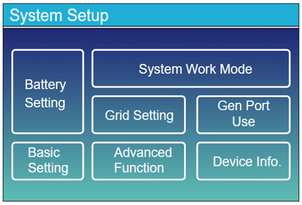
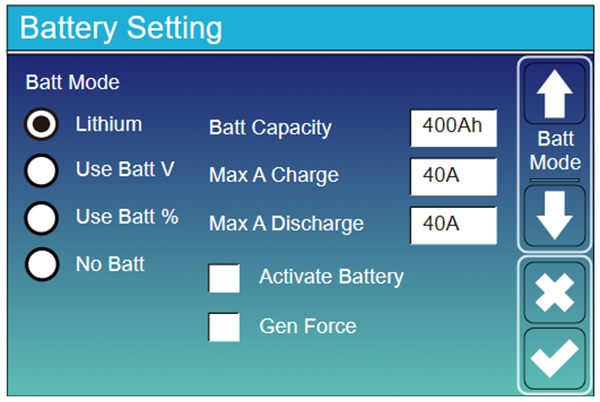
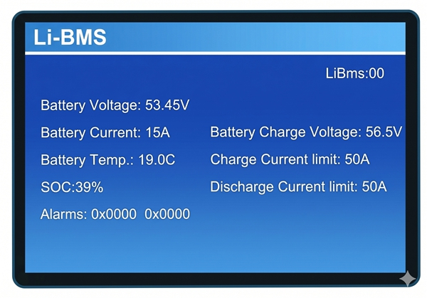

# GP-PC200B BMS connection and setup guide for Deye hybrid inverters

This manual describes how to physically connect and set parameters for a battery pack equipped with GP-PC200B BMS to a Deye hybrid inverter, enabling normal communication between the battery and the inverter via the CAN protocol.

**Applicable products**: Gobel Power GP-PC200B BMS paired with Deye hybrid inverter series.

## Required Materials

The following materials and equipment are required for this connection setup.

| No. | Name | Description |
|:---:|:---|:---|
| 1 | Battery pack with GP-PC200B BMS | The battery pack must have the GP-PC200B BMS properly installed and operating normally |
| 2 | Deye hybrid inverter | A Deye hybrid inverter supporting CAN communication protocol |
| 3 | Ethernet cable (straight-through) | A straight-through Ethernet cable with symmetrical RJ45 connector pinouts on both ends, used to connect the BMS to the inverter |

:::caution Ethernet Cable Requirements

Please ensure the Ethernet cable used is a straight-through cable with symmetrical ends (not a crossover cable), and that the RJ45 connectors on both ends are intact and secure. Choose the cable length based on the actual installation position; it is recommended not to exceed 10 meters to ensure communication stability.
:::

## Connection & Setup

The following steps will guide you through BMS protocol configuration, physical connection, and inverter parameter settings.

### BMS Communication Protocol Setup

First, set the CAN communication protocol of the GP-PC200B BMS to Deye-compatible mode.

1. Log in to the GP-PC200B BMS management interface
2. Enter the communication protocol settings page
3. Set the CAN communication protocol to **Deye** or **Pylon** mode

:::tip Protocol Selection

Deye inverters are compatible with both Deye and Pylon CAN communication protocols. If one protocol fails to communicate properly, try switching to the other.
:::

> For detailed BMS protocol setup steps, please refer to the official documentation:  
> [GP-PC200B Communication Protocol Setup Guide](https://docs.gobelpower.com/docs/bms/GP-PC200B/communication/)

### Physical Connection

Use an Ethernet cable to physically connect the BMS to the inverter.

1. Confirm that both the battery pack and inverter are powered off
2. Take the **Ethernet cable (straight-through)** and insert one end into the master battery's **CAN port**
3. Insert the other end of the Ethernet cable into the Deye inverter's **BMS port**

:::tip

The battery should be properly addressed via DIP switches. For details, see the GP-PC200B Communication Protocol Setup Guide.
:::

:::caution

Before connecting, make sure both devices are powered off. Hot-plugging communication cables may cause damage to the communication interfaces.
:::

### Inverter Parameter Settings

After completing the physical connection, power on the inverter and configure the following settings on the inverter's touch screen.

**Step 1: Enter the Battery Settings Page**

On the inverter's home screen, tap to enter the **System Setup** page, then tap the **Battery Setting** option.

**Step 2: Configure Battery Parameters**

On the **Battery Setting** page, configure the following parameters in order:

- **Batt Mode**: Select **Lithium**
- **Batt Capacity**: Enter the total battery pack capacity. Formula: rated capacity on the battery label × number of batteries
- **Max A Charge**: Enter the maximum charging current of the battery pack. This value should be less than or equal to the maximum continuous charging current on the battery label × number of batteries
- **Max A Discharge**: Enter the maximum discharging current of the battery pack. This value should be less than or equal to the maximum continuous discharging current on the battery label × number of batteries

**Step 3: Verify BMS Communication Data**

After completing the parameter settings, navigate to the **Li-BMS** page on the inverter screen to view the real-time data read by the inverter from the battery BMS. Check the following items one by one:

| Check Item | Correct Value |
|:---|:---|
| Battery Voltage | Should equal the average battery voltage |
| Battery SOC | Should equal the average battery SOC |
| Charge Current Limit | Should equal the maximum charging current value calculated in the previous step |
| Discharge Current Limit | Should equal the maximum discharging current value calculated in the previous step |

**Step 4: Confirm Communication is Normal**

If all the above data is verified correctly, it indicates that CAN communication between the battery and the inverter has been successfully established, and the connection setup is complete.

:::note More Settings

For more inverter setting options, please refer to the official Deye inverter manual: [www.deyeinverter.com](https://www.deyeinverter.com/)
:::

## Appendix

### Reference Links

| Resource | Link |
|:---|:---|
| GP-PC200B BMS Communication Protocol Setup | [https://docs.gobelpower.com/docs/bms/GP-PC200B/communication/](https://docs.gobelpower.com/docs/bms/GP-PC200B/communication/) |
| Deye Inverter Official Manual | [https://www.deyeinverter.com/](https://www.deyeinverter.com/) |

### FAQ

**Q: No data displayed on the inverter Li-BMS page?**

A: Please check the following:
- Confirm that the master battery's DIP switch addressing is correct
- Confirm that the BMS CAN communication protocol is correctly set to Deye or Pylon mode
- Check that both ends of the Ethernet cable are firmly inserted into the CAN port and BMS port
- Confirm that the Ethernet cable is a straight-through cable and rule out cable defects
- Try powering off both the inverter and BMS, then restarting

**Q: The battery data displayed on the inverter does not match actual values?**

A: Confirm that the BMS CAN communication protocol is correctly set to Deye or Pylon mode.
