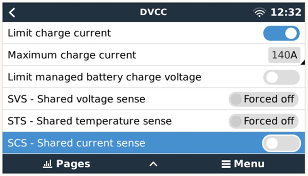
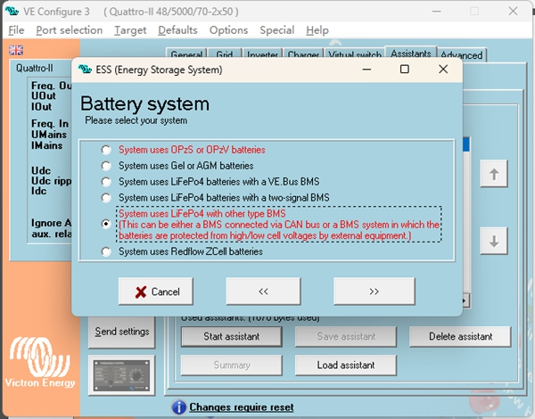
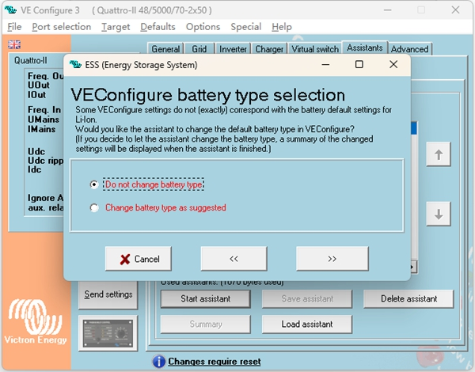
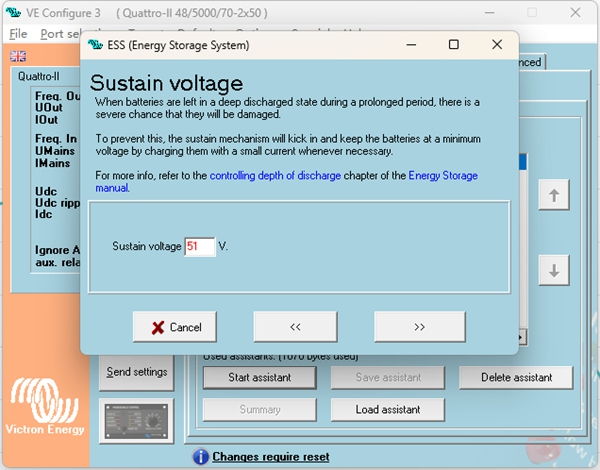
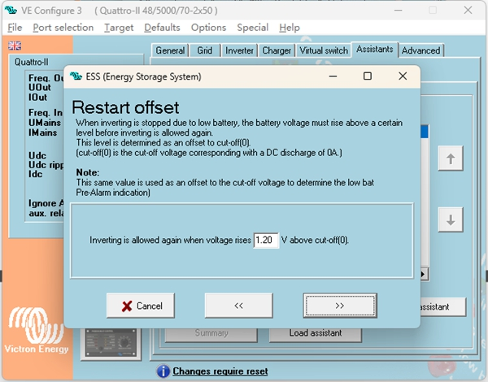

# GP-PC200B BMS to Victron Inverter Connection Setup Guide

This manual describes how to connect and configure the Gobel Power GP-PC200B BMS battery system with a Victron inverter and Cerbo GX device.

## Required Materials

Before starting, ensure you have the following equipment and materials ready:

|  #  |                   Material Name                    |                           Description                            |
| :-: | :------------------------------------------------: | :--------------------------------------------------------------: |
|  1  |   Battery pack using GP-PC200B BMS                 | Gobel Power battery system with built-in GP-PC200B BMS            |
|  2  |   Victron inverter and Cerbo GX device             | Official Victron inverter and communication gateway              |
|  3  |   Victron official Type B BMS connection cable     | VE.Can to CAN-bus BMS dedicated cable (Type B)                   |

:::info
The Victron Type B VE.Can to CAN-bus BMS cable is used for CAN-Bus communication between Gobel Power batteries and Victron GX devices. You can obtain this cable from the Victron official website.
:::

## Physical Connections

### BMS Settings

Before connecting the battery to Victron devices, verify that the GP-PC200B BMS communication protocol is correctly configured. For detailed setup instructions, refer to the GP-PC200B BMS Communication Settings documentation.

:::info
GP-PC200B BMS Communication Settings documentation: https://docs.gobelpower.com/docs/bms/GP-PC200B/communication/
:::

### Inverter Connection

1. Use the Victron Type B VE.Can to CAN-bus BMS dedicated cable to establish CAN-Bus communication between the Gobel Power battery and the Victron GX device. This cable is available at the following link: https://www.victronenergy.com/cables/ve-can-to-can-bus-bms

2. Connect the **BMS-CAN** end of the Victron cable to the battery's **CAN** communication port.

3. Connect the **Victron VE.CAN** end of the cable to the Cerbo GX device's communication port:
   - Older Cerbo GX: connect to the **BMS-CAN** port
   - Newer Cerbo GX: connect to the **VE.CAN** port

## Cerbo GX Setup

After completing the physical connections, follow the steps below to configure the Cerbo GX device.

### 1. BMS-CAN Port Configuration

Go to **Settings -> Services -> BMS-Can Port -> CAN-bus profile** and ensure **CAN-bus BMS (500 kbit/s)** is selected.

### 2. DVCC Settings

Go to **Settings -> DVCC** and configure the following parameters:

|                    Setting                     |                                Value                                |
| :--------------------------------------------: | :-----------------------------------------------------------------: |
|                     DVCC                        |                    Forced on                                         |
| Limit charge current (optional)                |                    ON                                                |
|              Max charge current                | Number of battery packs x 0.5 x single pack capacity (Ah)           |

**Example:** For 2 battery packs of 51.2V 280Ah, the maximum charge current is 2 x 0.5 x 280 = **280A**.

:::tip Maximum Charge Current Calculation
Maximum charge current = Number of battery packs x 0.5 x single pack capacity (Ah). Please calculate based on the actual number and capacity of your battery packs.
:::

### 3. Device Identification Confirmation

After completing the above settings, the battery device will appear in the device list. You can view real-time battery data on the **Battery Parameters** page.

## VictronConnect App Setup

Use the VictronConnect mobile application to configure your Victron devices.

### 1. Victron MPPT Solar Charge Controller Settings

In the VictronConnect App, select the MPPT device and configure the following parameters:

|                     Setting                     |                 Value                 |
| :---------------------------------------------: | :-----------------------------------: |
|               Charger Enabled                    |                  ON                   |
|                Battery preset                    |            User defined               |
|            Absorption Voltage                     |   Equal to Charge Voltage Limit (CVL) |
|                Float voltage                     |  Slightly lower than Absorption Voltage |
|        Low temperature cut-off                   |              Disabled                 |

### 2. Victron Inverter/Charger Settings

In the VictronConnect App, select the inverter/charger device and configure the **Charger** settings with the following parameters:

|                       Setting                       |                 Value                 |
| :-------------------------------------------------: | :-----------------------------------: |
|               Enable Charger                         |                  ON                   |
|             Absorption Voltage                       |   Equal to Charge Voltage Limit (CVL) |
|               Float voltage                          |  Slightly lower than Absorption Voltage |
|          Low temperature cut-off                     |              Disabled                 |
|                Charge Curve                          |                Fixed                  |
|             Lithium batteries                        |                  ON                   |

## VE Configuration Tools Setup

Use the Victron VE Configuration Tools software to perform advanced configuration of the inverter/charger.

### 1. Inverter/Charger Settings

#### Enable Charger

Check the **Enable charger** option to enable the charger function.

#### Lithium Batteries Mode

Check the **Lithium batteries** option to enable lithium battery mode.

#### Other Settings

Configure the following parameters:

|                    Setting                     |                 Value                 |
| :--------------------------------------------: | :-----------------------------------: |
|                Charge curve                     |                Fixed                  |
|            Absorption voltage                   |   Equal to Charge Voltage Limit (CVL) |
|              Float voltage                      |  Slightly lower than Absorption Voltage |

### 2. Virtual Switch Settings

In the **Virtual switch** tab, select **Do not use VS**.

### 3. ESS (Energy Storage System) Assistant Setup -- Add Assistant

In the **Assistant** tab, click to add an assistant and select **ESS (Energy Storage System)**.

### 4. ESS Assistant Setup -- Configure Parameters

#### Select System Type

Click **Start assistant** and select option 5 from the choices.

#### Set Total Capacity

Enter the total capacity of the battery system.

#### Battery Type

Select **Do not change battery type**.

#### Set Sustain Voltage

Set the **Sustain voltage** to **51V**.

#### Set Dynamic Cut-off

Configure the dynamic cut-off voltages according to the following relationships:

|   Discharge Rate   |  Cut-off Voltage  |
| :----------------: | :---------------: |
|       0.005C       |        49V        |
|        0.25C       |        48V        |
|        0.7C        |        48V        |
|         2C         |        47V        |

#### Restart Offset

Use the default **Restart offset** value; no modification is needed.

:::tip Setup Complete
After completing all the above configurations, the GP-PC200B BMS battery system will have successfully established communication and control connection with the Victron inverter. You can verify the battery status in the Cerbo GX device list.
:::
