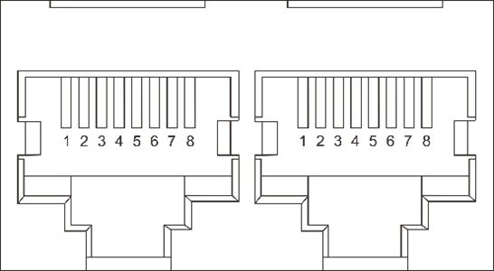
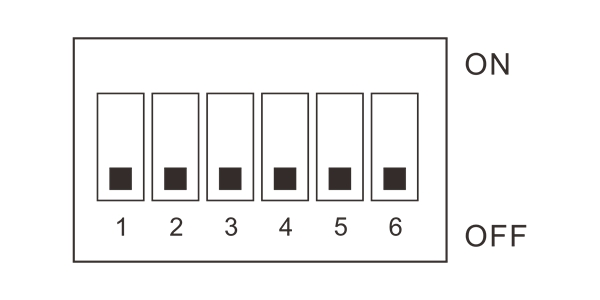

# GP-PC200B BMS Communication Connection Manual

This manual applies to the **Gobel Power GP-PC200B** Battery Management System (BMS), guiding users through multi-battery parallel communication, inverter connection, and communication protocol settings.

## Product Overview

The GP-PC200B is a Battery Management System (BMS) from Gobel Power, featuring comprehensive communication interfaces that support multi-battery parallel operation and communication with mainstream inverter brands.

### Key Features

- **Multi-Battery Parallel Communication**: Supports up to 63 slave units in parallel, with DIP switch or automatic address assignment for coordinated management of multiple battery packs
- **Inverter Communication**: Communicates with inverters via RS485 or CAN interfaces, compatible with multiple inverter protocols
- **PC Monitoring**: Connects to PC monitoring software via RS232 interface for real-time battery status viewing and parameter configuration
- **Flexible Protocol Switching**: Inverter communication protocols can be switched via the screen or PC software, compatible with multiple inverter brands

### Communication Interface Overview

|         Interface         |        Purpose        | Connector Type |
| :-----------------------: | :-------------------: | :------------: |
|    **RS485A** / **CAN**     | Inverter BMS Communication  |     RJ45     |
| **RS485B** / **RS485C** | Battery Parallel Communication |     RJ45     |
|       **RS232**        | PC Debug Communication |     RJ12     |

## Parts List

|          No.          |           Name           | Specification/Qty |              Image              |
| :-------------------: | :----------------------: | :---------------: | :----------------------------: |
| <a id="Part01">01</a> |  RJ45 Parallel Communication Cable  |      1 pc     |  |
| <a id="Part02">02</a> | RJ45 Inverter Communication Cable |      1 pc     |  |
| <a id="Part03">03</a> | USB to RS232 PC Communication Cable |      1 pc     |  |

:::note
- The **RJ45 Parallel Communication Cable ([01](#Part01))** and **RJ45 Inverter Communication Cable ([02](#Part02))** look identical — both are RJ45 network cables. Please distinguish them by cable labels or packaging.
- The inverter communication cable uses a straight-through pinout (symmetrical connection at both ends). If the BMS-side pinout does not match the inverter-side pinout, you will need to make your own cable or purchase a dedicated cable from the inverter manufacturer.
:::

## Product Communication Interface Description

### RS485A / CAN Port

RS485A and CAN share the same RJ45 physical port and are used for BMS communication with the inverter. Choose RS485A or CAN depending on the protocol type supported by the inverter.

**RS485A Pinout (RJ45, 8P8C):**

| Pin | Signal |
| :-: | :----: |
|  1  |   B    |
|  2  |   A    |
|  3  |  GND   |
|  4  |   NC   |
|  5  |   NC   |
|  6  |  GND   |
|  7  |   A    |
|  8  |   B    |

**CAN Pinout (RJ45, 8P8C):**

| Pin | Signal |
| :-: | :----: |
|  1  |   NC   |
|  2  |  GND   |
|  3  |   NC   |
|  4  | CAN-H  |
|  5  | CAN-L  |
|  6  |   NC   |
|  7  |   NC   |
|  8  |   NC   |

### RS232 Port

The RS232 port is used to connect to PC monitoring software for parameter configuration and status monitoring.

**RS232 Pinout (RJ12, 6P6C):**

| Pin | Signal |
| :-: | :----: |
|  1  |   NC   |
|  2  |   NC   |
|  3  |  TXD   |
|  4  |  RXD   |
|  5  |  GND   |
|  6  |   NC   |

### RS485B / RS485C Port

RS485B and RS485C are used for battery-to-battery parallel communication. RS485B is the output port, and RS485C is the input port.

**RS485B / RS485C Pinout (RJ45, 8P8C):**

| Pin | Signal |
| :-: | :----: |
|  1  |   B    |
|  2  |   A    |
|  3  |  GND   |
|  4  |   NC   |
|  5  |   NC   |
|  6  |  GND   |
|  7  |   A    |
|  8  |   B    |

:::tip Pin Description
- **A / B**: RS485 differential signal lines
- **CAN-H / CAN-L**: CAN bus differential signal lines
- **TXD / RXD**: RS232 transmit and receive signal lines
- **GND**: Signal ground
- **NC**: No Connection — this pin has no function
:::

## Parallel Connection Steps

### DIP Switch Settings

Before performing parallel wiring, you need to set the communication address for each battery. The BMS supports two addressing methods:

#### Automatic Addressing

Set all BMS DIP switches to the **OFF** position (i.e., OFF OFF OFF OFF OFF OFF), and the BMS system will automatically assign communication addresses to each battery.

:::tip Recommended
Automatic addressing is simple and convenient, suitable for most scenarios. It is recommended to use automatic addressing first.
:::

#### Manual Addressing

If you need to manually specify the communication address for each battery, refer to the DIP switch setting table in the appendix and set the address for each battery one by one.

- **Address 01**: Master — a parallel system must have exactly one master unit
- **Address 02–63**: Slave — all other batteries are set as slaves, and addresses must not be duplicated

### Parallel Wiring

After completing the DIP switch settings, use the **RJ45 Parallel Communication Cable ([01](#Part01))** to daisy-chain the **RS485B** and **RS485C** ports of each battery in sequence.

Wiring rules:

- Connect the **RS485B** port of the first battery to the **RS485C** port of the second battery
- Connect the **RS485B** port of the second battery to the **RS485C** port of the third battery
- Continue in this manner until all batteries are connected

:::info Port Direction
RS485B is the output port, and RS485C is the input port. Data flows from the RS485B output of the first battery, enters the RS485C input of the second battery, and then exits via its RS485B output to the next battery, forming a daisy-chain topology.
:::

## Inverter Connection

After completing the parallel wiring, use the **RJ45 Inverter Communication Cable ([02](#Part02))** to connect the battery pack to the inverter.

Steps:

1. Confirm the communication protocol type used by the inverter (RS485 or CAN) by referring to the inverter's product manual
2. Insert one end of the cable into the corresponding port of the first battery (master):
   - If the inverter uses the RS485 protocol, plug into the **RS485A** port
   - If the inverter uses the CAN protocol, plug into the **CAN** port
3. Insert the other end of the cable into the inverter's BMS communication interface

:::caution Pin Matching
The included **RJ45 Inverter Communication Cable ([02](#Part02))** uses a straight-through pinout at both ends. Before connecting, be sure to verify the following two items:

- The pinout of the BMS-side **RS485A** or **CAN** port
- The pinout of the inverter-side BMS communication interface (refer to the inverter's product manual)

If the pinouts on both ends do not match, you will need to make a custom communication cable or purchase a dedicated cable from the inverter manufacturer (e.g., Victron inverters require their proprietary cable).
:::

## Protocol Settings

After completing the physical wiring, you need to set the communication protocol matching the inverter on the first battery (master). There are two ways to set it:

### Via Screen Settings

In the display menu of the first battery (master), find the **Inverter Protocol Settings** option and select the communication protocol corresponding to the current inverter brand and model from the protocol list.

### Via PC Software Settings

1. Use the **USB to RS232 PC Communication Cable ([03](#Part03))** to connect the **RS232** port of the first battery (master) to the computer
2. Open the BMS PC software on the computer
3. Find the inverter protocol settings option in the software and select the corresponding inverter protocol
4. Disconnect the cable after saving the settings

:::tip
If you are unsure which protocol to select, refer to the BMS communication section of the inverter's product manual, or contact the inverter manufacturer for technical support.
:::

## Appendix

### DIP Switch Setting Table

The following table lists all DIP switch combinations. Each battery address must be unique, with only one master allowed in the system (address 01) and the rest as slaves (addresses 02–63).

| Address | SW1 | SW2 | SW3 | SW4 | SW5 | SW6 | Role |
| :-----: | :-: | :-: | :-: | :-: | :-: | :-: | :--: |
| 00 | OFF | OFF | OFF | OFF | OFF | OFF | Invalid |
| 01 | ON | OFF | OFF | OFF | OFF | OFF | Master |
| 02 | OFF | ON | OFF | OFF | OFF | OFF | Slave |
| 03 | ON | ON | OFF | OFF | OFF | OFF | Slave |
| 04 | OFF | OFF | ON | OFF | OFF | OFF | Slave |
| 05 | ON | OFF | ON | OFF | OFF | OFF | Slave |
| 06 | OFF | ON | ON | OFF | OFF | OFF | Slave |
| 07 | ON | ON | ON | OFF | OFF | OFF | Slave |
| 08 | OFF | OFF | OFF | ON | OFF | OFF | Slave |
| 09 | ON | OFF | OFF | ON | OFF | OFF | Slave |
| 10 | OFF | ON | OFF | ON | OFF | OFF | Slave |
| 11 | ON | ON | OFF | ON | OFF | OFF | Slave |
| 12 | OFF | OFF | ON | ON | OFF | OFF | Slave |
| 13 | ON | OFF | ON | ON | OFF | OFF | Slave |
| 14 | OFF | ON | ON | ON | OFF | OFF | Slave |
| 15 | ON | ON | ON | ON | OFF | OFF | Slave |
| 16 | OFF | OFF | OFF | OFF | ON | OFF | Slave |
| 17 | ON | OFF | OFF | OFF | ON | OFF | Slave |
| 18 | OFF | ON | OFF | OFF | ON | OFF | Slave |
| 19 | ON | ON | OFF | OFF | ON | OFF | Slave |
| 20 | OFF | OFF | ON | OFF | ON | OFF | Slave |
| 21 | ON | OFF | ON | OFF | ON | OFF | Slave |
| 22 | OFF | ON | ON | OFF | ON | OFF | Slave |
| 23 | ON | ON | ON | OFF | ON | OFF | Slave |
| 24 | OFF | OFF | OFF | ON | ON | OFF | Slave |
| 25 | ON | OFF | OFF | ON | ON | OFF | Slave |
| 26 | OFF | ON | OFF | ON | ON | OFF | Slave |
| 27 | ON | ON | OFF | ON | ON | OFF | Slave |
| 28 | OFF | OFF | ON | ON | ON | OFF | Slave |
| 29 | ON | OFF | ON | ON | ON | OFF | Slave |
| 30 | OFF | ON | ON | ON | ON | OFF | Slave |
| 31 | ON | ON | ON | ON | ON | OFF | Slave |
| 32 | OFF | OFF | OFF | OFF | OFF | ON | Slave |
| 33 | ON | OFF | OFF | OFF | OFF | ON | Slave |
| 34 | OFF | ON | OFF | OFF | OFF | ON | Slave |
| 35 | ON | ON | OFF | OFF | OFF | ON | Slave |
| 36 | OFF | OFF | ON | OFF | OFF | ON | Slave |
| 37 | ON | OFF | ON | OFF | OFF | ON | Slave |
| 38 | OFF | ON | ON | OFF | OFF | ON | Slave |
| 39 | ON | ON | ON | OFF | OFF | ON | Slave |
| 40 | OFF | OFF | OFF | ON | OFF | ON | Slave |
| 41 | ON | OFF | OFF | ON | OFF | ON | Slave |
| 42 | OFF | ON | OFF | ON | OFF | ON | Slave |
| 43 | ON | ON | OFF | ON | OFF | ON | Slave |
| 44 | OFF | OFF | ON | ON | OFF | ON | Slave |
| 45 | ON | OFF | ON | ON | OFF | ON | Slave |
| 46 | OFF | ON | ON | ON | OFF | ON | Slave |
| 47 | ON | ON | ON | ON | OFF | ON | Slave |
| 48 | OFF | OFF | OFF | OFF | ON | ON | Slave |
| 49 | ON | OFF | OFF | OFF | ON | ON | Slave |
| 50 | OFF | ON | OFF | OFF | ON | ON | Slave |
| 51 | ON | ON | OFF | OFF | ON | ON | Slave |
| 52 | OFF | OFF | ON | OFF | ON | ON | Slave |
| 53 | ON | OFF | ON | OFF | ON | ON | Slave |
| 54 | OFF | ON | ON | OFF | ON | ON | Slave |
| 55 | ON | ON | ON | OFF | ON | ON | Slave |
| 56 | OFF | OFF | OFF | ON | ON | ON | Slave |
| 57 | ON | OFF | OFF | ON | ON | ON | Slave |
| 58 | OFF | ON | OFF | ON | ON | ON | Slave |
| 59 | ON | ON | OFF | ON | ON | ON | Slave |
| 60 | OFF | OFF | ON | ON | ON | ON | Slave |
| 61 | ON | OFF | ON | ON | ON | ON | Slave |
| 62 | OFF | ON | ON | ON | ON | ON | Slave |
| 63 | ON | ON | ON | ON | ON | ON | Slave |
