# GP-SRA-PC314 Assembly Manual

**Brand:** Gobel Power

**Product Model:** GP-SRA-PC314

**Manual Type:** Assembly Manual

**Applicable Product:** LiFePO4 High Voltage Battery DIY Kit

## Safety Precautions

:::danger Electrical Safety
- The system voltage can reach up to 1000V. During installation, commissioning, and use, safety precautions must be taken according to relevant safety regulations to avoid accidents.
- **It is strictly forbidden to connect the slave BMU while the high-voltage box is powered on** to avoid potential damage to the BMS.
- Tools used by installation and commissioning personnel must have insulation protection.
- Insulated rubber gloves must be worn during installation, commissioning, and maintenance. Wear goggles and insulated rubber boots as appropriate to avoid accidents as much as possible.
- When maintenance is required, the main circuit breaker must be disconnected to cut off the connection between the battery pack and the PCS DC bus.
:::

:::danger Battery Safety
- If wire ends, metal, or other debris generated during installation, commissioning, and maintenance fall into the battery compartment, be sure to use insulated tools to remove them. Do not leave debris inside.
- Ensure the positive and negative poles are connected correctly to avoid short circuits that could damage the battery or BMS.
:::

:::warning Fire Safety
- In case of a fire around the energy storage cabinet, be sure to use a dry powder fire extinguisher or fire sand to extinguish the fire.
- **Using liquid to extinguish the fire may result in electric shock.**
- If the system is not used for a long time, be sure to disconnect the main circuit breaker of the battery cabinet.
:::

:::warning General Safety
- The working environment should be kept dry, ventilated, and free of flammable materials.
- Children and unrelated personnel should stay away from the installation area.
- Use qualified tools with insulation protection for operation.
:::

## Product Introduction

GP-SRA-PC314 is a LiFePO4 high-voltage battery DIY kit launched by Gobel Power, consisting of three main parts: high-voltage box, BMU, and battery pack.

### Main Features

- **Cell Specification**: Uses 314Ah LiFePO4 cells
- **Connection Method**: 1P18S series (18 cells in series)
- **System Configuration**: This high-voltage system requires at least 5 battery packs and a maximum of 15 battery packs connected in series.
- **BMU Function**: Each battery pack is equipped with one BMU, which can detect the voltage of 18 cells and is equipped with 8 NTC temperature sensors.
- **High-Voltage Box Performance**:
  - Supports a maximum current of 200A
  - Can connect to inverters, upper computers, and EMS
  - Provides overcharge protection, over-discharge protection, over-current protection, over-temperature protection, low-temperature protection, and multi-level alarm mechanisms
  - Real-time communication with the master controller to upload battery data
  - Battery status and data storage functions
  - RS485 and CAN isolated communication functions
  - Can be externally connected to 6 relays, suitable for commercial and industrial energy storage, UPS power supply systems, and other applications

## Parts List

:::note
The quantity marked "N" in the table below represents the quantity required for each battery pack. The high-voltage box and some common parts only require 1 piece.
:::

| No. | Name | Specification/Quantity | Image |
| :---: | :---: | :---: | :---: |
| <a id="part01">01</a> | Enclosure Case | 1 pc/N |  |
| <a id="part02">02</a> | Cell Compression Plate | 1 pc/N | 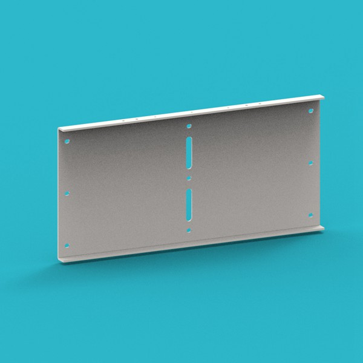 |
| <a id="part03">03</a> | Cell Clamping Bar | 1 pc/N |  |
| <a id="part04">04</a> | Bottom Epoxy Board | 2 pcs/N |  |
| <a id="part05">05</a> | Side Epoxy Board | 4 pcs/N | 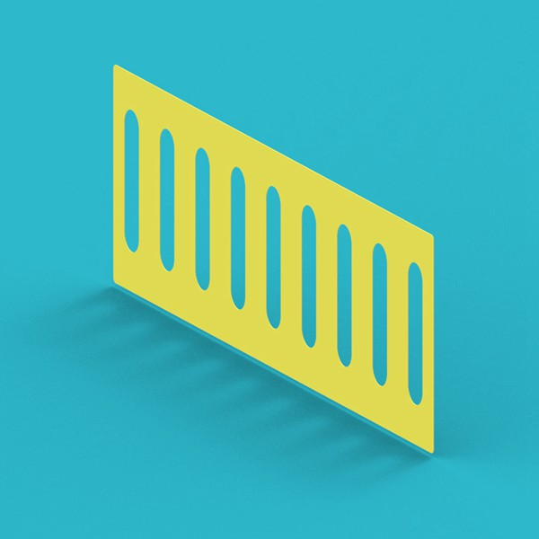 |
| <a id="part06">06</a> | Cell Epoxy Board | 20 pcs/N |  |
| <a id="part07">07</a> | Clamping Bar Epoxy Board | 2 pcs/N |  |
| <a id="part08">08</a> | Cell Busbar | 17 pcs/N |  |
| <a id="part09">09</a> | Main Terminal Lug | 2 pcs/N |  |
| <a id="part10">10</a> | Positive Copper Busbar | 1 pc/N |  |
| <a id="part11">11</a> | Negative Copper Busbar | 1 pc/N |  |
| <a id="part12">12</a> | Enclosure Cover | 1 pc/N |  |
| <a id="part13">13</a> | Enclosure Panel | 1 pc/N |  |
| <a id="part14">14</a> | Fan | 2 pcs/N |  |
| <a id="part15">15</a> | Fan Fixing Plate | 2 pcs/N |  |
| <a id="part16">16</a> | Fan Guard | 2 pcs/N |  |
| <a id="part17">17</a> | BMU | 1 pc/N |  |
| <a id="part18">18</a> | High-Voltage Box | 1 pc (System) | 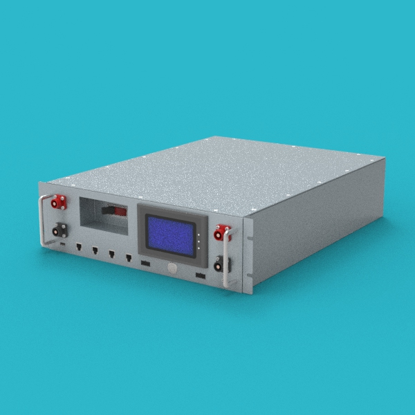 |
| <a id="part19">19</a> | BMU Communication Cable | 1 pc/N |  |
| <a id="part20">20</a> | Fan Connection Cable | 1 pc/N |  |
| <a id="part21">21</a> | HV Box to BMU Comm Cable | 1 pc (System) |  |
| <a id="part22">22</a> | PC Communication Cable | 1 pc (System) |  |
| <a id="part23">23</a> | Positive Terminal Base | 1 pc/N |  |
| <a id="part24">24</a> | Negative Terminal Base | 1 pc/N |  |
| <a id="part25">25</a> | Positive Terminal Plug | (1 pc +2)/N |  |
| <a id="part26">26</a> | Negative Terminal Plug | (1 pc +2)/N | 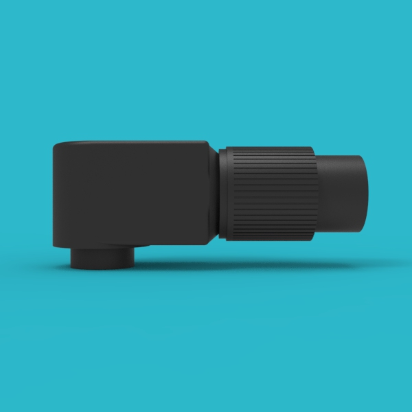 |
| <a id="part27">27</a> | Handle | 2 pcs/N |  |
| <a id="part28">28</a> | Case Mounting Ear | 2 pcs/N |  |
| <a id="part29">29</a> | Voltage Sensing Harness | 1 pc/N |  |
| <a id="part30">30</a> | Inverter Comm Cable | 1 pc (System) |  |

## Tools and Materials Preparation

:::note
The following tools and materials are not included with the product and must be prepared by the user.
:::

| Tool/Material | Specification/Requirement | Purpose |
| :---: | :---: | :---: |
| Insulated Screwdriver Set | Includes common specifications | Tightening screws |
| Torque Wrench | M6/M8/M10 sockets | Tighten screws according to torque requirements |
| Cable Crimping Tool | Suitable for 300A terminals | Crimping positive and negative terminal plugs |
| Multimeter | Insulation level meets high-voltage requirements | Testing voltage, continuity |
| Insulated Rubber Gloves | High-voltage protection level | Personal safety protection |
| Goggles | Impact resistant | Eye protection |
| Insulated Rubber Boots | High-voltage protection | Personal safety protection |
| Dry Powder Fire Extinguisher or Fire Sand | — | Fire emergency |
| Cable Cutting Tool | Suitable for high-voltage cables | Cutting cables to appropriate length |
| Insulation Tape | High-voltage insulation level | Insulation protection |

## Screw Torque Requirements

:::warning
Be sure to use a torque wrench to tighten the screws according to the following standards. Too loose or too tight may lead to poor connection or component damage.
:::

| Screw Specification | Torque Requirement |
| :---: | :---: |
| **M6** | **8N·m** |
| **M8** | **15N·m** |
| **M10** | **15-20N·m** |

## Assembly Steps

### Fan Assembly Pre-installation

**Step 1:** Assemble the fan assembly

Assemble the **Fan ([14](#part14))**, **Fan Fixing Plate ([15](#part15))**, and **Fan Guard ([16](#part16))** together. A total of 2 assemblies are needed for later use.

:::note Precautions
- Note that the text on the fan label should face towards the fan guard.
- Ensure the fan is installed firmly without looseness.
:::

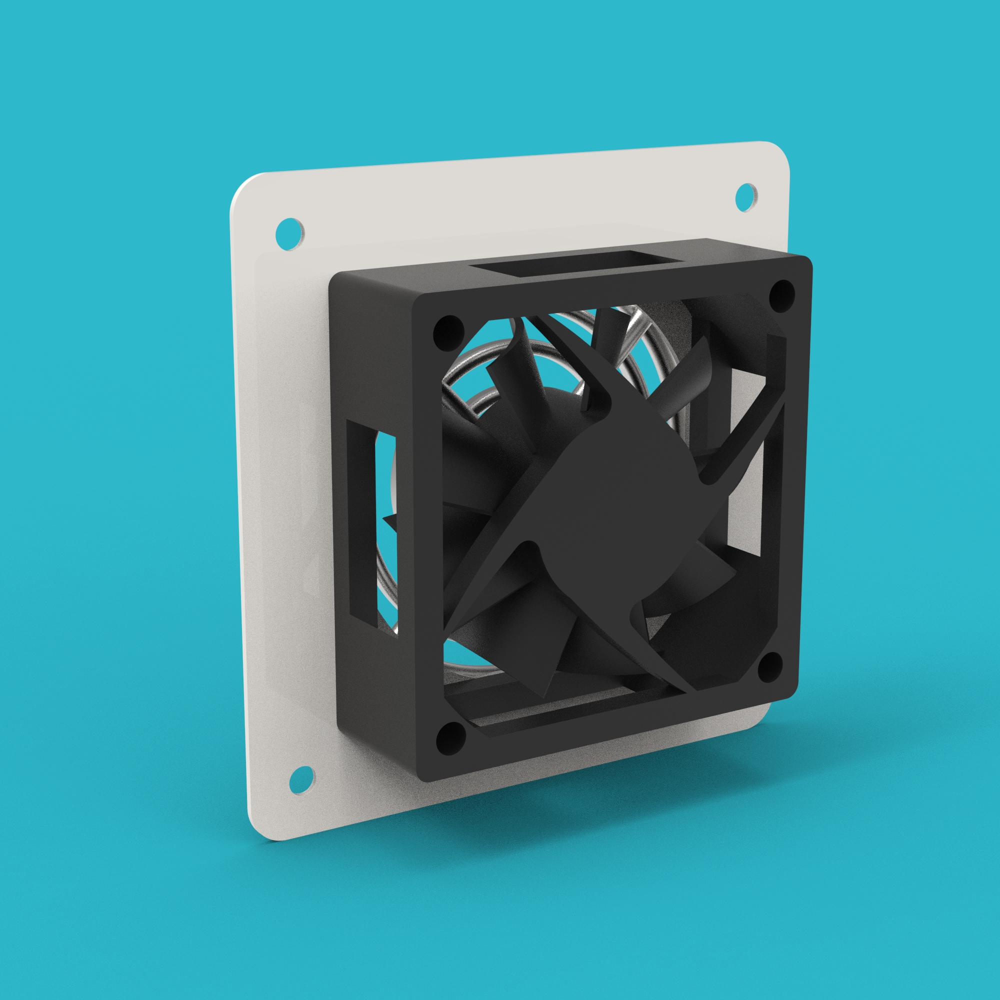

### Enclosure Panel Assembly Pre-installation

**Step 2:** Assemble the enclosure panel assembly

Assemble the **Enclosure Panel ([13](#part13))**, **Positive Terminal Base ([23](#part23))**, **Negative Terminal Base ([24](#part24))**, **BMU ([17](#part17))**, and **Handles ([27](#part27))** together for later use.

:::tip
It is recommended to pre-arrange the positions of each component on the workbench to ensure accurate alignment during installation.
:::

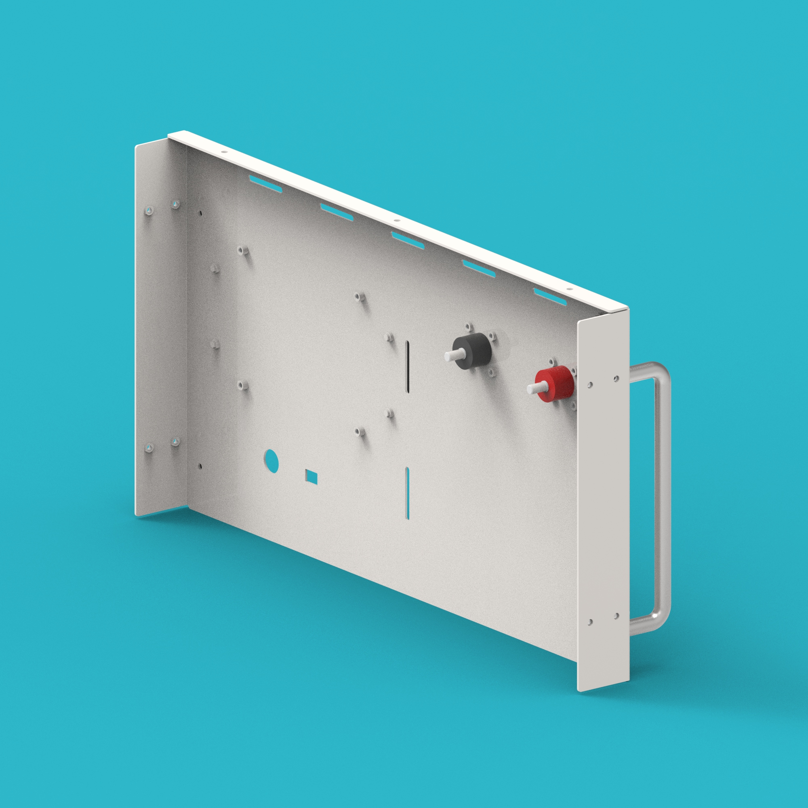

### Series Cable Pre-installation

**Step 3:** Assemble inter-pack series cables

Use a cable crimping tool and an appropriate length of cable to crimp the **Positive Terminal Plug ([25](#part25))** and **Negative Terminal Plug ([26](#part26))** to form inter-pack series cables.

:::note
- Ensure the crimp is firm and not loose.
- The cable length should be determined based on the actual spacing between battery packs.
:::

**Step 4:** Assemble battery pack to HV box positive connection cable

Use a cable crimping tool and an appropriate length of cable to crimp two **Positive Terminal Plugs ([25](#part25))** to form a battery pack to HV box positive connection cable.

**Step 5:** Assemble battery pack to HV box negative connection cable

Use a cable crimping tool and an appropriate length of cable to crimp two **Negative Terminal Plugs ([26](#part26))** to form a battery pack to HV box negative connection cable.

### Main Battery Pack Assembly

**Step 6:** Install fan assembly into the enclosure

Install the fan assembly onto the **Enclosure Case ([01](#part01))**. The fan wires should pass through the holes on the enclosure frame.

:::note
- Ensure the fan label faces outwards.
- Fan wires should pass through the reserved holes in the enclosure frame to avoid pinching.
:::

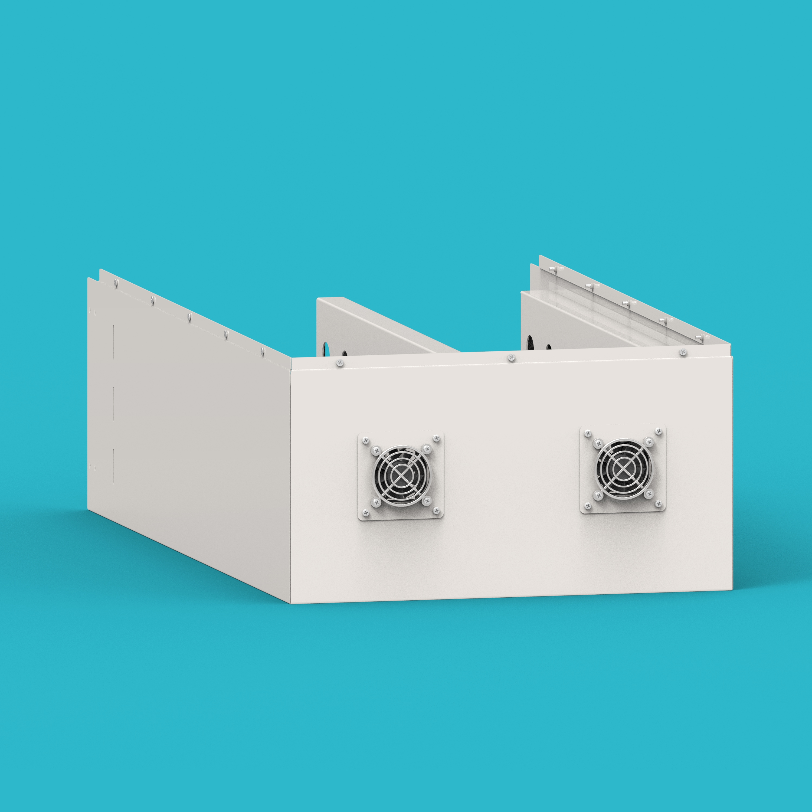

**Step 7:** Install bottom and side epoxy boards

Place the **Bottom Epoxy Boards ([04](#part04))** and **Side Epoxy Boards ([05](#part05))** into the enclosure.

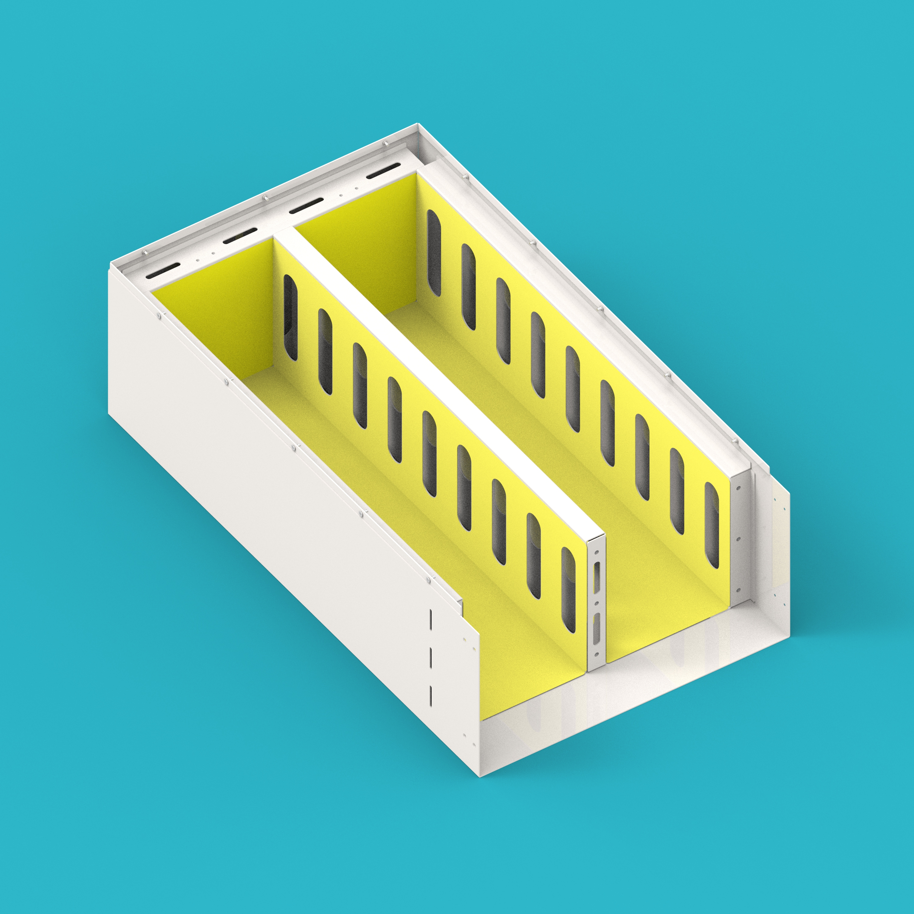

**Step 8:** Install cells into the enclosure

Place the cells into the **Enclosure Case ([01](#part01))**, paying attention to the positive and negative directions of the cells.

:::warning Note
The positive and negative directions of the cells must be correct, otherwise it will lead to subsequent connection errors.
:::

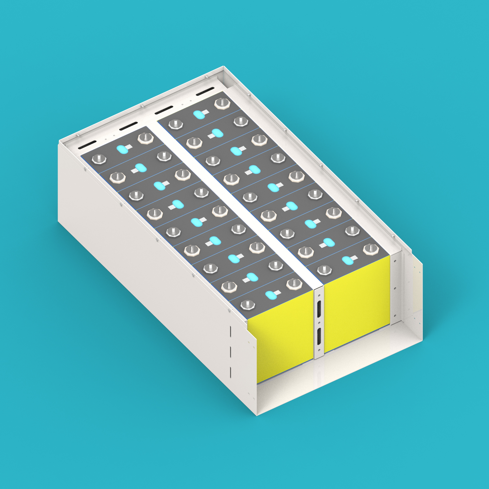

**Step 9:** Install cell compression plate

Install the **Cell Compression Plate ([02](#part02))** at the end of the cells to prevent cell expansion.

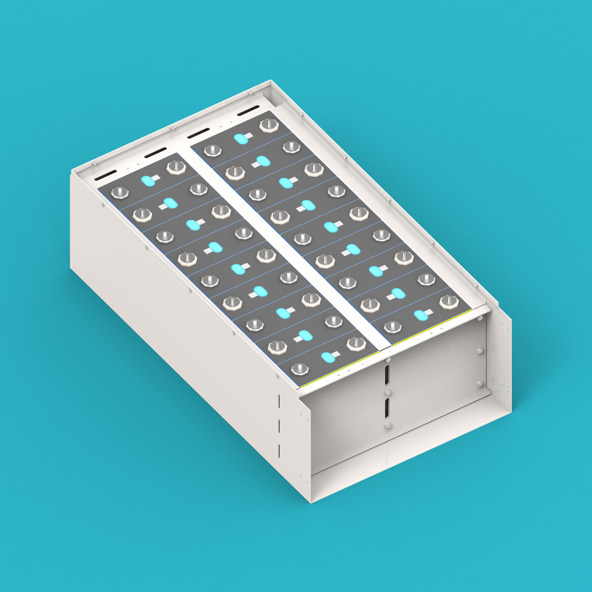

**Step 10:** Install clamping bar epoxy board

Install the **Clamping Bar Epoxy Board ([07](#part07))** above the cells.

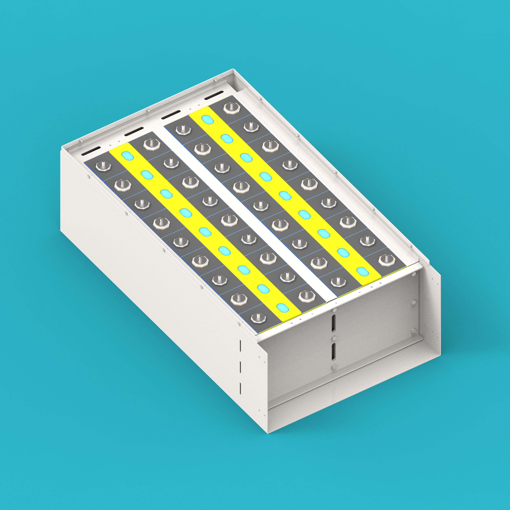

**Step 11:** Install cell clamping bar

Install the **Cell Clamping Bar ([03](#part03))** above the clamping bar epoxy board.

### Electrical Connections

**Step 12:** Install cell busbars and main terminal lugs

Install the **Cell Busbars ([08](#part08))** and **Main Terminal Lugs ([09](#part09))**.

:::warning High Voltage Danger
- This step involves high-voltage connections. Please ensure insulation protection is in place before operation.
- Busbars should be installed firmly, and contact surfaces should be tight.
:::

**Step 13:** Install enclosure panel assembly

Install the assembled enclosure panel assembly onto the case. Before installation, thread the **Voltage Sensing Harness ([29](#part29))** and **Fan Connection Cable ([20](#part20))** through the panel holes.

**Step 14:** Install case mounting ears

Install the **Case Mounting Ears ([28](#part28))** onto the enclosure.

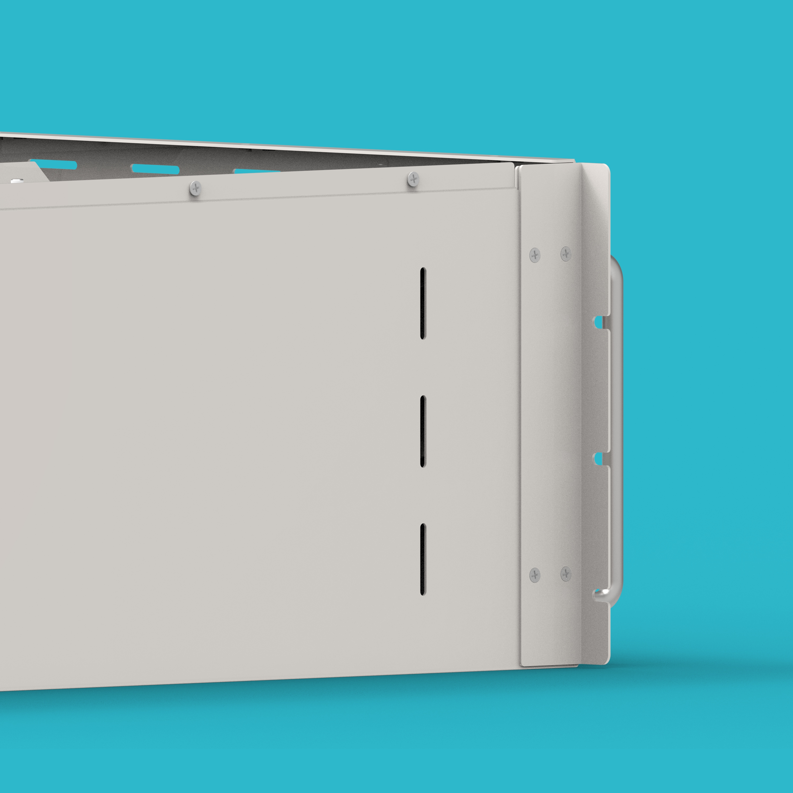

**Step 15:** Connect voltage sensing harness and fan connection cable

- Connect the **Voltage Sensing Harness ([29](#part29))** to the corresponding cells.
- Connect the **Fan Connection Cable ([20](#part20))** to the fan lead wires.
- Connect the other end of the voltage sensing harness to the **CELL VOLT/TEMP** port on the BMU.
- Connect the other end of the fan connection cable to the **FAN** port on the BMU.

:::note
- Ensure the voltage sensing harness is connected to each cell in order.
- Pay attention to the positive and negative correspondence for the fan connection cable.
:::

**Step 16:** Install positive and negative copper busbars

Install the **Positive Copper Busbar ([10](#part10))** and **Negative Copper Busbar ([11](#part11))**.

:::warning
- Copper busbar connections must be tight. Use a torque wrench to tighten to the standard torque.
- Ensure the copper busbars maintain a safe distance from other metal parts.
:::

### Final Assembly Completion

**Step 17:** Install enclosure cover

Install the **Enclosure Cover ([12](#part12))** onto the enclosure.

:::note
- Check that no tools or debris are left inside the enclosure before installation.
- Ensure the cover is well-sealed.
:::

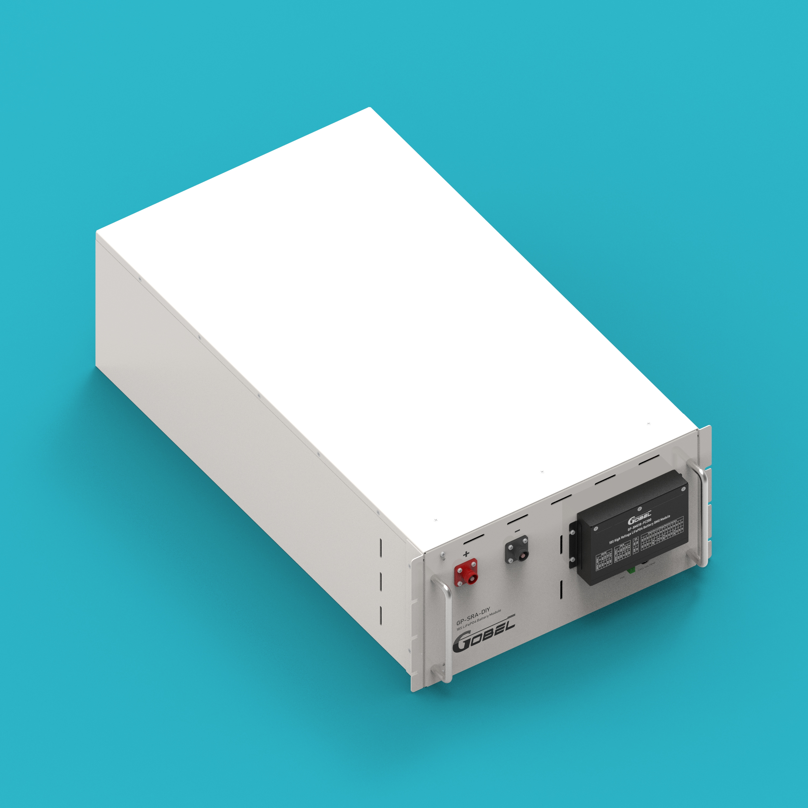

**Step 18:** Battery pack assembly complete

Battery pack assembly is finished. Check all connections for firmness and confirm no steps were missed before proceeding to the next step of system connection.

:::tip Assembly Completion Check
- Check if all screws are tightened according to torque requirements.
- Check if all electrical connections are correct and firm.
- Check that no metal debris is left inside the enclosure.
- Check if the fans rotate normally.
:::

## Connection Steps

:::note
The following connection steps are used to connect multiple battery packs with the high-voltage box to form a complete high-voltage system. The system requires at least 5 battery packs and a maximum of 15 battery packs connected in series.
:::

**Step 1:** Inter-pack series connection

Connect the positive pole of the first battery pack with the negative pole of the second battery pack using an **inter-pack series cable**. Continue this process to connect all battery packs in series.

**Step 2:** Communication connection between HV box and the first battery pack BMU

Connect the **Link Port Out** of the HV box with the **COM IN** port of the first battery pack using the **HV Box to BMU Comm Cable ([21](#part21))**.

**Step 3:** BMU communication connection between battery packs

Connect the **COM OUT** port of the first battery pack with the **COM IN** port of the second battery pack using the **BMU Communication Cable ([19](#part19))**. Continue this process to connect all BMU communication ports in series.

**Step 4:** Positive connection between HV box and the first battery pack

Connect the **B+** port of the HV box with the positive pole of the first battery pack using the **battery pack to HV box positive connection cable**.

**Step 5:** Negative connection between HV box and the last battery pack

Connect the negative pole of the last battery pack with the negative pole of the HV box using the **battery pack to HV box negative connection cable**.

:::danger High Voltage Danger
- Ensure all circuit breakers are in the disconnected state before connecting.
- Check all wiring for correctness and firmness after connection is complete.
- Use a multimeter to check if the total voltage is normal before powering on for the first time.
:::

## Port Diagram

### Battery Pack Port Diagram

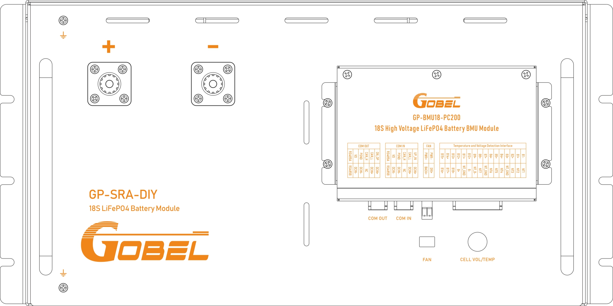

### High-Voltage Box Port Diagram

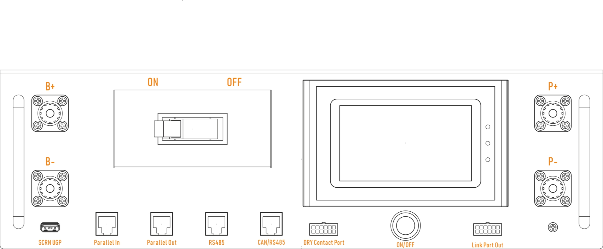

### BMU Port Diagram

## Contact Information

In case of troubleshooting issues that cannot be resolved, please contact Gobel Power technical support:

- **Official Website:** www.gobelpower.com
- **Technical Support Email:** cs@gobelpower.com
