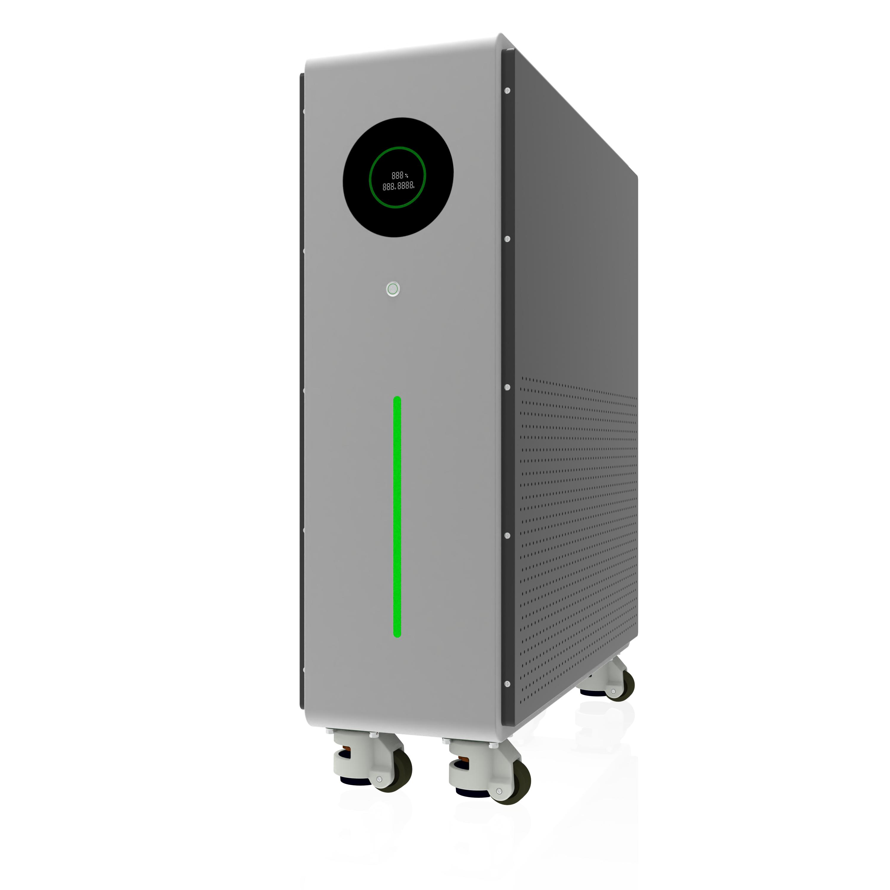
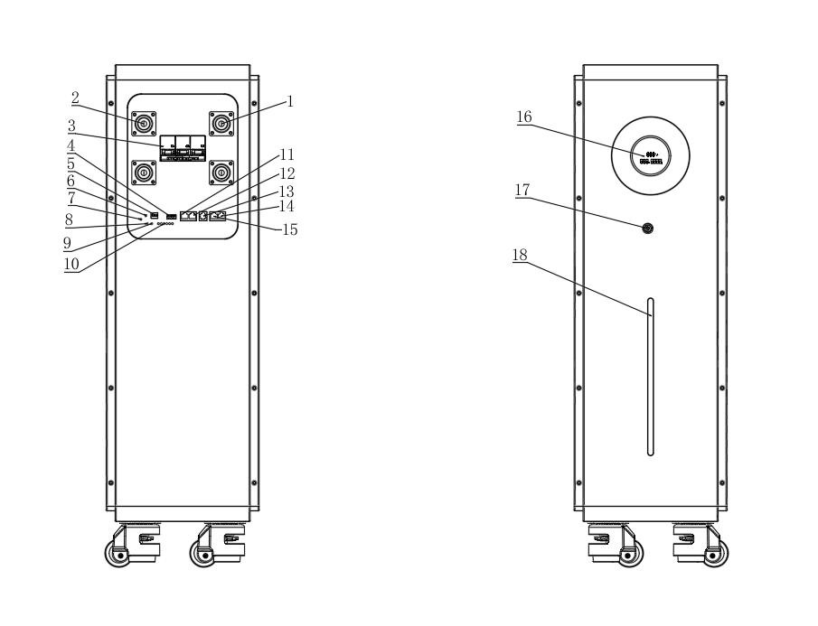
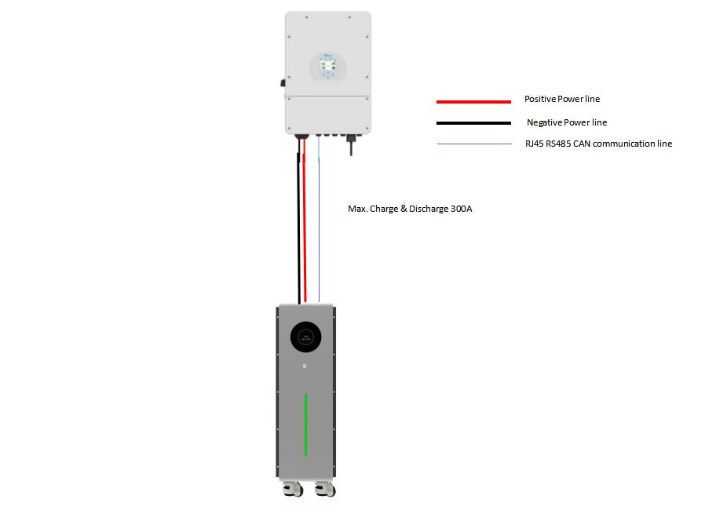
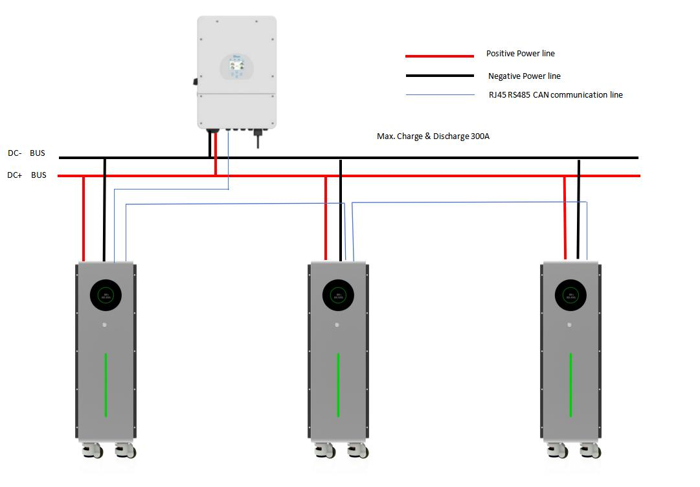
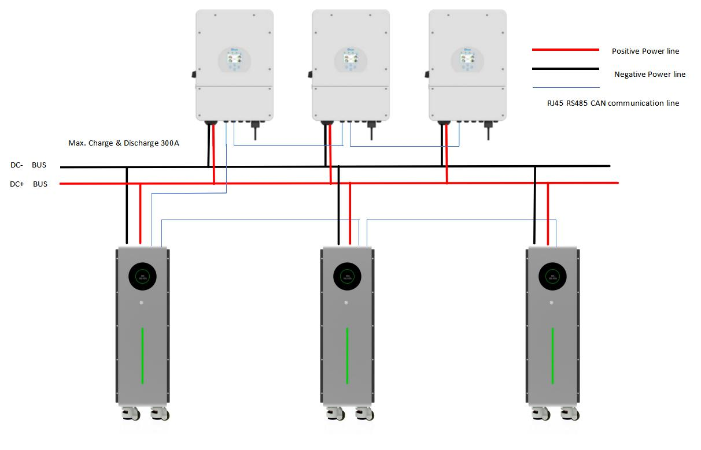
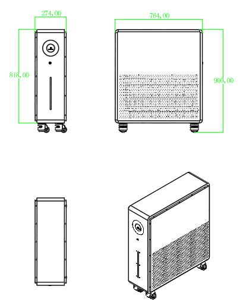
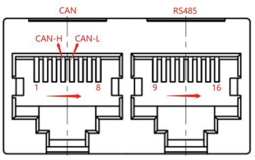
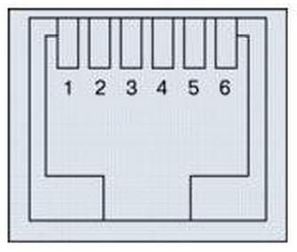
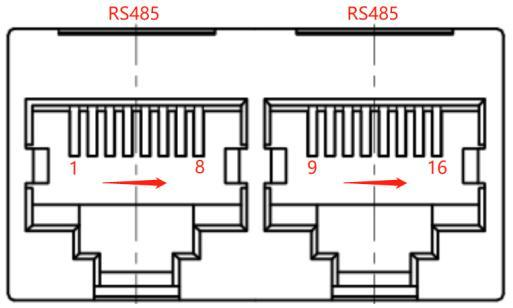
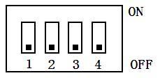

# 51.2V 628AH 磷酸铁锂储能电池 安装手册

| 项目 | 参数 |
| :-- | :-- |
| 品牌 | Gobel Power |
| 产品名称 | 51.2V628AH 磷酸铁锂储能电池 |
| 产品型号 | GP-PB5-PC628 |
| 额定电压 | 51.2V |
| 额定容量 | 628Ah |
| 额定能量 | 约 32.15kWh |
| 电芯类型 | 314Ah 磷酸铁锂（LFP） |
| 电芯连接方式 | 16S2P |
| 电池管理系统 | GP-PC300 BMS |
| 手册类型 | 安装手册 |

本手册用于指导 **GP-PB5-PC628 储能电池** 的安装、接线、通讯配置及开机调试。安装前请仔细阅读本手册，特别是安全须知部分。

## 目录

1. [安全须知](#安全须知)
2. [产品简介](#产品简介)
3. [部件清单](#部件清单)
4. [工具与材料准备](#工具与材料准备)
5. [螺丝扭矩要求](#螺丝扭矩要求)
6. [产品接口说明](#产品接口说明)
7. [安装前检查](#安装前检查)
8. [安装](#安装)
9. [逆变器与电池电力连接](#逆变器与电池电力连接)
10. [逆变器与电池通讯连接](#逆变器与电池通讯连接)
11. [协议设置](#协议设置)
12. [检查连接与开机](#检查连接与开机)
13. [产品维护](#产品维护)
14. [附录](#附录)
15. [联系方式](#联系方式)

## 安全须知

安装和使用本产品前，请仔细阅读全部安全须知。不遵守以下安全要求在可能导致人身伤害、设备损坏或火灾。

### 电气安全

:::danger 触电风险
本产品额定电压为 51.2V，虽然属于安全超低电压范围，但多台电池串联或并联后电压和电流可能达到危险水平。进行电气连接时，务必确保所有设备处于断电状态。
:::

:::caution 短路防护
电池正负极短路会产生极大电流，导致电弧、灼伤甚至火灾。操作时请勿佩戴金属首饰（戒指、手表等），使用带绝缘手柄的工具，每次只操作一根线缆。
:::

:::note 绝缘要求
所有线缆接头应做好绝缘处理，接线端子需紧固到位。连接前检查线缆绝缘层是否完好，如有破损请更换后再使用。
:::

### 电池安全

:::danger 电池安全
- 严禁将电池投入火中或加热，可能导致爆炸
- 严禁用金属物体同时接触正负极，造成短路
- 严禁刺穿、撞击或挤压电池外壳
- 如果电池出现鼓包、漏液、冒烟或异味，立即停止使用并联系技术支持
:::

:::caution 温度要求
电池应在 0°C 至 50°C 的环境温度下充电，-20°C 至 60°C 的环境温度下放电。超出此温度范围可能导致电池性能下降或永久损坏。
:::

:::note 正负极确认
连接电源线前，务必用万用表确认电池正负极端子极性，确保与逆变器极性对应。反接可能导致设备损坏。
:::

### 机械安全

:::caution 重物搬运
本产品重量较大，搬运时请使用脚轮推行，或由两人以上协作搬运。严禁单人徒手搬抬，防止砸伤或扭伤。
:::

:::note 安装位置
电池应安装在平整、坚实的地面上，周围预留至少 30cm 的通风空间。严禁安装在阳光直射、潮湿、多尘或有腐蚀性气体的环境中。
:::

### 一般安全

- 安装工作应由具备基本电气知识的成人完成
- 确保工作区域干燥、通风良好、光线充足
- 儿童和宠物应远离安装区域
- 使用符合安全标准的合格工具
- 安装前关闭所有相关设备的电源
- 如需上墙安装或固定，必须使用合适的膨胀螺丝固定在实体墙上

## 产品简介

本产品为 Gobel Power **GP-PB5-PC628 磷酸铁锂储能电池组**，专为家庭储能、商业储能及离网系统设计。

### 主要特点

- **大容量设计**：额定容量 628Ah，额定能量约 32.15kWh，满足长时间储能需求
- **高安全性电芯**：采用 314Ah 磷酸铁锂（LFP）电芯，热稳定性好，循环寿命长
- **16S2P 电芯结构**：16 串 2 并连接方式，确保电压均衡与一致性
- **智能 BMS 管理**：内置 GP-PC300 电池管理系统，提供过充、过放、过流、短路、温度等多重保护
- **丰富通讯接口**：支持 RS485、CAN、RS232 等多种通讯协议，兼容主流品牌逆变器
- **便捷移动**：底部配有脚轮，方便移动和安装就位

### 适用场景

- 家庭光伏储能系统
- 商业储能电站
- 离网/微网储能系统
- 应急备用电源

## 部件清单

请打开包装后核对以下部件，如有缺失或损坏请及时联系供应商。

|         编号          |               名称               |    规格/数量     |                   图片                   |
| :-------------------: | :------------------------------: | :--------------: | :--------------------------------------: |
| <a id="Part01">01</a> | GP-PB5-PC628 磷酸铁锂储能电池主机 | 额定能量 32.15kWh / 1 台 |  |
| <a id="Part02">02</a> |  正极线缆（红色，50mm² 电源线）  |      1 条       |    |
| <a id="Part03">03</a> |  负极线缆（黑色，50mm² 电源线）  |      1 条       |    |
| <a id="Part04">04</a> |      RS232 通信线缆（RJ12 转 USB）       |      1 条       |  |
| <a id="Part05">05</a> |  逆变器并联通讯线缆 |      1 条       |  |

## 工具与材料准备

以下工具和材料不随产品附带，安装前请自行准备：

|    工具/材料    |         用途         |         说明         |
| :-------------: | :------------------: | :------------------: |
|     万用表      | 测量电池电压及极性确认 | 直流电压量程 ≥ 100V  |
|    绝缘螺丝刀   | 紧固接线端子         | 十字/一字各一把       |
|    力矩扳手     | 按标准扭矩紧固螺丝    | 量程范围 5~25N·m     |
|  Windows 电脑   | 运行上位机软件以设置通讯协议 | 需具备 USB 接口 |
| 上位机软件程序  | 设置 BMS 通讯协议    | 请联系供应商获取安装包 |

## 螺丝扭矩要求

在安装和接线过程中，请按照以下扭矩标准紧固螺丝。扭矩不足可能导致接触不良和发热，扭矩过大可能损坏螺纹或端子。

| 螺丝规格 |   扭矩要求   |
| :------: | :----------: |
|    M6    |    8N·m     |
|    M8    |    15N·m    |
|   M10    | 15 ~ 20N·m |

:::caution 扭矩控制
请使用力矩扳手进行紧固，避免凭手感操作。电气连接端子扭矩不足是大电流应用中常见的故障原因。
:::

## 产品接口说明

安装前请熟悉电池面板上的各接口和组件位置。

| 编号 |    名称    |             功能说明             |
| :--: | :--------: | :------------------------------: |
|  1   |  输出正极  | 直流电源正极输出端子，连接逆变器电池输入正极 |
|  2   |  输出负极  | 直流电源负极输出端子，连接逆变器电池输入负极 |
|  3   |   断路器   | 电池总电路开关，ON 为接通，OFF 为断开 |
|  4   |   干接点   | 干接点信号接口，用于外部控制或告警输出 |
|  5   |  拨码开关  | 用于设置电池主从机身份（主机/从机编号） |
|  6   |  复位开关  | 按下可复位 BMS 系统 |
|  7   | 开关指示灯 | 指示电池弱电系统是否已启动 |
|  8   | 运行指示灯 | 电池正常运行时常亮 |
|  9   | 告警指示灯 | 电池出现异常时亮起或闪烁 |
|  10  | SOC 指示灯 | 显示电池剩余电量状态 |
|  11  |  RS485A  | RS485 通讯接口 A，用于连接逆变器 BMS 通讯 |
|  12  |    CAN     | CAN 通讯接口，用于连接逆变器 BMS 通讯 |
|  13  |   RS232   | RS232 通讯接口，用于连接电脑进行协议配置 |
|  14  |  RS485B  | RS485 通讯接口 B，用于电池并联通讯 |
|  15  |  RS485C  | RS485 通讯接口 C，用于电池并联通讯 |
|  16  |   显示屏   | 显示电池电压、电流、SOC、温度等实时信息 |
|  17  |  弱电开关  | 控制 BMS 弱电系统开关，短按开机，长按关机 |
|  18  |   灯条    | 装饰及状态指示 LED 灯条 |
|  19  |   脚轮    | 底部万向轮，方便移动电池至安装位置 |

:::info 接口参考
详细引脚定义请参见附录中的 [产品通信引脚定义](#产品通信引脚定义)。
:::

## 安装前检查

安装前请按以下步骤对电池进行全面检查，确保产品完好无损且功能正常。

### 步骤 1：取出电池

将 **GP-PB5-PC628 储能电池主机（[01](#Part01)）** 从运输木箱中取出。搬运时注意使用脚轮推行或多人协作，避免砸伤。

### 步骤 2：检查外观与配件

检查电池主机外观是否有碰撞、变形或破损。核对 **部件清单** 中的所有配件是否齐全，检查各线缆绝缘层有无破损、接头是否完好。

:::caution 发现异常
如发现产品或配件有缺失、损坏，请暂停安装并联系供应商处理，切勿继续安装已损坏的设备。
:::

### 步骤 3：开机自检

按下电池面板上的 **弱电开关**（编号 17），启动 BMS 弱电系统，观察以下内容：

- **显示屏**（编号 16）是否正常亮起并显示信息
- **灯条**（编号 18）及各类指示灯是否正常显示

如屏幕无法点亮或指示灯异常，请先排查后再继续。

### 步骤 4：测量电压

将电池面板上的 **断路器**（编号 3）拨到 ON 位置，使用万用表直流电压档测量电池 **输出正极**（编号 1）与 **输出负极**（编号 2）之间的电压。

:::note 正常电压范围
电压在 **40V ~ 58V** 之间均为正常。如果电压为 0V 或超出此范围，请确认断路器是否已正确拨至 ON 位置，或联系技术支持。
:::

### 步骤 5：确认

以上检查全部正常后，方可进入下一步安装操作。

## 安装

完成安装前检查后，按以下步骤将电池安装到指定位置。

### 步骤 1：关机

将电池面板上的 **断路器**（编号 3）拨回到 OFF 位置，然后长按 **弱电开关**（编号 17）将 BMS 弱电系统完全关闭。确认显示屏和所有指示灯均已熄灭。

### 步骤 2：定位与固定

将 **GP-PB5-PC628 储能电池主机（[01](#Part01)）** 推行至预定安装位置。到达位置后，踩下各脚轮的刹车锁止机构，确保电池不会意外滑动。

:::note 安装位置要求
- 地面应平整、坚实，能承受电池重量
- 电池四周至少预留 30cm 空间，确保通风散热
- 远离热源、水源和易燃物品
:::

## 逆变器与电池电力连接

完成电池安装定位后，进行电池与逆变器之间的电力接线。

### 步骤 1：确认逆变器状态

确保逆变器及其他相关设备已安装到位。将逆变器关机并切断其所有电源输入。查阅逆变器使用手册中与电池连接相关的章节，确认逆变器电池输入端口的规格和要求。

:::danger 断电操作
进行电力接线前，务必确保所有设备（电池、逆变器、光伏组件等）均处于断电关机状态，防止触电或设备损坏。
:::

### 步骤 2：连接电源线缆

1. 取出 **正极线缆（红色，50mm² 电源线）（[02](#Part02)）**，一端接到电池的 **输出正极**（编号 1）接线端子，另一端接到逆变器的电池输入正极端子
2. 取出 **负极线缆（黑色，50mm² 电源线）（[03](#Part03)）**，一端接到电池的 **输出负极**（编号 2）接线端子，另一端接到逆变器的电池输入负极端子

:::caution 极性确认
接线前务必用万用表再次确认电池正负极端子的极性。正极接正极，负极接负极，严禁反接。紧固时参照 [螺丝扭矩要求](#螺丝扭矩要求) 章节的标准扭矩值。
:::

### 步骤 3：多台电池并联（如适用）

如果系统中只有一台电池，跳过此步骤。如需连接多台电池并联运行：

每台 **GP-PB5-PC628 储能电池主机（[01](#Part01)）** 配有两对正负极端子，每个端子最大承载电流为 **200A**，因此分以下两种情况处理：

**情况 A：逆变器输入电流 ≤ 200A**

可使用电源线缆将相邻两台电池的正极端子与正极端子连接、负极端子与负极端子连接（电池并联），然后将两端电池的正负极分别连接到逆变器的电池输入端口。

**情况 B：逆变器输入电流 > 200A**

需要将每台电池的正极端子分别连接到汇流排（正极），负极端子分别连接到汇流排（负极），再将汇流排连接到逆变器的电池输入端口。

:::info 汇流排
汇流排为额外配件，不随本产品附带，请根据系统电流需求自行选购合适规格的铜汇流排。
:::

## 逆变器与电池通讯连接

完成电力接线后，进行电池与逆变器之间的通讯连接。

### 步骤 1：设置拨码开关

根据系统中电池的数量，设置 **拨码开关**（编号 5）：

**单台电池：**
该电池即为主机，将拨码开关拨为：`ON OFF OFF OFF`。

**多台电池并联：**
选择其中一台作为主机，将其拨码开关拨为：`ON OFF OFF OFF`。其余电池作为从机，按顺序参考以下拨码设置：

| 序号 | 拨码 1 | 拨码 2 | 拨码 3 | 拨码 4 |  身份  |
| :--: | :----: | :----: | :----: | :----: | :----: |
|  01  |   ON   |  OFF   |  OFF   |  OFF   |  主机  |
|  02  |  OFF   |   ON   |  OFF   |  OFF   |  从机  |
|  03  |   ON   |   ON   |  OFF   |  OFF   |  从机  |
|  04  |  OFF   |  OFF   |   ON   |  OFF   |  从机  |
| ...  |   …    |   …    |   …    |   …    |   …    |

:::info 完整拨码表
更多从机编号对应的拨码设置，请参见附录中的 [拨码开关设置表](#拨码开关设置表)。
:::

### 步骤 2：电池并联通讯（仅多台电池时需要）

如果只有一台电池，跳过此步骤。多台电池并联时：

取出 **逆变器并联通讯线缆（[05](#Part05)）**，将第一台电池的 **RS485B**（编号 14）接口连接到第二台电池的 **RS485C**（编号 15）接口。如有第三台，则将第二台的 RS485B 连接到第三台的 RS485C，以此类推，形成菊花链连接。

### 步骤 3：连接逆变器通讯线缆

1. 查阅逆变器使用手册，确认逆变器使用 **RS485 协议**还是 **CAN 协议**与电池 BMS 通讯
2. 取出 **逆变器并联通讯线缆（[05](#Part05)）**，一端接到主机电池的 **RS485A**（编号 11）或 **CAN**（编号 12）接口（根据逆变器协议选择对应接口）
3. 另一端接到逆变器的 BMS 通讯接口

:::caution 引脚定义检查
产品附带的通讯线缆两端为对称（直通）连接。使用前请务必对比以下两端的引脚定义：

- 逆变器 BMS 通讯接口的引脚定义
- 电池 RS485A 或 CAN 接口的引脚定义（详见附录 [产品通信引脚定义](#产品通信引脚定义)）

如果两端引脚定义不一致（如 Victron 等品牌逆变器），您需要自制通讯线缆或从逆变器厂商购买专用通讯线缆，否则通讯将无法正常建立。
:::

## 协议设置

完成通讯连接后，需通过上位机软件设置电池 BMS 的通讯协议，使其与逆变器匹配。

### 步骤 1：启动电池 BMS

按下主机电池面板上的 **弱电开关**（编号 17），启动 BMS 弱电系统。注意：此时保持 **断路器**（编号 3）在 OFF 位置，不要打开。

### 步骤 2：连接电脑

1. 取出 **RS232 通信线缆（RJ12 转 USB）（[04](#Part04)）**
2. 将线缆的 RJ12 端插入电池的 **RS232** 接口（编号 13）
3. 将线缆的 USB 端插入 Windows 电脑的 USB 接口
4. 在电脑上找到并运行 **电池上位机程序软件**

:::info 上位机软件
上位机软件的详细操作说明请参见《上位机操作指南》。如尚未安装该软件，请联系供应商获取安装包和操作文档。
:::

### 步骤 3：选择通讯协议

在上位机软件界面中，根据所连接逆变器的品牌和型号，选择对应的通讯协议。常见的逆变器通讯协议包括 Pylontech、Growatt、Deye、Victron 等。

:::tip 协议选择建议
如果不确定应选择哪种协议，请查阅逆变器使用手册中关于电池通讯协议的说明，或咨询逆变器厂商技术支持。
:::

## 检查连接与开机

完成所有接线和协议配置后，进入最后检查与开机流程。

### 步骤 1：检查连接

逐一确认以下连接是否正确可靠：

- 所有电力线缆（正极/负极）接头已紧固到位，极性正确
- 所有通讯线缆已插入对应接口并锁紧
- 拨码开关设置正确
- 汇流排（如使用）连接牢固

### 步骤 2：开启电池

1. 按下所有电池的 **弱电开关**（编号 17），启动各台电池的 BMS 弱电系统
2. 将所有电池的 **断路器**（编号 3）拨到 ON 位置
3. 打开逆变器的电源开关

### 步骤 3：设置逆变器电池类型

在逆变器的设置菜单中，将电池类型设置为"**锂电池**"（Lithium Battery）。具体操作方法因逆变器品牌而异，请参考逆变器使用手册。

### 步骤 4：验证通讯数据

在逆变器显示屏或监控界面中，查看是否已正确从电池 BMS 获取到实时数据，重点关注以下参数：

- 电池电压
- 电池 SOC（剩余电量百分比）
- 电池温度
- 充放电电流

:::tip 通讯验证
如果逆变器能正确显示以上数据，说明 BMS 通讯已正常建立，安装成功。
:::

### 步骤 5：充放电测试

在逆变器中设置适当的充放电参数后，可进行充放电测试，验证系统在实际负载下的运行情况。

:::caution 通讯异常处理
如果逆变器无法正确读取电池数据，请检查：
- 通讯线缆是否连接到正确的接口（RS485A 或 CAN）
- 拨码开关是否正确设置
- 上位机协议选择是否正确
- 通讯线缆引脚定义是否与逆变器匹配（参见附录 [产品通信引脚定义](#产品通信引脚定义)）

依次排查以上问题，必要时重做通讯连接和协议设置步骤。
:::

## 产品维护

### 日常使用

- 保持电池外观清洁，定期用干燥软布擦拭表面灰尘
- 确保电池周围通风口未被遮挡
- 定期检查线缆接头是否松动

### 长期存储

如果电池需要长期不使用，请按以下要求进行维护：

1. 将电池充电至满电状态（SOC 100%）
2. 关闭断路器，长按弱电开关将 BMS 关机
3. 将电池存放在干燥、阴凉的环境中（建议温度 10°C ~ 30°C）
4. 至少每 **3 个月** 检查一次电池电压
5. 如果电压低于 **51V**，需及时对电池进行充电

:::danger 保修说明
长期存储期间未按要求及时充电导致的电池过放损坏，**不在产品保修范围之内**。请务必按要求定期检查和充电。
:::

## 附录

### 电池与逆变器连接示意图

#### 一台电池与一台逆变器连接

:::note 图示说明
图中红色线缆为 **正极线缆（红色，50mm² 电源线）（[02](#Part02)）**，黑色线缆为 **负极线缆（黑色，50mm² 电源线）（[03](#Part03)）**，蓝色线缆为通讯线缆。

此连接方式下，电池最大工作电流为 **200A DC**，逆变器功率须 **≤ 8kW**。
:::

#### 一台逆变器与多台电池连接

:::note 图示说明
图中红色线缆为 **正极线缆（红色，50mm² 电源线）（[02](#Part02)）**，黑色线缆为 **负极线缆（黑色，50mm² 电源线）（[03](#Part03)）**，蓝色线缆为通讯线缆。

此连接方式下，单台电池最大工作电流为 **200A DC**，逆变器功率须 **≤ 10kW**。
:::

#### 多台逆变器与多台电池连接

:::note 图示说明
图中红色线缆为 **正极线缆（红色，50mm² 电源线）（[02](#Part02)）**，黑色线缆为 **负极线缆（黑色，50mm² 电源线）（[03](#Part03)）**，蓝色线缆为通讯线缆。

此连接方式下，单台电池最大工作电流为 **200A DC**，逆变器功率须 **≥ 10kW**。
:::

---

### 产品尺寸图

外形尺寸（长 × 宽 × 高）：**764 × 274 × 900 mm**

---

### 产品通信引脚定义

:::caution 接线前必读
以下引脚定义用于制作通讯线缆时参考。如使用产品附带的通讯线缆，请确认逆变器端引脚定义是否与以下定义一致。若不一致，需自制或购买专用线缆。
:::

#### RS485A 端口

| 引脚 | 定义 |
| :--: | :--: |
|  1   |  B   |
|  2   |  A   |
|  3   | GND  |
|  4   |  NC  |
|  5   |  NC  |
|  6   | GND  |
|  7   |  A   |
|  8   |  B   |

#### CAN 端口

| 引脚 |  定义  |
| :--: | :----: |
|  1   |   NC   |
|  2   |  GND   |
|  3   |   NC   |
|  4   | CAN-H  |
|  5   | CAN-L  |
|  6   |   NC   |
|  7   |   NC   |
|  8   |   NC   |

#### RS232 端口

| 引脚 | 定义 |
| :--: | :--: |
|  1   |  NC  |
|  2   |  NC  |
|  3   | TXD  |
|  4   | RXD  |
|  5   | GND  |
|  6   |  NC  |

#### RS485B 和 RS485C 端口

| 引脚 | 定义 |
| :--: | :--: |
|  1   |  B   |
|  2   |  A   |
|  3   | GND  |
|  4   |  NC  |
|  5   |  NC  |
|  6   | GND  |
|  7   |  A   |
|  8   |  B   |

---

### 拨码开关设置表

| 序号 | 拨码 1 | 拨码 2 | 拨码 3 | 拨码 4 |  身份  |
| :--: | :----: | :----: | :----: | :----: | :----: |
|  00  |  OFF   |  OFF   |  OFF   |  OFF   | 无效   |
|  01  |   ON   |  OFF   |  OFF   |  OFF   | 主机   |
|  02  |  OFF   |   ON   |  OFF   |  OFF   | 从机   |
|  03  |   ON   |   ON   |  OFF   |  OFF   | 从机   |
|  04  |  OFF   |  OFF   |   ON   |  OFF   | 从机   |
|  05  |   ON   |  OFF   |   ON   |  OFF   | 从机   |
|  06  |  OFF   |   ON   |   ON   |  OFF   | 从机   |
|  07  |   ON   |   ON   |   ON   |  OFF   | 从机   |
|  08  |  OFF   |  OFF   |  OFF   |   ON   | 从机   |
|  09  |   ON   |  OFF   |  OFF   |   ON   | 从机   |
|  10  |  OFF   |   ON   |  OFF   |   ON   | 从机   |
|  11  |   ON   |   ON   |  OFF   |   ON   | 从机   |
|  12  |  OFF   |  OFF   |   ON   |   ON   | 从机   |
|  13  |   ON   |  OFF   |   ON   |   ON   | 从机   |
|  14  |  OFF   |   ON   |   ON   |   ON   | 从机   |
|  15  |   ON   |   ON   |   ON   |   ON   | 从机   |

## 联系方式

如遇到无法解决的故障或对本产品有任何疑问，请联系 **Gobel Power** 技术支持：

|     渠道     |             信息              |
| :----------: | :---------------------------: |
|   官方网站   | [www.gobelpower.com](https://www.gobelpower.com) |
| 技术支持邮箱 |       cs@gobelpower.com       |
