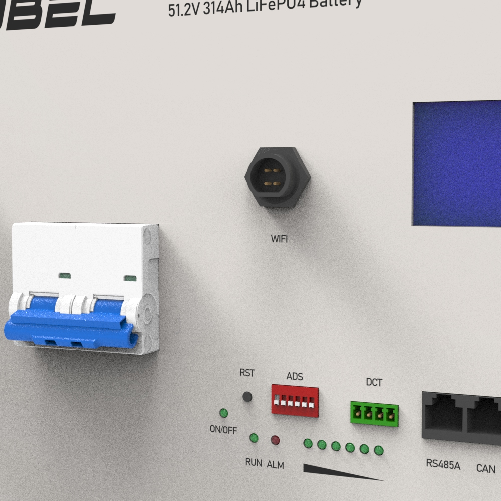
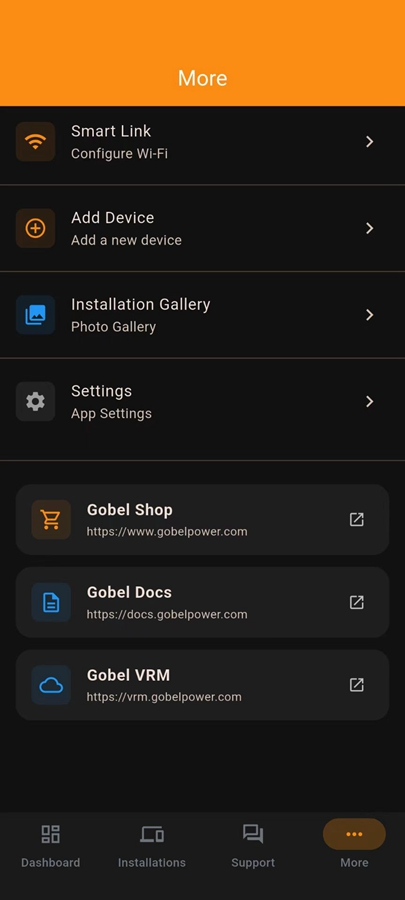
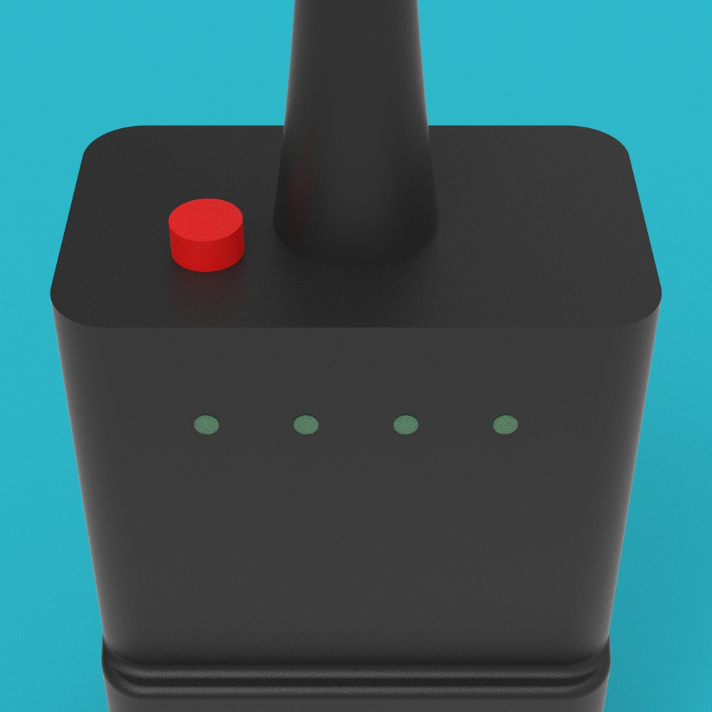
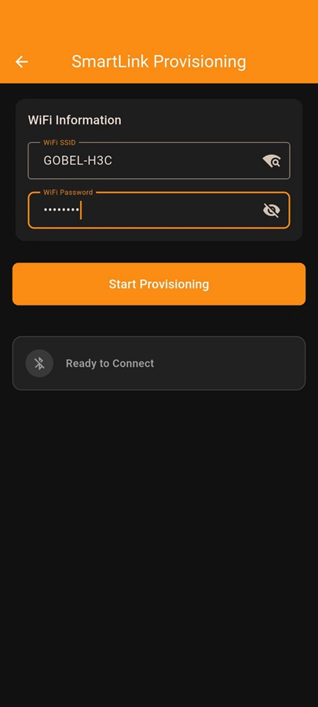
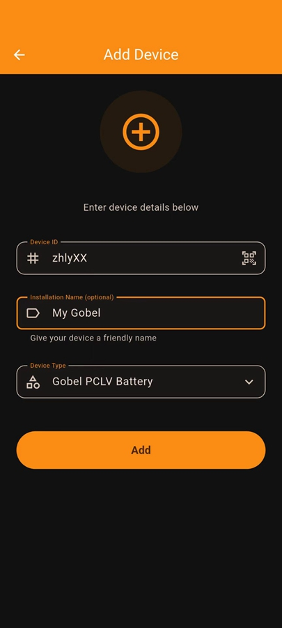

# GP-PWB1-PC200B WIFI Module Installation and Configuration Manual

## Table of Contents

## Safety Instructions

:::danger Electrical Safety
Before inserting or removing the WIFI module, please ensure that the battery is powered off to prevent potential arcing or interface damage caused by live plugging.
:::

:::warning General Safety
1. Do not use or store the module in damp, high-temperature, or corrosive gas environments.
2. The module consists of precision electronic components; please avoid severe vibration, impact, or falling.
3. Ensure that the sealing cap installed on the module is tightened to prevent dust and moisture from entering the battery terminals.
:::

## Product Introduction

The GP-PWB1-PC200B WIFI module is a remote communication adapter designed specifically for the latest GP-PC200B BMS batteries equipped with a WIFI port.

Used in conjunction with the Gobel VRM online platform and the Gobel VRM App (supporting Android and iOS), this module enables centralized monitoring and management of a single battery or up to 63 parallel battery packs.

### Main Features
- **Real-time Monitoring**: Records and displays the current, voltage, temperature of each battery, and the individual cell voltages.
- **Parameter Setting**: Allows users to set the maximum voltage, maximum charging current, and maximum discharging current requested from the inverter.
- **High-frequency Update**: Data update frequency can be as fast as every 10 seconds.
- **Historical Tracking**: Cloud historical records can be stored for up to 6 months.
- **Parallel System Support**: Only one module is required to monitor the entire parallel battery system.

## Parts List

|         No.          |         Name          | Specification/Quantity |             Image             |
| :-------------------: | :-------------------: | :-------: | :--------------------------: |
| <a id="part01">01</a> | **WIFI Communication Module** |    1 pc    |  |

:::tip Component Description
This module contains an integrated 2.4GHz WIFI antenna and LED status indicators to show network pairing and operating status.
:::

## Installation Steps

### 1. Confirm Port
Confirm that the battery panel has a dedicated WIFI port (WIFI Connector).

### 2. Insert Module
Insert the **WIFI Communication Module ([01](#part01))** fully into the WIFI port on the battery panel according to the specific orientation of the interface keyway.

### 3. Secure Sealing Cap
Tighten the built-in sealing cap of the **WIFI Communication Module ([01](#part01))** clockwise to ensure a firm physical connection and meet protection requirements.

### 4. Confirm Installation
Power on the battery and observe whether the indicator light on the **WIFI Communication Module ([01](#part01))** lights up. If the light is on, the physical connection of the module installation is complete.

## Configuration and Pairing Process

:::tip Notes
1. The WIFI module only supports 2.4GHz WIFI networks (5GHz is not supported).
2. Please download the **Gobel VRM** App from Google Play or the App Store before starting the operation.
:::

### 1. Software Preparation
Open the Gobel VRM App on your phone. Tap the **More** tab at the bottom of the App, and then tap **Smart Link**.

### 2. Mode Activation
Short press the circular configuration button on the top of the module (hold for about 1-2s). The module indicator should start flashing rapidly at this time, indicating that the module has entered provisioning mode.

### 3. WIFI Login
On the **Smart Link** page, enter the 2.4GHz WIFI hotspot name and password you wish to connect to. You can tap the WIFI icon to scan and select available 2.4GHz WIFI hotspots.

### 4. Automatic Pairing
Tap the **Start Provisioning** button. The system will automatically perform WIFI pairing settings for the **WIFI Communication Module ([01](#part01))**.

### 5. Status Confirmation
After successful pairing, the indicator on the module will change from rapid flashing to a steady light or normal communication state (the light stops flashing rapidly).

### 6. Add Device
Return to the **More** page of the App and tap **Add Device**. Before proceeding to the next step, find the **Device ID** and **Device Type** on the side label of the **WIFI Communication Module ([01](#part01))**.

### 7. Data Entry
Enter the following information on the **Add Device** page:
- **Device ID**: It is recommended to tap the QR code icon to scan for input.
- **Installation Name**: You can customize the name for this system.
- **Device Type**: Please select the device type that matches the module label.

### 8. Complete Configuration
Tap the **Add** button to complete the addition. Now you can view the battery monitoring information in real-time on the **Installations** page.

## FAQ

### 1. How to use when multiple batteries are in parallel?
When multiple batteries are connected in parallel, **only one WIFI module is needed**. Insert it into the WIFI port of the battery set as the Master in the parallel system to monitor the entire cluster.

### 2. Use on older GP-PC200 BMS
The older GP-PC200 BMS does not have a dedicated WIFI port and cannot have this module installed directly. However, through parallel technology, you can use one battery with the latest GP-PC200B BMS as the master battery and install the module, thereby reading data from all older GP-PC200 BMS batteries connected in parallel under the system.

### 3. How to mix old and new BMS to achieve more than 16 units in parallel?
The older GP-PC200 BMS has a 4-bit DIP switch (addresses 1-16), while the new GP-PC200B BMS has a 6-bit DIP switch (addresses 1-63).
- **Mixing Principle**: One GP-PC200B BMS battery must be set as **Master Battery No. 1**.
- **Address Allocation**: Set the older BMS batteries as units 2-16. Starting from unit 17, the new GP-PC200B BMS batteries must be used again.
- **Configuration Requirement**: Unique ID addresses must be manually assigned via DIP switches for all batteries participating in parallel (regardless of whether they are new or old models).
