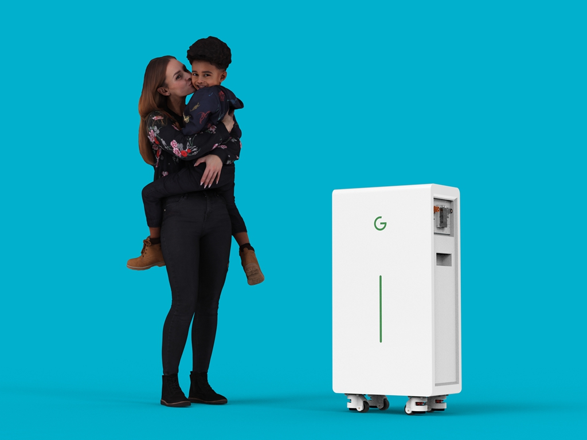
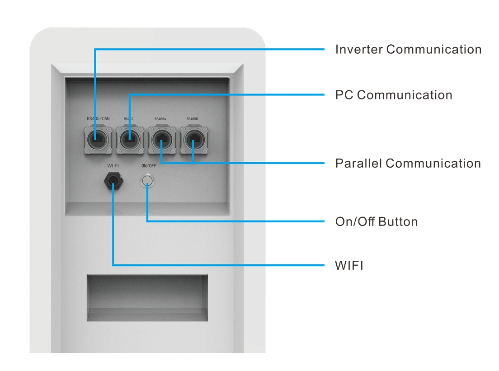
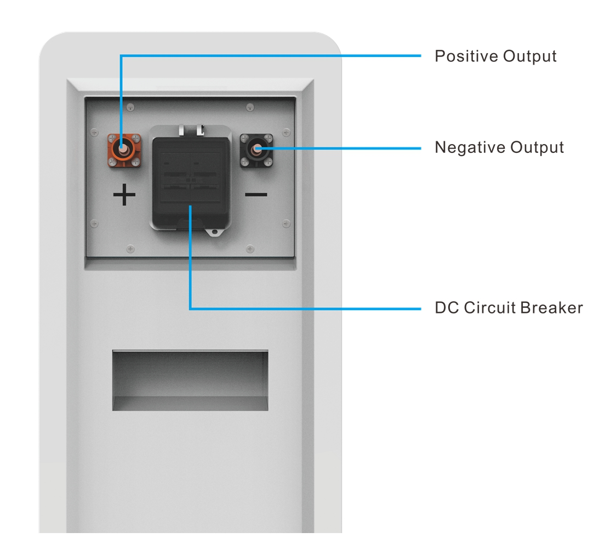
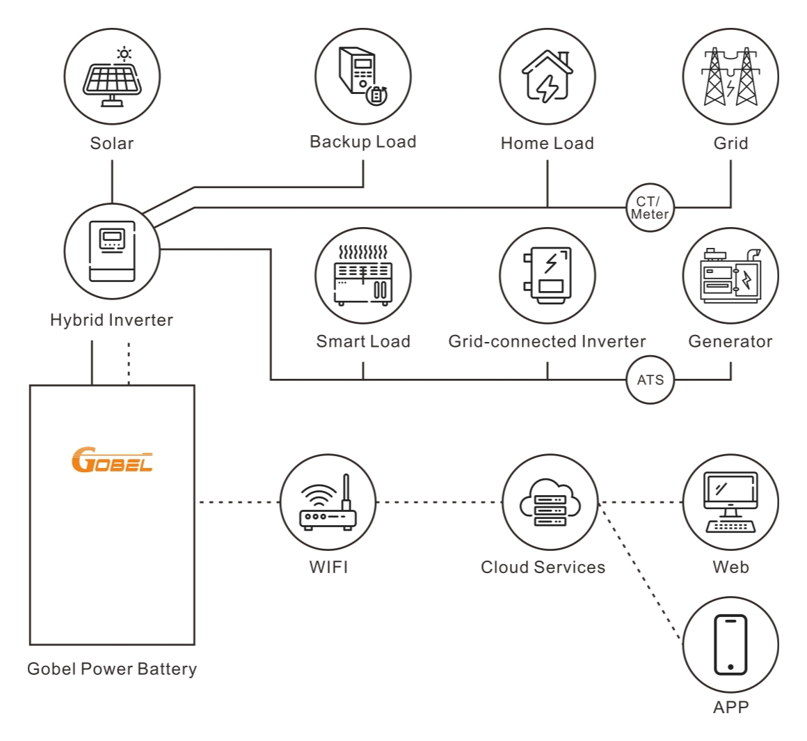

# GP-WP1-PC314 Low-Voltage Energy Storage Battery Product Datasheet

## Product Overview

The GP-WP1-PC314 is a high-performance low-voltage energy storage battery launched by Gobel Power, utilizing lithium iron phosphate (LiFePO4) cells, featuring high safety, long cycle life, and high energy density. It has a nominal energy of 16.1kWh per unit and supports up to 63 units in parallel, achieving a total system energy of up to 1012kWh. The product is equipped with the built-in GP-PC200B battery management system (BMS), supports multiple communication protocols, and is compatible with mainstream inverters. It has an IP65 waterproof rating and is suitable for various applications such as grid-tied, backup power, off-grid, as well as residential energy storage and small commercial & industrial energy storage.

### Product Features

- **IP65 Water Resistance Rating**: Dust-tight and water-resistant, suitable for outdoor installation
- **Intelligent BMS Management**: Equipped with the GP-PC200B BMS, providing comprehensive battery protection and monitoring functions (for BMS specifications, refer to the [GP-PC200B Product Page](https://docs.gobelpower.com/docs/bms/GP-PC200B/Datasheet/))
- **Remote WiFi Monitoring**: Supports connection to the Gobel VRM platform, enabling remote real-time monitoring via WiFi (refer to the [WiFi Module User Guide](https://docs.gobelpower.com/docs/low-voltage-battery/GP-SR1-PC314/WIFI-Module/))
- **Automatic Paralleling**: Supports up to 63 batteries in parallel, with automatic system addressing -- no manual setup required
- **2A Active Balancing**: Built-in 2A active balancing function, effectively extending battery pack lifespan
- **Broad Compatibility**: Compatible with mainstream inverter brands (refer to the [Inverter Compatibility List](https://docs.gobelpower.com/docs/bms/GP-PC200B/Inverter_Protocols/))

### Application Scenarios

This product is suitable for the following scenarios:

- **Grid-Tied Energy Storage**: Works with photovoltaic systems to enable self-consumption with surplus power fed back to the grid
- **Grid-Tied with Backup Power**: Automatically switches to backup power during grid outages, ensuring power supply for critical loads
- **Off-Grid Power Supply**: Serves as an independent power system for remote areas without grid coverage

## Technical Specifications

### System Parameters

| Parameter | Value |
| :------: | :----: |
| Nominal Voltage | 51.2V |
| Operating Voltage Range | 44V – 58.4V |
| Nominal Energy | 16.1kWh |
| Usable Energy | >16.1kWh [^1] |
| Max Continuous Discharge Current | 150A [^2] |
| Max Continuous Charge Current | 140A [^2] |
| Recommended DOD | 90% |
| Cell Type | LiFePO4 |
| Active Balancing Current | 2A |
| Circuit Breaker | 2P 125A (250A total) |
| Display | LED strip (shows SOC and alarm information) |
| Communication Interfaces | RS485 / CAN / RS232 / WiFi |

### Performance Specifications

| Parameter | Value |
| :------: | :----: |
| Round-trip Efficiency | ≥95% |
| Cycle Life | 10,000 cycles (25°C, 70% EOL) |
| Scalability | Up to 63 units in parallel (total system energy up to 1012kWh) |

### Environmental Parameters

| Parameter | Value |
| :------: | :----: |
| Operating Temperature – Charge | 0°C to +50°C |
| Operating Temperature – Discharge | -20°C to +50°C |
| Storage Temperature | 0°C to +35°C |
| Relative Humidity | ≤95% (non-condensing) |
| Altitude | ≤4000m |
| Ingress Protection | IP65 |

### Compliance Information

| Parameter | Value |
| :------: | :----: |
| Certifications | CE / UN38.3 |

### Mechanical Parameters

| Parameter | Value |
| :------: | :----: |
| Dimensions | 960 × 480 × 270 mm (H/W/D) |
| Weight | 125kg |
| Installation Method | Floor standing |
| Warranty | 10 years [^3] |

[^1]: Test conditions: 25°C ±2°C, beginning of life, 0.5C charge/discharge, 100% DOD.
[^2]: Current is affected by temperature and SOC; actual values may be lower than the nominal value.
[^3]: Refer to the Gobel Power warranty letter for specific terms.

## Appendix

### Interface Diagram

Front view:

Left view:

Right view:

### System Connection Diagram

Below is the connection diagram for GP-WP1-PC314 in a typical energy storage system:

### Product Dimensions

The GP-WP1-PC314 dimensions are 960 × 480 × 270 mm (H/W/D). Refer to the dimension drawing below:

### Gobel VRM Remote Monitoring Platform

Gobel VRM is a remote monitoring application designed specifically for lithium battery energy storage systems.

- **Full-Time Remote Monitoring**: Stay connected to your energy storage system in real time via Wi-Fi. Wherever you are, you can have full visibility into battery voltage, current, SOC (State of Charge), and SOH (State of Health) at your fingertips.

- **In-Depth Data Visualization**: Provides detailed real-time power flow diagrams and historical data curves, visually displaying charge/discharge trends to help you optimize energy usage efficiency.

- **Cell-Level Precision Management**: Deeply monitor the status of each individual cell, including temperature alarms, voltage difference analysis, and real-time BMS protection status, ensuring long-term safe and reliable system operation.

- **Intelligent Alarm Notifications**: Immediately push alerts for system anomalies, covering key risks such as over-voltage, over-current, and high temperature, safeguarding your home energy security.

### Related Documents

- [GP-PC200B BMS Datasheet](https://docs.gobelpower.com/docs/bms/GP-PC200B/Datasheet/)
- [WiFi Module Monitoring User Guide](https://docs.gobelpower.com/docs/low-voltage-battery/GP-SR1-PC314/WIFI-Module/)
- [Inverter Compatibility List](https://docs.gobelpower.com/docs/bms/GP-PC200B/Inverter_Protocols/)
