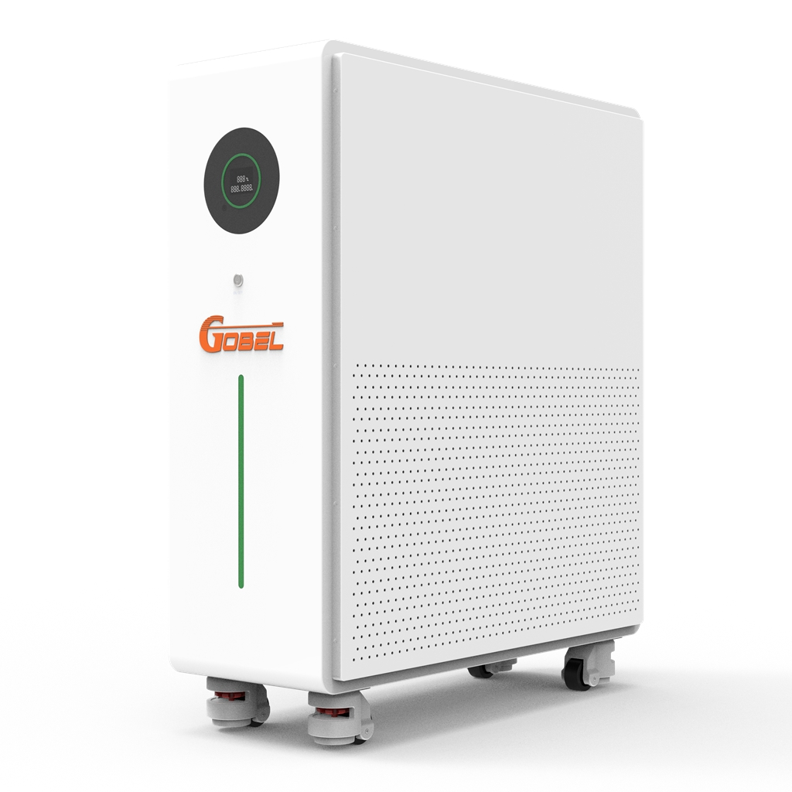
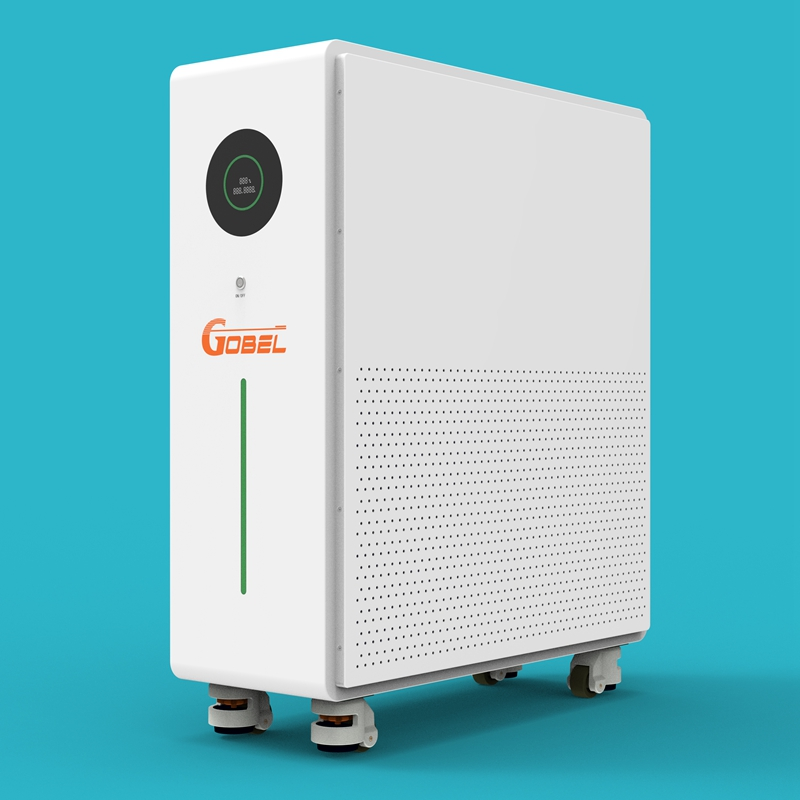
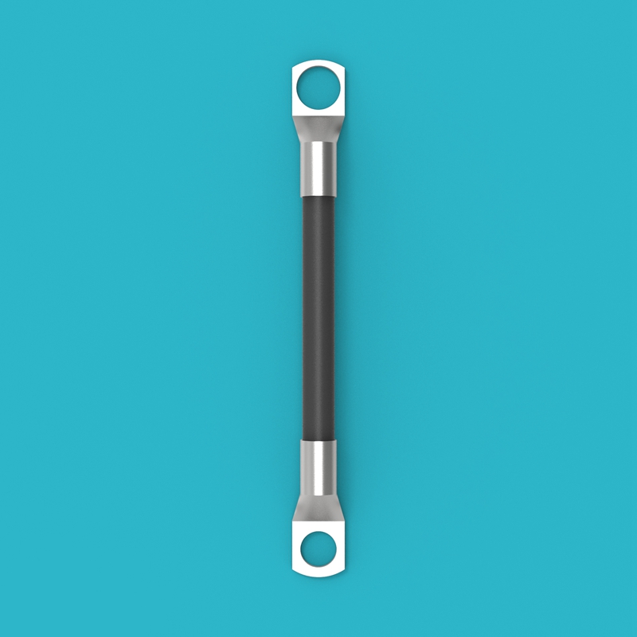
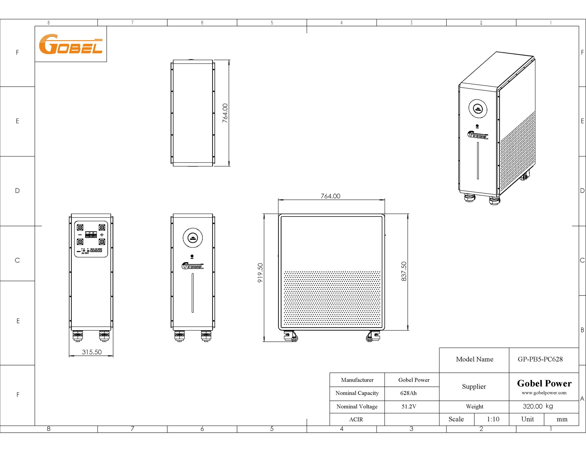
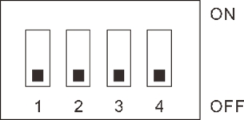

# GP-PB5-PC628 Installation Manual

## Product Overview

| Item | Specification |
| :--- | :--- |
| Product Model | GP-PB5-PC628 |
| Brand | Gobel Power |
| Product Type | 51.2V 628Ah LiFePO4 Low-Voltage Energy Storage Battery |
| Cell Configuration | 314Ah LiFePO4 (LFP) cells, 16S2P connection |
| Rated Voltage | 51.2V |
| Rated Capacity | 628Ah |
| Battery Management System | GP-PC300 BMS |
| Dimensions (L x W x H) | 764 x 316 x 920mm |
| Weight | 320kg |

## Safety Instructions

Before installing, using, and maintaining this product, please read and understand the following safety instructions carefully. Failure to follow these instructions may result in personal injury, equipment damage, or property loss.

:::danger Electric Shock Hazard
This product is a energy storage device. Improper operation may cause serious electric shock accidents. Before performing any electrical connections or maintenance operations, be sure to disconnect the battery circuit breaker and turn off the BMS low-voltage switch.
:::

:::caution Battery Safety
- Do not short-circuit the battery positive and negative terminals. Short-circuiting will generate extremely high current, which may cause fire or explosion
- Before operation, ensure the battery positive and negative terminals are correctly connected. Reverse connection will damage the equipment
- Do not use open flames or spark-producing equipment near the battery
- If the battery casing is deformed, leaking, or abnormally hot, stop using it immediately and contact technical support
:::

:::caution Handling Safety
This product weighs 320kg. Use appropriate handling equipment and work with multiple people when moving it. Watch for obstacles on the floor while moving to prevent the equipment from tipping over and causing personal injury.
:::

:::note Operator Requirements
Installation and maintenance operations should be performed by professionals with electrical knowledge. Do not install the equipment yourself if you are not familiar with electrical equipment operation.
:::

:::note Working Environment Requirements
- The installation site should be dry and well-ventilated
- Keep away from flammable and explosive materials
- Ambient temperature: 0°C ~ 50°C
- Relative humidity: not exceeding 95% RH (non-condensing)
:::

## Product Introduction

This product is the GP-PB5-PC628 51.2V 628Ah LiFePO4 (LiFePO₄) low-voltage energy storage battery. It utilizes high-performance 314Ah LiFePO4 cells connected in a 16S2P (16 series, 2 parallel) configuration and is equipped with the **GP-PC300 BMS ([Battery Management System](#Product-Introduction)**) for comprehensive battery monitoring and protection.

### Key Features

- **High Capacity Energy Storage**: Rated capacity of 628Ah, suitable for home and small commercial energy storage needs
- **Safe and Reliable**: LiFePO4 cells have stable chemical properties and excellent thermal stability
- **Intelligent BMS Management**: Real-time monitoring of battery voltage, current, temperature, SOC (State of Charge) and other parameters, providing multiple protections including overcharge, over-discharge, over-temperature, and short circuit
- **Flexible Expansion**: Supports parallel use of multiple batteries for easy capacity expansion
- **Standard Interfaces**: Provides RS485, RS232, CAN and other communication interfaces, compatible with mainstream inverters

### Applicable Scenarios

- Home solar energy storage systems
- Small commercial energy storage systems
- Uninterruptible Power Supply (UPS) systems
- Off-grid energy storage systems

## Parts List

After opening the package, check the product and accessories against the table below to confirm all parts are complete and intact.

| No. | Name | Specification/Quantity | Image |
| :---: | :---: | :---: | :---: |
| <a id="Part01">01</a> | GP-PB5-PC628 Energy Storage Battery | 51.2V 628Ah, 1 unit |  |
| <a id="Part02">02</a> | Positive Power Cable | Red, M10 copper lugs at both ends, 1 piece (included per order) |  |
| <a id="Part03">03</a> | Negative Power Cable | Black, M10 copper lugs at both ends, 1 piece (included per order) |  |
| <a id="Part04">04</a> | RS232 Communication Cable | RJ12 to USB, 1 piece |  |
| <a id="Part05">05</a> | Inverter Communication Cable | RJ45 at both ends, 1 piece (can also be used as a parallel cable) |  |

:::note
The inclusion of the **Positive Power Cable ([02](#Part02))** and **Negative Power Cable ([03](#Part03))** with the product depends on the order. If not included, please prepare power cables that match the specifications on your own.
:::

## Product Interface Description

The following diagram illustrates the interfaces, indicator lights, and operating components on the battery panel (numbers in the diagram correspond to the table below):

| No. | Name | Description |
| :---: | :---: | :--- |
| 1 | Output Negative | 300A terminal, M10 threaded hole |
| 2 | Output Positive | 300A terminal, M10 threaded hole |
| 3 | Circuit Breaker | Controls the main circuit on/off of the battery |
| 4 | DIP Switch (ADS) | 4-position DIP switch for setting the battery parallel address |
| 5 | Reset Switch (RST) | Long press to reset BMS status |
| 6 | ON/OFF Indicator | Indicates battery switch status |
| 7 | RUN Indicator | Indicates battery operating status |
| 8 | Alarm Indicator (ALM) | Lights up when battery fault or alarm occurs |
| 9 | SOC Indicator | Indicates battery state of charge |
| 10 | RS485C Port | Parallel communication interface |
| 11 | RS485B Port | Parallel communication interface |
| 12 | RS232 Port | Host computer communication interface |
| 13 | CAN Port | Inverter communication interface |
| 14 | RS485A Port | Inverter communication interface |
| 15 | Dry Contact (DRY) | Dry contact output interface |
| 16 | Casters | Bottom moving casters for easy movement and positioning |
| 17 | Display | Shows charge/discharge status and SOC information |
| 18 | Low-Voltage Switch | Turns BMS on or off |
| 19 | SOC Light Bar | Visually displays battery state of charge |

For pin definitions of each communication interface, refer to the [Product Communication Pin Definitions](#Communication-Pin-Definitions) section in the [Appendix](#Appendix).

## Installation Requirements

### Installation Environment

- **Floor**: The installation floor should be level and sturdy, with sufficient load-bearing capacity (product weight 320kg)
- **Ventilation**: The installation site should be well-ventilated to prevent heat accumulation
- **Environmental Conditions**: Dry, clean, free of corrosive gases or dust; ambient temperature 0°C ~ 50°C, relative humidity not exceeding 95% RH (non-condensing)
- **Safety Distance**: Keep away from flammable and explosive materials and water sources

### Installation Clearance

To ensure heat dissipation and maintenance access, maintain sufficient clearance between the battery and walls or other equipment:

- Distance from both sides of the battery to walls: ≥ 100mm
- Distance from the top of the battery to overhead obstacles: ≥ 300mm
- Reserve at least 800mm of operating space in front of the battery

### Tool Preparation

Prepare the following tools and instruments before installation:

- Torque wrench
- Screwdriver set
- Multimeter
- Insulated gloves
- Windows computer (for protocol settings)

### Screw Torque Requirements

When making electrical connections, tighten the screws according to the torque values specified in the table below:

| Screw Specification | Torque Requirement |
| :------: | :------: |
| M6 | 8N-m |
| M8 | 15N-m |
| M10 | 15 ~ 20N-m |

:::warning Wiring Requirement
This product supports parallel connection only. Do not connect batteries in series. Series connection may cause equipment damage or safety hazards.
:::

## Pre-Installation Check

After receiving the product, perform the unpacking inspection as follows:

1. Remove the energy storage battery ([01](#Part01)) from the wooden crate and check whether the outer packaging and product appearance are intact.

2. Check the product and accessories against the [Parts List](#Parts-List) for any missing or damaged items.

3. Press the [**Low-Voltage Switch**](#Product-Interface) on the panel to power on, and observe whether the [**Display**](#Product-Interface) and [**SOC Light Bar**](#Product-Interface) function normally.

4. Turn the [**Circuit Breaker**](#Product-Interface) to the ON position, and use a multimeter to measure the voltage at the battery [**Positive**](#Product-Interface) and [**Negative**](#Product-Interface) terminals. The normal voltage should be between 40V and 58V.

5. If all checks are normal, proceed to the next installation step.

:::caution
If you find product damage, missing accessories, or abnormal voltage, do not continue with installation. Contact Gobel Power technical support promptly.
:::

## Installation

1. Turn off the [**Circuit Breaker**](#Product-Interface) of the energy storage battery ([01](#Part01)), and press the [**Low-Voltage Switch**](#Product-Interface) to power off.

2. Move the battery to the predetermined installation location and lock the bottom [**Casters**](#Product-Interface) to prevent movement.

:::caution
Pay attention to the floor levelness when moving the battery to avoid excessive tilting. The battery weighs 320kg. Be sure to prioritize safety when moving to prevent tipping and injury.
:::

## Inverter and Battery Power Connection

1. Ensure other equipment such as the inverter is installed in place, and power off and disconnect the inverter. Also consult the inverter manual for sections related to battery connection.

2. Connect one end of the **Positive Power Cable ([02](#Part02))** to the battery **Positive** terminal and the other end to the inverter's battery input positive terminal. Connect one end of the **Negative Power Cable ([03](#Part03))** to the battery **Negative** terminal and the other end to the inverter's battery input negative terminal.

:::caution
When connecting, ensure the positive and negative terminals are correctly matched. Reverse connection will cause severe damage to the equipment.
:::

3. If multiple batteries are used in parallel, connect the batteries in parallel first before connecting to the inverter. Each battery has two pairs of positive and negative terminals, with each terminal rated for a maximum current of 300A. There are two scenarios:

   - **Scenario 1**: If the inverter input/output current is less than 300A, use positive and negative cables to connect the positive and negative terminals of adjacent batteries to each other, then connect the two end batteries to the inverter.

   - **Scenario 2**: If the inverter input/output current is greater than 300A, connect the positive and negative terminals of each battery to a busbar, then connect the busbar to the inverter.

For connection diagrams, refer to the [Battery and Inverter Connection Diagrams](#Connection-Diagrams) section in the [Appendix](#Appendix).

## Inverter and Battery Communication Connection

1. **DIP Switch Settings**. If there is only one battery, it is the master. Set the [**DIP Switch**](#Product-Interface) to ON, OFF, OFF, OFF. If multiple batteries are used in parallel, select one as the master and set its DIP switch to ON, OFF, OFF, OFF. The other batteries act as slaves. Refer to the [DIP Switch Settings Table](#DIP-Switch-Settings) in the [Appendix](#Appendix) for slave DIP switch settings.

2. **Parallel Communication Connection**. When multiple batteries are used in parallel, use parallel communication cables to connect the RS485B and RS485C ports of each battery in sequence: connect the RS485B of the first battery to the RS485C of the second battery, the RS485B of the second battery to the RS485C of the third battery, and so on.

3. **Inverter Communication Connection**. Connect one end of the **Inverter Communication Cable ([05](#Part05))** to the [**RS485A Port**](#Product-Interface) or [**CAN Port**](#Product-Interface) of the master battery (refer to the inverter manual to determine whether the inverter uses RS485 or CAN protocol for battery communication), and connect the other end to the inverter's BMS communication interface.

:::caution
Verify whether the pin definitions of the inverter's BMS communication interface match those of the battery's RS485A or CAN interface. The inverter communication cable included with this product has a straight-through pinout at both ends. If the pin definitions of the inverter and battery differ, you need to create a custom communication cable with the appropriate pinout or purchase an adapter cable from the inverter manufacturer (e.g., Victron inverters).
:::

For pin definitions of each communication interface, refer to the [Product Communication Pin Definitions](#Communication-Pin-Definitions) section in the [Appendix](#Appendix).

## Protocol Settings

1. Press the [**Low-Voltage Switch**](#Product-Interface) on the master battery to start the battery. Keep the [**Circuit Breaker**](#Product-Interface) in the OFF position.

2. Use the **RS232 Communication Cable ([04](#Part04))** to connect the Windows computer to the master battery: connect the RJ12 end of the cable to the battery's [**RS232 Port**](#Product-Interface), and insert the USB end into a computer USB port. Find and run the battery host computer software on the computer.

:::note
For detailed operation of the host computer software, refer to the host computer operation process documentation (reserved link for host computer detailed operation guide).
:::

3. Select the communication protocol that matches the inverter in the host computer software.

## Check Connections and Startup

1. Verify that the power and communication connections are normal, ensuring all cables are securely connected and not loose.

2. Power on all batteries and turn on the [**Circuit Breaker**](#Product-Interface), then turn on the inverter's power switch.

3. Set the battery type to Lithium Battery in the inverter.

4. Check the battery information displayed in the inverter to confirm that data (such as battery voltage, battery SOC, temperature, etc.) is correctly received from the battery BMS.

5. If data can be read correctly in the inverter, the installation is complete, and charge/discharge testing can be performed.

:::tip
If the inverter cannot read battery data after startup, check whether the communication cable is properly connected and whether the protocol settings are correct.
:::

## Product Maintenance

If the battery is not used for an extended period, perform maintenance as follows:

- Fully charge the battery, then turn off the [**Circuit Breaker**](#Product-Interface) and the [**Low-Voltage Switch**](#Product-Interface) (turn off the BMS).
- Check the battery voltage at least every 3 months. If the voltage drops below 51V, charge it promptly.

:::danger
Battery damage caused by failure to charge in a timely manner is not covered by the warranty. Prolonged storage without charging will lead to over-discharge of the battery, resulting in irreversible capacity loss or even battery scrapping.
:::

## Appendix

### Battery and Inverter Connection Diagrams

**Single Battery and Single Inverter Connection Diagram**

:::note
In the diagram, the red cable is the positive power cable, the blue cable is the negative power cable, and the green cable is the communication cable.
:::

**One Inverter and Multiple Batteries Connection Diagram**

:::note
In the diagram, the red cable is the positive power cable, the blue cable is the negative power cable, and the green cable is the communication cable.
:::

### Product Dimensions

Dimensions (L x W x H): 764 x 316 x 920mm
Weight: 320kg

### Product Communication Pin Definitions

#### RS485A Port

| Pin | Definition |
| :--: | :--: |
| 1 | B |
| 2 | A |
| 3 | GND |
| 4 | NC |
| 5 | NC |
| 6 | GND |
| 7 | A |
| 8 | B |

#### CAN Port

| Pin | Definition |
| :--: | :--: |
| 1 | NC |
| 2 | GND |
| 3 | NC |
| 4 | CAN-H |
| 5 | CAN-L |
| 6 | NC |
| 7 | NC |
| 8 | NC |

#### RS232 Port

| Pin | Definition |
| :--: | :--: |
| 1 | NC |
| 2 | NC |
| 3 | TXD |
| 4 | RXD |
| 5 | GND |
| 6 | NC |

#### RS485B and RS485C Ports

| Pin | Definition |
| :--: | :--: |
| 1 | B |
| 2 | A |
| 3 | GND |
| 4 | NC |
| 5 | NC |
| 6 | GND |
| 7 | A |
| 8 | B |

### DIP Switch Settings Table

| Address | DIP Switch Status (1-2-3-4) | Description |
| :--: | :---------------------: | :--: |
| 00 | OFF-OFF-OFF-OFF | Invalid address |
| 01 | ON-OFF-OFF-OFF | Master |
| 02 | OFF-ON-OFF-OFF | Slave |
| 03 | ON-ON-OFF-OFF | Slave |
| 04 | OFF-OFF-ON-OFF | Slave |
| 05 | ON-OFF-ON-OFF | Slave |
| 06 | OFF-ON-ON-OFF | Slave |
| 07 | ON-ON-ON-OFF | Slave |
| 08 | OFF-OFF-OFF-ON | Slave |
| 09 | ON-OFF-OFF-ON | Slave |
| 10 | OFF-ON-OFF-ON | Slave |
| 11 | ON-ON-OFF-ON | Slave |
| 12 | OFF-OFF-ON-ON | Slave |
| 13 | ON-OFF-ON-ON | Slave |
| 14 | OFF-ON-ON-ON | Slave |
| 15 | ON-ON-ON-ON | Slave |

## Contact Information

If you encounter an issue that cannot be resolved or need technical support, please contact Gobel Power:

| Item | Information |
| :--- | :--- |
| Official Website | [www.gobelpower.com](http://www.gobelpower.com) |
| Technical Support Email | [cs@gobelpower.com](mailto:cs@gobelpower.com) |
