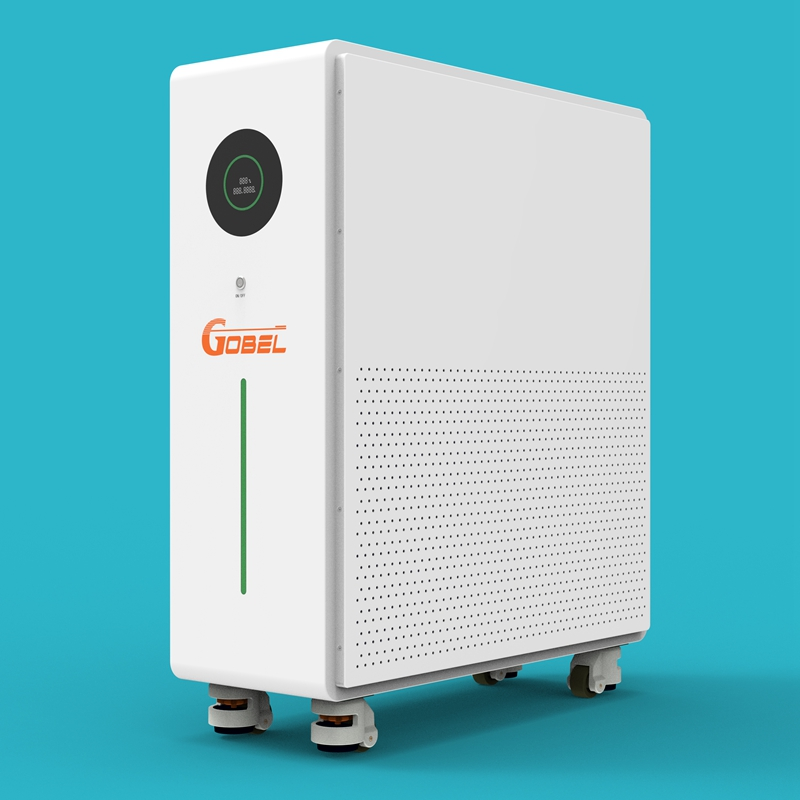
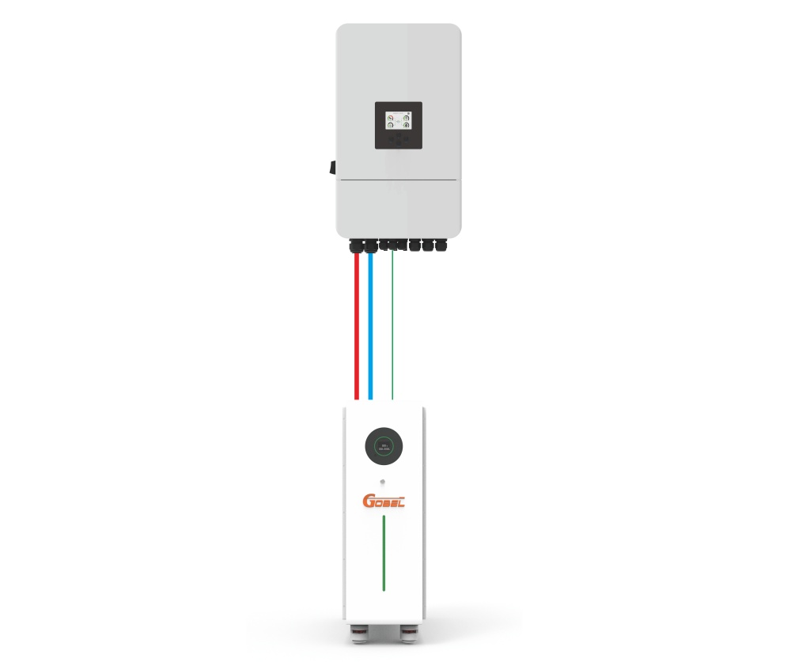
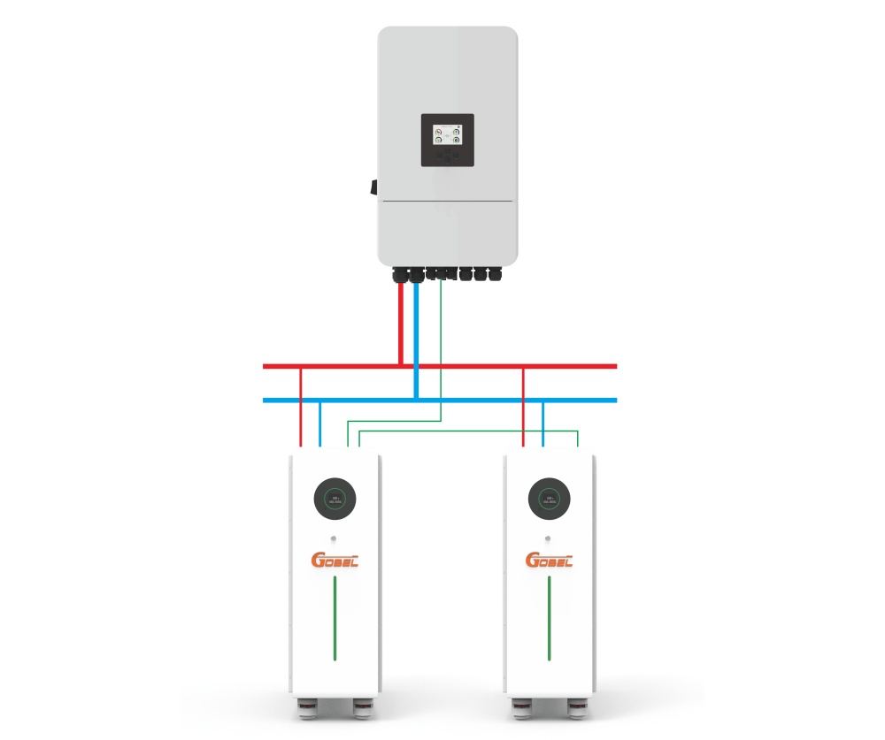
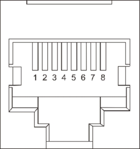
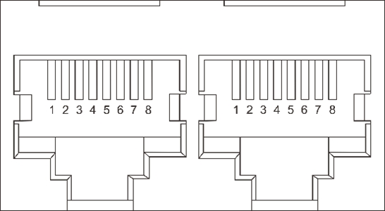
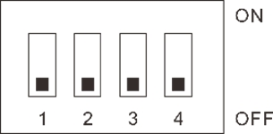
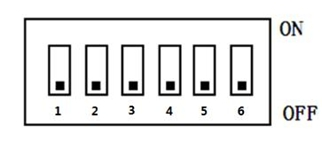

# GP-PB5-PC628 Installation Manual

## 1. Product Introduction

This product is the GP-PB5-PC628 51.2V 628Ah lithium iron phosphate (LiFePO₄) low-voltage energy storage battery. It uses high-performance 314Ah LiFePO4 cells connected in a 16S2P (16 series, 2 parallel) configuration, and is equipped with the **GP-PC300 BMS ([Battery Management System](#Product-Introduction)**), which provides comprehensive battery monitoring and protection.

### 1.1 Product Overview

| Item | Specification |
| :--- | :--- |
| Product Model | GP-PB5-PC628 |
| Brand | Gobel Power |
| Product Type | 51.2V 628Ah LiFePO4 low-voltage energy storage battery |
| Cell Configuration | 314Ah LiFePO4 (LFP) cells, 16S2P connection |
| Rated Voltage | 51.2V |
| Rated Capacity | 628Ah |
| Battery Management System | GP-PC300 BMS |
| Dimensions (L×W×H) | 764 × 316 × 920mm |
| Weight | 320kg |

### 1.2 Product Features

- **High-capacity energy storage**: Rated capacity of 628Ah, meeting the energy storage needs of households and small commercial & industrial applications
- **Safe and reliable**: LiFePO4 cell chemistry is chemically stable with excellent thermal stability
- **Intelligent BMS management**: Monitors battery voltage, current, temperature, SOC (State of Charge) and other parameters in real time, providing multiple protections against overcharge, over-discharge, over-temperature, short circuit, and more
- **Flexible expansion**: Supports parallel connection of multiple batteries for easy capacity expansion
- **Standard interfaces**: Provides RS485, RS232, CAN and other communication interfaces, compatible with mainstream inverters

### 1.3 Application Scenarios

- Residential photovoltaic energy storage systems
- Small commercial & industrial energy storage systems
- Backup power (UPS) systems
- Off-grid energy storage systems

### 1.4 Product Appearance and Interfaces

The figure below shows the interfaces, indicator lights, and operating components on the battery panel (the numbers in the figure correspond to the table below):

| No. | Name | Description |
| :---: | :---: | :--- |
| 1 | Output Negative | 300A terminal, M10 threaded hole |
| 2 | Output Positive | 300A terminal, M10 threaded hole |
| 3 | Circuit Breaker | Controls the on/off state of the battery main circuit |
| 4 | DIP Switch (ADS) | 4-bit or 6-bit DIP switch (depending on product configuration), used to set the battery parallel address |
| 5 | Reset Switch (RST) | Press and hold to reset the BMS state |
| 6 | Switch Indicator (ON/OFF) | Indicates the battery switch state |
| 7 | Running Indicator (RUN) | Indicates the battery operating state |
| 8 | Alarm Indicator (ALM) | Lights up when the battery fails or issues an alarm |
| 9 | SOC Indicator | Indicates the battery state of charge |
| 10 | RS485C Interface | Parallel communication interface |
| 11 | RS485B Interface | Parallel communication interface |
| 12 | RS232 Interface | Host computer communication interface |
| 13 | CAN Interface | Inverter communication interface |
| 14 | RS485A Interface | Inverter communication interface |
| 15 | Dry Contact (DRY) | Dry contact output interface |
| 16 | Casters | Bottom casters for easy movement and positioning |
| 17 | Display Screen | Displays charge/discharge status and SOC information |
| 18 | Low-Voltage Switch | Turns the BMS on or off |
| 19 | SOC Light Bar | Intuitively displays the battery state of charge |

For the pin definitions of each communication interface, see the [Product Communication Pin Definitions](#Communication-Pin-Definitions) section in the [Appendix](#Appendix).

## 2. Safety Instructions

Before installing, using, and maintaining this product, please read and understand the following safety instructions carefully. Failure to comply with these instructions may result in personal injury, equipment damage, or property loss. Do not cover, deface, or remove the warning labels and specification nameplate on the product.

### 2.1 Operating Personnel and Protection Requirements

:::note Personnel Requirements
Installation and maintenance operations should be performed by professionals with electrical knowledge. Personnel unfamiliar with electrical equipment operation must not attempt installation on their own.
:::

:::warning Personal Protection
- Use insulated tools and wear insulated gloves during operation; remove watches, rings, and other metal accessories
- Do not place tools or metal parts on the battery, to prevent terminals from contacting exposed wires or metal objects
- Adjacent live parts should be covered or protected
- Components may become extremely hot during equipment malfunction; do not touch them to avoid burns
:::

### 2.2 Safety Precautions

:::danger Electric Shock Hazard
This product is an energy storage device; improper operation may cause severe electric shock accidents. Before performing any electrical connection or maintenance operation, be sure to open the battery circuit breaker and turn off the BMS low-voltage switch.
:::

:::caution Battery Safety
- Never short-circuit the positive and negative terminals of the battery; a short circuit produces extremely high current and may cause fire or explosion
- Before operation, confirm that the battery positive and negative connections are correct; reverse connection will damage the equipment
- Do not use open flames or spark-generating equipment near the battery
- If the battery casing is deformed, leaking, or abnormally hot, stop using it immediately and contact technical support
:::

:::caution Electrolyte Handling
The electrolyte is harmful to skin and eyes and may be toxic; do not touch it. If electrolyte accidentally contacts the eyes or skin, rinse immediately with plenty of clean water for at least 10 minutes and seek medical attention as soon as possible.
:::

:::danger Disassembly Prohibited
No one other than manufacturer-authorized personnel may open, repair, or disassemble the battery. There are no user-serviceable parts inside the battery; unauthorized disassembly or modification will void the warranty and may cause safety incidents. It is recommended to place warning signs or barriers near the product to prevent misuse.
:::

:::caution Disposal and Recycling
- Damaged, swollen, or leaking batteries should be taken out of service immediately and stored in a dry, cool environment protected from moisture and light; do not attempt to repair or disassemble them yourself — contact your installer, dealer, or a professional recycling organization
- Waste batteries must not be discarded as household waste; dispose of them at designated recycling points in accordance with local regulations. Before disposal, remove any privacy-related information from the product
:::

:::warning Fire-Fighting Requirements
In the event of a battery fire, only dry powder fire extinguishers may be used; liquid fire extinguishers are strictly prohibited. Do not place the battery near open flames, heaters, or other high-temperature heat sources.
:::

:::caution Handling Safety
This product weighs 320kg; single-person lifting is strictly prohibited. Handling and moving must be performed by multiple people using appropriate handling equipment. The product is top-heavy; do not lay it on its side or upside down, and prevent the equipment from tipping over during movement to avoid personal injury. For handling methods, see the [Transportation and Handling](#Transportation-Handling) section.
:::

## 3. Transportation and Handling

### 3.1 Transportation Requirements

- During transportation, protect the product from severe vibration, impact, and compression; avoid direct sunlight, rain, and moisture, and take rainproof, moisture-proof, and sun-protection measures
- Smoking is strictly prohibited in transportation, loading, and unloading areas; carriers must not open the battery packaging without authorization
- Lithium-ion batteries are Class 9 dangerous goods (UN3480). Cross-border sea, land, and air transport must comply with the applicable dangerous goods transport regulations, and dangerous goods labels must be affixed as required
- If the battery shows odor, leakage, smoke, fire, or any other abnormality before transport, transportation is strictly prohibited
- Transportation operations should be performed by trained professionals; handlers must wear protective gloves and safety shoes
- Do not remove the transport packaging before the product arrives at the installation site

### 3.2 Handling Methods

#### 3.2.1 Manual Handling

- The product weighs 320kg; single-person lifting is strictly prohibited. Before handling, confirm that personnel are in good physical condition, wear non-slip gloves, safety shoes, and other protective equipment, and watch out for sharp metal panels and heavy objects
- Clear the handling path and confirm the floor is safe before moving; slow down on ramps, in narrow spaces, and on stairs, and arrange for dedicated personnel to assist
- The product is top-heavy; laying it on its side, inverting it, or moving it without securing is prohibited. Take measures to prevent tipping during movement
- Push or lift the product only using the designated handles or the bottom edge; do not grip components installed inside the equipment
- For short-distance movement on flat ground, multiple people may push the unit together using the bottom [**casters**](#Product-Interface), and lock the casters once in position
- When handling, stay close to the equipment, bend your knees, and exert force smoothly; lift with your legs rather than your back, and do not jerk or twist your body; when turning, move your feet instead of twisting your waist
- Move the equipment smoothly at an even speed and lift and set it down gently to prevent collisions, drops, scratches, or damage to components and cables
- After handling, confirm the equipment is placed stably to prevent tipping and injury

#### 3.2.2 Handling with Equipment

- When using handling equipment such as forklifts, operation must be performed by certified professionals in accordance with equipment operating requirements; unrelated personnel should stay at least 2m away from the work area. Standing on or riding the forklift or cargo is prohibited, and overloading is prohibited
- The rated load capacity of the handling equipment should be more than twice the product weight (this product weighs 320kg, i.e. more than 640kg), and the fork arm length should be no less than the product width
- Control driving speed and avoid sharp turns; confirm the area behind is clear before reversing, and arrange for a dedicated spotter in narrow spaces
- Operating on slopes ≥5° is prohibited; slow down on uneven ground
- Do not tilt or invert the product during handling. If tilting is unavoidable, return it upright as soon as possible and let it stand for 2 hours before powering on

## 4. Installation

### 4.1 Pre-Installation Preparation

#### 4.1.1 Installation Environment Requirements

- **Floor**: The installation floor should be level and solid, with sufficient load-bearing capacity (the product weighs 320kg)
- **Ventilation**: The installation site should be well ventilated to avoid heat buildup; do not block the equipment vents or heat-dissipation structures, and keep away from equipment air outlets
- **Environmental conditions**: Dry and clean, free of corrosive gases or dust; ambient temperature 0°C ~ 50°C, relative humidity not exceeding 95% RH (non-condensing); the installation altitude should not exceed 3000m
- **Safety distance**: Keep away from flammable and explosive materials and water sources; keep away from heat sources, open flames, and high-temperature objects. Do not install or operate the equipment in environments containing flammable or explosive gases or fumes, and do not store flammable or explosive materials around the equipment
- **Waterproofing and rain protection**: This product is not waterproof and must not be installed in outdoor exposed locations; rain, water splash, or snow coverage is strictly prohibited. Do not install it in locations that may be flooded, and keep away from liquids and areas prone to condensation or water seepage
- **Corrosive environments**: Avoid magnetic dust, volatile or corrosive gases, organic solvents, conductive metal dust, and salt spray environments
- **Electromagnetic and vibration**: Avoid locations with strong vibration, noise, and electromagnetic interference
- **Other**: Do not install the equipment on mobile platforms such as ships, trains, or automobiles; the installation location should be away from children and daily living and working areas

To ensure heat dissipation and maintenance space, maintain adequate clearance between the battery and walls or other equipment:

- Distance between both sides of the battery and the wall ≥ 100mm
- Distance between the top of the battery and any obstruction above ≥ 300mm
- Reserve at least 800mm of operating space in front of the battery

:::caution
Before installation and powering on, clear dust and iron filings from the installation area; before installation, confirm the site has sufficient load-bearing capacity and take anti-static measures. Do not install the equipment in enclosed, poorly ventilated locations without fire-fighting facilities, or in locations inaccessible to firefighters.
:::

#### 4.1.2 Tools and Torque Requirements

Prepare the following tools and instruments before installation:

- Torque wrench
- Screwdriver set
- Multimeter
- Insulated gloves
- Safety shoes and goggles (recommended)
- Windows PC (for protocol configuration)

When making electrical connections, tighten the screws to the torque values specified in the table below:

| Screw Size | Torque Requirement |
| :------: | :------: |
| M6 | 8N·m |
| M8 | 15N·m |
| M10 | 15 ~ 20N·m |

:::note Torque Notes
- The torque values in the table apply to standard screws under normal assembly conditions; adjust as appropriate for special conditions such as high vibration or harsh environments.
- Use a calibrated torque wrench to avoid over-tightening or under-tightening the screws.
:::

### 4.2 Unpacking and Inspection

#### 4.2.1 Parts List

After unpacking, check the product and accessories against the table below to confirm that all parts are complete and undamaged.

| No. | Name | Specification/Quantity | Image |
| :---: | :---: | :---: | :---: |
| <a id="Part01">01</a> | GP-PB5-PC628 energy storage battery | 51.2V 628Ah, 1 unit |  |
| <a id="Part02">02</a> | Positive power connection cable | Red, M10 copper lugs on both ends, 1 pc (included depending on order) |  |
| <a id="Part03">03</a> | Negative power connection cable | Black, M10 copper lugs on both ends, 1 pc (included depending on order) |  |
| <a id="Part04">04</a> | RS232 communication cable | RJ12 to USB, 1 pc |  |
| <a id="Part05">05</a> | Inverter communication cable | RJ45 on both ends, 1 pc (can also be used as a parallel cable) |  |

:::note
Whether the **positive power connection cable ([02](#Part02))** and the **negative power connection cable ([03](#Part03))** are included with the product depends on your order. If not included, prepare power connection cables with matching specifications yourself.
:::

#### 4.2.2 Unpacking Inspection Steps

After receiving the product, perform the unpacking inspection as follows:

1. Remove the energy storage battery ([01](#Part01)) from the wooden crate and check whether the outer packaging and product appearance are intact.

2. Check the product and accessories against the [Parts List](#Parts-List) for any missing or damaged items.

3. Power on using the [**low-voltage switch**](#Product-Interface) on the panel, and observe whether the [**display screen**](#Product-Interface) and [**SOC light bar**](#Product-Interface) display normally.

4. Set the [**circuit breaker**](#Product-Interface) to the ON position, use a multimeter to measure the voltage across the battery [**positive**](#Product-Interface) and [**negative**](#Product-Interface) terminals; the normal voltage should be between 40V ~ 58V.

5. If all checks pass, proceed to the next installation step.

:::caution
If the product casing is damaged, accessories are missing, or the voltage is abnormal, do not continue installation; contact Gobel Power technical support promptly.
:::

:::note Unpacking Tips
- Do not remove the transport packaging before the product arrives at the installation site; handle with care during unpacking to avoid scratching the equipment
- Before unpacking, check whether the outer packaging is damaged and whether the shock indicator has been triggered; if it has been triggered, transport damage cannot be ruled out
- Clean all parts before assembly; prevent collisions and scratches during handling and storage, and take moisture-proof and rust-prevention measures
- The system should be installed and commissioned within 6 months of delivery; long-term idle storage accelerates battery capacity degradation
:::

### 4.3 Installation Steps

This product weighs 320kg and supports only indoor floor-standing installation. Move it into position using the bottom [**casters**](#Product-Interface) and lock them in place; wall-mounted or bracket installation is not supported.

1. Set the [**circuit breaker**](#Product-Interface) of the energy storage battery ([01](#Part01)) to OFF and power off using the [**low-voltage switch**](#Product-Interface).

2. Move the battery to the predetermined installation location and lock the bottom [**casters**](#Product-Interface) to prevent movement.

:::caution
Pay attention to floor levelness when moving the battery and avoid excessive tilt angles. The battery weighs 320kg — be sure to move it safely and prevent it from tipping over and injuring people.
:::

:::caution Installation Discipline
- Installation must strictly follow this manual and the design requirements; unauthorized changes to installation steps or technical parameters are prohibited
- During installation and wiring, keep all switches in the OFF position; live work is strictly prohibited
- All screws and fasteners must be tightened securely; when drilling, prevent dust from entering the battery, avoid buried or underground pipes and cables, and clean up debris after drilling
:::

### 4.4 Post-Installation Inspection

After installation is complete, confirm that the following items are normal:

- The battery casing is intact, with no deformation, dents, or scratches
- The equipment is placed stably and the [**casters**](#Product-Interface) are locked
- Surrounding passages are clear and free of flammable or explosive materials
- Warning labels and the specification nameplate are complete and legible
- On-site fire-fighting equipment is in place and compliant

## 5. Electrical Connection

### 5.1 Safety Precautions

:::warning Wiring Requirements
This product supports parallel connection only; series connection is strictly prohibited. Series connection may cause equipment damage or safety hazards.
:::

:::warning Electrical Safety Precautions
- Residual voltage may remain between terminals after the battery is de-energized; before wiring, wait at least 10 minutes and use a multimeter to confirm there is no voltage
- Never connect the battery directly to the AC grid or photovoltaic (PV) DC lines; the battery may only be connected to matching power conversion equipment such as an inverter
- Do not use faulty or incompatible power conversion equipment such as inverters; before connection, confirm that the battery system parameters are fully compatible with the connected equipment
- Do not perform electrical connections during sandstorms or when the ambient relative humidity exceeds 95%
- Wiring operations should be performed by professionals with electrical knowledge, wearing protective equipment as required in Chapter 2
:::

### 5.2 Connection Preparation

#### 5.2.1 Cable Preparation

Before connection, confirm that the following cables and parts are ready:

- **Positive power connection cable ([02](#Part02))**: Red, M10 copper lugs on both ends; whether it is included depends on your order — if not included, prepare a power connection cable with matching specifications yourself
- **Negative power connection cable ([03](#Part03))**: Black, M10 copper lugs on both ends; whether it is included depends on your order
- **Inverter communication cable ([05](#Part05))**: RJ45 on both ends (can also be used as a parallel cable)
- **RS232 communication cable ([04](#Part04))**: RJ12 to USB, used to connect a Windows PC to configure the communication protocol

Also confirm that the inverter and other equipment are installed in place, and power off the inverter; also refer to the battery connection section of the inverter manual.

#### 5.2.2 Battery DIP Switch Settings

If there is only one battery, it is the master; set its [**DIP switch**](#Product-Interface) to ON, OFF, OFF, OFF (for a 6-bit DIP switch: ON, OFF, OFF, OFF, OFF, OFF). If multiple batteries are connected in parallel, select one as the master and the others as slaves; refer to the [DIP Switch Settings Table](#DIP-Switch-Settings) in the [Appendix](#Appendix) for the DIP switch settings of each address. Products with a 6-bit DIP switch may also set all batteries' DIP switches to OFF, letting the system assign addresses automatically.

### 5.3 Cable Connection

#### 5.3.1 Grounding Connection

- The battery system must be reliably grounded with a grounding resistance of less than 1Ω; follow local electrical codes and the inverter's requirements for the grounding connection method
- Ensure that an overvoltage protection device is installed at the site where the system is located

#### 5.3.2 Power Cable Connection

Connect one end of the **positive power connection cable ([02](#Part02))** to the battery **positive** terminal and the other end to the inverter's positive battery input; connect one end of the **negative power connection cable ([03](#Part03))** to the battery **negative** terminal and the other end to the inverter's negative battery input. Tighten the terminal screws to the torque specified in [Tools and Torque Requirements](#Tool-Requirements) (15 ~ 20N·m for M10).

:::caution
Be sure to confirm correct positive/negative polarity when connecting; reverse connection will cause severe equipment damage.
:::

:::note Cable Routing
Do not pull the cables with force; leave enough bending room for the cables and use appropriate fasteners to reduce cable stress.
:::

#### 5.3.3 Communication Cable Connection

Connect one end of the **inverter communication cable ([05](#Part05))** to the master battery's [**RS485A interface**](#Product-Interface) or [**CAN interface**](#Product-Interface) (which interface to use depends on the inverter manual — confirm whether the inverter communicates with the battery via RS485 or CAN), and the other end to the inverter's BMS communication port. For communication wiring when multiple batteries are connected in parallel, see the [Multi-Pack Parallel Connection](#Multi-Pack-Parallel-Connection) section.

:::caution
Confirm whether the pin definitions of the inverter's BMS communication port match those of the battery's RS485A or CAN interface. The inverter communication cable supplied with this product has a symmetrical pinout at both ends; if the inverter's and the battery's pin definitions differ, you need to make a communication cable with the corresponding pinout yourself or purchase an adapter cable from the inverter manufacturer (e.g. for Victron inverters).
:::

For the pin definitions of each communication interface, see the [Product Communication Pin Definitions](#Communication-Pin-Definitions) section in the [Appendix](#Appendix).

### 5.4 Multi-Pack Parallel Connection

:::caution
Never connect batteries of different models or specifications in parallel. When connecting multiple batteries, route the cables along the designated paths; changing the wiring routes at will is not allowed.
:::

#### 5.4.1 Parallel Power Connection

If multiple batteries are used in parallel, the batteries must be paralleled before connecting to the inverter. Each battery has two pairs of positive and negative terminals, and each terminal can carry a maximum current of 300A. There are therefore two cases:

- **Case 1**: If the inverter input/output current is less than 300A, use the positive and negative cables to connect the positive and negative terminals of adjacent batteries to each other, and then connect the two end batteries to the inverter.

- **Case 2**: If the inverter input/output current is greater than 300A, connect each battery's positive and negative terminals to a busbar, and then connect the busbar to the inverter.

:::note
For connection diagrams, see the [Battery-Inverter Connection Diagrams](#Connection-Diagrams) section in the [Appendix](#Appendix).
:::

#### 5.4.2 Parallel Communication Connection

When multiple batteries are connected in parallel, use parallel communication cables to daisy-chain each battery's RS485B and RS485C interfaces in sequence: the first battery's RS485B connects to the second battery's RS485C, the second battery's RS485B connects to the third battery's RS485C, and so on.

:::note
Before parallel communication wiring, first complete the [DIP switch settings](#DIP-Switch-Settings) for the master and slaves; products with a 6-bit DIP switch may also set all batteries to OFF, letting the system assign addresses automatically.
:::

:::warning Mixing 4-Bit and 6-Bit DIP Switch Products
If products with a 4-bit DIP switch and products with a 6-bit DIP switch are used in parallel:

- Automatic address assignment is not allowed; all 6-bit DIP switch products must be set manually
- The master must be a 6-bit DIP switch product
- Slaves at addresses 2 ~ 15 may be 4-bit or 6-bit DIP switch products
- Slaves at address 16 and above must be 6-bit DIP switch products
:::

### 5.5 Post-Connection Inspection

After all cables are connected, verify each of the following:

- After each connection is made, check that it is correct and secure, with no looseness or poor contact; all bolts, screws, and other fasteners are fully tightened
- Positive and negative cables have correct polarity, terminals are firm and reliable, and protective covers are properly installed
- Prevent terminals from contacting exposed wires or metal objects; adjacent live parts should be covered
- Remove foreign objects from around the equipment, especially metal debris, to prevent short circuits

## 6. Operation

### 6.1 Pre-Power-On Check

:::caution Pre-Power-On Check
- All items in [Post-Connection Inspection](#Post-Connection-Inspection) have been verified
- The work area should be cleared, and unauthorized personnel and animals should be kept away from the equipment
:::

### 6.2 Inverter Communication Protocol Settings

1. Press the [**low-voltage switch**](#Product-Interface) on the host battery to start the battery, keeping the [**circuit breaker**](#Product-Interface) in the OFF position.

2. Use the **RS232 communication cable ([04](#Part04))** to connect a Windows PC to the host battery: plug the RJ12 end of the cable into the battery's [**RS232 port**](#Product-Interface), and the USB end into a USB port on the PC. Locate and run the battery host software (monitoring software) on the PC.

:::note
For detailed host software operation, refer to the host software operation procedure document (link to the detailed host software operation guide reserved).
:::

3. In the host software, select the communication protocol that matches the inverter.

### 6.3 Power-On

1. Check that the power and communication connections are normal, and ensure all cables are securely connected with no looseness.

2. Power on all batteries and switch on the [**circuit breaker**](#Product-Interface), then turn on the inverter's power switch.

3. In the inverter, set the battery type to lithium battery.

4. Check the battery information displayed in the inverter to confirm that data has been correctly retrieved from the battery BMS (such as battery voltage, battery SOC, temperature, etc.).

5. If the inverter can read the data correctly, installation is complete and charge/discharge testing can be performed.

:::tip
If the inverter cannot read battery data after power-on, check that the communication cable connection is normal and that the communication protocol settings are correct. For more common fault handling methods, see [Appendix I](#Troubleshooting).
:::

### 6.4 Power-Off

To shut down the system, follow this sequence:

1. Turn off the inverter and its connected loads.

2. Switch the [**circuit breaker**](#Product-Interface) of all batteries to the OFF position.

3. Press the [**low-voltage switch**](#Product-Interface) to shut down each battery's BMS.

:::caution
Residual voltage may remain between terminals after shutdown; do not touch the terminals immediately. If maintenance is required, follow the [maintenance safety precautions](#Maintenance-Safety).
:::

## 7. Product Monitoring

### 7.1 Panel Status Indicators

The battery's operating status can be checked via the indicators and display on the panel:

| Component | Description |
| :--- | :--- |
| Switch indicator (ON/OFF) | Indicates the battery switch status |
| Run indicator (RUN) | Indicates the battery operating status |
| Alarm indicator (ALM) | Lights up when the battery has a fault or alarm |
| SOC indicator | Indicates the battery's remaining charge status |
| SOC bar | Visually displays the battery's remaining charge |
| Display | Shows charge/discharge status and SOC information |

When the alarm indicator (ALM) lights up, promptly investigate the cause of the fault; if it cannot be resolved, contact Gobel Power technical support. For common fault handling methods, see [Appendix I](#Troubleshooting).

### 7.2 Host Software Monitoring

1. Use the **RS232 communication cable ([04](#Part04))** to connect a Windows PC to the battery: plug the RJ12 end of the cable into the battery's [**RS232 port**](#Product-Interface), and the USB end into a USB port on the PC.

2. Run the battery host software (monitoring software) on the PC to view the battery's operating status, including voltage, current, temperature, SOC, and more.

:::note
For detailed host software operation, refer to the host software operation procedure document (link to the detailed host software operation guide reserved).
:::

## 8. Maintenance and Storage

### 8.1 Maintenance Safety Precautions

- Before maintenance, the battery must be fully de-energized (disconnect both the grid and battery-side power), following the principle of "de-energize → prevent accidental re-closing → verify no voltage → grounding and short-circuit protection → cover adjacent live parts"
- Hang a "Do Not Switch On" warning tag at the switch position to prevent accidental power restoration
- Before maintenance, disconnect all battery terminals and circuit connectors, and fit the terminals with protective caps; use insulated tools and do not wear jewelry, watches, or other metal accessories

### 8.2 Routine Maintenance Requirements

- Replacement parts must be of the same type and specification
- Do not spray paint on any internal or external parts of the battery, and do not use cleaning solvents on the battery
- If any abnormality is found, contact the supplier within 24 hours
- In daily use, keep the battery SOC above 5%; recharge within 48 hours after a full discharge to avoid over-discharge

### 8.3 Post-Maintenance Requirements

- After maintenance is complete, clear away tools and materials, and confirm that no metal foreign objects remain inside or on top of the battery
- Confirm that terminal protective caps, protective covers, etc., are all back in place before re-energizing

### 8.4 Long-Term Storage

If the battery will not be used for an extended period, store and maintain it as follows:

- Fully charge the battery, then turn off the [**circuit breaker**](#Product-Interface) and the [**low-voltage switch**](#Product-Interface) (shutting down the BMS).
- Check the battery voltage at least once every 3 months. If the voltage is below 51V, recharge promptly.
- Store the battery in a dry, clean, well-ventilated indoor location, away from direct sunlight and rain, and away from high-temperature heat sources, open flames, and flammable or explosive materials
- During storage, the battery should be completely disconnected from external equipment, and all indicators should be off
- The storage area floor should be level and solid, and equipped with qualified fire-fighting facilities (such as dry powder fire extinguishers and fire sand)
- Handle with care during storage; dropping, collision, tipping, laying on its side, and tilting are prohibited

:::danger
Battery damage caused by failure to recharge in time is not covered by the warranty. Long-term storage without recharging will cause the battery to over-discharge, resulting in irreversible capacity loss or even battery scrapping.
:::

## 9. Product Specifications

| Item | Parameter |
| :--- | :--- |
| Product model | GP-PB5-PC628 |
| Brand | Gobel Power |
| Product type | 51.2V 628Ah lithium iron phosphate low-voltage energy storage battery |
| Cell configuration | 314Ah lithium iron phosphate (LFP) cells, 16S2P connection |
| Rated voltage | 51.2V |
| Rated capacity | 628Ah |
| Battery management system | GP-PC300 BMS |
| Normal terminal voltage range | 40V ~ 58V |
| Output terminals | Positive and negative terminals, 300A, M10 threaded holes |
| Communication interfaces | RS485A / CAN (inverter), RS485B / RS485C (parallel), RS232 (host software), dry contact (DRY) |
| Connection method | Parallel connection of multiple units only; series connection is strictly prohibited |
| Installation method | Indoor floor-standing installation only (bottom casters), not waterproof |
| Operating ambient temperature | 0°C ~ 50°C |
| Operating ambient humidity | ≤95% RH (non-condensing) |
| Recommended installation altitude | ≤3000m |
| Dimensions (L×W×H) | 764 × 316 × 920mm |
| Weight | 320kg |

### 9.1 Product Dimensions

## Appendix

### Appendix I: Common Faults and Troubleshooting

| Symptom | Possible Cause | Remedy |
| :--- | :--- | :--- |
| Inverter cannot read battery data | Loose or broken communication cable connection; pin definitions mismatched at both ends; incorrect communication protocol settings | Check the communication cable connection; verify the pin definitions at both ends (see [Appendix IV](#Communication-Pin-Definitions)); reset the communication protocol (see [Inverter Communication Protocol Settings](#Protocol-Settings)) |
| Abnormal terminal voltage measured at unboxing (below 40V or above 58V) | Charge level too low or product defect | Do not continue installation or use; contact Gobel Power technical support |
| Alarm indicator (ALM) lights up | Battery fault or alarm | Stop using the battery and investigate the cause of the fault; contact Gobel Power technical support if necessary |
| Battery casing deformed, leaking, or abnormally hot | Internal battery abnormality | Stop using immediately and contact technical support; see [Appendix II](#Emergency-Handling) for handling instructions |
| Voltage below 51V after long-term storage | Self-discharge during storage | Recharge promptly before returning to service (see [Long-Term Storage](#Storage-Precautions)) |

### Appendix II: Emergency Handling

:::danger
In emergencies such as electric shock, fire, or electrolyte leakage, ensure personal safety first, evacuate personnel promptly, and call the appropriate emergency number; do not operate damaged equipment until it has been professionally inspected and passed testing.
:::

#### Electric Shock Accidents

- Cut off the power supply immediately, provided your own safety is ensured
- Use an insulated object to separate the shock victim from the power source, administer first aid including cardiopulmonary resuscitation (CPR), and immediately call the emergency number
- Preserve the accident scene for investigation and evidence collection
- After the accident, the system must be inspected by professionals and may only be returned to service after repair or replacement and successful testing

#### Fire or Explosion Risk

- Evacuate the area immediately and call the fire department; stay away from smoke produced by burning. Only dry powder fire extinguishers may be used for firefighting; liquid extinguishers are strictly prohibited
- Cut off the upstream power supply, provided your own safety is ensured, and wear respiratory protection
- Isolate the accident area where it is safe to do so to prevent unauthorized personnel from entering; post-incident cleanup must be performed by professionals

#### Electrolyte Leakage and Chemical Hazards

- In the event of an electrolyte leak, evacuate personnel immediately and notify the relevant personnel; the leaked material must be safely collected and disposed of by professionals
- Burning or damaged batteries may release toxic gases; evacuate to a safe area immediately, and if anyone is exposed or injured, seek medical attention immediately
- When handling leaked material, wear safety equipment such as respiratory protection and protective clothing

#### Mechanical Injury

- If the equipment tips over, the battery falls, or a component comes loose, cut off power immediately and stop system operation
- If anyone is injured, perform first aid such as stopping bleeding and bandaging, and immediately call the emergency number
- If abnormalities such as odor, damage, smoking, or fire are found, evacuate immediately and raise the alarm; an abnormal battery should be moved by professionals to an open, safe area and left undisturbed for at least 1 hour while its temperature is monitored

#### Natural Disasters

- In natural disasters such as earthquakes, typhoons, floods, or wildfires, cut off power immediately and stop system operation
- If the system is flooded or submerged, do not touch it and stay away from the flooded area; a flood-soaked battery must not be used again and should be scrapped through a professional recycling agency
- Before a wildfire approaches, a firebreak may be established around the system, and firefighting equipment such as fire extinguishers and fire sand should be prepared
- After the disaster, professionals must inspect the support structure, electrical connections, and other components; the system may only be used again after repair or replacement and successful testing

### Appendix III: Battery-Inverter Connection Diagrams

**Connection diagram for a single battery with a single inverter**

:::note
In the diagram, the red cables are positive power cables, the blue cables are negative power cables, and the green cables are communication cables.
:::

**Connection diagram for one inverter with multiple batteries**

:::note
In the diagram, the red cables are positive power cables, the blue cables are negative power cables, and the green cables are communication cables.
:::

### Appendix IV: Product Communication Pin Definitions

#### RS485A Port

| Pin | Definition |
| :--: | :--: |
| 1 | B |
| 2 | A |
| 3 | GND |
| 4 | NC |
| 5 | NC |
| 6 | GND |
| 7 | A |
| 8 | B |

#### CAN Port

| Pin | Definition |
| :--: | :--: |
| 1 | NC |
| 2 | GND |
| 3 | NC |
| 4 | CAN-H |
| 5 | CAN-L |
| 6 | NC |
| 7 | NC |
| 8 | NC |

#### RS232 Port

| Pin | Definition |
| :--: | :--: |
| 1 | NC |
| 2 | NC |
| 3 | TXD |
| 4 | RXD |
| 5 | GND |
| 6 | NC |

#### RS485B and RS485C Ports

| Pin | Definition |
| :--: | :--: |
| 1 | B |
| 2 | A |
| 3 | GND |
| 4 | NC |
| 5 | NC |
| 6 | GND |
| 7 | A |
| 8 | B |

### Appendix V: DIP Switch Settings Tables

Select the corresponding settings table according to the number of DIP switch positions actually equipped on the product's BMS.

#### 4-Position DIP Switch Settings Table

| Address | DIP switch state (1-2-3-4) | Description |
| :--: | :---------------------: | :--: |
| 00 | OFF-OFF-OFF-OFF | Invalid address |
| 01 | ON-OFF-OFF-OFF | Host |
| 02 | OFF-ON-OFF-OFF | Slave |
| 03 | ON-ON-OFF-OFF | Slave |
| 04 | OFF-OFF-ON-OFF | Slave |
| 05 | ON-OFF-ON-OFF | Slave |
| 06 | OFF-ON-ON-OFF | Slave |
| 07 | ON-ON-ON-OFF | Slave |
| 08 | OFF-OFF-OFF-ON | Slave |
| 09 | ON-OFF-OFF-ON | Slave |
| 10 | OFF-ON-OFF-ON | Slave |
| 11 | ON-ON-OFF-ON | Slave |
| 12 | OFF-OFF-ON-ON | Slave |
| 13 | ON-OFF-ON-ON | Slave |
| 14 | OFF-ON-ON-ON | Slave |
| 15 | ON-ON-ON-ON | Slave |

#### 6-Position DIP Switch Settings Table

The 6-position DIP switch address range is 0 ~ 63: address 0 (all OFF) is automatic address assignment mode, address 1 is the host, and addresses 2 ~ 63 are slaves.

:::caution
When products with 4-position and 6-position DIP switches are mixed in parallel, additional setting restrictions apply; refer to the parallel communication connection section in the [Multiple Batteries in Parallel](#Multi-Pack-Parallel-Connection) chapter.
:::

| Address | #1 | #2 | #3 | #4 | #5 | #6 | Description |
| :--: | :--: | :--: | :--: | :--: | :--: | :--: | :--: |
| 0 | OFF | OFF | OFF | OFF | OFF | OFF | Automatic address assignment |
| 1 | ON | OFF | OFF | OFF | OFF | OFF | Host |
| 2 | OFF | ON | OFF | OFF | OFF | OFF | Slave |
| 3 | ON | ON | OFF | OFF | OFF | OFF | Slave |
| 4 | OFF | OFF | ON | OFF | OFF | OFF | Slave |
| 5 | ON | OFF | ON | OFF | OFF | OFF | Slave |
| 6 | OFF | ON | ON | OFF | OFF | OFF | Slave |
| 7 | ON | ON | ON | OFF | OFF | OFF | Slave |
| 8 | OFF | OFF | OFF | ON | OFF | OFF | Slave |
| 9 | ON | OFF | OFF | ON | OFF | OFF | Slave |
| 10 | OFF | ON | OFF | ON | OFF | OFF | Slave |
| 11 | ON | ON | OFF | ON | OFF | OFF | Slave |
| 12 | OFF | OFF | ON | ON | OFF | OFF | Slave |
| 13 | ON | OFF | ON | ON | OFF | OFF | Slave |
| 14 | OFF | ON | ON | ON | OFF | OFF | Slave |
| 15 | ON | ON | ON | ON | OFF | OFF | Slave |
| 16 | OFF | OFF | OFF | OFF | ON | OFF | Slave |
| 17 | ON | OFF | OFF | OFF | ON | OFF | Slave |
| 18 | OFF | ON | OFF | OFF | ON | OFF | Slave |
| 19 | ON | ON | OFF | OFF | ON | OFF | Slave |
| 20 | OFF | OFF | ON | OFF | ON | OFF | Slave |
| 21 | ON | OFF | ON | OFF | ON | OFF | Slave |
| 22 | OFF | ON | ON | OFF | ON | OFF | Slave |
| 23 | ON | ON | ON | OFF | ON | OFF | Slave |
| 24 | OFF | OFF | OFF | ON | ON | OFF | Slave |
| 25 | ON | OFF | OFF | ON | ON | OFF | Slave |
| 26 | OFF | ON | OFF | ON | ON | OFF | Slave |
| 27 | ON | ON | OFF | ON | ON | OFF | Slave |
| 28 | OFF | OFF | ON | ON | ON | OFF | Slave |
| 29 | ON | OFF | ON | ON | ON | OFF | Slave |
| 30 | OFF | ON | ON | ON | ON | OFF | Slave |
| 31 | ON | ON | ON | ON | ON | OFF | Slave |
| 32 | OFF | OFF | OFF | OFF | OFF | ON | Slave |
| 33 | ON | OFF | OFF | OFF | OFF | ON | Slave |
| 34 | OFF | ON | OFF | OFF | OFF | ON | Slave |
| 35 | ON | ON | OFF | OFF | OFF | ON | Slave |
| 36 | OFF | OFF | ON | OFF | OFF | ON | Slave |
| 37 | ON | OFF | ON | OFF | OFF | ON | Slave |
| 38 | OFF | ON | ON | OFF | OFF | ON | Slave |
| 39 | ON | ON | ON | OFF | OFF | ON | Slave |
| 40 | OFF | OFF | OFF | ON | OFF | ON | Slave |
| 41 | ON | OFF | OFF | ON | OFF | ON | Slave |
| 42 | OFF | ON | OFF | ON | OFF | ON | Slave |
| 43 | ON | ON | OFF | ON | OFF | ON | Slave |
| 44 | OFF | OFF | ON | ON | OFF | ON | Slave |
| 45 | ON | OFF | ON | ON | OFF | ON | Slave |
| 46 | OFF | ON | ON | ON | OFF | ON | Slave |
| 47 | ON | ON | ON | ON | OFF | ON | Slave |
| 48 | OFF | OFF | OFF | OFF | ON | ON | Slave |
| 49 | ON | OFF | OFF | OFF | ON | ON | Slave |
| 50 | OFF | ON | OFF | OFF | ON | ON | Slave |
| 51 | ON | ON | OFF | OFF | ON | ON | Slave |
| 52 | OFF | OFF | ON | OFF | ON | ON | Slave |
| 53 | ON | OFF | ON | OFF | ON | ON | Slave |
| 54 | OFF | ON | ON | OFF | ON | ON | Slave |
| 55 | ON | ON | ON | OFF | ON | ON | Slave |
| 56 | OFF | OFF | OFF | ON | ON | ON | Slave |
| 57 | ON | OFF | OFF | ON | ON | ON | Slave |
| 58 | OFF | ON | OFF | ON | ON | ON | Slave |
| 59 | ON | ON | OFF | ON | ON | ON | Slave |
| 60 | OFF | OFF | ON | ON | ON | ON | Slave |
| 61 | ON | OFF | ON | ON | ON | ON | Slave |
| 62 | OFF | ON | ON | ON | ON | ON | Slave |
| 63 | ON | ON | ON | ON | ON | ON | Slave |

## Contact Information

If you encounter a fault that cannot be resolved or need technical support, contact Gobel Power:

| Item | Information |
| :--- | :--- |
| Official website | [www.gobelpower.com](http://www.gobelpower.com) |
| Technical support email | [cs@gobelpower.com](mailto:cs@gobelpower.com) |
