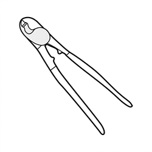
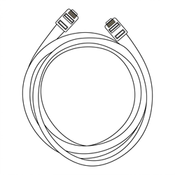
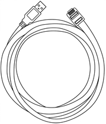
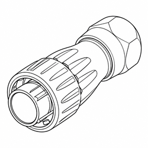
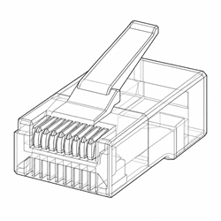
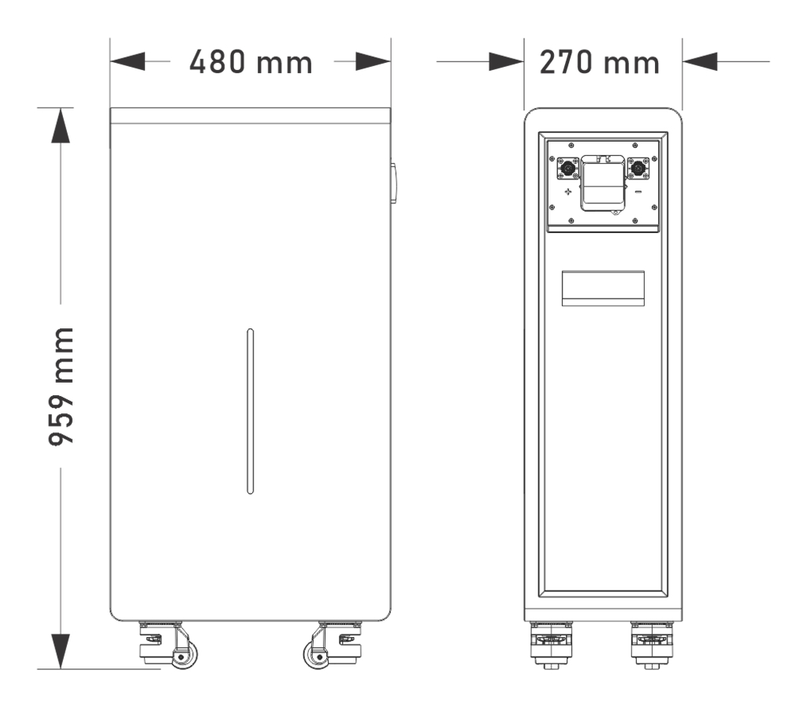
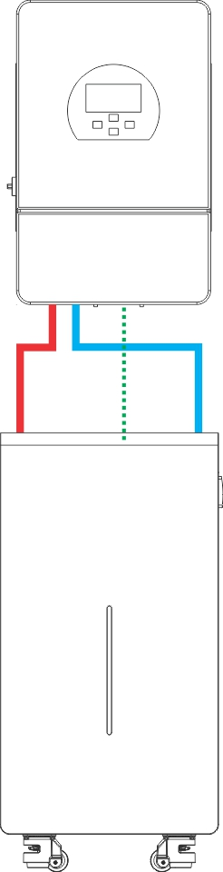
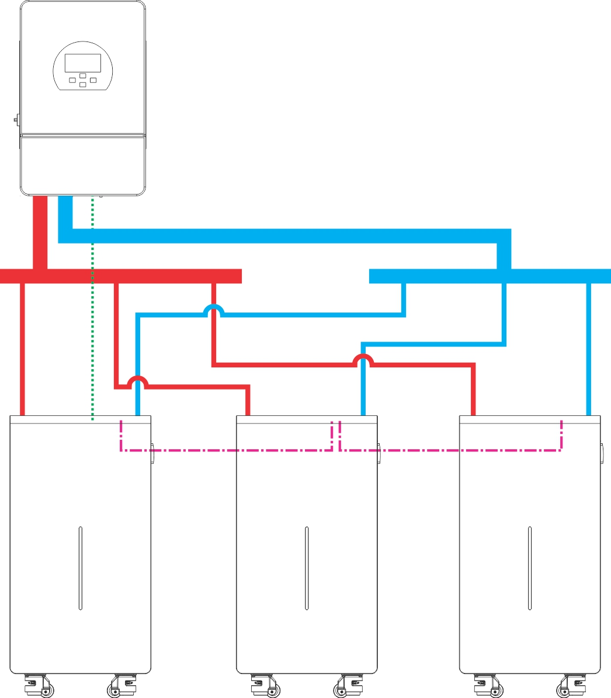

# Gobel PowerCarol 16 Installation Manual

This manual applies to the Gobel Power Carol 16 series (model GP-WP1-16K-PC200B).

## 1. Product Introduction

This product is the Gobel Power Carol 16 (model GP-WP1-16K-PC200B), a 51.2V 314Ah LiFePO4 (LiFePO₄) low-voltage energy storage battery. It uses high-performance 314Ah LiFePO4 battery cells, with a floor-standing structure featuring casters at the bottom and handles on the sides, IP65 ingress protection, and can be installed both indoors and outdoors. It is equipped with a high-performance battery management system (BMS) that provides comprehensive monitoring and protection of the battery.

### 1.1 Product Overview

| Item | Specification |
| :--- | :--- |
| Product Name | Gobel PowerCarol 16 |
| Product Model | GP-WP1-16K-PC200B |
| Brand | Gobel Power |
| Product Type | 51.2V 314Ah LiFePO4 low-voltage energy storage battery |
| Rated Voltage | 51.2V |
| Rated Capacity | 314Ah (approx. 16kWh) |
| Ingress Protection | IP65 |
| Installation Method | Floor mounting (with casters and handles) |
| Dimensions | See [Product Dimensions Diagram](#Product-Dimensions) |
| Weight | 125kg |

### 1.2 Product Features

- **High-capacity energy storage**: Rated capacity 314Ah (approx. 16kWh), meeting the energy storage needs of households and small commercial & industrial applications
- **Safe and reliable**: LiFePO4 battery cell chemistry is stable, with excellent thermal stability
- **Intelligent BMS management**: Monitors battery voltage, current, temperature, SOC (state of charge) and other parameters in real time, providing multiple protections against overcharge, over-discharge, over-temperature, short circuit, and more
- **Flexible expansion**: Supports up to 63 batteries in parallel for easy capacity expansion; parallel addresses are assigned automatically by the system (auto addressing), with no manual DIP switch setting required
- **Suitable for indoor and outdoor use**: IP65 ingress protection, floor mounting, installable both indoors and outdoors
- **Easy to move**: With casters at the bottom and handles on the sides, one person can move the unit over short distances
- **Online monitoring**: Built-in WiFi interface, compatible with the Gobel VRM online monitoring platform, and supports integration with Home Assistant, ioBroker, and other platforms
- **Mobile APP management**: The Gobel Console APP can be used for one-click configuration and firmware upgrade of the battery
- **Standard interfaces**: Provides RS485A/CAN (inverter), RS232 (PC/mobile phone), RS485B/RS485C (parallel) and other communication interfaces, compatible with mainstream inverters

### 1.3 Application Scenarios

- Residential PV energy storage systems
- Small commercial & industrial energy storage systems
- Backup power (UPS) systems
- Off-grid energy storage systems
- Outdoor energy storage systems (IP65 protection)

### 1.4 Product Appearance and Interfaces

The figure below shows the interfaces, indicators, and operating components on the battery panel (the numbers in the figure correspond to the table below):

| No. | Name | Description |
| :---: | :---: | :--- |
| 1 | RS485A/CAN Port | Inverter communication interface |
| 2 | RS232 Port | Connects to a PC or mobile phone for host software (PC) monitoring and parameter setting |
| 3 | WiFi Interface | Wireless communication interface; connects to the Gobel VRM online monitoring platform, Home Assistant, ioBroker, etc. |
| 4 | RS485B Port | Battery parallel communication interface |
| 5 | RS485C Port | Battery parallel communication interface |
| 6 | ON/OFF Switch | Turns the battery BMS on or off |
| 7 | Exhaust Valve | Automatically relieves pressure when internal pressure is abnormal; do not block it |
| 8 | Handle | Used for moving and carrying the battery |
| 9 | LED Light Bar | Indicates SOC (state of charge), Run, and Alarm status |
| 10 | Positive Terminal | Positive energy-storage quick-insert terminal, maximum current capacity 200A |
| 11 | Negative Terminal | Negative energy-storage quick-insert terminal, maximum current capacity 200A |
| 12 | Circuit Breaker | Controls making/breaking of the battery main circuit |

For the pin definitions of each communication interface, see the [Product Communication Pin Definitions](#Communication-Pin-Definitions) section in the [Appendix](#Appendix).

## 2. Safety Instructions

Before installing, using, and maintaining this product, please read and understand the following safety instructions carefully. Failure to follow these instructions may result in personal injury, equipment damage, or property loss. Do not cover, alter, or tear off the warning labels and specification nameplate on the product.

### 2.1 Operators and Protection Requirements

:::note Operator Requirements
Installation and maintenance operations should be performed by professionals with electrical knowledge. Personnel unfamiliar with the operation of electrical equipment must not install it themselves.
:::

:::warning Personal Protection
- Use insulated tools and wear insulated gloves during operation; remove watches, rings, and other metal accessories
- Do not place tools or metal parts on the battery to prevent terminals from contacting exposed wires or metal objects
- Adjacent live parts should be covered or protected
- Components may become extremely hot when the equipment malfunctions; do not touch them to avoid burns
:::

### 2.2 Safety Precautions

:::danger Risk of Electric Shock
This product is an energy storage device; improper operation may cause serious electric shock accidents. Before performing any electrical connection or maintenance operation, be sure to switch off the battery circuit breaker and turn off the BMS via the ON/OFF switch.
:::

:::caution Battery Safety
- Short-circuiting the battery's positive and negative terminals is prohibited; a short circuit produces extremely high current and may cause fire or explosion
- Before operation, confirm that the battery's positive and negative connections are correct; reversed connection will damage the equipment
- Do not use open flames or spark-producing devices near the battery
- If the battery casing is deformed, leaking, or abnormally hot, stop using it immediately and contact technical support
:::

:::caution Electrolyte Handling
The electrolyte is harmful to skin and eyes and may be toxic; do not touch it. If electrolyte accidentally contacts eyes or skin, immediately rinse continuously with clean water for at least 10 minutes and seek medical attention as soon as possible.
:::

:::danger Unauthorized Disassembly Prohibited
No one other than manufacturer-authorized personnel may open, repair, or disassemble the battery. There are no user-serviceable parts inside the battery; unauthorized disassembly or modification will void the warranty and may cause safety accidents. It is recommended to place warning signs or barriers near the product to prevent misoperation.
:::

:::caution Disposal and Recycling
- Damaged, swollen, or leaking batteries should be deactivated immediately and stored in a dry, cool, moisture-proof environment away from light; do not attempt to repair or disassemble them yourself — contact the installer, distributor, or a professional recycling agency for handling
- Waste batteries must not be discarded as household garbage; dispose of them at designated recycling points in accordance with local regulations, and remove privacy-related information from the product before disposal
:::

:::warning Fire Extinguishing Requirements
In the event of a battery fire, only dry powder fire extinguishers may be used; liquid fire extinguishers are strictly prohibited. Do not place the battery near open flames, heaters, or other high-temperature heat sources.
:::

:::caution Handling Safety
This product weighs 125kg; forcing a single person to carry it is prohibited. Handling and moving must be performed with suitable handling equipment and by multiple people working together. The product is top-heavy; laying it on its side or upside down is prohibited, and care must be taken during movement to prevent the equipment from tipping over and causing personal injury. For handling methods, see the [Transportation and Handling](#Transportation-Handling) chapter.
:::

## 3. Transportation and Handling

### 3.1 Transportation Requirements

- Prevent violent vibration, impact, and squeezing during transportation; avoid direct sunlight, rain, and moisture, and take rain-proof, moisture-proof, and sun-proof measures
- Smoking is strictly prohibited in transportation, loading, and unloading areas; freight personnel must not open the battery packaging without permission
- Lithium-ion batteries are Class 9 dangerous goods (UN3480); cross-border sea, land, and air transport must comply with the corresponding dangerous goods transportation regulations, and dangerous goods labels must be posted as required
- If the battery shows odor, leakage, smoke, fire, or any other abnormality before transportation, transport is strictly prohibited
- Transportation operations should be performed by trained professionals; handlers must wear protective gloves and safety shoes
- Do not remove the transport packaging before the product arrives at the installation site

### 3.2 Handling Methods

#### 3.2.1 Manual Handling

- The product weighs 125kg; forcing a single person to carry it is prohibited. Before handling, confirm that personnel are in good physical condition, wear non-slip gloves, safety shoes, and other protective gear, and watch out for sharp metal panels and heavy objects
- Clear the handling path and confirm the floor is safe before moving; slow down when passing ramps, narrow spaces, and stairs, and assign dedicated personnel to assist
- The product is top-heavy; laying it on its side, upside down, or unsecured handling is prohibited, and measures should be taken to prevent tipping during movement
- For short-distance movement on flat ground, push the unit using the side [**handle**](#Product-Interface) together with the bottom [**casters**](#Product-Interface), and lock the casters after moving it into position
- When handling, stay close to the equipment, bend your knees, and exert force smoothly; lift with leg strength rather than your waist; do not jerk or twist your body; when turning, move your feet rather than twisting your waist
- Move the equipment smoothly at a constant speed and lift and set it down gently to prevent collisions, drops, scratches, or damage to components and cables
- After handling is complete, confirm the equipment is placed stably to prevent tipping injuries

#### 3.2.2 Using Handling Equipment

- When using handling equipment such as forklifts, it must be operated by certified professionals in compliance with the equipment's operating requirements; unrelated personnel should stay at least 2m away from the work area; standing on or riding the forklift or cargo is prohibited, and overloading is prohibited
- The rated load of the handling equipment should be more than twice the product's weight (this product weighs 125kg, i.e., more than 250kg), and the fork arm length should be no less than the product's depth
- Control the driving speed; sharp turns are prohibited; confirm the rear is safe before reversing, and assign dedicated personnel to direct operations in narrow spaces
- Operating on slopes with a grade ≥5° is prohibited; slow down on uneven surfaces
- Tilting or inverting the product during handling is prohibited; if tilting is unavoidable, restore it upright as soon as possible and let it stand for 2 hours before powering on

## 4. Installation

### 4.1 Pre-Installation Preparation

#### 4.1.1 Installation Environment Requirements

- **Floor**: The installation floor should be flat and solid, with sufficient load-bearing capacity (the product weighs 125kg)
- **Ventilation**: The installation site should be well ventilated to avoid heat accumulation; do not block the equipment's vents or heat-dissipation structures, and keep away from equipment air outlets
- **Environmental conditions**: Dry and clean, free of corrosive gases or dust; ambient temperature 0°C ~ 50°C, relative humidity not exceeding 95% RH (non-condensing); the recommended installation altitude is no more than 3000m
- **Safety distance**: Keep away from flammable and explosive items; keep away from heat sources, open flames, and high-temperature objects; do not install or operate in environments containing flammable/explosive gases or fumes, and do not store flammable or explosive materials around the equipment
- **Waterproofing and rain protection**: This product has IP65 ingress protection and can be installed both indoors and outdoors; however, it must not be installed in locations that may be flooded, should be kept away from areas prone to standing water, condensation, or water seepage, and must avoid prolonged soaking
- **Corrosive environments**: Avoid magnetic dust, volatile or corrosive gases, organic solvents, conductive metal dust, and salt-spray environments
- **Electromagnetic interference and vibration**: Avoid locations with strong vibration, noise, and electromagnetic interference
- **Others**: Do not install the equipment on moving vehicles such as ships, trains, or cars; the installation location should be away from children and daily living and working areas

To ensure space for heat dissipation and maintenance, keep sufficient clearance between the battery and walls or other equipment:

- Distance from both sides of the battery to walls ≥ 100mm
- Distance from the top of the battery to obstacles above ≥ 300mm
- Reserve at least 800mm of operating space in front of the battery (the interface panel side)

:::caution
Before installation and power-on, remove dust and iron filings from the installation area; before installation, confirm the site has sufficient load-bearing capacity and take anti-static measures; do not install the equipment in enclosed, poorly ventilated locations without fire-fighting facilities, or in locations inaccessible to firefighters.
:::

#### 4.1.2 Tool Requirements

Prepare the following tools and instruments before installation:

| Tool/Instrument | Purpose | Image |
| :--- | :--- | :---: |
| Socket wrench | Tightening inverter-side power terminals (per inverter requirements) |  |
| Adjustable wrench | Tightening inverter-side terminal nuts |  |
| Phillips screwdriver | Tightening inverter-side wiring screws, etc. |  |
| Multimeter | Measuring terminal voltage |  |
| Crimping tool | Making power cables in-house, crimping energy-storage quick-insert terminals |  |
| Network cable crimping tool | Re-crimping RJ45 plugs for outdoor installation |  |
| Tape measure | Measuring cable lengths and installation distances |  |
| Marker pen | Marking measurement positions |  |
| Spirit level | Confirming the equipment is placed level |  |
| Insulated gloves | Operation protection |  |
| Insulated boots | Operation protection |  |
| Safety glasses | Work protection (recommended) |  |
| Windows PC | For host software (PC) protocol setting | — |
| Smartphone | For Gobel Console APP configuration | — |

:::note
For the complete procedure for making power cables (crimping energy-storage quick-insert terminals), see [Power Cable Assembly](#Power-Cable-Assembly).
:::

### 4.2 Unboxing and Inspection

#### 4.2.1 Parts List

After unboxing, check the product and accessories against the table below to confirm all parts are complete and intact.

| No. | Name | Specification/Quantity | Image |
| :---: | :---: | :---: | :---: |
| <a id="Part01">01</a> | Gobel PowerCarol 16 energy storage battery | 51.2V 314Ah, 1 unit |  |
| <a id="Part02">02</a> | Positive/negative energy-storage quick-insert terminal (cable side power connector) | 200A, 1 each for positive and negative (cables must be crimped in-house) |  |
| <a id="Part03">03</a> | Communication network cable | RJ45 on both ends, symmetric pinout, 1 piece (usable as parallel cable or inverter communication cable) |  |
| <a id="Part04">04</a> | RS232-USB communication cable | 1 piece (connects to PC host software) |  |
| <a id="Part05">05</a> | USB-Type C data cable | 1 piece (connects to mobile phone) |  |
| <a id="Part06">06</a> | RJ45 waterproof gland (RJ45 Cable Waterproof Gland) | 2 pieces (for waterproofing in outdoor installations) |  |
| <a id="Part07">07</a> | RJ45 plug | 4 pieces (for re-crimping in outdoor installations) |  |

#### 4.2.2 Unboxing Inspection Steps

After receiving the product, perform the unboxing inspection as follows:

1. Remove the energy storage battery ([01](#Part01)) from the packaging and check whether the outer packaging and the product's appearance are intact.

2. Check the product and accessories against the [Parts List](#Parts-List) for any missing or damaged items.

3. Power on via the [**ON/OFF switch**](#Product-Interface) on the panel and observe whether the [**LED light bar**](#Product-Interface) display is normal.

4. Switch the [**circuit breaker**](#Product-Interface) to the ON position, and use a multimeter to measure the voltage between the battery's [**positive terminal**](#Product-Interface) and [**negative terminal**](#Product-Interface); the normal voltage should be between 40V ~ 58V.

5. If all inspection results are normal, proceed to the next installation step.

:::caution
If the product's appearance is damaged, accessories are missing, or the voltage is abnormal, do not continue installation; contact Gobel Power technical support promptly.
:::

:::note Unboxing Tips
- Do not remove the transport packaging before the product arrives at the installation site; handle carefully when unboxing to avoid scratching the equipment
- Before unboxing, check whether the outer packaging is damaged and whether the shock indicator has been triggered; if it has been triggered, transport damage cannot be ruled out
- Clean all parts before installation; prevent collisions and scratches during handling and storage, and take moisture-proof and rust-proof measures
- The system should be installed and commissioned within 6 months after delivery; long-term idle storage accelerates battery capacity degradation
:::

### 4.3 Installation Steps

This product has a floor-standing structure with casters at the bottom and handles on the sides, making it easy to move. The installation steps are as follows:

1. Switch off the [**circuit breaker**](#Product-Interface) of the energy storage battery ([01](#Part01)) and power it off via the [**ON/OFF switch**](#Product-Interface).

2. Use the side [**handle**](#Product-Interface) together with the bottom [**casters**](#Product-Interface) to move the battery to the predetermined installation location (two people working together is recommended to prevent tipping), and lock the casters after moving it into position.

3. Use a spirit level to confirm the equipment is placed level; if the floor is uneven, adjust the equipment's position or shim it to ensure the equipment is stable and does not wobble.

:::caution
Pay attention to floor evenness when moving the battery and avoid excessive tilt angles. The battery weighs 125kg; be sure to move it safely to prevent tipping injuries. The interface panel side should face a direction convenient for wiring and maintenance.
:::

:::caution Installation Discipline
- Installation must strictly follow this manual and the design requirements; changing installation steps or technical parameters without authorization is prohibited
- All switches must remain in the OFF position during installation and wiring; live work is strictly prohibited
- All fasteners must be firm and reliable
:::

### 4.4 Post-Installation Inspection

After installation is complete, confirm that the following items are normal:

- The battery's appearance is intact, with no deformation, bumps, or scratches
- The equipment is placed stably and the casters are locked
- Surrounding passages are clear, with no flammable or explosive items
- Warning labels and the specification nameplate are complete and legible
- On-site fire-fighting equipment is in place and meets requirements

## 5. Electrical Connection

### 5.1 Safety Precautions

:::warning Wiring Requirements
This product only supports parallel connection; series connection is strictly prohibited, with a maximum of 63 units in parallel. Series connection may cause equipment damage or safety hazards.
:::

:::warning Electrical Safety Precautions
- Residual voltage may remain between the terminals after the battery is powered off; wait at least 10 minutes before wiring and use a multimeter to confirm there is no voltage
- Never connect the battery directly to the AC grid or to photovoltaic (PV) DC lines; the battery can only be connected to matching power conversion equipment such as an inverter
- Do not use faulty inverters or other power conversion equipment that is not matched to the battery; before connection, confirm that the battery system parameters are fully compatible with the connected equipment
- Do not perform electrical connections during sandstorms or when the ambient relative humidity exceeds 95%
- Wiring should be performed by professionals with electrical knowledge wearing protective equipment as required in Chapter 2
:::

### 5.2 Connection Preparation

#### 5.2.1 Cable Preparation

Before connection, confirm that the following cables and parts are ready:

- **Positive/negative energy-storage quick-insert terminals ([02](#Part02))**: 200A, 1 each for positive and negative, cables must be crimped in-house
- **Communication network cable ([03](#Part03))**: RJ45 on both ends, symmetric pinout, usable as parallel communication cable or inverter communication cable
- **RS232-USB communication cable ([04](#Part04))**: for connecting to a Windows PC for host software (PC) monitoring and protocol setting
- **USB-Type C data cable ([05](#Part05))**: for connecting to a mobile phone, configured using the Gobel Console APP
- **RJ45 waterproof gland ([06](#Part06)) and RJ45 plugs ([07](#Part07))**: for making waterproof communication cables in outdoor installations

Also confirm that the inverter and other equipment are installed in place, and switch off and de-energize the inverter; also refer to the battery-connection-related sections in the inverter's manual.

#### 5.2.2 Power Cable Assembly

The power cable must be made in-house. Prepare 50mm² power cable of an appropriate length, and crimp the cable to the positive/negative energy-storage quick-insert terminals ([02](#Part02)) as follows:

1. Unscrew the tail cover (cable sheath clamping nut) of the positive/negative energy-storage quick-insert terminal, and pass one end of the 50mm² cable through the tail cover.
2. Strip the insulation from the cable end according to the crimping length requirement of the terminal's crimping copper ring (be careful not to damage the copper core), and insert the entire stripped copper core into the bottom of the terminal's crimping copper ring.
3. Use a crimping tool matched to the 50mm² cable with the corresponding crimping die, and apply pressure at the specified crimping position of the copper ring. After crimping, visually inspect the crimped area and gently pull the cable to confirm the crimp is secure and conductivity is good.
4. Screw the tail cover back onto the terminal and tighten it, so that the tail cover firmly clamps the cable sheath, preventing force from being transmitted to the crimped area when the cable is pulled.

   

5. Crimp the corresponding terminal to the other end of the cable according to the actual connection target: when connecting directly to the inverter, crimp according to the inverter's input terminal specifications (e.g., M8 OT terminals); when multiple batteries are paralleled via a busbar, crimp according to the busbar connection method (e.g., M8/M10 OT terminals), and tighten to the torque required by the inverter or busbar manual.

:::danger
Poor crimping will increase the terminal's contact resistance, causing abnormal heating or even burnout. Crimping must be performed by qualified personnel using proper tools; after crimping, be sure to check each item for security before putting the connection into use.
:::

#### 5.2.3 Waterproof Communication Cable Assembly

For outdoor installations, the end of the communication cable connected to the battery (both ends for the parallel cable) must be waterproofed using the RJ45 waterproof gland ([06](#Part06)) and RJ45 plug ([07](#Part07)) from the accessories. There are two cases depending on the cable's purpose:

- **Inverter communication cable (battery → inverter)**: use 1 gland, assembled on the end connected to the battery; handle the other end according to the inverter's requirements.

- **Parallel communication cable (battery → battery)**: use 2 glands, 1 assembled at each end.

The gland assembly steps are as follows:

1. Unscrew the covers at both ends of the RJ45 waterproof gland (the front waterproof cover and the rear locking cover), and slip the removed rear cover onto the network cable;
2. Pass the network cable (with the RJ45 plug cut off) through the rear cover and insert it into the gland body;
3. Re-crimp an RJ45 plug ([07](#Part07));
4. Screw the front waterproof cover back onto the front of the gland and tighten it;
5. Align the gland's front with the waterproof port on the panel and insert it; tighten the rear cover so that the gland locks in place and clamps the network cable sheath, achieving a waterproof seal.

:::note
When making the parallel communication cable, the other end does not need to be cut: slip the rear cover and body of the second gland onto the end with the cut-off plug, push it along to the end retaining the original RJ45 plug so that the original plug exits through the gland's front, and then tighten that gland's rear cover.
:::

#### 5.2.4 Battery Address Description

This product requires no manual DIP switch setting; parallel addresses are assigned automatically by the system (auto addressing). When multiple batteries are paralleled, the system automatically designates the master and the slaves; the inverter communication protocol only needs to be set on the master. See the [Inverter Communication Protocol Settings](#Protocol-Settings) chapter.

### 5.3 Cable Connections

#### 5.3.1 Grounding Connection

- Complete the grounding connection of the battery system in accordance with local electrical codes and the inverter's requirements
- Ensure that an overvoltage protection device has been installed at the site where the system is located

#### 5.3.2 Power Cable Connection

Insert the positive energy storage quick-connect terminal (of the self-made power cable) ([02](#Part02)) into the battery's [**positive terminal**](#Product-Interface) and lock it securely in place, then connect the other end to the inverter's battery input positive; insert the negative energy storage quick-connect terminal into the battery's [**negative terminal**](#Product-Interface) and lock it securely in place, then connect the other end to the inverter's battery input negative.

:::caution
When making connections, be sure to confirm that the positive and negative poles are matched correctly; reversed polarity will cause severe damage to the equipment. Each terminal carries a maximum current of 200A. Please verify, based on the actual system current, whether the current-carrying capacity of the terminals and cables meets the requirements. When inserting a terminal, make sure it is locked securely in place; after connecting, gently pull the cable to confirm there is no looseness.
:::

:::note Cable Routing
Do not pull or yank the cables forcibly. Leave sufficient bending space for the cables and use appropriate fasteners to reduce cable stress.
:::

#### 5.3.3 Communication Cable Connection

Connect one end of the **communication network cable ([03](#Part03))** to the [**RS485A/CAN port**](#Product-Interface) of the master battery, and the other end to the inverter's BMS communication interface (whether RS485 or CAN protocol is used depends on the inverter manual and must be consistent with the battery's protocol setting). Depending on the installation environment, the wiring method for the communication cable is as follows:

- **Indoor installation**: The RJ45 waterproof cable gland may be omitted; insert the network cable's crystal connector directly into the RS485A/CAN, RS485B, RS485C, or RS232 communication port.

- **Outdoor installation**: Use the RJ45 waterproof cable gland ([06](#Part06)) from the accessories to make a waterproof communication cable. For the assembly steps, see [Making a Waterproof Communication Cable](#Waterproof-Cable-Assembly).

  The RS232 port is used to connect to the host software (PC) and is not permanently connected, so the RJ45 waterproof cable gland may be omitted for it.

:::caution
Please confirm whether the pin definitions of the inverter's BMS communication interface match the pin definitions of the battery's RS485A/CAN port. The communication network cable included with this product has a symmetric wire order at both ends. If the pin definitions of the inverter and the battery differ, you need to make a communication cable with the corresponding wire order yourself using a network cable crimping tool, or purchase an adapter cable from the inverter manufacturer (e.g., for Victron inverters).
:::

For the pin definitions of each communication interface, refer to the [Product Communication Pin Definitions](#Communication-Pin-Definitions) section in the [Appendix](#Appendix).

### 5.4 Parallel Connection of Multiple Batteries

:::caution
It is strictly forbidden to connect batteries of different models or different specifications in parallel; this product supports a maximum of 63 units in parallel; when connecting multiple batteries, the cables must be routed along the designated paths, and the wiring direction must not be changed arbitrarily.
:::

#### 5.4.1 Parallel Power Connection

If multiple batteries are used in parallel, the positive and negative terminals of each battery need to be connected to the busbar via power cables, and then the busbar is connected to the inverter.

:::note
For the connection diagrams, refer to the [Battery and Inverter Connection Diagrams](#Connection-Diagrams) section in [Appendix 4](#Connection-Diagrams).
:::

#### 5.4.2 Parallel Communication Connection

When multiple batteries are connected in parallel, use parallel communication cables to connect the RS485B and RS485C interfaces of the batteries in sequence: the RS485B of the first battery connects to the RS485C of the second battery, the RS485B of the second battery connects to the RS485C of the third battery, and so on. For outdoor installation, it is also recommended to assemble the parallel communication cables with RJ45 waterproof cable glands (see [Making a Waterproof Communication Cable](#Waterproof-Cable-Assembly)).

:::note
The parallel communication connection requires no manual address setting; the system assigns addresses automatically (auto-addressing).
:::

### 5.5 Post-Connection Inspection

After all cable connections are complete, please verify the following items one by one:

- After completing each connection, check that it is correct and secure, with no looseness or poor contact; quick-connect terminals are locked securely in place, and all fasteners are fully tightened
- The polarity of the positive and negative power cables is correct, and the connections are firm and reliable
- Prevent terminals from contacting exposed wires or metal objects; adjacent live parts should be covered
- Remove foreign objects around the equipment, especially metal debris, to prevent short circuits

## 6. Operation

### 6.1 Pre-Power-On Check

:::caution Pre-Power-On Check
- All items of the [Post-Connection Inspection](#Post-Connection-Inspection) have been confirmed correct
- The work area should be cleared, and unrelated personnel and animals should be kept away from the equipment
:::

### 6.2 Inverter Communication Protocol Settings

When multiple batteries are connected in parallel, you only need to set the communication protocol of the **master** battery; the slave batteries require no setting. You can set it in any one of the following three ways:

1. **Set via host software (PC)**: Use the **RS232-USB communication cable ([04](#Part04))** to connect a Windows PC to the master battery, and select the communication protocol matching the inverter in the host software (PC) program.

   :::note
   For detailed host software (PC) operation, refer to the "PCBMS Software User Guide" in the [Reference Documents](#Reference-Documents) section.
   :::

2. **Set via mobile APP**: Use the **USB-Type C data cable ([05](#Part05))** to connect the mobile phone to the master battery, and select the communication protocol matching the inverter in the Gobel Console APP.

3. **Set on the Gobel VRM platform or APP**: After the battery is connected to the network, you can select the communication protocol matching the inverter on the Gobel VRM platform or APP.

:::note WiFi Configuration
For the battery's WiFi configuration and access to the online monitoring platform, refer to the "WiFi User Guide".
:::

:::note Inverter Compatibility
Before setting the communication protocol, please first confirm that the brand and model of the inverter you are using are compatible with the battery. For the list of verified compatible inverters, refer to the "Inverter Compatibility List" in the [Reference Documents](#Reference-Documents) section.
:::

### 6.3 Power-On

Follow this sequence for power-on: **BMS power-on (ON/OFF switch) → wait → circuit breaker ON → inverter power-on**.

1. Check that the power connections and communication connections are normal, and ensure all cables are firmly connected with no looseness.

2. Press the [**ON/OFF switch**](#Product-Interface) on all batteries to power on (BMS ON), and wait for the battery system to complete self-check, with the [**LED light bar**](#Product-Interface) displaying normally and no alarms.

3. Turn the [**circuit breakers**](#Product-Interface) of all batteries to the ON position.

4. Turn on the inverter's power switch.

5. Set the battery type to lithium battery in the inverter.

6. Check the battery information displayed in the inverter to confirm that data (such as battery voltage, battery SOC, temperature, etc.) has been correctly obtained from the battery BMS.

7. If the data can be read correctly in the inverter, the installation is complete, and a charge/discharge test can be performed.

:::warning Power-On Sequence
Do not turn on the inverter before or at the same time as turning on the circuit breaker, and do not skip the waiting step and close the circuit breaker directly; otherwise, a large inrush current may occur, causing equipment damage or triggering protection.
:::

:::tip
If the inverter cannot read the battery data after power-on, check whether the communication cable connection is normal and whether the communication protocol settings are correct. For more common fault handling methods, see [Appendix 1](#Troubleshooting).
:::

### 6.4 Power-Off

Follow this sequence for power-off: **inverter power-off (Inverter OFF) → wait → circuit breaker OFF → BMS power-off (ON/OFF switch)**.

1. Turn off the inverter and its connected loads, and wait for the inverter to stop working completely.

2. Turn the [**circuit breakers**](#Product-Interface) of all batteries to the OFF position.

3. Press the [**ON/OFF switch**](#Product-Interface) to turn off each battery's BMS.

:::caution
Residual voltage may still exist between terminals after power-off; do not touch the terminals immediately. If maintenance is required, follow the [Maintenance Safety Precautions](#Maintenance-Safety).
:::

## 7. Product Monitoring

### 7.1 Panel Status Indicators

You can check the battery's operating status via the [**LED light bar**](#Product-Interface) on the panel:

| Component | Description |
| :--- | :--- |
| LED light bar | Indicates SOC (state of charge), Run (running), and Alarm status |

When the Alarm indicator lights up, promptly investigate the cause of the fault. If it cannot be resolved, contact Gobel Power technical support. For common fault handling methods, see [Appendix 1](#Troubleshooting).

### 7.2 Host Software (PC) and Remote Monitoring

This product supports multiple monitoring methods:

1. **PC host software monitoring**: Use the **RS232-USB communication cable ([04](#Part04))** to connect a Windows PC to the battery, run the battery host software (PC) program on the computer, and view operating status such as battery voltage, current, temperature, and SOC.

2. **Mobile APP monitoring**: Use the **USB-Type C data cable ([05](#Part05))** to connect the mobile phone to the battery, view the battery status through the Gobel Console APP, and perform one-touch configuration and upgrade of the battery.

3. **WiFi online monitoring**: After connecting to the network through the battery's built-in [**WiFi interface**](#Product-Interface), it is compatible with the Gobel VRM online monitoring platform, and supports integration with platforms such as Home Assistant and ioBroker for remote monitoring. For the WiFi configuration method, refer to the "WiFi User Guide".

:::note
For detailed host software (PC) operation, refer to the "PCBMS Software User Guide" in the [Reference Documents](#Reference-Documents) section.
:::

## 8. Maintenance and Storage

### 8.1 Maintenance Safety Precautions

- Before maintenance, the battery must be completely de-energized (disconnect both the grid side and the battery side power), following the principle of "de-energize → prevent inadvertent reclosing → verify absence of voltage → grounding and short-circuit protection → cover adjacent live parts"
- Hang a "Do Not Close" warning tag on the switch position to prevent inadvertent power restoration
- Before maintenance, disconnect all battery terminals and circuit connectors, and fit protective caps on the terminals; use insulated tools, and it is forbidden to wear metal accessories such as jewelry and watches

### 8.2 Routine Maintenance Requirements

- When replacing parts, spare parts of the same type and specification must be used
- Do not spray paint on the internal or external components of the battery, and do not use cleaning solvents to clean the battery
- If any abnormality is found, contact the supplier within 24 hours
- In daily use, keep the battery SOC above 5%, and charge promptly within 48 hours after a full discharge to avoid over-discharge

### 8.3 Post-Maintenance Requirements

- After maintenance, clean up tools and materials, and confirm that no metal foreign objects remain inside or on top of the battery
- Re-energize only after confirming that the terminal protective caps, protective covers, etc. have all been restored to their positions

### 8.4 Long-Term Storage

If the battery will not be used for a long period, store and maintain it according to the following requirements:

- Fully charge the battery, then turn off the [**circuit breaker**](#Product-Interface) and the [**ON/OFF switch**](#Product-Interface) (turn off the BMS).
- Check the battery voltage at least every 3 months. If the voltage is below 51V, charge it promptly.
- The battery should be stored in a dry, clean, well-ventilated place, away from direct sunlight and rain, and away from high-temperature heat sources, open flames, and flammable and explosive materials
- During storage, the battery should be completely disconnected from external equipment, ensuring the LED light bar is off
- The floor of the storage area should be level and solid, and qualified fire-fighting facilities (such as dry powder fire extinguishers and fire sand) should be provided
- Handle with care when moving for storage; dropping, collision, tipping over, laying on its side, and tilting are forbidden

:::danger
Battery damage caused by failure to charge in time is not covered by the warranty. Long-term storage without charging will cause the battery to over-discharge, resulting in irreversible capacity loss or even scrapping of the battery.
:::

## 9. Product Specifications

### 9.1 Technical Specifications

| Item | Parameter |
| :--- | :--- |
| Product Name | Gobel PowerCarol 16 |
| Product Model | GP-WP1-16K-PC200B |
| Brand | Gobel Power |
| Product Type | 51.2V 314Ah LiFePO4 low-voltage energy storage battery |
| **Main Parameters** | |
| Battery Cell Type | LiFePO4 (LiFePO₄) |
| Rated Capacity | 314Ah [1] |
| Parallel Expansion | Up to 63 units in parallel [2], series connection strictly prohibited |
| Nominal Voltage | 51.2V |
| Operating Voltage | 44.8V ~ 58.4V |
| Nominal Energy | 16kWh |
| Usable Energy | 16kWh [1] |
| Maximum Output Power | 7.68kW |
| Charge Current [3] | Max. continuous 150A; peak 200A (25 seconds) |
| Discharge Current [3] | Max. continuous 150A; peak 200A (25 seconds) |
| Active Balancing | Yes |
| **Other Parameters** | |
| Maximum Depth of Discharge | 100% DOD |
| Dimensions (W×H×D) | 477 × 959 × 270 mm |
| Weight | Approx. 125kg |
| Display | LED light bar (SOC, alarm) |
| Ingress Protection | IP65 |
| Operating Temperature | Charge: 0°C ~ 55°C; Discharge: -20°C ~ 55°C |
| Storage Temperature | 0°C ~ 35°C |
| Relative Humidity | 95% (non-condensing) |
| Altitude | ≤3000m |
| Cycle Life | ≥8000 cycles (25°C±2°C, 70% EOL) |
| Electrical Isolation Protection | Built-in circuit breaker |
| Installation | Floor mounting (with casters and handles) |
| Communication Interfaces | CAN, RS485, RS232, WiFi |
| Energy Throughput | 50MWh [4] |

[1] Test conditions: 25°C±2°C, beginning of life (BOL), 0.5C charge / 0.5C discharge, 100% DOD.
[2] The battery modules automatically form a network after power-on; no DIP switches are required.
[3] Current is affected by temperature and SOC.
[4] Energy throughput refers to the total energy accumulated through charging and discharging over the battery's entire service life.

### 9.2 Product Dimensions Diagram

## Appendix

### Appendix 1: Common Faults and Troubleshooting

| Symptom | Possible Cause | Solution |
| :--- | :--- | :--- |
| Inverter cannot read battery data | Communication cable connection loose or open circuit; pin definitions at both ends do not match; communication protocol set incorrectly | Check the communication cable connections; verify the pin definitions at both ends (see [Appendix 3](#Communication-Pin-Definitions)); reset the communication protocol (see [Inverter Communication Protocol Settings](#Protocol-Settings)) |
| Abnormal terminal voltage measured during unboxing inspection (below 40V or above 58V) | Charge too low or product abnormality | Do not continue installation or use; contact Gobel Power technical support |
| Alarm indicator lights up | Battery fault or alarm | Stop using and investigate the cause of the fault; contact Gobel Power technical support if necessary |
| Battery case deformed, leaking, or abnormally hot | Battery internal abnormality | Stop using immediately and contact technical support; for handling methods, see [Appendix 2](#Emergency-Handling) |
| WiFi or mobile APP cannot connect to the battery | WiFi not configured or configured incorrectly | Reconfigure according to the "WiFi User Guide" |
| Voltage below 51V after long-term storage | Self-discharge during storage | Charge promptly before putting back into use (see [Long-Term Storage](#Storage-Precautions)) |
| Abnormal heating at quick-connect terminal connections | Terminal not fully inserted or poorly crimped | De-energize, then re-insert the terminal firmly; if necessary, re-crimp according to [Making the Power Cable](#Power-Cable-Assembly) |

### Appendix 2: Emergency Handling

:::danger
In emergencies such as electric shock, fire, or electrolyte leakage, personal safety must be prioritized; evacuate personnel promptly and call the appropriate emergency numbers. Damaged equipment must not be operated until it has been professionally inspected and has passed qualified testing.
:::

#### Electric Shock Accident

- Cut off the power supply immediately, on the premise of ensuring your own safety
- Use an insulated object to separate the electric shock victim from the power source, and administer first aid including cardiopulmonary resuscitation (CPR), while immediately calling the emergency number
- Protect the accident scene for investigation and evidence collection
- After the accident, the system must be inspected by professionals and may only be put back into use after repair or replacement and passing qualified testing

#### Fire or Explosion Risk

- Evacuate the scene immediately and call the fire emergency number; stay away from the smoke produced by combustion; when extinguishing the fire, only use dry powder fire extinguishers — liquid fire extinguishers are strictly prohibited
- Cut off the upstream power supply on the premise of ensuring your own safety, and wear respiratory protective equipment
- Isolate the accident area when it is safe to do so, preventing unrelated personnel from entering; post-incident cleanup must be completed by professionals

#### Electrolyte Leakage and Chemical Hazards

- In the event of an electrolyte leak, evacuate personnel immediately and notify relevant personnel; the leaked material must be safely collected and disposed of by professionals
- Burning or damaged batteries may release toxic gases; evacuate to a safe area immediately. If personnel are exposed or injured, seek medical attention immediately
- When handling leaked material, wear safety equipment such as respiratory protective equipment and protective clothing

#### Mechanical Injury

- If the equipment topples over, the battery falls, or components come loose, cut off the power immediately and stop the system
- If anyone is injured, first administer first aid such as hemostasis and bandaging, and immediately call the emergency number
- If abnormalities such as odor, damage, smoke, or fire are found, evacuate immediately and raise the alarm; the abnormal battery should be moved by professionals to an open, safe area, left to stand for at least 1 hour, with its temperature monitored

#### Natural Disasters

- In the event of natural disasters such as earthquakes, typhoons, floods, or wildfires, cut off the power immediately and stop the system
- If the system has been flooded or submerged, do not touch it and stay away from the waterlogged area; a water-soaked battery must not continue to be used and should be scrapped through a professional recycling agency
- Before a wildfire approaches, a firebreak can be set up around the system, and fire-fighting equipment such as fire extinguishers and fire sand should be prepared
- After the disaster, professionals should inspect the supporting structures, electrical connections, and other components; the system may only be reused after repair or replacement and passing qualified testing

### Appendix 3: Product Communication Pin Definitions

#### RS485A/CAN Port

**RS485A/CAN Mode Pin Definitions:**

| Pin | Definition |
| :--: | :--: |
| 1 | B |
| 2 | A |
| 3 | GND |
| 4 | CAN-H |
| 5 | CAN-L |
| 6 | GND |
| 7 | A |
| 8 | B |

#### RS232 Port

| Pin | Definition |
| :--: | :--: |
| 1 | NC |
| 2 | NC |
| 3 | TXD |
| 4 | RXD |
| 5 | GND |
| 6 | NC |

#### RS485B and RS485C Ports

| Pin | Definition |
| :--: | :--: |
| 1 | B |
| 2 | A |
| 3 | GND |
| 4 | NC |
| 5 | NC |
| 6 | GND |
| 7 | A |
| 8 | B |

### Appendix 4: Battery and Inverter Connection Diagrams

**Connection Diagram of a Single Battery with the Inverter**

:::note
In the diagram, solid lines represent power cables, and dotted lines represent communication cables.
:::

**Connection Diagram of Multiple Batteries with the Inverter**

:::note
In the diagram, solid lines represent power cables and the busbar, dotted lines represent the inverter communication cables, and dash-dot lines (-.-.-) represent the battery parallel communication cables.
:::

### Reference Documents

In addition to this manual, please refer to the following companion documents as needed:

| Document Name | Description | Link |
| :--- | :--- | :--- |
| WiFi User Guide | Battery WiFi configuration and access to online monitoring platforms such as Gobel VRM, Home Assistant, and ioBroker | Reserved: WiFi User Guide link |
| PCBMS Software User Guide | Installation and detailed operation instructions for the PC host software | Reserved: host software (PC) detailed operation guide link |
| Gobel Console User Guide | Connection, one-touch configuration, and upgrade operations of the mobile APP | Reserved: Gobel Console User Guide link |
| Inverter Compatibility List | List of verified compatible inverter brands and models | Reserved: inverter compatibility list link |

## Contact Information

If you encounter faults that cannot be resolved or need technical support, please contact Gobel Power:

| Item | Information |
| :--- | :--- |
| Official Website | [www.gobelpower.com](http://www.gobelpower.com) |
| Technical Support Email | [cs@gobelpower.com](mailto:cs@gobelpower.com) |
