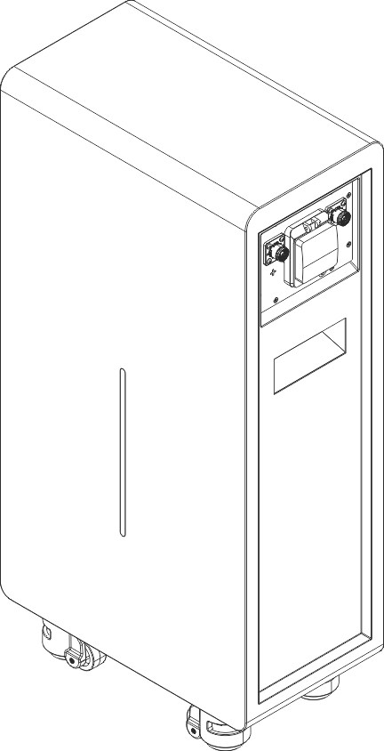

# Gobel PowerCarol 16 Product Introduction

PowerCarol 16 is a 51.2V 314Ah (approx. 16kWh) LiFePO4 low-voltage energy storage battery from Gobel Power. It uses high-performance 314Ah LiFePO4 battery cells in a floor-standing structure with casters on the bottom and handles on the sides. With IP65 ingress protection, it can be installed both indoors and outdoors. Equipped with a high-performance battery management system (BMS) that provides comprehensive monitoring and protection of the battery, it is suitable for household and small commercial & industrial energy storage scenarios.

## Product Features

- **High-capacity energy storage**: Rated capacity of 314Ah (approx. 16kWh), meeting household and small commercial & industrial energy storage needs
- **Safe and reliable**: LiFePO4 battery cells feature stable chemistry and excellent thermal stability
- **Intelligent BMS management**: Real-time monitoring of battery voltage, current, temperature, SOC (state of charge) and other parameters, with multiple protections against overcharge, over-discharge, over-temperature, short circuit, and more
- **Flexible expansion**: Supports up to 63 batteries in parallel for easy capacity expansion; parallel addresses are automatically assigned by the system (auto addressing), so no manual DIP switch setting is required
- **Suitable for indoor and outdoor use**: IP65 ingress protection with floor mounting, installable both indoors and outdoors
- **Easy to move**: Casters on the bottom and handles on the sides allow a single person to move the unit over short distances
- **Online monitoring**: Built-in WiFi interface, compatible with the Gobel VRM online monitoring platform, and supports integration with platforms such as Home Assistant and ioBroker
- **Mobile APP management**: One-click configuration and upgrades via the Gobel Console APP
- **Standard interfaces**: Provides multiple communication interfaces including RS485A/CAN (inverter), RS232 (computer/mobile phone), and RS485B/RS485C (parallel), compatible with mainstream inverters

## Specifications Overview

| Item | Specification |
| :--- | :--- |
| Brand Name | Gobel PowerCarol 16 |
| Product Model | GP-WP1-16K-PC200B |
| Brand | Gobel Power |
| Product Type | 51.2V 314Ah LiFePO4 low-voltage energy storage battery |
| Battery Cell Type | LiFePO4 (LiFePO₄) |
| Rated Capacity | 314Ah [1] |
| Parallel Expansion | Up to 63 units in parallel [2]; series connection is strictly prohibited |
| Nominal Voltage | 51.2V |
| Operating Voltage | 44.8V ~ 58.4V |
| Nominal Energy | 16kWh |
| Usable Energy | 16kWh [1] |
| Maximum Output Power | 7.68kW |
| Charge Current [3] | Max. continuous 150A; peak 200A (25 seconds) |
| Discharge Current [3] | Max. continuous 150A; peak 200A (25 seconds) |
| Active Balancing | Yes |
| Maximum Depth of Discharge | 100% DOD |
| Dimensions (W×H×D) | 477 × 959 × 270 mm |
| Weight | Approx. 125kg |
| Display | LED light bar (SOC, alarms) |
| Ingress Protection | IP65 |
| Operating Temperature | Charging: 0°C ~ 55°C; Discharging: -20°C ~ 55°C |
| Storage Temperature | 0°C ~ 35°C |
| Relative Humidity | 95% (non-condensing) |
| Altitude | ≤3000m |
| Cycle Life | ≥8000 cycles (25°C±2°C, 70% EOL) |
| Electrical Isolation Protection | Built-in circuit breaker |
| Installation Method | Floor mounting (with casters and handles) |
| Communication Interfaces | CAN, RS485, RS232, WiFi |
| Energy Throughput | 50MWh [4] |

[1] Test conditions: 25°C±2°C, beginning of life (BOL), 0.5C charge / 0.5C discharge, 100% DOD.
[2] Battery modules automatically form a network after power-up; no DIP switches required.
[3] Current is affected by temperature and SOC.
[4] Energy throughput refers to the total cumulative charge and discharge energy over the battery's entire service life.

## Applicable Scenarios

- Home photovoltaic (PV) energy storage systems
- Small commercial & industrial energy storage systems
- Backup power (UPS) systems
- Off-grid energy storage systems
- Outdoor energy storage systems (IP65 protection)
