# Gobel PowerFable 16 Installation Manual (PCBMS Version)

This manual applies to the Gobel Power PowerFable 16 series **PCBMS Version** (model GP-SR1-16K-PC200B). For the **JKBMS Version** (Gobel PowerFable 16 JKBMS Version, model GP-SR1-16K-JK200), please use its corresponding installation manual.

## 1. Product Introduction

This product is the Gobel Power PowerFable 16 (model GP-SR1-16K-PC200B) 51.2V 314Ah lithium iron phosphate (LiFePO₄) low-voltage energy storage battery. It uses high-performance 314Ah LiFePO4 cells, features a standard 6U rack-mountable enclosure with casters at the bottom, and is equipped with a high-performance battery management system (BMS) that provides comprehensive monitoring and protection of the battery.

### 1.1 Product Overview

| Item | Specification |
| :--- | :--- |
| Product Name | Gobel PowerFable 16 (PCBMS Version) |
| Product Model | GP-SR1-16K-PC200B |
| Brand | Gobel Power |
| Product Type | 51.2V 314Ah LiFePO4 low-voltage energy storage battery |
| Rated Voltage | 51.2V |
| Rated Capacity | 314Ah (approx. 16kWh) |
| Ingress Protection Rating | IP21 |
| Installation Method | Rack mounting / stacked installation (≤3 units) / floor mounting (optional wall fixing) |
| Dimensions | 482.6 × 241.3 × 773mm (W × H × D, see [Product Dimensions Diagram](#Product-Dimensions)) |
| Weight | 120kg |

### 1.2 Product Features

- **High-capacity energy storage**: Rated capacity of 314Ah (approx. 16kWh), meeting the energy storage needs of homes and small commercial/industrial applications
- **Safe and reliable**: LiFePO4 cells offer chemically stable, thermally excellent performance
- **Intelligent BMS management**: Real-time monitoring of battery voltage, current, temperature, SOC (state of charge) and other parameters, with multiple protections against overcharge, over-discharge, over-temperature, short circuit and more
- **Flexible expansion**: Supports paralleling of up to 63 batteries for easy capacity expansion; DIP switches support automatic address assignment (auto addressing), eliminating manual dip-switch setting unit by unit
- **Multiple installation methods**: 6U standard rack-mount design with casters, supporting rack mounting, stacked installation (up to 3 units) and floor mounting
- **Online monitoring**: Built-in WiFi interface, compatible with the Gobel VRM online monitoring platform, and supports integration with Home Assistant, ioBroker and other platforms
- **Mobile APP management**: Use the Gobel Console APP to configure and upgrade the battery with one tap
- **Standard interfaces**: Provides RS485A/CAN (inverter), RS232 (computer/mobile phone), RS485B/RS485C (paralleling) and other communication interfaces, compatible with mainstream inverters

### 1.3 Application Scenarios

- Residential PV energy storage systems
- Small commercial and industrial energy storage systems
- Backup power (UPS) systems
- Off-grid energy storage systems

### 1.4 Product Appearance and Interfaces

The figure below illustrates the interfaces, indicators and operating components on the battery panel (the numbers in the figure correspond to the table below):

| No. | Name | Description |
| :---: | :---: | :--- |
| 1 | Positive terminal | M8 threaded holes, one pair; each terminal carries a maximum current of 200A |
| 2 | Negative terminal | M8 threaded holes, one pair; each terminal carries a maximum current of 200A |
| 3 | Ground terminal | Grounding connection for the battery system |
| 4 | WiFi interface | Wireless communication interface for connecting to the Gobel VRM online monitoring platform, Home Assistant, ioBroker, etc. |
| 5 | Dry contact (DRY) | Dry contact output interface |
| 6 | Display and buttons | Displays battery status information; communication protocol and other parameters can be set on the screen |
| 7 | ON/OFF switch | Turns the battery BMS on or off |
| 8 | Circuit breaker | Controls making/breaking of the battery main circuit |
| 9 | Reset button (RST) | Press and hold to reset the BMS state |
| 10 | DIP switch (ADS) | Used to set the battery address for paralleling; supports automatic address assignment |
| 11 | Indicators | Includes RUN (running), ALM (alarm), ON/OFF (switch) and SOC (state of charge) indicators |
| 12 | RS485A/CAN port | Inverter communication interface |
| 13 | RS232 port | Connects to a computer or mobile phone for host monitoring and parameter setting |
| 14 | RS485B/RS485C ports | Communication interfaces for battery paralleling |

For pin definitions of each communication interface, see the [Product Communication Pin Definitions](#Communication-Pin-Definitions) section in the [Appendix](#Appendix).

## 2. Safety Instructions

Before installing, using and maintaining this product, carefully read and understand the following safety instructions. Failure to comply may result in personal injury, equipment damage or property loss. Do not cover, alter or remove the warning labels and specification nameplate on the product.

### 2.1 Personnel and Protection Requirements

:::note Personnel Requirements
Installation and maintenance operations must be performed by qualified personnel with electrical knowledge. Persons unfamiliar with electrical equipment must not install the product on their own.
:::

:::warning Personal Protection
- Use insulated tools and wear insulated gloves during operation; remove watches, rings and other metal accessories
- Do not place tools or metal parts on the battery, to prevent terminals from contacting exposed wires or metal objects
- Adjacent live parts should be covered or shielded
- Components may become extremely hot in the event of equipment failure; do not touch them to avoid burns
:::

### 2.2 Safety Precautions

:::danger Electric Shock Hazard
This product is an energy storage device; improper operation may cause severe electric shock accidents. Before performing any electrical connection or maintenance, be sure to open the battery circuit breaker and turn off the BMS via the ON/OFF switch.
:::

:::caution Battery Safety
- Never short-circuit the positive and negative terminals of the battery; a short circuit produces extremely high current and may cause fire or explosion
- Verify that the battery polarity connections are correct before operation; reversed connection will damage the equipment
- Do not use open flames or spark-generating equipment near the battery
- If the battery enclosure is deformed, leaking or abnormally hot, stop using it immediately and contact technical support
:::

:::caution Electrolyte Handling
The electrolyte is harmful to skin and eyes and may be toxic; do not touch it. If electrolyte accidentally contacts eyes or skin, rinse immediately and continuously with clean water for at least 10 minutes and seek medical attention promptly.
:::

:::danger No Unauthorized Disassembly
No one other than manufacturer-authorized personnel may open, service or disassemble the battery. There are no user-serviceable parts inside; unauthorized disassembly or modification will void the warranty and may cause safety accidents. It is recommended to place warning signs or fences near the product to prevent accidental operation.
:::

:::caution Disposal and Recycling
- Batteries that are damaged, swollen or leaking must be taken out of service immediately and stored in a dry, cool, moisture-proof environment away from light; do not repair or disassemble them yourself — contact your installer, dealer or a professional recycling organization
- Waste batteries must not be discarded as household waste; dispose of them at designated recycling points in accordance with local regulations, and remove any privacy-related information from the product before disposal
:::

:::warning Fire-Fighting Requirements
In the event of a battery fire, only dry-powder fire extinguishers may be used; liquid fire extinguishers are strictly prohibited. Keep the battery away from high-temperature heat sources such as open flames and heaters.
:::

:::caution Handling Safety
This product weighs 120kg; carrying it by a single person by force is prohibited. Handling and moving must be performed with appropriate handling equipment and by multiple people working together. The product is heavy on top and light on the bottom; never lay it on its side or upside down, and take care to prevent the equipment from tipping over during movement, which could cause personal injury. For handling methods, see the [Transportation and Handling](#Transportation-Handling) section.
:::

## 3. Transportation and Handling

### 3.1 Transportation Requirements

- During transportation, protect the product from severe vibration, shock and crushing; avoid direct sunlight, rain and moisture, and take rain-proof, moisture-proof and sun-proof measures
- Smoking is strictly prohibited in transportation, loading and unloading areas; without permission, freight personnel must not open the battery packaging on their own
- Lithium-ion batteries are Class 9 dangerous goods (UN3480); cross-border sea, land and air transport must comply with the applicable dangerous goods transport regulations, and dangerous goods labels must be affixed as required
- If the battery emits an odor, leaks, smokes, catches fire or shows any other abnormality before transportation, transportation is strictly prohibited
- Transportation operations must be performed by trained professionals; handlers must wear protective gloves and safety shoes
- Do not remove the transportation packaging before the product arrives at the installation site

### 3.2 Handling Methods

#### 3.2.1 Manual Handling

- The product weighs 120kg; carrying it by a single person by force is prohibited. Before handling, confirm that all personnel are in good physical condition, wear anti-slip gloves, safety shoes and other protective gear, and watch out for sharp metal panels and heavy objects
- Clear the handling route and confirm the floor is safe before moving; slow down when passing ramps, narrow spaces and stairs, and assign dedicated personnel to assist
- The product is heavy on top and light on the bottom; laying it on its side, upside down or moving it without securing it is prohibited. Take measures to prevent tipping during movement
- Only push or lift the product by its designated handles or bottom edge; never grip components installed inside the equipment
- For short-distance movement on level ground, the bottom [**casters**](#Product-Interface) may be used, with multiple people pushing together; lock the casters once the product is in position
- When carrying, stay close to the equipment, bend your knees and lift smoothly, using leg strength rather than your back; do not jerk or twist your body. When turning, move your feet instead of twisting your waist
- Move the equipment smoothly at a constant speed and lift and set it down gently, to prevent collision, dropping, scratching or damage to components and cables
- After handling, confirm that the equipment is placed stably to prevent it from tipping over and injuring people

#### 3.2.2 Using Handling Equipment

- When using forklifts or other handling equipment, operation must be performed by certified professionals in compliance with the equipment's operating requirements; unrelated personnel must stay at least 2m away from the work area, standing or riding on the forklift or its load is prohibited, and overloading is prohibited
- The rated load of the handling equipment should be more than twice the product weight (this product weighs 120kg, i.e. more than 240kg), and the fork arm length should be no less than the product depth
- Control travel speed and avoid sharp turns; before reversing, confirm the area behind is clear, and assign dedicated personnel to direct operations in narrow spaces
- Working on slopes with a gradient ≥5° is prohibited; slow down on uneven ground
- Tilting or inverting the product during handling is prohibited; if tilting is unavoidable, return it upright as soon as possible and let it stand for 2 hours before powering on

## 4. Installation

### 4.1 Pre-Installation Preparation

#### 4.1.1 Installation Environment Requirements

- **Floor/rack**: The installation floor should be level and solid with sufficient load-bearing capacity (the product weighs 120kg); when using rack mounting, the rack must be strong enough to reliably bear the total weight of the batteries installed
- **Ventilation**: The installation site should be well ventilated to avoid heat accumulation; do not block the equipment's vents or heat-dissipation structures, and keep away from equipment air outlets
- **Environmental conditions**: Dry and clean, free of corrosive gases or dust; ambient temperature 0°C ~ 50°C, relative humidity not exceeding 95% RH (non-condensing); the recommended installation altitude is no more than 3000m
- **Safety clearances**: Keep away from flammable and explosive materials and water sources; keep away from heat sources, open flames and high-temperature objects. Do not install or operate the equipment in environments containing flammable or explosive gases or fumes, and do not store flammable or explosive materials around the equipment
- **Waterproofing**: This product has an IP21 ingress protection rating and is not waterproof. It must not be installed outdoors in exposed locations; exposure to rain, water splash or snow accumulation is strictly prohibited. Do not install it in locations that may be flooded, and keep it away from liquids and areas prone to condensation or water seepage
- **Corrosive environments**: Avoid magnetic dust, volatile or corrosive gases, organic solvents, conductive metal dust and salt-spray environments
- **Electromagnetic and vibration**: Avoid locations with strong vibration, noise and electromagnetic interference
- **Others**: Do not install the equipment on moving carriers such as ships, trains or automobiles; the installation location should be away from children and daily living and working areas

To ensure heat dissipation and space for maintenance operations, maintain sufficient clearance between the battery and walls or other equipment:

- Distance from both sides of the battery to walls ≥ 100mm
- Distance from the top of the battery to obstacles above ≥ 300mm
- Reserve at least 800mm of operating space in front of the battery

:::caution
Before installation and power-on, clear dust and iron filings from the installation area; before installation, confirm that the site (or rack) has sufficient load-bearing capacity and take anti-static measures; do not install the equipment in enclosed, poorly ventilated locations without fire-fighting facilities, or in locations inaccessible to fire fighters.
:::

#### 4.1.2 Tool and Torque Requirements

Prepare the following tools and instruments before installation:

| Tool/Instrument | Purpose | Image |
| :--- | :--- | :---: |
| Socket wrench/torque wrench | Tightening the M8 positive and negative power terminals |   |
| Adjustable wrench | Tightening expansion bolt nuts |  |
| Phillips screwdriver | Installing the left/right rack ears and wall fixing brackets |  |
| Multimeter | Measuring terminal voltage | 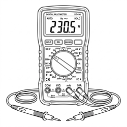 |
| Electric drill | Drilling holes in the wall for floor mounting | 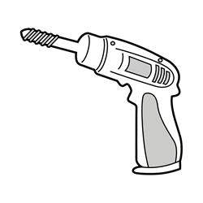 |
| Hammer | Driving expansion bolts into the wall | 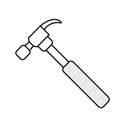 |
| Tape measure | Measuring installation hole distances |  |
| Marker pen | Marking drilling positions |  |
| Spirit level | Confirming the equipment is installed level | 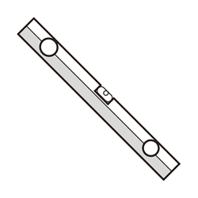 |
| RJ45 crimping tool | Making custom inverter communication/parallel network cables (if pin definitions do not match) | 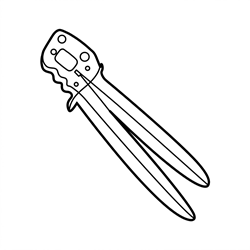 |
| Crimping tool | Making custom power cables (if needed) |  |
| Insulated gloves | Operation protection |  |
| Insulated shoes | Operation protection | 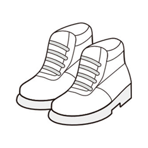 |
| Safety goggles | Protection for drilling and other work (recommended) |  |
| Windows PC | For host software protocol setting | — |
| Smartphone | For Gobel Console APP configuration | — |

When making electrical connections, tighten the screws to the torque values specified in the table below:

| Screw Size | Torque Requirement |
| :------: | :------: |
| M6 | 8N·m |
| M8 | 15N·m |
| M10 | 15 ~ 20N·m |

:::note Torque Notes
- The positive and negative power terminals of this product are M8 size; tighten them to a torque of 15N·m.
- The torque values in the table apply to standard screws under conventional assembly conditions; adjust as appropriate for special conditions such as high vibration or harsh environments.
- Use a calibrated torque wrench to avoid over-tightening or under-tightening the screws.
:::

### 4.2 Unpacking and Inspection

#### 4.2.1 Parts List

After unpacking, check the product and accessories against the table below to confirm that all parts are complete and in good condition.

| No. | Name | Specification/Qty | Image |
| :---: | :---: | :---: | :---: |
| <a id="Part01">01</a> | Gobel PowerFable 16 energy storage battery | 51.2V 314Ah, 1 unit |  |
| <a id="Part02">02</a> | Positive power cable | 50mm², 1m, M8 terminals on both ends, 1 pc | 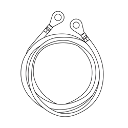 |
| <a id="Part03">03</a> | Negative power cable | 50mm², 1m, M8 terminals on both ends, 1 pc | 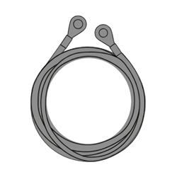 |
| <a id="Part04">04</a> | Communication network cable | RJ45 on both ends, symmetric wiring, 1 pc (can be used as a parallel cable or inverter communication cable) |  |
| <a id="Part05">05</a> | RS232-USB communication cable | 1 pc (connects to the computer host software) | 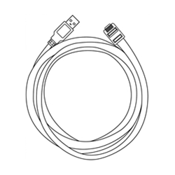 |
| <a id="Part06">06</a> | USB-Type C data cable | 1 pc (connects to a mobile phone) | 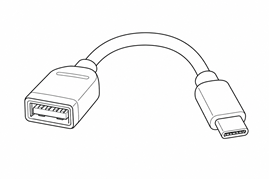 |
| <a id="Part07">07</a> | Rack mounting ears (left/right) | 1 left ear and 1 right ear (for rack fixing and wall fixing) | 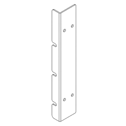 |
| <a id="Part08">08</a> | Wall fixing bracket | 2 pcs (for wall fixing in floor mounting) | 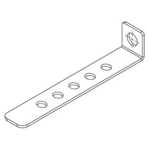 |
| <a id="Part09">09</a> | Expansion bolt | 2 pcs | 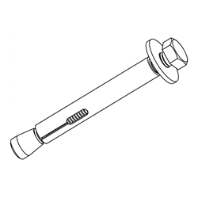 |

#### 4.2.2 Unpacking Inspection Procedure

After receiving the product, perform the unpacking inspection as follows:

1. Remove the energy storage battery ([01](#Part01)) from its packaging and check whether the outer packaging and product appearance are intact.

2. Check the product and accessories against the [Parts List](#Parts-List) for missing or damaged items.

3. Power on via the [**ON/OFF switch**](#Product-Interface) on the panel, and check whether the [**display**](#Product-Interface) and [**indicators**](#Product-Interface) show normal readings.

4. Set the [**circuit breaker**](#Product-Interface) to the ON position, and use a multimeter to measure the voltage across the battery [**positive terminal**](#Product-Interface) and [**negative terminal**](#Product-Interface); the normal voltage should be between 40V ~ 58V.

5. If all checks are normal, proceed to the next installation step.

:::caution
If the product appearance is damaged, accessories are missing or the voltage is abnormal, do not continue installation; contact Gobel Power technical support promptly.
:::

:::note Unpacking Tips
- Do not remove the transportation packaging in advance before the product arrives at the installation site; handle with care when unpacking to avoid scratching the equipment
- Before unpacking, check whether the outer packaging is damaged and whether the shock indicator has been triggered; if triggered, transportation damage cannot be ruled out
- Clean all parts before installation; prevent collision and scratching during handling and storage, and take moisture-proof and rust-proof measures
- The system should be installed and commissioned within 6 months of delivery; long-term idle storage accelerates battery capacity degradation
:::

### 4.3 Installation Procedures

This product features a 6U standard rack-mount structure with casters at the bottom, and supports three installation methods: **rack mounting**, **stacked installation** and **floor mounting** (optional wall fixing). Choose one method according to the actual site conditions.

1. Open the [**circuit breaker**](#Product-Interface) of the energy storage battery ([01](#Part01)) and power it off via the [**ON/OFF switch**](#Product-Interface).

2. Select one of the installation methods below according to the site conditions.

#### 4.3.1 Rack Mounting

1. Install the **left/right rack ears ([07](#Part07))** onto the mounting holes on both sides of the battery with screws, taking care to distinguish the orientation of the left and right ears.

   

2. With multiple people working together (or using handling equipment), push the battery into the predetermined slot of a standard 19-inch rack.

3. Pass screws through the mounting holes in the left and right ears to fasten the battery securely to the front and rear posts of the rack.

:::caution Rack Load-Bearing Requirements
The rack holding the battery must be strong enough to reliably bear the battery weight (a single battery weighs 120kg). When multiple batteries are installed in the same rack, calculate the load-bearing capacity of the rack and floor slab based on the total weight of the batteries in the rack, and ensure the rack itself is stable and does not wobble.
:::

#### 4.3.2 Stacked Installation

1. Place the bottom battery on a flat, solid, level floor.

2. Stack the remaining batteries one by one on top of the bottom battery, keeping them aligned vertically and placed steadily.

:::caution Stacking Limit
The maximum number of stacked units must not exceed 3. After stacking, confirm that each battery is stable and does not wobble; if necessary, refer to the [Floor Mounting](#Floor-Installation) section to secure the equipment to the wall to prevent tipping.
:::

#### 4.3.3 Floor Mounting

1. Use the bottom [**casters**](#Product-Interface) to move the battery to the predetermined installation position, and lock the casters to prevent movement.

2. (Optional) To secure the battery to the wall, follow these steps:

   1. Install the **left/right rack ears ([07](#Part07))** onto both sides of the battery.

   2. Install the **wall fixing brackets ([08](#Part08))** onto the left and right ears.

      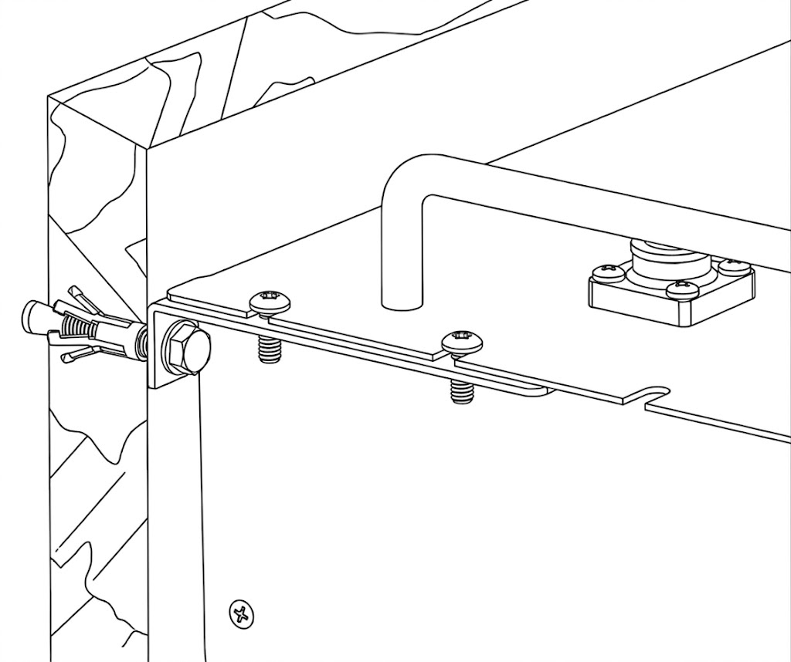

   3. Use the marker pen to mark the wall through the holes in the wall fixing bracket, drill holes at the marked positions with the electric drill, insert the **expansion bolts ([09](#Part09))** into the drilled holes, and finally tighten the nuts with a wrench to secure the brackets to the wall.

      

:::caution
Pay attention to floor evenness when moving the battery and avoid excessive tilt angles. The battery weighs 120kg; be sure to move it safely to prevent it from tipping over and injuring people. Before drilling into the wall, confirm there are no water, electricity or gas pipes inside; when drilling, prevent dust from entering the battery, and clean up the debris after drilling.
:::

:::caution Installation Discipline
- Installation must strictly follow this manual and the design requirements; unauthorized changes to installation steps or technical parameters are prohibited
- During installation and wiring, keep all switches in the OFF position; working on live equipment is strictly prohibited
- All screws and fasteners must be tightened securely; when drilling, prevent dust from entering the battery, avoid pipes inside walls or underground, and clean up the debris after drilling
:::

### 4.4 Post-Installation Inspection

After installation is complete, confirm the following items are normal:

- The battery exterior is intact, with no deformation, dents or scratches
- The equipment is placed securely: for rack mounting, the left/right ear screws are tightened; for stacked installation, all units are aligned and stable; for floor mounting, the casters are locked (and the wall fixing brackets are secure if wall-fixed)
- Surrounding passages are clear and free of flammable and explosive materials
- Warning labels and the specification nameplate are complete and legible
- On-site fire-fighting equipment is in place and compliant

## 5. Electrical Connection

### 5.1 Safety Precautions

:::warning Wiring Requirements
This product supports parallel connection only; series connection is strictly prohibited. A maximum of 63 units can be connected in parallel. Series connection may cause equipment damage or safety hazards.
:::

:::warning Electrical Safety Precautions
- Terminals may still carry residual voltage after the battery is powered off. Before wiring, wait at least 10 minutes and use a multimeter to confirm that no voltage is present
- Never connect the battery directly to the AC grid or to PV (photovoltaic) DC lines; the battery may only be connected to matching power conversion equipment such as an inverter
- Do not use faulty power conversion equipment (such as an inverter) or one that is not matched to the battery; before connection, confirm that the battery system parameters are fully compatible with the connected equipment
- Do not perform electrical connections during sandstorms or when the ambient relative humidity exceeds 95%
- Wiring must be performed by qualified personnel with electrical knowledge, wearing protective equipment as required in Chapter 2
:::

### 5.2 Connection Preparation

#### 5.2.1 Cable Preparation

Before connection, confirm that the following cables and parts are ready:

- **Positive power cable ([02](#Part02))**: 50mm², 1m, M8 terminals on both ends
- **Negative power cable ([03](#Part03))**: 50mm², 1m, M8 terminals on both ends
- **Communication network cable ([04](#Part04))**: RJ45 on both ends, symmetrically wired; can be used as a parallel communication cable or an inverter communication cable
- **RS232-USB communication cable ([05](#Part05))**: used to connect a Windows PC for host software monitoring and protocol configuration
- **USB Type-C data cable ([06](#Part06))**: used to connect a mobile phone for configuration via the Gobel Console APP

Also confirm that the inverter and other equipment have been installed in place, and shut down and de-energize the inverter. Refer to the battery connection sections of the inverter manual as well.

#### 5.2.2 Battery DIP Switch Settings

If there is only one battery, it is the host; set its [**DIP switches**](#Product-Interface) to ON, OFF, OFF, OFF, OFF, OFF. If multiple batteries are connected in parallel, select one as the host and the others as slaves; for the DIP switch settings of each address, refer to the [DIP Switch Settings Table](#DIP-Switch-Settings) in the [Appendix](#Appendix). Alternatively, all DIP switches on all batteries may be set to OFF, allowing the system to assign addresses automatically (auto dial) without manual configuration unit by unit.

### 5.3 Cable Connection

#### 5.3.1 Grounding Connection

- Use a grounding cable to reliably connect the battery [**grounding terminal**](#Product-Interface) to earth. The grounding resistance shall be less than 1Ω. Follow local electrical codes and the inverter's requirements for the grounding method
- Ensure that an overvoltage protection device is installed at the site where the system is located

#### 5.3.2 Power Cable Connection

Connect one end of the **positive power cable ([02](#Part02))** to the battery **positive terminal** (M8, either free terminal of the pair), and the other end to the inverter's positive battery input. Connect one end of the **negative power cable ([03](#Part03))** to the battery **negative terminal** (M8, either free terminal of the pair), and the other end to the inverter's negative battery input. Tighten the terminal screws to the specified torque in [Tools and Torque Requirements](#Tool-Requirements) (15N·m for M8).

:::caution
Make sure the positive and negative terminals are correctly matched; reverse connection will cause severe equipment damage. Each terminal carries a maximum current of 200A; verify that the current-carrying capacity of the terminals and cables meets the actual system current requirements.
:::

:::note Cable Routing
Do not pull or strain the cables. Leave sufficient bending space for the cables and use appropriate fasteners to reduce cable stress.
:::

#### 5.3.3 Communication Cable Connection

Connect one end of the **communication network cable ([04](#Part04))** to the [**RS485A/CAN port**](#Product-Interface) of the host battery, and the other end to the inverter's BMS communication interface (whether RS485 or CAN protocol is used depends on the inverter manual and must match the battery's protocol settings). For communication wiring when multiple batteries are connected in parallel, refer to the [Multi-Pack Parallel Connection](#Multi-Pack-Parallel-Connection) section.

:::caution
Verify that the pin definitions of the inverter's BMS communication interface match those of the battery's RS485A/CAN port. The communication network cable supplied with this product is symmetrically wired on both ends. If the pin definitions of the inverter and the battery differ, you need to make a communication cable with the corresponding wiring sequence using an RJ45 crimping tool, or purchase an adapter cable from the inverter manufacturer (e.g., for Victron inverters).
:::

For the pin definitions of each communication interface, refer to the [Product Communication Pin Definitions](#Communication-Pin-Definitions) section in the [Appendix](#Appendix).

### 5.4 Multi-Pack Parallel Connection

:::caution
Never connect batteries of different models or specifications in parallel. This product supports a maximum of 63 units in parallel. When connecting multiple batteries, route the cables along the designated paths; do not change the wiring layout arbitrarily.
:::

#### 5.4.1 Parallel Power Connection

If multiple batteries are used in parallel, they must first be paralleled and then connected to the inverter. Each battery has one pair of positive terminals and one pair of negative terminals (M8), and each terminal carries a maximum current of 200A. Two cases apply:

- **Case 1**: If the inverter input/output current is less than 200A, use power cables to interconnect the positive and negative terminals of adjacent batteries, and then connect the batteries at both ends to the inverter.

- **Case 2**: If the inverter input/output current is greater than 200A, connect the positive and negative terminals of each battery to busbars, and then connect the busbars to the inverter.

:::note
For connection diagrams, refer to the [Battery-Inverter Connection Diagrams](#Connection-Diagrams) section in [Appendix V](#Connection-Diagrams).
:::

#### 5.4.2 Parallel Communication Connection

When multiple batteries are connected in parallel, use parallel communication cables to daisy-chain the RS485B and RS485C ports of the batteries: connect the RS485B of the first battery to the RS485C of the second battery, the RS485B of the second battery to the RS485C of the third battery, and so on.

:::note
Before wiring the parallel communication cables, complete the [DIP switch settings](#DIP-Switch-Settings) for the host and slaves; alternatively, all DIP switches on all batteries may be set to OFF, allowing the system to assign addresses automatically (auto dial).
:::

:::warning Mixing with 4-Bit DIP Switch Versions
If this product (6-bit DIP switches) is mixed in parallel with products using 4-bit DIP switches:

- Automatic address assignment (auto dial) is not allowed; all products with 6-bit DIP switches must be set manually
- The host must be a product with 6-bit DIP switches
- Slaves at addresses 2 to 15 may be products with either 4-bit or 6-bit DIP switches
- Slaves at address 16 and above must be products with 6-bit DIP switches
:::

### 5.5 Post-Connection Inspection

After all cables are connected, check each item in turn:

- After completing each connection, verify that it is correct and secure, with no looseness or poor contact; all bolts, screws, and other fasteners are fully tightened
- Positive and negative power cables have correct polarity, and the terminals are secure and reliable
- Prevent terminals from contacting exposed wires or metal objects; adjacent live parts should be covered
- Remove foreign objects around the equipment, especially metal debris, to prevent short circuits

## 6. Operation

### 6.1 Pre-Power-On Checks

:::caution Pre-Power-On Checks
- All items of the [Post-Connection Inspection](#Post-Connection-Inspection) have been confirmed correct
- The work area is cleared; unauthorized personnel and animals are kept away from the equipment
:::

### 6.2 Inverter Communication Protocol Settings

When multiple batteries are connected in parallel, only the **host** battery's communication protocol needs to be set; slaves require no configuration. Use any one of the following three methods:

1. **Set on the screen**: Enter the settings menu via the host battery's [**display and buttons**](#Product-Interface) and select the communication protocol that matches the inverter.

2. **Set via PC host software**: Use the **RS232-USB communication cable ([05](#Part05))** to connect a Windows PC to the host battery, and select the communication protocol that matches the inverter in the host software on the PC.

   :::note
   For detailed host software operation, refer to the "Host Software Operation Procedure" in the [Reference Documents](#Reference-Documents) section.
   :::

3. **Set via mobile APP**: Use the **USB Type-C data cable ([06](#Part06))** to connect a mobile phone to the host battery, and select the communication protocol that matches the inverter in the Gobel Console APP.

:::note WiFi Configuration
For the battery's WiFi configuration and access to the online monitoring platform, refer to the "WiFi User Manual".
:::

:::note Inverter Compatibility
Before setting the communication protocol, confirm that the brand and model of the inverter are compatible with the battery. For the list of verified compatible inverters, refer to the "Inverter Compatibility List" in the [Reference Documents](#Reference-Documents) section.
:::

### 6.3 Power-On

Power on in the following sequence: **BMS power-on (ON/OFF switch) → Wait → Circuit breaker ON → Inverter power-on**.

1. Check the power and communication connections to ensure all cables are firmly connected with no looseness.

2. Press the [**ON/OFF switch**](#Product-Interface) on all batteries to power on (BMS ON), and wait for the battery system to complete self-check, with the [**display**](#Product-Interface) showing normal status and no alarms.

3. Switch the [**circuit breaker**](#Product-Interface) of all batteries to the ON position.

4. Turn on the inverter's power switch.

5. Set the battery type to lithium battery in the inverter.

6. Check the battery information displayed in the inverter to confirm that data has been correctly retrieved from the battery BMS (e.g., battery voltage, battery SOC, temperature).

7. If the inverter reads the data correctly, the installation is complete and charge/discharge testing can be performed.

:::warning Power-On Sequence
Do not turn on the inverter before or simultaneously with the circuit breaker, and do not close the circuit breaker without the waiting step; otherwise, a large inrush current may occur, causing equipment damage or triggering protection.
:::

:::tip
If the inverter cannot read battery data after power-on, check whether the communication cables are properly connected and whether the communication protocol is set correctly. For more common fault handling, see [Appendix I](#Troubleshooting).
:::

### 6.4 Power-Off

Power off in the following sequence: **Inverter OFF → Wait → Circuit breaker OFF → BMS power-off (ON/OFF switch)**.

1. Shut down the inverter and its loads, and wait for the inverter to stop working completely.

2. Switch the [**circuit breaker**](#Product-Interface) of all batteries to the OFF position.

3. Press the [**ON/OFF switch**](#Product-Interface) to turn off the BMS of each battery.

:::caution
Terminals may still carry residual voltage after power-off; do not touch the terminals immediately. Before performing maintenance, follow the [Maintenance Safety Precautions](#Maintenance-Safety).
:::

## 7. Product Monitoring

### 7.1 Panel Status Indicators

The battery's operating status can be viewed via the panel indicators and display:

| Component | Description |
| :--- | :--- |
| Switch indicator (ON/OFF) | Indicates the battery switch status |
| Run indicator (RUN) | Indicates the battery operating status |
| Alarm indicator (ALM) | Lights up when the battery has a fault or alarm |
| SOC indicators | Indicate the battery state of charge |
| Display and buttons | Display battery status information; parameters can be viewed and set on the screen |

When the alarm indicator (ALM) lights up, promptly investigate the cause of the fault. If it cannot be resolved, contact Gobel Power technical support. For common fault handling, see [Appendix I](#Troubleshooting).

### 7.2 Host Software and Remote Monitoring

This product supports multiple monitoring methods:

1. **PC host software monitoring**: Use the **RS232-USB communication cable ([05](#Part05))** to connect a Windows PC to the battery, and run the battery host software on the PC to view operating status such as battery voltage, current, temperature, and SOC.

2. **Mobile APP monitoring**: Use the **USB Type-C data cable ([06](#Part06))** to connect a mobile phone to the battery, view the battery status via the Gobel Console APP, and perform one-touch configuration and upgrades.

3. **WiFi online monitoring**: After the battery's built-in [**WiFi interface**](#Product-Interface) connects to the network, it is compatible with the Gobel VRM online monitoring platform and supports integration with platforms such as Home Assistant and ioBroker for remote monitoring. For WiFi configuration, refer to the "WiFi User Manual".

:::note
For detailed host software operation, refer to the "Host Software Operation Procedure" in the [Reference Documents](#Reference-Documents) section.
:::

## 8. Maintenance and Storage

### 8.1 Maintenance Safety Precautions

- Before maintenance, the battery must be completely de-energized (disconnect both the grid and the battery side), following the principle of "de-energize → prevent unintended re-closing → verify no voltage → grounding and short-circuit protection → cover adjacent live parts"
- Hang a "Do Not Close" warning tag on the switch position to prevent unintended power restoration
- Before maintenance, disconnect all battery terminals and circuit connectors, and install protective caps on the terminals; use insulated tools and never wear jewelry, watches, or other metal accessories

### 8.2 Routine Maintenance Requirements

- When replacing parts, always use spare parts of the same type and specification
- Do not spray paint on any internal or external parts of the battery, and do not clean the battery with cleaning solvents
- If any abnormality is found, contact the supplier within 24 hours
- During daily use, keep the battery SOC above 5%, and recharge within 48 hours after a full discharge to avoid over-discharge

### 8.3 Post-Maintenance Requirements

- After maintenance, clear all tools and materials and confirm that no metal foreign objects are left inside or on top of the battery
- Confirm that terminal protective caps, guards, etc., are all restored in place before re-energizing

### 8.4 Long-Term Storage

If the battery will not be used for an extended period, store and maintain it as follows:

- Fully charge the battery, then switch off the [**circuit breaker**](#Product-Interface) and the [**ON/OFF switch**](#Product-Interface) (BMS off).
- Check the battery voltage at least every 3 months. If the voltage is below 51V, recharge promptly.
- Store the battery in a dry, clean, well-ventilated indoor location, away from direct sunlight and rain, and away from high-temperature heat sources, open flames, and flammable or explosive materials
- During storage, the battery should be completely disconnected from external equipment, and all indicators should be off
- The floor of the storage area should be level and solid, and qualified fire protection facilities (e.g., dry powder extinguishers, fire sand) should be provided
- Handle with care during transport and storage; dropping, collision, tipping, side placement, and tilting are prohibited

:::danger
Battery damage caused by failure to recharge in time is not covered by the warranty. Long-term storage without recharging will over-discharge the battery, causing irreversible capacity loss or even scrapping the battery.
:::

## 9. Product Specifications

| Item | Parameter |
| :--- | :--- |
| Product name | Gobel PowerFable 16 (PCBMS Version) |
| Product model | GP-SR1-16K-PC200B |
| Brand | Gobel Power |
| Product type | 51.2V 314Ah LiFePO4 low-voltage energy storage battery |
| Rated voltage | 51.2V |
| Rated capacity | 314Ah (approx. 16kWh) |
| Normal terminal voltage range | 40V ~ 58V |
| Output terminals | One pair of positive terminals and one pair of negative terminals, M8 threaded holes, 200A max per terminal |
| Communication interfaces | RS485A/CAN (inverter), RS485B/RS485C (parallel), RS232 (PC/mobile phone), WiFi (online monitoring), dry contact (DRY) |
| Connection mode | Parallel connection of multiple units only (up to 63 units); series connection strictly prohibited |
| Installation | Rack mounting / stacking (≤3 layers) / floor mounting (optional wall fixing), with casters on the bottom |
| Ingress protection rating | IP21 |
| Operating ambient temperature | 0°C ~ 50°C |
| Operating ambient humidity | ≤95% RH (non-condensing) |
| Recommended installation altitude | ≤3000m |
| Dimensions (W×H×D) | 482.6 × 241.3 × 773mm |
| Weight | 120kg |

### 9.1 Product Dimensions Diagram

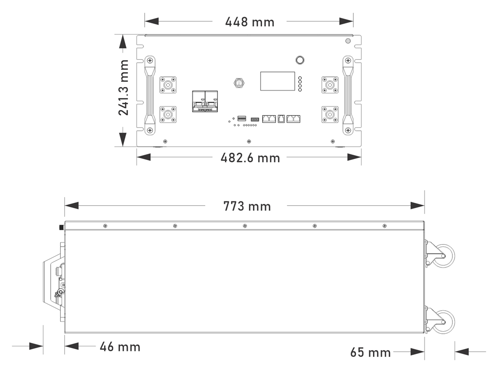

## Appendix

### Appendix I: Common Faults and Troubleshooting

| Symptom | Possible Cause | Remedy |
| :--- | :--- | :--- |
| Inverter cannot read battery data | Loose or open communication cable connection; mismatched pin definitions on both ends; incorrect communication protocol settings | Check the communication cable connections; verify the pin definitions on both ends (see [Appendix III](#Communication-Pin-Definitions)); reconfigure the communication protocol (see [Inverter Communication Protocol Settings](#Protocol-Settings)) |
| Abnormal terminal voltage measured at unboxing (below 40V or above 58V) | State of charge too low or product abnormality | Do not proceed with installation or use; contact Gobel Power technical support |
| Alarm indicator (ALM) lights up | Battery fault or alarm | Stop use and investigate the cause; contact Gobel Power technical support if necessary |
| Battery enclosure deformed, leaking, or abnormally hot | Internal battery abnormality | Stop use immediately and contact technical support; see [Appendix II](#Emergency-Handling) for handling procedures |
| WiFi or mobile APP cannot connect to the battery | WiFi not configured or misconfigured | Reconfigure as described in the "WiFi User Manual" |
| Voltage below 51V after long-term storage | Self-discharge during storage | Recharge promptly before returning to service (see [Long-Term Storage](#Storage-Precautions)) |

### Appendix II: Emergency Handling

:::danger
In emergencies such as electric shock, fire, or electrolyte leakage, ensure personal safety first, evacuate personnel promptly, and call the appropriate emergency numbers. Do not operate damaged equipment without professional inspection and qualified testing.
:::

#### Electric Shock

- Cut off the power immediately, provided your own safety is ensured
- Use an insulated object to separate the victim from the power source, administer first aid including cardiopulmonary resuscitation (CPR), and immediately call the emergency number
- Preserve the accident scene for investigation and evidence collection
- After the accident, the system must be inspected by professionals and may only be returned to service after repair or replacement and passing testing

#### Fire or Explosion Risk

- Evacuate the area immediately and call the fire department; stay away from smoke produced by burning. Only dry powder extinguishers may be used to fight the fire; liquid extinguishers are strictly prohibited
- Cut off the upstream power supply, provided your own safety is ensured, and wear respiratory protective equipment
- Isolate the accident area where it is safe to do so, preventing unauthorized personnel from entering; post-incident handling must be completed by professionals

#### Electrolyte Leakage and Chemical Hazards

- In the event of electrolyte leakage, evacuate personnel immediately and notify the relevant personnel; the leaked material must be safely collected and disposed of by professionals
- Burning or damaged batteries may release toxic gases; evacuate to a safe area immediately. If personnel are exposed or injured, seek medical attention immediately
- When handling leaked material, wear respiratory protective equipment, protective clothing, and other safety gear

#### Mechanical Injury

- If the equipment tips over, the battery falls, or parts come loose, cut off the power immediately and stop the system
- If anyone is injured, administer first aid such as stopping bleeding and bandaging, and immediately call the emergency number
- If abnormalities such as odor, damage, smoking, or fire are observed, evacuate immediately and raise the alarm; the abnormal battery should be moved by professionals to an open, safe area, left undisturbed for at least 1 hour, and its temperature monitored

#### Natural Disasters

- In the event of natural disasters such as earthquakes, typhoons, floods, or wildfires, cut off the power immediately and stop the system
- If the system is flooded or submerged, do not touch it and stay away from the waterlogged area. Flooded batteries must not be used again; contact a professional recycling agency for scrapping
- Before a wildfire approaches, a firebreak may be established around the system, and fire equipment such as extinguishers and fire sand should be prepared
- After the disaster, professionals must inspect the support structure, electrical connections, and other components; the system may only be reused after repair or replacement and passing testing

### Appendix III: Product Communication Pin Definitions

#### RS485A/CAN Port

**RS485A mode pin definitions:**

| Pin | Definition |
| :--: | :--: |
| 1 | B |
| 2 | A |
| 3 | GND |
| 4 | NC |
| 5 | NC |
| 6 | GND |
| 7 | A |
| 8 | B |

**CAN mode pin definitions:**

| Pin | Definition |
| :--: | :--: |
| 1 | NC |
| 2 | GND |
| 3 | NC |
| 4 | CAN-H |
| 5 | CAN-L |
| 6 | NC |
| 7 | NC |
| 8 | NC |

#### RS232 Port

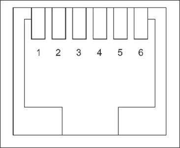

| Pin | Definition |
| :--: | :--: |
| 1 | NC |
| 2 | NC |
| 3 | TXD |
| 4 | RXD |
| 5 | GND |
| 6 | NC |

#### RS485B and RS485C Ports

| Pin | Definition |
| :--: | :--: |
| 1 | B |
| 2 | A |
| 3 | GND |
| 4 | NC |
| 5 | NC |
| 6 | GND |
| 7 | A |
| 8 | B |

### Appendix IV: DIP Switch Settings Table

The address range of this product's DIP switches (ADS) is 0 ~ 63: Address 0 (all OFF) is the automatic address assignment mode (auto dial), address 1 is the host, and addresses 2 ~ 63 are slaves.

#### 6-Bit DIP Switch Settings Table

| Address | #1 | #2 | #3 | #4 | #5 | #6 | Description |
| :--: | :--: | :--: | :--: | :--: | :--: | :--: | :--: |
| 0 | OFF | OFF | OFF | OFF | OFF | OFF | Automatic address assignment |
| 1 | ON | OFF | OFF | OFF | OFF | OFF | Host |
| 2 | OFF | ON | OFF | OFF | OFF | OFF | Slave |
| 3 | ON | ON | OFF | OFF | OFF | OFF | Slave |
| 4 | OFF | OFF | ON | OFF | OFF | OFF | Slave |
| 5 | ON | OFF | ON | OFF | OFF | OFF | Slave |
| 6 | OFF | ON | ON | OFF | OFF | OFF | Slave |
| 7 | ON | ON | ON | OFF | OFF | OFF | Slave |
| 8 | OFF | OFF | OFF | ON | OFF | OFF | Slave |
| 9 | ON | OFF | OFF | ON | OFF | OFF | Slave |
| 10 | OFF | ON | OFF | ON | OFF | OFF | Slave |
| 11 | ON | ON | OFF | ON | OFF | OFF | Slave |
| 12 | OFF | OFF | ON | ON | OFF | OFF | Slave |
| 13 | ON | OFF | ON | ON | OFF | OFF | Slave |
| 14 | OFF | ON | ON | ON | OFF | OFF | Slave |
| 15 | ON | ON | ON | ON | OFF | OFF | Slave |
| 16 | OFF | OFF | OFF | OFF | ON | OFF | Slave |
| 17 | ON | OFF | OFF | OFF | ON | OFF | Slave |
| 18 | OFF | ON | OFF | OFF | ON | OFF | Slave |
| 19 | ON | ON | OFF | OFF | ON | OFF | Slave |
| 20 | OFF | OFF | ON | OFF | ON | OFF | Slave |
| 21 | ON | OFF | ON | OFF | ON | OFF | Slave |
| 22 | OFF | ON | ON | OFF | ON | OFF | Slave |
| 23 | ON | ON | ON | OFF | ON | OFF | Slave |
| 24 | OFF | OFF | OFF | ON | ON | OFF | Slave |
| 25 | ON | OFF | OFF | ON | ON | OFF | Slave |
| 26 | OFF | ON | OFF | ON | ON | OFF | Slave |
| 27 | ON | ON | OFF | ON | ON | OFF | Slave |
| 28 | OFF | OFF | ON | ON | ON | OFF | Slave |
| 29 | ON | OFF | ON | ON | ON | OFF | Slave |
| 30 | OFF | ON | ON | ON | ON | OFF | Slave |
| 31 | ON | ON | ON | ON | ON | OFF | Slave |
| 32 | OFF | OFF | OFF | OFF | OFF | ON | Slave |
| 33 | ON | OFF | OFF | OFF | OFF | ON | Slave |
| 34 | OFF | ON | OFF | OFF | OFF | ON | Slave |
| 35 | ON | ON | OFF | OFF | OFF | ON | Slave |
| 36 | OFF | OFF | ON | OFF | OFF | ON | Slave |
| 37 | ON | OFF | ON | OFF | OFF | ON | Slave |
| 38 | OFF | ON | ON | OFF | OFF | ON | Slave |
| 39 | ON | ON | ON | OFF | OFF | ON | Slave |
| 40 | OFF | OFF | OFF | ON | OFF | ON | Slave |
| 41 | ON | OFF | OFF | ON | OFF | ON | Slave |
| 42 | OFF | ON | OFF | ON | OFF | ON | Slave |
| 43 | ON | ON | OFF | ON | OFF | ON | Slave |
| 44 | OFF | OFF | ON | ON | OFF | ON | Slave |
| 45 | ON | OFF | ON | ON | OFF | ON | Slave |
| 46 | OFF | ON | ON | ON | OFF | ON | Slave |
| 47 | ON | ON | ON | ON | OFF | ON | Slave |
| 48 | OFF | OFF | OFF | OFF | ON | ON | Slave |
| 49 | ON | OFF | OFF | OFF | ON | ON | Slave |
| 50 | OFF | ON | OFF | OFF | ON | ON | Slave |
| 51 | ON | ON | OFF | OFF | ON | ON | Slave |
| 52 | OFF | OFF | ON | OFF | ON | ON | Slave |
| 53 | ON | OFF | ON | OFF | ON | ON | Slave |
| 54 | OFF | ON | ON | OFF | ON | ON | Slave |
| 55 | ON | ON | ON | OFF | ON | ON | Slave |
| 56 | OFF | OFF | OFF | ON | ON | ON | Slave |
| 57 | ON | OFF | OFF | ON | ON | ON | Slave |
| 58 | OFF | ON | OFF | ON | ON | ON | Slave |
| 59 | ON | ON | OFF | ON | ON | ON | Slave |
| 60 | OFF | OFF | ON | ON | ON | ON | Slave |
| 61 | ON | OFF | ON | ON | ON | ON | Slave |
| 62 | OFF | ON | ON | ON | ON | ON | Slave |
| 63 | ON | ON | ON | ON | ON | ON | Slave |

### Appendix 5: Battery-to-Inverter Connection Diagrams

**Single Battery-to-Inverter Connection Diagram**

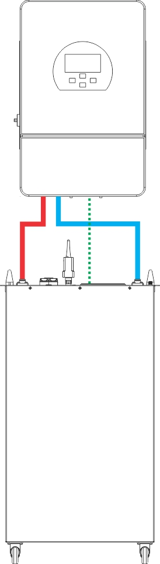

:::note
In the diagram, solid lines represent the positive and negative power cables, and dotted lines represent the communication cables.
:::

**Multiple Batteries-to-Inverter Connection Diagram**

:::note
In the diagram, solid lines represent the positive power cables, negative power cables, and busbar; dotted lines represent the inverter communication cables; and dash-dotted lines (-.-.-) represent the parallel communication cables between batteries.
:::

### Reference Documents

In addition to this manual, refer to the following companion documents as needed:

| Document Name | Description | Link |
| :--- | :--- | :--- |
| WiFi User Manual | Battery WiFi configuration and integration with online monitoring platforms such as Gobel VRM, Home Assistant, and ioBroker | WiFi User Manual link (reserved) |
| Host Computer Software Operation Guide | Installation and detailed operating instructions for the PC host software | Detailed host computer software guide link (reserved) |
| Gobel Console APP User Guide | Connection, one-touch configuration, and upgrade operations of the mobile APP | Gobel Console APP user guide link (reserved) |
| Inverter Compatibility List | List of verified compatible inverter brands and models | Inverter compatibility list link (reserved) |

## Contact Information

If you encounter a fault that cannot be resolved or need technical support, contact Gobel Power:

| Item | Information |
| :--- | :--- |
| Official Website | [www.gobelpower.com](http://www.gobelpower.com) |
| Technical Support Email | [cs@gobelpower.com](mailto:cs@gobelpower.com) |
