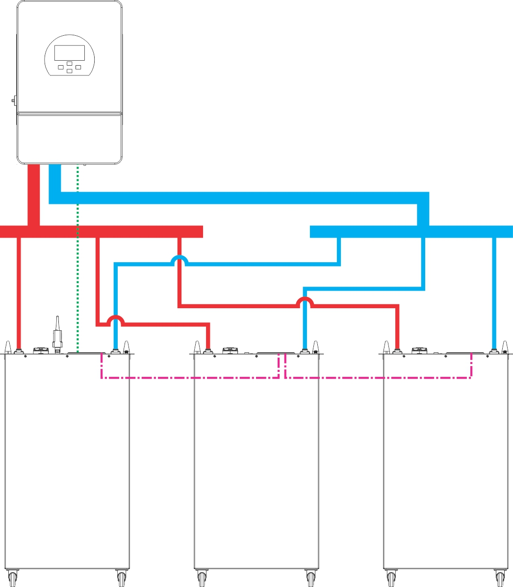

# Gobel PowerFable 16 Quick Installation Guide (PCBMS Version)

This guide applies to the Gobel Power PowerFable 16 series **PCBMS version** (model GP-SR1-16K-PC200B). It is intended for experienced installers and lists only the key steps and points. For complete installation instructions, safety precautions, and troubleshooting, refer to the *Gobel PowerFable 16 Installation Manual (PCBMS Version)*. For the JKBMS version (Gobel PowerFable 16 JKBMS Version, model GP-SR1-16K-JK200), use its corresponding documentation.

## 1. Key Specifications

| Item | Parameter |
| :--- | :--- |
| Product name | Gobel PowerFable 16 (PCBMS Version) |
| Model | GP-SR1-16K-PC200B |
| Rated voltage / capacity | 51.2V / 314Ah (approx. 16kWh) |
| Output terminals | One pair of positive terminals and one pair of negative terminals, M8 threaded holes, 200A max per terminal |
| Connection method | Parallel connection only (up to 63 units); series connection is strictly prohibited |
| Installation method | Rack mounting / stacked installation (≤3 units) / floor mounting, with casters at the bottom |
| Dimensions / weight | 482.6 × 241.3 × 773mm, 120kg |
| Operating environment | 0°C ~ 50°C, ≤95% RH (non-condensing), IP21 (not suitable for outdoor exposed installation) |

## 2. Key Panel Components

| No. | Name | Function |
| :---: | :--- | :--- |
| 1 / 2 | Positive / negative terminals | M8, one pair each, for power cable connections |
| 3 | Grounding terminal | System grounding |
| 6 | Display screen and buttons | View status, set communication protocol |
| 7 | ON/OFF switch | Turn the BMS on/off |
| 8 | Circuit breaker | Switch the battery main circuit on/off |
| 10 | DIP switches (ADS) | Parallel address setting (auto addressing supported) |
| 12 | RS485A/CAN port | Communication with the inverter |
| 13 | RS232 port | Connect to a PC host software |
| 14 | RS485B/RS485C ports | Parallel communication between batteries |

## 3. Safety Points

:::danger Electric Shock Hazard
Before any operation, be sure to switch off the battery circuit breaker and press the ON/OFF switch to turn off the BMS. Residual voltage may remain between terminals after power-off; wait at least 10 minutes and confirm with a multimeter that no voltage is present before wiring.
:::

:::caution
- Never short-circuit the positive and negative terminals, never reverse the polarity; never connect batteries in series
- This product weighs 120kg; do not carry it alone, and never place it on its side or upside down
- Use insulated tools, wear insulated gloves, and remove metal jewelry
- IP21 is not waterproof; outdoor exposed installation, rain, and water splashes are strictly prohibited
- Never disassemble the battery except by manufacturer-authorized personnel
:::

## 4. Installation

1. **Choose an installation method** (choose one of three):
   - **Rack mounting**: Attach the rack mounting ears (left and right ears), then with multiple people push the unit into a 19-inch rack and secure it
   - **Stacked installation**: Up to **3 units**; keep all layers aligned and placed stably
   - **Floor mounting**: Push the unit into position on its casters and lock them; an optional wall mounting bracket can be used to secure the unit to a wall

2. **Environmental requirements**: The floor must bear sufficient load, and the site must be well ventilated, dry, and clean. Keep ≥100mm clearance from walls on both sides of the battery, ≥300mm at the top, and reserve ≥800mm of operating space in front.

3. **Unpacking inspection**: Check the unit against the parts list. Press the ON/OFF switch to power on, close the circuit breaker, and measure the voltage across the positive and negative terminals with a multimeter; it should normally read between **40V ~ 58V**. Do not install the unit if the reading is abnormal; contact technical support.

## 5. Electrical Connections

### 5.1 Grounding

Reliably ground the grounding terminal with a grounding wire. The grounding resistance must be less than 1Ω.

### 5.2 Power Connections

- Positive power cable (M8 terminal) → inverter battery input positive; negative power cable → inverter battery input negative
- Tighten the M8 terminal screws to a torque of **15N·m**
- 200A max per terminal: when the inverter current exceeds 200A, connect through a busbar (see the connection diagram in Appendix V of the installation manual)

:::caution
Before connecting, confirm that the inverter is powered off. Be sure to verify correct positive/negative polarity; reversed polarity will cause severe equipment damage.
:::

### 5.3 DIP Switches (Parallel Address)

- **Single battery**: Set to ON, OFF, OFF, OFF, OFF, OFF (address 1, host)
- **Multiple batteries in parallel**: Choose one battery as the host (address 1) and set the others to addresses 2~63; or set the DIP switches of **all batteries to OFF** and let the system assign addresses automatically (auto addressing, recommended)
- For the DIP switch setting table, see Appendix IV of the installation manual

### 5.4 Communication Connections

- **Inverter communication**: Connect one end of the communication network cable to the RS485A/CAN port of the **host** battery, and the other end to the inverter's BMS communication port (RS485 or CAN, depending on the inverter)
- **Parallel communication** (multiple batteries): Connect the first battery's RS485B to the second battery's RS485C, the second battery's RS485B to the third battery's RS485C, and so on in a daisy chain
- The supplied network cable has a straight-through pinout; if it does not match the inverter's pin definition, a custom cable must be made (e.g., for Victron inverters). See Appendix III of the installation manual for pin definitions

:::note
In the diagram, solid lines represent power cables and busbars, dotted lines represent inverter communication cables, and dash-dot lines (-.-.-) represent parallel communication cables between batteries.
:::

## 6. Communication Protocol Settings

When multiple batteries are connected in parallel, only the **host** needs to be configured. Choose one of the three methods:

1. **On-screen settings**: Enter the settings menu via the display screen and buttons, and select the protocol matching the inverter
2. **PC host software**: Connect a Windows PC via an RS232-USB communication cable to configure
3. **Mobile APP**: Connect a phone via a USB-Type C data cable and configure in the Gobel Console APP

:::note
Before configuring, confirm that the inverter is compatible with the battery (see the compatibility list in the "Reference Files" section of the installation manual).
:::

## 7. Power-On

**Turn on the BMS (ON/OFF switch) → Wait for self-check to complete → Circuit breaker ON → Turn on the inverter**

1. Confirm that all cables are securely connected and that no personnel or foreign objects are in the area
2. Press the ON/OFF switch on every battery to power on, and wait until the display screen shows normal status with no alarms
3. Set the circuit breakers of all batteries to ON
4. Turn on the inverter power and set the battery type to lithium battery
5. Confirm that the inverter can correctly read the battery data (voltage, SOC, temperature, etc.), then proceed with charge/discharge testing

:::warning
Do not turn on the inverter before, or at the same time as, closing the circuit breaker, and do not skip the waiting step; otherwise inrush current may occur and damage the equipment.
:::

## 8. Power-Off

**Turn off the inverter → Wait until it has fully stopped → Circuit breaker OFF → Turn off the BMS (ON/OFF switch)**

:::caution
Residual voltage may remain between terminals after power-off; do not touch the terminals immediately.
:::

## 9. Quick Troubleshooting

| Symptom | Solution |
| :--- | :--- |
| Inverter cannot read battery data | Check the communication cable connections; verify the pin definitions; reset the communication protocol |
| Alarm LED (ALM) is on | Identify the cause of the fault; if it cannot be resolved, contact technical support |
| Voltage below 40V or above 58V | Stop installation and use; contact technical support |
| WiFi/APP cannot connect | Reconfigure as described in the *WiFi User Manual* |
| Voltage below 51V after storage | Charge promptly (when stored long-term, check at least once every 3 months) |

For detailed troubleshooting, emergency handling, and communication pin definitions, refer to the appendices of the installation manual.

## 10. More Documents

- *Gobel PowerFable 16 Installation Manual (PCBMS Version)* (full version)
- *WiFi User Manual*, *PC Host Software Operation Guide*, *Gobel Console APP User Guide*, *Inverter Compatibility List* (see the "Reference Files" section of the installation manual)

## Contact

| Item | Information |
| :--- | :--- |
| Official website | [www.gobelpower.com](http://www.gobelpower.com) |
| Technical support email | [cs@gobelpower.com](mailto:cs@gobelpower.com) |
