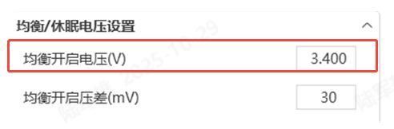
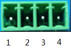
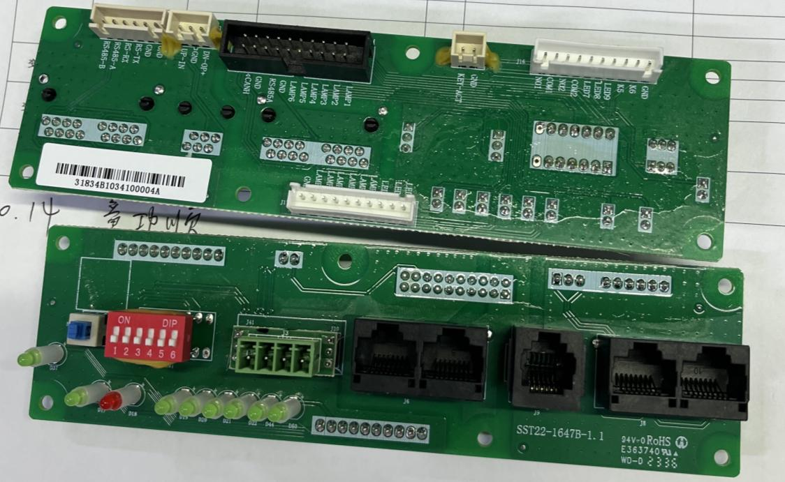
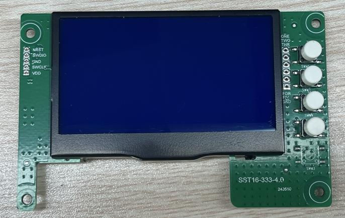
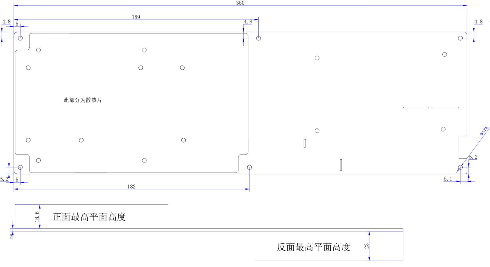
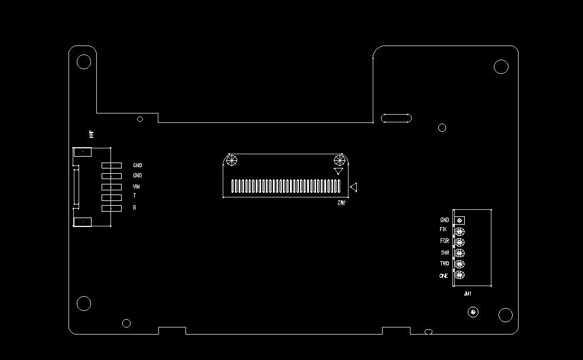
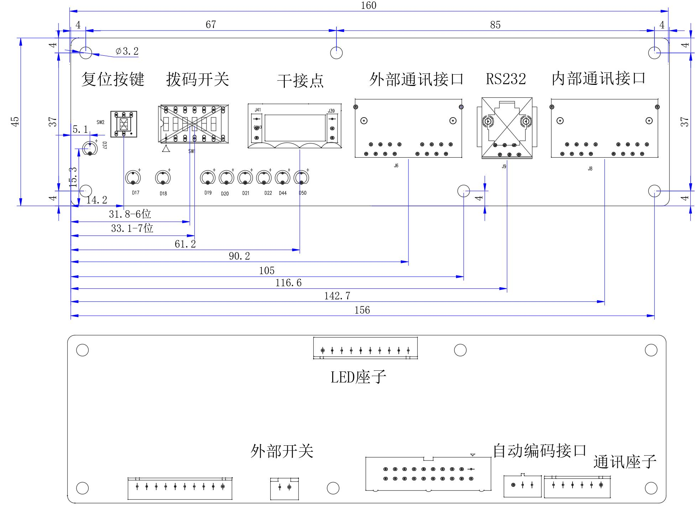
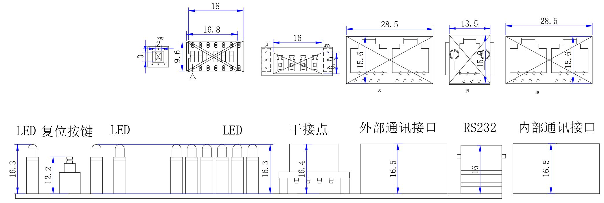

## 规格确认书

<table>
  <tr>
    <td>客户名称</td>
    <td colspan="3">东莞市众领科技有限公司</td>
  </tr>
  <tr>
    <td>客户型号</td>
    <td colspan="3"></td>
  </tr>
  <tr>
    <td>客户料号</td>
    <td colspan="3"></td>
  </tr>
  <tr>
    <td>产品型号</td>
    <td colspan="3">P16S200A-ZL51706L20-K4-IOB</td>
  </tr>
  <tr>
    <td>版 本</td>
    <td colspan="3">1.4</td>
  </tr>
  <tr>
    <td>日 期</td>
    <td colspan="3">2025-11-10</td>
  </tr>
  <tr>
    <td rowspan="19">配件清单</td>
    <td>序号</td>
    <td>名称</td>
    <td>型号</td>
    <td>数量</td>
  </tr>
  <tr>
    <td>1</td>
    <td>保护板</td>
    <td>P16S200A-51706-1.4</td>
    <td>1 块</td>
  </tr>
  <tr>
    <td>2</td>
    <td>显示板</td>
    <td>MD32K4-20666-3.0</td>
    <td>1 块</td>
  </tr>
  <tr>
    <td>3</td>
    <td>接口板</td>
    <td>IOB-31834B-1.0</td>
    <td>1 块</td>
  </tr>
  <tr>
    <td>4</td>
    <td>螺丝</td>
    <td>M5*10 螺丝</td>
    <td>4 颗</td>
  </tr>
  <tr>
    <td>5</td>
    <td>接线端子</td>
    <td>KF2EDG-Y-3.81-4P-1G</td>
    <td>1 个</td>
  </tr>
  <tr>
    <td>6</td>
    <td>接线端子</td>
    <td>KF2EDG-Y-3.81-2P-1G</td>
    <td>1 个</td>
  </tr>
  <tr>
    <td>7</td>
    <td>线材</td>
    <td>6P-300mm-6P-2.5X-1.1</td>
    <td>1 条</td>
  </tr>
  <tr>
    <td>8</td>
    <td>线材</td>
    <td>10P(2.0S)-300mm-10P(2.5X)-1.1</td>
    <td>1 条</td>
  </tr>
  <tr>
    <td>9</td>
    <td>线材</td>
    <td>10Px2-300mm-10Px2-2.5S-1.0</td>
    <td>1 条</td>
  </tr>
  <tr>
    <td>10</td>
    <td>线材</td>
    <td>420mm-2P-2.5S-R19A-1.1</td>
    <td>1 条</td>
  </tr>
  <tr>
    <td>11</td>
    <td>线材</td>
    <td>3.5P-245mm-tin-16AWG-1.0</td>
    <td>1 块</td>
  </tr>
  <tr>
    <td>12</td>
    <td>线材</td>
    <td>5P-500mm-5P-2.5X-1.1</td>
    <td>1 条</td>
  </tr>
  <tr>
    <td>13</td>
    <td>线材</td>
    <td>500mm-3P-3.81-tin-1.0</td>
    <td>1 条</td>
  </tr>
  <tr>
    <td>14</td>
    <td>线材</td>
    <td>P16S200A-ZL51706-采样线 1-1.0</td>
    <td>1 条</td>
  </tr>
  <tr>
    <td>15</td>
    <td>线材</td>
    <td>P16S200A-ZL51706-采样线 2-1.0</td>
    <td>1 条</td>
  </tr>
  <tr>
    <td>16</td>
    <td>线材</td>
    <td>P16S200A-ZL51706-采样线 3-1.0</td>
    <td>1 条</td>
  </tr>
  <tr>
    <td>17</td>
    <td>线材</td>
    <td>P16S200A-ZL51706-采样线 4-1.0</td>
    <td>1 条</td>
  </tr>
  <tr>
    <td>18</td>
    <td>线材</td>
    <td>3P-500mm-3P-2.5S-1.0</td>
    <td>1 条</td>
  </tr>
  <tr>
    <td colspan="2">沛城</td>
    <td colspan="2">客户确认</td>
  </tr>
  <tr>
    <td>制定：</td>
    <td>吴奕冰</td>
    <td>审查：</td>
    <td></td>
  </tr>
  <tr>
    <td>核准：</td>
    <td>陆军雄</td>
    <td>核准：</td>
    <td></td>
  </tr>
</table>

## 文件更改摘要

<table>
  <tr>
    <th>日 期</th>
    <th>版本号</th>
    <th>修订说明</th>
    <th>制定人</th>
    <th>核准人</th>
  </tr>
  <tr>
    <td>2025-07-10</td>
    <td>1.0</td>
    <td>初版发行。</td>
    <td>吴奕冰</td>
    <td>陆军雄</td>
  </tr>
  <tr>
    <td>2025-07-14</td>
    <td>1.1</td>
    <td>软件变更： 1、新增客供维克多 CAN 协议，按要求上传数据，并设为默认 CAN 协议。</td>
    <td>吴奕冰</td>
    <td>陆军雄</td>
  </tr>
  <tr>
    <td>2025-09-09</td>
    <td>1.2</td>
    <td>软硬件变更： 1、删除板载蓝牙 WiFi 模块，客户外挂 WiFi 模块。</td>
    <td>吴奕冰</td>
    <td>陆军雄</td>
  </tr>
  <tr>
    <td>2025-10-15</td>
    <td>1.3</td>
    <td>软件变更： 1、J75 接口 232 协议修改； 2、支持 63 台电池并机； 配件变更： 1、采样线型号变更，已标黄。</td>
    <td>吴奕冰</td>
    <td>陆军雄</td>
  </tr>
  <tr>
    <td>2025-11-10</td>
    <td>1.4</td>
    <td>软件变更： 1、主动均衡逻辑调整； 2、其他需求[17]修改。</td>
    <td>吴奕冰</td>
    <td>陆军雄</td>
  </tr>
  <tr>
    <td></td>
    <td></td>
    <td></td>
    <td></td>
    <td></td>
  </tr>
  <tr>
    <td></td>
    <td></td>
    <td></td>
    <td></td>
    <td></td>
  </tr>
  <tr>
    <td></td>
    <td></td>
    <td></td>
    <td></td>
    <td></td>
  </tr>
  <tr>
    <td></td>
    <td></td>
    <td></td>
    <td></td>
    <td></td>
  </tr>
  <tr>
    <td></td>
    <td></td>
    <td></td>
    <td></td>
    <td></td>
  </tr>
  <tr>
    <td></td>
    <td></td>
    <td></td>
    <td></td>
    <td></td>
  </tr>
  <tr>
    <td></td>
    <td></td>
    <td></td>
    <td></td>
    <td></td>
  </tr>
  <tr>
    <td></td>
    <td></td>
    <td></td>
    <td></td>
    <td></td>
  </tr>
  <tr>
    <td></td>
    <td></td>
    <td></td>
    <td></td>
    <td></td>
  </tr>
  <tr>
    <td></td>
    <td></td>
    <td></td>
    <td></td>
    <td></td>
  </tr>
  <tr>
    <td></td>
    <td></td>
    <td></td>
    <td></td>
    <td></td>
  </tr>
  <tr>
    <td></td>
    <td></td>
    <td></td>
    <td></td>
    <td></td>
  </tr>
  <tr>
    <td></td>
    <td></td>
    <td></td>
    <td></td>
    <td></td>
  </tr>
  <tr>
    <td></td>
    <td></td>
    <td></td>
    <td></td>
    <td></td>
  </tr>
  <tr>
    <td></td>
    <td></td>
    <td></td>
    <td></td>
    <td></td>
  </tr>
  <tr>
    <td></td>
    <td></td>
    <td></td>
    <td></td>
    <td></td>
  </tr>
  <tr>
    <td></td>
    <td></td>
    <td></td>
    <td></td>
    <td></td>
  </tr>
  <tr>
    <td></td>
    <td></td>
    <td></td>
    <td></td>
    <td></td>
  </tr>
  <tr>
    <td></td>
    <td></td>
    <td></td>
    <td></td>
    <td></td>
  </tr>
  <tr>
    <td></td>
    <td></td>
    <td></td>
    <td></td>
    <td></td>
  </tr>
  <tr>
    <td></td>
    <td></td>
    <td></td>
    <td></td>
    <td></td>
  </tr>
</table>

## 1. 简介

BMS（Battery Management System）是一种监测和控制电池的状态，使电池能够安全且长期使用的系统。主要就是为了智能化管理及维护各个电池单元，监控电池的状态，防止电池出现过充电和过放电，以延长电池的使用寿命。本产品适用于户用储能电池。

## 2. 功能特性

- 具有 16 路单体电压、总体电压检测，过充、过放告警及保护功能。常温下静态电压采样精度可达 &le;10mV。
- 具有充、放电电流检测，充、放电过流告警及保护功能。充电电流显示为正，放电电流显示为负，常温下电流采样精度可达 &le;2%@FS。
- 预留充、放电电流检测，充、放电过流告警及保护功能。充电电流显示为正，放电电流显示为负，常温下电流采样精度可达 &le;2%@FS。
- 具有 4 路电芯温度检测，电芯高、低温告警及保护功能。常温下温度采样精度可达 &le;2&deg;C。
- 具有短路保护功能。
- 具有充电均衡功能。
- 支持电芯容量估算功能。电池组满充容量、当前容量、设计容量可以通过上位机进行设置，在进行完整充放电循环后容量可自动更新。
- 支持上位机软件控制功能，可通过上位机软件方便地对过充、过放、充放电电流、过温、欠温等保护参数，容量、休眠、均衡、等参数进行设置。
- 具有 RS232、RS485、CAN 通信接口。
- 具有多种休眠及唤醒方式。
- 具有复位开关，自动编码等功能。
- 具有 LCD 接口（选配），充电限流，蜂鸣器，LED 等功能。
- 支持在线升级。

## 3. 功能示意框图（仅供参考，以产品为准）

## 4. 环境要求

<table>
  <tr>
    <th>项目</th>
    <th>参数</th>
    <th>单位</th>
  </tr>
  <tr>
    <td>工作温度</td>
    <td>-20 /~ 60</td>
    <td>°C</td>
  </tr>
  <tr>
    <td>储存温度</td>
    <td>-20 /~ 75</td>
    <td>°C</td>
  </tr>
  <tr>
    <td>工作湿度</td>
    <td>10 /~ 85</td>
    <td>%RH</td>
  </tr>
  <tr>
    <td>储存湿度</td>
    <td>10 /~ 85</td>
    <td>%RH</td>
  </tr>
</table>

## 5. 参数配置

### 5.1 基本参数设置

<table>
  <tr>
    <th>序号</th>
    <th colspan="2">指标项目</th>
    <th>出厂默认参数</th>
    <th>是否可设</th>
    <th>备注</th>
  </tr>
  <tr>
    <td rowspan="6">1</td>
    <td rowspan="3">单体过充保护</td>
    <td>单体过充告警电压</td>
    <td>3600mV</td>
    <td>可设</td>
    <td></td>
  </tr>
  <tr>
    <td>单体过充保护电压</td>
    <td>3650mV</td>
    <td>可设</td>
    <td></td>
  </tr>
  <tr>
    <td>单体过充保护延时</td>
    <td>1.0S</td>
    <td>可设</td>
    <td></td>
  </tr>
  <tr>
    <td rowspan="3">单体过压保护解除</td>
    <td>单体过充保护解除电压</td>
    <td>3400mV</td>
    <td>可设</td>
    <td></td>
  </tr>
  <tr>
    <td>容量解除</td>
    <td>SOC &lt; 96%</td>
    <td>可设</td>
    <td></td>
  </tr>
  <tr>
    <td>放电解除</td>
    <td colspan="2">放电电流 &gt; 2A</td>
    <td></td>
  </tr>
  <tr>
    <td rowspan="5">2</td>
    <td rowspan="3">单体过放保护</td>
    <td>单体过放告警电压</td>
    <td>2600mV</td>
    <td>可设</td>
    <td></td>
  </tr>
  <tr>
    <td>单体过放保护电压</td>
    <td>2500mV</td>
    <td>可设</td>
    <td></td>
  </tr>
  <tr>
    <td>单体过放保护延时</td>
    <td>1.0S</td>
    <td>可设</td>
    <td></td>
  </tr>
  <tr>
    <td rowspan="2">单体过放保护解除</td>
    <td>单体过放保护解除电压</td>
    <td>2900mV</td>
    <td>可设</td>
    <td></td>
  </tr>
  <tr>
    <td>有充电时解除</td>
    <td colspan="2">接入充电器可激活</td>
    <td></td>
  </tr>
  <tr>
    <td rowspan="6">3</td>
    <td rowspan="3">总体过充保护</td>
    <td>总体过充告警电压</td>
    <td>56.5V</td>
    <td>可设</td>
    <td></td>
  </tr>
  <tr>
    <td>总体过充保护电压</td>
    <td>58.4V</td>
    <td>可设</td>
    <td></td>
  </tr>
  <tr>
    <td>总体过充保护延时</td>
    <td>1.0S</td>
    <td>可设</td>
    <td></td>
  </tr>
  <tr>
    <td rowspan="3">总体过压保护解除</td>
    <td>总体过充保护解除电压</td>
    <td>54.4V</td>
    <td>可设</td>
    <td></td>
  </tr>
  <tr>
    <td>容量解除</td>
    <td>SOC &lt; 96%</td>
    <td>可设</td>
    <td></td>
  </tr>
  <tr>
    <td>放电解除</td>
    <td colspan="2">放电电流 &gt; 2A</td>
    <td></td>
  </tr>
  <tr>
    <td rowspan="5">4</td>
    <td rowspan="3">总体过放保护</td>
    <td>总体过放告警电压</td>
    <td>44V</td>
    <td>可设</td>
    <td></td>
  </tr>
  <tr>
    <td>总体过放保护电压</td>
    <td>40V</td>
    <td>可设</td>
    <td></td>
  </tr>
  <tr>
    <td>总体过放保护延时</td>
    <td>1.0S</td>
    <td>可设</td>
    <td></td>
  </tr>
  <tr>
    <td rowspan="2">总体过放保护解除</td>
    <td>总体过放保护解除电压</td>
    <td>46.5V</td>
    <td>可设</td>
    <td></td>
  </tr>
  <tr>
    <td>有充电时解除</td>
    <td colspan="2">接入充电器可激活</td>
    <td></td>
  </tr>
  <tr>
    <td rowspan="5">5</td>
    <td rowspan="3">充电过流保护</td>
    <td>充电过流告警电流</td>
    <td>145A</td>
    <td>可设</td>
    <td rowspan="5">连续出现10次将锁定该状态，不再自动解除</td>
  </tr>
  <tr>
    <td>充电过流保护电流</td>
    <td>210A</td>
    <td>可设</td>
  </tr>
  <tr>
    <td>充电过流保护延时</td>
    <td>1.0S</td>
    <td>可设</td>
  </tr>
  <tr>
    <td rowspan="2">充电过流保护解除</td>
    <td>自动解除</td>
    <td colspan="2">1min 后自动解除</td>
  </tr>
  <tr>
    <td>放电解除</td>
    <td colspan="2">放电电流 &gt; 1A</td>
  </tr>
  <tr>
    <td rowspan="5">6</td>
    <td rowspan="3">放电过流 1 保护</td>
    <td>放电过流 1 告警电流</td>
    <td>155A</td>
    <td>可设</td>
    <td rowspan="5">连续出现10次将锁定该状态，不再自动解除</td>
  </tr>
  <tr>
    <td>放电过流 1 保护电流</td>
    <td>210A</td>
    <td>可设</td>
  </tr>
  <tr>
    <td>放电过流 1 保护延时</td>
    <td>1.0S</td>
    <td>可设</td>
  </tr>
  <tr>
    <td rowspan="2">放电过流 1 保护解除</td>
    <td>自动解除</td>
    <td colspan="2">1min 后自动解除</td>
  </tr>
  <tr>
    <td>充电解除</td>
    <td colspan="2">充电电流 &gt; 1A</td>
  </tr>
  <tr>
    <td rowspan="2">7</td>
    <td rowspan="2">放电过流 2</td>
    <td>放电过流 2 保护电流</td>
    <td>&ge;250A</td>
    <td>可设</td>
    <td rowspan="4">连续出现10次将锁定该状态，不再自动解除</td>
  </tr>
  <tr>
    <td>放电过流 2 保护延时</td>
    <td>500mS</td>
    <td>可设</td>
  </tr>
  <tr>
    <td></td>
    <td rowspan="2">放电过流 2 保护解除</td>
    <td>自动解除</td>
    <td colspan="2">1min 后自动解除</td>
  </tr>
  <tr>
    <td></td>
    <td>充电解除</td>
    <td colspan="2">充电电流 &gt; 1A</td>
  </tr>
  <tr>
    <td rowspan="3">8</td>
    <td rowspan="3">短路保护</td>
    <td>短路保护功能</td>
    <td colspan="2">有（默认为功能开启）</td>
    <td rowspan="3">连续出现10次将锁定该状态，不再自动解除</td>
  </tr>
  <tr>
    <td rowspan="2">短路保护解除</td>
    <td colspan="2">有充电时，短路保护解除</td>
  </tr>
  <tr>
    <td colspan="2">负载移除后，将自动解除</td>
  </tr>
  <tr>
    <td rowspan="3">9</td>
    <td rowspan="3">MOS 高温保护</td>
    <td>MOS 过温告警温度</td>
    <td>90°C</td>
    <td>可设</td>
    <td></td>
  </tr>
  <tr>
    <td>MOS 过温保护温度</td>
    <td>115°C</td>
    <td>可设</td>
    <td></td>
  </tr>
  <tr>
    <td>MOS 保护解除温度</td>
    <td>85°C</td>
    <td>可设</td>
    <td></td>
  </tr>
  <tr>
    <td rowspan="12">10</td>
    <td rowspan="12">电芯温度保护</td>
    <td>充电低温告警温度</td>
    <td>5°C</td>
    <td>可设</td>
    <td></td>
  </tr>
  <tr>
    <td>充电低温保护温度</td>
    <td>0°C</td>
    <td>可设</td>
    <td></td>
  </tr>
  <tr>
    <td>充电低温保护解除温度</td>
    <td>10°C</td>
    <td>可设</td>
    <td></td>
  </tr>
  <tr>
    <td>充电高温告警温度</td>
    <td>50°C</td>
    <td>可设</td>
    <td></td>
  </tr>
  <tr>
    <td>充电高温保护温度</td>
    <td>55°C</td>
    <td>可设</td>
    <td></td>
  </tr>
  <tr>
    <td>充电高温保护解除温度</td>
    <td>50°C</td>
    <td>可设</td>
    <td></td>
  </tr>
  <tr>
    <td>放电低温告警温度</td>
    <td>-15°C</td>
    <td>可设</td>
    <td></td>
  </tr>
  <tr>
    <td>放电低温保护温度</td>
    <td>-20°C</td>
    <td>可设</td>
    <td></td>
  </tr>
  <tr>
    <td>放电低温保护解除温度</td>
    <td>-15°C</td>
    <td>可设</td>
    <td></td>
  </tr>
  <tr>
    <td>放电高温告警温度</td>
    <td>50°C</td>
    <td>可设</td>
    <td></td>
  </tr>
  <tr>
    <td>放电高温保护温度</td>
    <td>55°C</td>
    <td>可设</td>
    <td></td>
  </tr>
  <tr>
    <td>放电高温保护解除温度</td>
    <td>50°C</td>
    <td>可设</td>
    <td></td>
  </tr>
  <tr>
    <td rowspan="6">11</td>
    <td rowspan="6">环境温度告警</td>
    <td>环境低温告警温度</td>
    <td>-20°C</td>
    <td>可设</td>
    <td></td>
  </tr>
  <tr>
    <td>环境低温保护温度</td>
    <td>-30°C</td>
    <td>可设</td>
    <td></td>
  </tr>
  <tr>
    <td>环境低温保护解除温度</td>
    <td>-20°C</td>
    <td>可设</td>
    <td></td>
  </tr>
  <tr>
    <td>环境高温告警温度</td>
    <td>55°C</td>
    <td>可设</td>
    <td></td>
  </tr>
  <tr>
    <td>环境高温保护温度</td>
    <td>65°C</td>
    <td>可设</td>
    <td></td>
  </tr>
  <tr>
    <td>环境高温保护解除温度</td>
    <td>55°C</td>
    <td>可设</td>
    <td></td>
  </tr>
  <tr>
    <td rowspan="2">12</td>
    <td rowspan="2">消耗电流</td>
    <td>工作时自耗电电流</td>
    <td colspan="2">&le;45mA</td>
    <td></td>
  </tr>
  <tr>
    <td>低功耗模式电流</td>
    <td colspan="2">&le;200&mu;A</td>
    <td></td>
  </tr>
  <tr>
    <td rowspan="2">13</td>
    <td rowspan="2">均衡功能</td>
    <td>均衡开启电压</td>
    <td>&gt; 3400mV</td>
    <td>可设</td>
    <td></td>
  </tr>
  <tr>
    <td>开启压差</td>
    <td>&gt; 30mV</td>
    <td>可设</td>
    <td></td>
  </tr>
  <tr>
    <td>14</td>
    <td>容量默认设置</td>
    <td>电量低告警门槛</td>
    <td>SOC &lt; 5%</td>
    <td>可设</td>
    <td>充电时不告警</td>
  </tr>
  <tr>
    <td rowspan="2">15</td>
    <td rowspan="2">休眠功能</td>
    <td>休眠电压</td>
    <td>&lt; 3150mV</td>
    <td>可设</td>
    <td></td>
  </tr>
  <tr>
    <td>延迟时间</td>
    <td>5min</td>
    <td>可设</td>
    <td></td>
  </tr>
  <tr>
    <td>16</td>
    <td>电芯失效保护</td>
    <td>单体压差</td>
    <td>&gt; 1V 保护</td>
    <td>不可设</td>
    <td>不允许充放电</td>
  </tr>
  <tr>
    <td rowspan="2">17</td>
    <td rowspan="2">满充判断</td>
    <td>满充电压</td>
    <td>&ge; 55.2V</td>
    <td>可设</td>
    <td rowspan="2">更新 SOC 为 100%</td>
  </tr>
  <tr>
    <td>截止电流</td>
    <td>&le; 5A</td>
    <td>可设</td>
  </tr>
</table>

注：以上参数设定是在 25°C 环境温度下的标准设置，不同温度的表现会有差异。

### 5.2 基本配置

<table>
  <tr>
    <th rowspan="14">功能</th>
    <td>存储</td>
    <td colspan="5">□无 □ 存储 400 条 ☑ 存储 10000 条</td>
  </tr>
  <tr>
    <td>电池容量</td>
    <td colspan="5">□50AH □100AH □150AH □200AH ☑ 280 AH</td>
  </tr>
  <tr>
    <td>显示屏接口</td>
    <td colspan="5">□无 □中文智能 □英文智能 ☑有</td>
  </tr>
  <tr>
    <td>充电限流</td>
    <td colspan="5">□无 □5A □10A ☑20A □ A 定义：充电电流 &gt; 200A 开启</td>
  </tr>
  <tr>
    <td>干接点</td>
    <td colspan="5">□无 ☑有 定义：干接点 1-PIN1 to PIN2 常开，故障保护时闭合； 干接点 2-PIN3 to PIN4 常开，电池低告警闭合。</td>
  </tr>
  <tr>
    <td>加热膜接口</td>
    <td colspan="5">□无 ☑ 有（加热膜座子不焊接，客户自接座子并自己焊接，其它硬件电路保留） 定义：加热开启温度允许（充电低温告警温度+1），加热膜关闭温度关联充电低温保护解除温度，当 BMS 进入充电低温保护状态，充电 MOS 关闭，增加加热膜请求充电电流为 10A（与德赛请求充电电流分开）；在并机时，若有电池出现充电低温保护状态，加热膜请求充电电流为 10A*充电低温保护状态数量；上位机可修改。</td>
  </tr>
  <tr>
    <td>CAN 并机</td>
    <td colspan="5">☑无 □有 定义：</td>
  </tr>
  <tr>
    <td>风扣板接口</td>
    <td colspan="5">□无 ☑有 定义：1.充电 MOS 关闭后，若检测到有充电电流，持续 8S 启动。 2.放电 MOS 关闭后，若检测到有放电电流，持续 8S 启动。</td>
  </tr>
  <tr>
    <td>认证功能接口</td>
    <td colspan="5">☑MCU 升片看门狗 ☑双重总压检测 ☑双重电流检测</td>
  </tr>
  <tr>
    <td>弱电开关</td>
    <td colspan="5">□无 ☑有</td>
  </tr>
  <tr>
    <td>蜂鸣器</td>
    <td colspan="5">□无 ☑有</td>
  </tr>
  <tr>
    <td>定位功能接口</td>
    <td colspan="5">☑无 □有</td>
  </tr>
  <tr>
    <td>蓝牙&amp;WIFI</td>
    <td colspan="5">☑无 □有</td>
  </tr>
  <tr>
    <td>灯条接口</td>
    <td colspan="5">□无 ☑有</td>
  </tr>
  <tr>
    <th rowspan="3">通信</th>
    <td>拨码开关</td>
    <td colspan="5">□无 □1 位 □4 位 ☑6 位 ☑ 自动编码</td>
  </tr>
  <tr>
    <td>LED 灯</td>
    <td colspan="5">□无 □ALM ☑RUN ☑ON/OFF ☑SOC 6 个</td>
  </tr>
  <tr>
    <td>采样插座</td>
    <td colspan="5">☑立式 □卧式</td>
  </tr>
  <tr>
    <th rowspan="3">其他需求</th>
    <td>条码</td>
    <td colspan="5">□一维码 ☑二维码</td>
  </tr>
  <tr>
    <td>通信接口</td>
    <td colspan="5">☑RS232 □RS485 ☑并机 RS485 ☑CAN</td>
  </tr>
  <tr>
    <td>并机方式</td>
    <td colspan="5">□无 □RS485 □CAN</td>
  </tr>
  <tr>
    <th rowspan="5"></th>
    <td>升级方式</td>
    <td colspan="5">☑RS232 □RS485</td>
  </tr>
  <tr>
    <td>1</td>
    <td colspan="5">自动编码需支持主机唤醒从机，主机唤醒后从机能自动唤醒。</td>
  </tr>
  <tr>
    <td>2</td>
    <td colspan="5">LED 灯和条形灯亮灯逻辑二选一。</td>
  </tr>
  <tr>
    <td>3</td>
    <td colspan="5">手动编码和自动编码逻辑二选一。</td>
  </tr>
  <tr>
    <td>4</td>
    <td colspan="5">主动均衡最大支持 2A。</td>
  </tr>
  <tr>
    <td></td>
    <td>5</td>
    <td colspan="5">新增客供 MAP 表，见附件； 表格数值为系数（单位微欧）； 单机： 请求充电电流=表中函数 X2X 充电过流警告值；</td>
  </tr>
  <tr>
    <td></td>
    <td>6</td>
    <td colspan="5">请求放电电流=表中系数 X 放电过流 1 告警值； 并机： 分别查每一台的请求电流，然后取最小的电流，乘上（并机数-保护数）。</td>
  </tr>
  <tr>
    <td></td>
    <td>7</td>
    <td colspan="5">逆变协议： RS485：鹏辉 CAN：施耐德、维克托、德业、SMA、特能创新、美世乐、瑞迪、索瑞德、TBB、迈格瑞</td>
  </tr>
  <tr>
    <td></td>
    <td>8</td>
    <td colspan="5">增加加热膜功能： 定义：加热开启温度关联（充电低温告警温度+1），加热膜关闭温度关联充电低温保护解除温度，上位机可修改。</td>
  </tr>
  <tr>
    <td></td>
    <td>9</td>
    <td colspan="5">主板上加热膜座子不焊接（客户自购座子，并自己焊接）。</td>
  </tr>
  <tr>
    <td></td>
    <td>10</td>
    <td colspan="5">BMS 需支持屏通协议的功能。</td>
  </tr>
  <tr>
    <td></td>
    <td>11</td>
    <td colspan="5">读取端并机总电流改为“读取并机总电压-0.5V”，请求充电电压=最高单剂电压。</td>
  </tr>
  <tr>
    <td></td>
    <td>12</td>
    <td colspan="5">1、在 010-Victron CAN 2021.01.07(维克多)协议中，当均衡开启时，取消 BMS 上传逆变器正偏差报告。 2、在 001-PYLON CAN Inverter EMS(派能) 协议中，修改掩码标记 1 和 2 的范围：掩码标记 1 的 Bit5 为充电告警值-低电量告警值+2%；强制标记 2 的 Bit4 为低电量告警值+1%-低电量告警值+3%；流充关闭，低电量告警值-10%。</td>
  </tr>
  <tr>
    <td></td>
    <td>13</td>
    <td colspan="5">BMS 在未休眠状态下开启自耗电，休眠状态下关闭，功率为 7W。</td>
  </tr>
  <tr>
    <td></td>
    <td>14</td>
    <td colspan="5">232 的波特率修改为 115200。</td>
  </tr>
  <tr>
    <td></td>
    <td>15</td>
    <td colspan="5">支持多种双向表，详情见上位机协议选择界面。</td>
  </tr>
  <tr>
    <td></td>
    <td>16</td>
    <td colspan="5">导入 A 威标准 SOC 算法。</td>
  </tr>
  <tr>
    <td></td>
    <td>17</td>
    <td colspan="5">请求逻辑： 1. 仅当第一次满足条件触发一小时后，如果 SOC 大于间歇式充电门限，向逆变器请求“低请求电压”，其他正常情况下，向逆变器请求“正常请求电压”。 2. 间歇式充电门限：即 Gap Charge Threshold 值，默认 95（可设）。 3. 低请求电压：取 总休止保护恢复值 (Pack OVP Release) 值（可设）。 4. 正常请求电压：取 电池包截止电压 (Pack FullCharge Voltage) 值（可设）。 目的： 1. 当电池 SOC 低于某个值 (TSOC) 的时候，向逆变器请求最大放电电流=-10。 2. 当电池电压低于某个值 (PACK_UV_ALARM) 的时候，向逆变器请求最大放电电流=0。  定义： SOC：电池当前 SOC（取所有 pack 平均 SOC）。 VOL：电池当前电压（取所有 pack 平均电压）。 SOC_LOW_ALARM：软件设置中 SOC Low Alarm 低电量告警 (%) 值（取主机设置值）。 PACK_UV_ALARM：软件设置中 Pack UV Alarm 总体过放告警 (V) 值（取主机设置值）。 TSOC：一个变量。 TSOC_STATE：指示当前是否因低电量而导致向逆变器请求最大放电电流=-10，默认为 0。 TVOL_STATE：指示当前是否因低电压而导致向逆变器请求最大放电电流=0，默认为 0。 基准最大放电电流：软件设置中 DCG_OC_ALARM 放电过流告警 (A) 值 (MAP 系数，向向逆变器请求最大放电电流。</td>
  </tr>
  <tr>
    <td></td>
    <td>18</td>
    <td colspan="5">TSOC 的值： 1. 当 SOC_LOW_ALARM &le; 5%，TSOC 固定取值 SOC_LOW_ALARM (目的是留一个口子，从而不使用 TSOC 动态变化逻辑)。 2. 当 SOC_LOW_ALARM &gt; 5%，TSOC 的值会发生变化。  TSOC 的值变化： 1. 如果电池连续 4 天不触发放电条件： 在 96 小时及以上时，将 TSOC 提高到 50%。 在 192 小时及以上时，将 TSOC 提高到 70%。 2. 一旦触发放电条件，TSOC 重置为 SOC_LOW_ALARM。  向逆变器请求最大放电电流： 1. 如果 SOC &lt; TSOC，设置 TSOC_STATE = 1。 2. 如果 VOL &lt; PACK_UV_ALARM，设置 TVOL_STATE = 1。 3. 如果 TVOL_STATE = 1，向逆变器请求最大放电电流=0。 4. 如果 TVOL_STATE = 0 且 TSOC_STATE = 1，向逆变器请求最大放电电流=-10。 向逆变器请求最大放电电流的退出： 1. 如果 SOC &gt; TSOC + 20%，设置 TSOC_STATE = 0。 2. 如果 VOL &gt; PACK_UV_ALARM + 3V，设置 TVOL_STATE = 0。 3. 如果 TSOC_STATE = 0 且 TVOL_STATE = 0，向逆变器请求最大放电电流=基准最大放电电流。</td>
  </tr>
  <tr>
    <td></td>
    <td>19</td>
    <td colspan="5">并机时，向逆变器上报电池平均总电压。</td>
  </tr>
  <tr>
    <td></td>
    <td>20</td>
    <td colspan="5">排除板载蓝牙 WIFI 模块，J75 外接蓝牙 WIFI 接口需要保留电路和座子，客户外接 WIFI 模块。 J75-外接蓝牙 WIFI 接口做成 232 协议，波特率为 115200。</td>
  </tr>
  <tr>
    <td></td>
    <td>21</td>
    <td colspan="5">支持 63 台电池并机。</td>
  </tr>
  <tr>
    <td></td>
    <td>22</td>
    <td colspan="5">新增客供通用多 CAN 协议，对应内部协议编号：010-Victron CAN 2023.09.22，并设为默认 CAN 协议。 BMS 上传数据要求： 0x35E 上传：Gobel 0x370 上传：Gobel 0x371 上传：Power 0x360 上报填充 0x378 上报累计充放电容量</td>
  </tr>
  <tr>
    <td></td>
    <td>23</td>
    <td colspan="5">J75-外接蓝牙 WIFI 接口串口 232 协议修改： 把正常响应 RTN = 0x00，改为 RTN = Cmd (Bms 接收的命令)。</td>
  </tr>
  <tr>
    <td></td>
    <td>24</td>
    <td colspan="5">修改主动均衡的策略： 均衡开启由低压差启动变更为开启电压 (上位机可设)，如下图 a. 静置开启条件：Gmax &gt; 均衡开启电压值 且 压差 &gt; 30mv。 b. 静置关闭条件：Gmax &lt; 均衡开启电压值 或 压差 &lt; 20mv。 c. 充放电开启条件：Gmax &gt; 均衡开启电压值 且 压差 &gt; 50mv。 d. 充放电关闭条件：Gmax &lt; 均衡开启电压值 或 压差 &lt; 40mv。 e. 开启关闭压差 500 次循环增加 1mv，最大 20mv。 f. 开启一小时运行时间 1H，关闭均衡后要等待 10min 才能再次开启开启。 g. 电池温度高 105 退出。 h. 平均电压大于 3625mv 不启动。</td>
  </tr>
  <tr>
    <td></td>
    <td></td>
    <td colspan="5">j. 压差大于 1000mv 不启动。 k. 高温告警不启动。 l. 故障不启动。 m. 温度/保护不启动。 n. 过压保护可以启动，欠压保护不启动。 o. 去除流大于 0.5C 不启动的逻辑。 p. 电流小于 2A 为静置。 q. 每隔 1 分钟判断一次是否开启或继续维持均衡。  </td>
  </tr>
</table>

## 6. 主要功能说明

### 6.1 LED 指示说明（注：选用 LED 灯时逻辑参考如下，选用灯条时逻辑参考附件）

表 1 LED 工作状态指示

<table>
  <tr>
    <th rowspan="2">状态</th>
    <th rowspan="2">正常/告警/保护</th>
    <th rowspan="2">ON/OFF</th>
    <th rowspan="2">RUN</th>
    <th rowspan="2">ALM</th>
    <th colspan="6">电量指示 LED</th>
    <th rowspan="2">说明</th>
  </tr>
  <tr>
    <th>L6 ●</th>
    <th>L5 ●</th>
    <th>L4 ●</th>
    <th>L3 ●</th>
    <th>L2 ●</th>
    <th>L1 ●</th>
  </tr>
  <tr>
    <td>关机</td>
    <td>休眠</td>
    <td>灭</td>
    <td>灭</td>
    <td>灭</td>
    <td>灭</td>
    <td>灭</td>
    <td>灭</td>
    <td>灭</td>
    <td>灭</td>
    <td>灭</td>
    <td>全灭</td>
  </tr>
  <tr>
    <td rowspan="2">待机</td>
    <td>正常</td>
    <td>常亮</td>
    <td>闪 1</td>
    <td>灭</td>
    <td colspan="6" rowspan="2">依电量指示</td>
    <td>待机状态</td>
  </tr>
  <tr>
    <td>告警</td>
    <td>常亮</td>
    <td>闪 1</td>
    <td>闪 3</td>
    <td>低压告警</td>
  </tr>
  <tr>
    <td rowspan="3">充电</td>
    <td>正常</td>
    <td>常亮</td>
    <td>常亮</td>
    <td>灭</td>
    <td colspan="6" rowspan="2">依电量指示 (电量指示最高 LED 闪 2)</td>
    <td>最高电量 LED 闪动 (闪 2)，过充告警时 ALM 不闪烁</td>
  </tr>
  <tr>
    <td>告警</td>
    <td>常亮</td>
    <td>常亮</td>
    <td>闪 3</td>
    <td></td>
  </tr>
  <tr>
    <td>过充保护</td>
    <td>常亮</td>
    <td>常亮</td>
    <td>灭</td>
    <td>常亮</td>
    <td>常亮</td>
    <td>常亮</td>
    <td>常亮</td>
    <td>常亮</td>
    <td>常亮</td>
    <td>若无市电，指示灯转为待机状态</td>
  </tr>
  <tr>
    <td></td>
    <td>温度、过流、失效保护</td>
    <td>常亮</td>
    <td>灭</td>
    <td>常亮</td>
    <td>灭</td>
    <td>灭</td>
    <td>灭</td>
    <td>灭</td>
    <td>灭</td>
    <td>灭</td>
    <td>停止充电</td>
  </tr>
  <tr>
    <td rowspan="4">放电</td>
    <td>正常</td>
    <td>常亮</td>
    <td>闪 3</td>
    <td>灭</td>
    <td colspan="6" rowspan="2">依电量指示</td>
    <td></td>
  </tr>
  <tr>
    <td>告警</td>
    <td>常亮</td>
    <td>闪 3</td>
    <td>闪 3</td>
    <td></td>
  </tr>
  <tr>
    <td>欠压保护</td>
    <td>常亮</td>
    <td>灭</td>
    <td>灭</td>
    <td>灭</td>
    <td>灭</td>
    <td>灭</td>
    <td>灭</td>
    <td>灭</td>
    <td>灭</td>
    <td>停止放电</td>
  </tr>
  <tr>
    <td>温度、过流、短路、失效保护</td>
    <td>常亮</td>
    <td>灭</td>
    <td>常亮</td>
    <td>灭</td>
    <td>灭</td>
    <td>灭</td>
    <td>灭</td>
    <td>灭</td>
    <td>灭</td>
    <td>停止放电</td>
  </tr>
  <tr>
    <td>失效</td>
    <td></td>
    <td>灭</td>
    <td>灭</td>
    <td>常亮</td>
    <td>灭</td>
    <td>灭</td>
    <td>灭</td>
    <td>灭</td>
    <td>灭</td>
    <td>灭</td>
    <td>停止充、放电</td>
  </tr>
</table>

表 2 容量指示说明

<table>
  <tr>
    <th colspan="2">状态</th>
    <th colspan="6">充电</th>
    <th colspan="6">放电</th>
  </tr>
  <tr>
    <td colspan="2">容量指示灯</td>
    <td>L6 ●</td>
    <td>L5 ●</td>
    <td>L4 ●</td>
    <td>L3 ●</td>
    <td>L2 ●</td>
    <td>L1 ●</td>
    <td>L6 ●</td>
    <td>L5 ●</td>
    <td>L4 ●</td>
    <td>L3 ●</td>
    <td>L2 ●</td>
    <td>L1 ●</td>
  </tr>
  <tr>
    <td>电量 (%)</td>
    <td>0% /~ 17%</td>
    <td>灭</td>
    <td>灭</td>
    <td>灭</td>
    <td>灭</td>
    <td>灭</td>
    <td>闪 2</td>
    <td>灭</td>
    <td>灭</td>
    <td>灭</td>
    <td>灭</td>
    <td>灭</td>
    <td>常亮</td>
  </tr>
  <tr>
    <td></td>
    <td>18% /~ 33%</td>
    <td>灭</td>
    <td>灭</td>
    <td>灭</td>
    <td>灭</td>
    <td>闪 2</td>
    <td>常亮</td>
    <td>灭</td>
    <td>灭</td>
    <td>灭</td>
    <td>灭</td>
    <td>常亮</td>
    <td>常亮</td>
  </tr>
  <tr>
    <td></td>
    <td>34% /~ 50%</td>
    <td>灭</td>
    <td>灭</td>
    <td>灭</td>
    <td>闪 2</td>
    <td>常亮</td>
    <td>常亮</td>
    <td>灭</td>
    <td>灭</td>
    <td>灭</td>
    <td>常亮</td>
    <td>常亮</td>
    <td>常亮</td>
  </tr>
  <tr>
    <td></td>
    <td>51% /~ 66%</td>
    <td>灭</td>
    <td>灭</td>
    <td>闪 2</td>
    <td>常亮</td>
    <td>常亮</td>
    <td>常亮</td>
    <td>灭</td>
    <td>灭</td>
    <td>常亮</td>
    <td>常亮</td>
    <td>常亮</td>
    <td>常亮</td>
  </tr>
  <tr>
    <td></td>
    <td>67% /~ 83%</td>
    <td>灭</td>
    <td>闪 2</td>
    <td>常亮</td>
    <td>常亮</td>
    <td>常亮</td>
    <td>常亮</td>
    <td>灭</td>
    <td>常亮</td>
    <td>常亮</td>
    <td>常亮</td>
    <td>常亮</td>
    <td>常亮</td>
  </tr>
  <tr>
    <td></td>
    <td>84% /~ 100%</td>
    <td>闪 2</td>
    <td>常亮</td>
    <td>常亮</td>
    <td>常亮</td>
    <td>常亮</td>
    <td>常亮</td>
    <td>常亮</td>
    <td>常亮</td>
    <td>常亮</td>
    <td>常亮</td>
    <td>常亮</td>
    <td>常亮</td>
  </tr>
  <tr>
    <td colspan="2">运行指示灯 ●</td>
    <td colspan="6">常亮</td>
    <td colspan="6">闪烁(闪 3)</td>
  </tr>
</table>

表 3 LED 闪动说明

<table>
  <tr>
    <th>闪动方式</th>
    <th>亮</th>
    <th>灭</th>
  </tr>
  <tr>
    <td>闪 1</td>
    <td>0.25S</td>
    <td>3.75S</td>
  </tr>
  <tr>
    <td>闪 2</td>
    <td>0.5S</td>
    <td>0.5S</td>
  </tr>
  <tr>
    <td>闪 3</td>
    <td>0.5S</td>
    <td>1.5S</td>
  </tr>
</table>

### 6.2 蜂鸣器动作说明

1) 故障时，每 1S 鸣叫 0.25S；
2) 保护时，每 2S 鸣叫 0.25S（过压保护除外）；
3) 告警时，每 3S 鸣叫 0.25S（低压告警除外）；
4) 蜂鸣器功能可通过上位机使能或禁止，出厂默认是禁止的。

### 6.3 按键说明

BMS 处于休眠状态时，按下按键（3/~6S）后松开，保护板被激活，LED 指示灯从“RUN”开始依次点亮 0.5 秒。
BMS 处于激活状态时，按下按键（3/~6S）后松开，保护板休眠，LED 指示灯从最低电量灯开始依次点亮 0.5 秒。
BMS 处于激活状态时，按下按键（6/~10S）后松开，保护板被复位，LED 灯全部同时点亮 1.5 秒。
**BMS 被复位后仍保留通过上位机设置的参数和功能，如果需要恢复到初始参数可以通过上位机的“恢复默认值”来实现，但相关运行记录和存储数据保持不变（如电量、循环次数、保护记录等）。**

### 6.4 休眠及唤醒

#### 休眠
当满足以下任意一条件时，系统进入低功耗模式：
1) 单体或总体过放保护 30 秒内未解除。
2) 按下按键（3/~6S），松开按键。
3) 最低单体电压低于休眠电压，并且无通信、无保护、无均衡、无电流、无充电的情况下，持续时间达到休眠延时时间。
4) 待机时间超过 24 小时（无通信、无充放电、无外接电源）。
5) 通过上位机软件强制关机。
进入休眠前，需确保输入端未接入外部电压，否则将无法进入低功耗模式。

#### 唤醒
当系统处于低功耗模式，满足以下任意一条件时，系统将退出低功耗模式，进入正常运行模式：
1) 接入充电器，充电器输出电压需大于 48V。
2) 按下复位按键（3/~6S），松开按键。
3) RS232 通讯激活。

**备注：单体或总体过放保护进入低功耗模式，每 4 小时定时唤醒一次，开启充电 MOS。如可以充电，将退出休眠状态进入正常充电；如果连续 10 次自动唤醒无法充电，将不再自动唤醒。**

### 6.5 均衡条件说明

a. 静置开启条件：Gmax&gt;均衡开启电压 且 压差&gt; 30mv。
b. 静置关闭条件：Gmax&lt;均衡开启电压 或 压差&lt;20mv。
c. 充放电开启条件：Gmax&gt;均衡开启电压值 且 压差&gt;50mv。
d. 充放电关闭条件：Gmax&lt;均衡开启电压值 或 压差&lt;40mv。
备注：均衡开启电压值绑定被动均衡开启电压（上位机可设）。

## 7. 通信说明

### 7.1 CAN 通信

CAN 通信，默认波特率 500K，此接口用于与逆变器通信，当电池池为主机时，可汇总从机数据与逆变器通讯。

### 7.2 RS232 通信

BMS 可以通过 RS232 接口与上位机进行通讯，从而可通过上位机监控电池的各种信息，包括电池电压、电流、温度、状态及电池生产信息等，默认波特率为 115200bps。

### 7.3 RS485 通信

独立 RS485 接口，默认波特率为 9600bps。此接口用于与逆变器通信，监控设备作为主机，可汇总从机数据与逆变器通信。

### 7.4 并机 RS485 通信

并机 RS485 通信，默认波特率为 9600bps，如需通过 RS485 与监控设备通信，监控设备作为主机，依据地址轮询数据，地址设置范围为 1/~15。

### 7.5 拨码开关（注：选用手动编码时逻辑参考如下）

当 PACK 作并联使用时，可通过 BMS 上的拨码开关设置地址区分不同的 PACK，需避免地址设置为相同，BMS 拨码开关的定义参照下表。

<table>
  <tr>
    <th rowspan="2">地址</th>
    <th colspan="6">拨码开关位置</th>
  </tr>
  <tr>
    <th>#1</th>
    <th>#2</th>
    <th>#3</th>
    <th>#4</th>
    <th>#5</th>
    <th>#6</th>
  </tr>
  <tr>
    <td>0</td>
    <td>OFF</td>
    <td>OFF</td>
    <td>OFF</td>
    <td>OFF</td>
    <td>OFF</td>
    <td>OFF</td>
  </tr>
  <tr>
    <td>1</td>
    <td>ON</td>
    <td>OFF</td>
    <td>OFF</td>
    <td>OFF</td>
    <td>OFF</td>
    <td>OFF</td>
  </tr>
  <tr>
    <td>2</td>
    <td>OFF</td>
    <td>ON</td>
    <td>OFF</td>
    <td>OFF</td>
    <td>OFF</td>
    <td>OFF</td>
  </tr>
  <tr>
    <td>3</td>
    <td>ON</td>
    <td>ON</td>
    <td>OFF</td>
    <td>OFF</td>
    <td>OFF</td>
    <td>OFF</td>
  </tr>
  <tr>
    <td>4</td>
    <td>OFF</td>
    <td>OFF</td>
    <td>ON</td>
    <td>OFF</td>
    <td>OFF</td>
    <td>OFF</td>
  </tr>
  <tr>
    <td>5</td>
    <td>ON</td>
    <td>OFF</td>
    <td>ON</td>
    <td>OFF</td>
    <td>OFF</td>
    <td>OFF</td>
  </tr>
  <tr>
    <td>6</td>
    <td>OFF</td>
    <td>ON</td>
    <td>ON</td>
    <td>OFF</td>
    <td>OFF</td>
    <td>OFF</td>
  </tr>
  <tr>
    <td>7</td>
    <td>ON</td>
    <td>ON</td>
    <td>ON</td>
    <td>OFF</td>
    <td>OFF</td>
    <td>OFF</td>
  </tr>
  <tr>
    <td>8</td>
    <td>OFF</td>
    <td>OFF</td>
    <td>OFF</td>
    <td>ON</td>
    <td>OFF</td>
    <td>OFF</td>
  </tr>
  <tr>
    <td>9</td>
    <td>ON</td>
    <td>OFF</td>
    <td>OFF</td>
    <td>ON</td>
    <td>OFF</td>
    <td>OFF</td>
  </tr>
  <tr>
    <td>10</td>
    <td>OFF</td>
    <td>ON</td>
    <td>OFF</td>
    <td>ON</td>
    <td>OFF</td>
    <td>OFF</td>
  </tr>
  <tr>
    <td>11</td>
    <td>ON</td>
    <td>ON</td>
    <td>OFF</td>
    <td>ON</td>
    <td>OFF</td>
    <td>OFF</td>
  </tr>
  <tr>
    <td>12</td>
    <td>OFF</td>
    <td>OFF</td>
    <td>ON</td>
    <td>ON</td>
    <td>OFF</td>
    <td>OFF</td>
  </tr>
  <tr>
    <td>13</td>
    <td>ON</td>
    <td>OFF</td>
    <td>ON</td>
    <td>ON</td>
    <td>OFF</td>
    <td>OFF</td>
  </tr>
  <tr>
    <td>14</td>
    <td>OFF</td>
    <td>ON</td>
    <td>ON</td>
    <td>ON</td>
    <td>OFF</td>
    <td>OFF</td>
  </tr>
  <tr>
    <td>15</td>
    <td>ON</td>
    <td>ON</td>
    <td>ON</td>
    <td>ON</td>
    <td>OFF</td>
    <td>OFF</td>
  </tr>
  <tr>
    <td>16</td>
    <td>OFF</td>
    <td>OFF</td>
    <td>OFF</td>
    <td>OFF</td>
    <td>ON</td>
    <td>OFF</td>
  </tr>
  <tr>
    <td>17</td>
    <td>ON</td>
    <td>OFF</td>
    <td>OFF</td>
    <td>OFF</td>
    <td>ON</td>
    <td>OFF</td>
  </tr>
  <tr>
    <td>18</td>
    <td>OFF</td>
    <td>ON</td>
    <td>OFF</td>
    <td>OFF</td>
    <td>ON</td>
    <td>OFF</td>
  </tr>
  <tr>
    <td>19</td>
    <td>ON</td>
    <td>ON</td>
    <td>OFF</td>
    <td>OFF</td>
    <td>ON</td>
    <td>OFF</td>
  </tr>
  <tr>
    <td>20</td>
    <td>OFF</td>
    <td>OFF</td>
    <td>ON</td>
    <td>OFF</td>
    <td>ON</td>
    <td>OFF</td>
  </tr>
  <tr>
    <td>21</td>
    <td>ON</td>
    <td>OFF</td>
    <td>ON</td>
    <td>OFF</td>
    <td>ON</td>
    <td>OFF</td>
  </tr>
  <tr>
    <td>22</td>
    <td>OFF</td>
    <td>ON</td>
    <td>ON</td>
    <td>OFF</td>
    <td>ON</td>
    <td>OFF</td>
  </tr>
  <tr>
    <td>23</td>
    <td>ON</td>
    <td>ON</td>
    <td>ON</td>
    <td>OFF</td>
    <td>ON</td>
    <td>OFF</td>
  </tr>
  <tr>
    <td>24</td>
    <td>OFF</td>
    <td>OFF</td>
    <td>OFF</td>
    <td>ON</td>
    <td>ON</td>
    <td>OFF</td>
  </tr>
  <tr>
    <td>25</td>
    <td>ON</td>
    <td>OFF</td>
    <td>OFF</td>
    <td>ON</td>
    <td>ON</td>
    <td>OFF</td>
  </tr>
  <tr>
    <td>26</td>
    <td>OFF</td>
    <td>ON</td>
    <td>OFF</td>
    <td>ON</td>
    <td>ON</td>
    <td>OFF</td>
  </tr>
  <tr>
    <td>27</td>
    <td>ON</td>
    <td>ON</td>
    <td>OFF</td>
    <td>ON</td>
    <td>ON</td>
    <td>OFF</td>
  </tr>
  <tr>
    <td>28</td>
    <td>OFF</td>
    <td>OFF</td>
    <td>ON</td>
    <td>ON</td>
    <td>ON</td>
    <td>OFF</td>
  </tr>
  <tr>
    <td>29</td>
    <td>ON</td>
    <td>OFF</td>
    <td>ON</td>
    <td>ON</td>
    <td>ON</td>
    <td>OFF</td>
  </tr>
  <tr>
    <td>30</td>
    <td>OFF</td>
    <td>ON</td>
    <td>ON</td>
    <td>ON</td>
    <td>ON</td>
    <td>OFF</td>
  </tr>
  <tr>
    <td>31</td>
    <td>ON</td>
    <td>ON</td>
    <td>ON</td>
    <td>ON</td>
    <td>ON</td>
    <td>OFF</td>
  </tr>
  <tr>
    <td>32</td>
    <td>OFF</td>
    <td>OFF</td>
    <td>OFF</td>
    <td>OFF</td>
    <td>OFF</td>
    <td>ON</td>
  </tr>
  <tr>
    <td>33</td>
    <td>ON</td>
    <td>OFF</td>
    <td>OFF</td>
    <td>OFF</td>
    <td>OFF</td>
    <td>ON</td>
  </tr>
  <tr>
    <td>34</td>
    <td>OFF</td>
    <td>ON</td>
    <td>OFF</td>
    <td>OFF</td>
    <td>OFF</td>
    <td>ON</td>
  </tr>
  <tr>
    <td>35</td>
    <td>ON</td>
    <td>ON</td>
    <td>OFF</td>
    <td>OFF</td>
    <td>OFF</td>
    <td>ON</td>
  </tr>
  <tr>
    <td>36</td>
    <td>OFF</td>
    <td>OFF</td>
    <td>ON</td>
    <td>OFF</td>
    <td>OFF</td>
    <td>ON</td>
  </tr>
  <tr>
    <td>37</td>
    <td>ON</td>
    <td>OFF</td>
    <td>ON</td>
    <td>OFF</td>
    <td>OFF</td>
    <td>ON</td>
  </tr>
  <tr>
    <td>38</td>
    <td>OFF</td>
    <td>ON</td>
    <td>ON</td>
    <td>OFF</td>
    <td>OFF</td>
    <td>ON</td>
  </tr>
  <tr>
    <td>39</td>
    <td>ON</td>
    <td>ON</td>
    <td>ON</td>
    <td>OFF</td>
    <td>OFF</td>
    <td>ON</td>
  </tr>
  <tr>
    <td>40</td>
    <td>OFF</td>
    <td>OFF</td>
    <td>OFF</td>
    <td>ON</td>
    <td>OFF</td>
    <td>ON</td>
  </tr>
  <tr>
    <td>41</td>
    <td>ON</td>
    <td>OFF</td>
    <td>OFF</td>
    <td>ON</td>
    <td>OFF</td>
    <td>ON</td>
  </tr>
  <tr>
    <td>42</td>
    <td>OFF</td>
    <td>ON</td>
    <td>OFF</td>
    <td>ON</td>
    <td>OFF</td>
    <td>ON</td>
  </tr>
  <tr>
    <td>43</td>
    <td>ON</td>
    <td>ON</td>
    <td>OFF</td>
    <td>ON</td>
    <td>OFF</td>
    <td>ON</td>
  </tr>
  <tr>
    <td>44</td>
    <td>OFF</td>
    <td>OFF</td>
    <td>ON</td>
    <td>ON</td>
    <td>OFF</td>
    <td>ON</td>
  </tr>
  <tr>
    <td>45</td>
    <td>ON</td>
    <td>OFF</td>
    <td>ON</td>
    <td>ON</td>
    <td>OFF</td>
    <td>ON</td>
  </tr>
  <tr>
    <td>46</td>
    <td>OFF</td>
    <td>ON</td>
    <td>ON</td>
    <td>ON</td>
    <td>OFF</td>
    <td>ON</td>
  </tr>
  <tr>
    <td>47</td>
    <td>ON</td>
    <td>ON</td>
    <td>ON</td>
    <td>ON</td>
    <td>OFF</td>
    <td>ON</td>
  </tr>
  <tr>
    <td>48</td>
    <td>OFF</td>
    <td>OFF</td>
    <td>OFF</td>
    <td>OFF</td>
    <td>ON</td>
    <td>ON</td>
  </tr>
  <tr>
    <td>49</td>
    <td>ON</td>
    <td>OFF</td>
    <td>OFF</td>
    <td>OFF</td>
    <td>ON</td>
    <td>ON</td>
  </tr>
  <tr>
    <td>50</td>
    <td>OFF</td>
    <td>ON</td>
    <td>OFF</td>
    <td>OFF</td>
    <td>ON</td>
    <td>ON</td>
  </tr>
  <tr>
    <td>51</td>
    <td>ON</td>
    <td>ON</td>
    <td>OFF</td>
    <td>OFF</td>
    <td>ON</td>
    <td>ON</td>
  </tr>
  <tr>
    <td>52</td>
    <td>OFF</td>
    <td>OFF</td>
    <td>ON</td>
    <td>OFF</td>
    <td>ON</td>
    <td>ON</td>
  </tr>
  <tr>
    <td>53</td>
    <td>ON</td>
    <td>OFF</td>
    <td>ON</td>
    <td>OFF</td>
    <td>ON</td>
    <td>ON</td>
  </tr>
  <tr>
    <td>54</td>
    <td>OFF</td>
    <td>ON</td>
    <td>ON</td>
    <td>OFF</td>
    <td>ON</td>
    <td>ON</td>
  </tr>
  <tr>
    <td>55</td>
    <td>ON</td>
    <td>ON</td>
    <td>ON</td>
    <td>OFF</td>
    <td>ON</td>
    <td>ON</td>
  </tr>
  <tr>
    <td>56</td>
    <td>OFF</td>
    <td>OFF</td>
    <td>OFF</td>
    <td>ON</td>
    <td>ON</td>
    <td>ON</td>
  </tr>
  <tr>
    <td>57</td>
    <td>ON</td>
    <td>OFF</td>
    <td>OFF</td>
    <td>ON</td>
    <td>ON</td>
    <td>ON</td>
  </tr>
  <tr>
    <td>58</td>
    <td>OFF</td>
    <td>ON</td>
    <td>OFF</td>
    <td>ON</td>
    <td>ON</td>
    <td>ON</td>
  </tr>
  <tr>
    <td>59</td>
    <td>ON</td>
    <td>ON</td>
    <td>OFF</td>
    <td>ON</td>
    <td>ON</td>
    <td>ON</td>
  </tr>
  <tr>
    <td>60</td>
    <td>OFF</td>
    <td>OFF</td>
    <td>ON</td>
    <td>ON</td>
    <td>ON</td>
    <td>ON</td>
  </tr>
  <tr>
    <td>61</td>
    <td>ON</td>
    <td>OFF</td>
    <td>ON</td>
    <td>ON</td>
    <td>ON</td>
    <td>ON</td>
  </tr>
  <tr>
    <td>62</td>
    <td>OFF</td>
    <td>ON</td>
    <td>ON</td>
    <td>ON</td>
    <td>ON</td>
    <td>ON</td>
  </tr>
  <tr>
    <td>63</td>
    <td>ON</td>
    <td>ON</td>
    <td>ON</td>
    <td>ON</td>
    <td>ON</td>
    <td>ON</td>
  </tr>
</table>

### 7.6 并机自动编码（拨码为 0 时，默认自动编码）

通讯并机线路接好后，系统主机开机后进行自动编码（无所谓主从机开机顺序，主机开机后会一直自动编码）。编码失败，则相应单机所有指示灯一起闪烁。

## 8. 接口说明

### 8.1 通讯接口图示

&gt; 接口板接口图示

<table>
  <tr>
    <td></td>
    <td></td>
  </tr>
  <tr>
    <td>CAN 和 RS485 接口</td>
    <td>干接点</td>
  </tr>
  <tr>
    <td></td>
    <td></td>
  </tr>
  <tr>
    <td>并联通讯端口</td>
    <td>RS232 通讯接口</td>
  </tr>
</table>

### 8.2 接口定义说明

&gt; 接口板通讯接口，管脚定义如下：

<table>
  <tr>
    <th colspan="2">RS232 通讯接口--采用 6P6C 立式 RJ11 插座</th>
  </tr>
  <tr>
    <th>RJ11 引脚</th>
    <th>定义说明</th>
  </tr>
  <tr>
    <td>2</td>
    <td>NC</td>
  </tr>
  <tr>
    <td>3</td>
    <td>TX（单板）</td>
  </tr>
  <tr>
    <td>4</td>
    <td>RX（单板）</td>
  </tr>
  <tr>
    <td>5</td>
    <td>GND</td>
  </tr>
</table>

<table>
  <tr>
    <th colspan="2">CAN--采用 8P8C 立式 RJ45 插座</th>
    <th colspan="2">RS485--采用 8P8C 立式 RJ45 插座</th>
  </tr>
  <tr>
    <th>RJ45 引脚</th>
    <th>定义说明</th>
    <th>RJ45 引脚</th>
    <th>定义说明</th>
  </tr>
  <tr>
    <td>1、7、3、6、8</td>
    <td>NC</td>
    <td>9、16</td>
    <td>RS485-B1</td>
  </tr>
  <tr>
    <td>5</td>
    <td>CANL</td>
    <td>10、15</td>
    <td>RS485-A1</td>
  </tr>
  <tr>
    <td>4</td>
    <td>CANH</td>
    <td>11、14</td>
    <td>GND</td>
  </tr>
  <tr>
    <td>2</td>
    <td>GND</td>
    <td>12、13</td>
    <td>NC</td>
  </tr>
</table>

<table>
  <tr>
    <th colspan="2">RS485--采用 8P8C 立式 RJ45 插座</th>
    <th colspan="2">RS485--采用 8P8C 立式 RJ45 插座</th>
  </tr>
  <tr>
    <td>RJ45 引脚</td>
    <td>定义说明</td>
    <td>RJ45 引脚</td>
    <td>定义说明</td>
  </tr>
  <tr>
    <td>1、8</td>
    <td>RS485-B</td>
    <td>9、16</td>
    <td>RS485-B</td>
  </tr>
  <tr>
    <td>2、7</td>
    <td>RS485-A</td>
    <td>10、15</td>
    <td>RS485-A</td>
  </tr>
  <tr>
    <td>3、6</td>
    <td>GND</td>
    <td>11、14</td>
    <td>GND</td>
  </tr>
  <tr>
    <td>4</td>
    <td>GND</td>
    <td>13</td>
    <td>UP_IN</td>
  </tr>
  <tr>
    <td>5</td>
    <td>DN_OP+</td>
    <td>12</td>
    <td>GND</td>
  </tr>
</table>

&gt; 保护板接口，管脚定义如下：

### 1) 采样接口

<table>
  <tr>
    <th>接口</th>
    <th colspan="4">说明</th>
  </tr>
  <tr>
    <td>B+</td>
    <td colspan="4">电池正极，用来给 BMS 供电；</td>
  </tr>
  <tr>
    <td>B-</td>
    <td colspan="4">电池负极；</td>
  </tr>
  <tr>
    <td>P-</td>
    <td colspan="4">电池 PACK 负极（充放电同口）；</td>
  </tr>
  <tr>
    <td rowspan="14">电芯&amp;温度</td>
    <td>JA2-1</td>
    <td>BT12</td>
    <td>JA1-1</td>
    <td>BT16</td>
  </tr>
  <tr>
    <td>JA2-2</td>
    <td>BT11</td>
    <td>JA1-2</td>
    <td>BT15</td>
  </tr>
  <tr>
    <td>JA2-3</td>
    <td>BT10</td>
    <td>JA1-3</td>
    <td>BT14</td>
  </tr>
  <tr>
    <td>JA2-4</td>
    <td>BT9</td>
    <td>JA1-4</td>
    <td>BT13</td>
  </tr>
  <tr>
    <td>JA2-5</td>
    <td>BT8</td>
    <td>JA1-5</td>
    <td>GND</td>
  </tr>
  <tr>
    <td>JA2-6</td>
    <td>GND</td>
    <td>JA1-6</td>
    <td>NT4</td>
  </tr>
  <tr>
    <td>JA2-7</td>
    <td>NT3</td>
    <td></td>
    <td></td>
  </tr>
  <tr>
    <td>JA4-1</td>
    <td>BT4</td>
    <td>JA3-1</td>
    <td>BT8</td>
  </tr>
  <tr>
    <td>JA4-2</td>
    <td>BT3</td>
    <td>JA3-2</td>
    <td>BT7</td>
  </tr>
  <tr>
    <td>JA4-3</td>
    <td>BT2</td>
    <td>JA3-3</td>
    <td>BT6</td>
  </tr>
  <tr>
    <td>JA4-4</td>
    <td>BT1</td>
    <td>JA3-4</td>
    <td>BT5</td>
  </tr>
  <tr>
    <td>JA4-5</td>
    <td>BT0</td>
    <td>JA3-5</td>
    <td>GND</td>
  </tr>
  <tr>
    <td>JA4-6</td>
    <td>GND</td>
    <td>JA3-6</td>
    <td>NT2</td>
  </tr>
  <tr>
    <td>JA4-7</td>
    <td>NT1</td>
    <td></td>
    <td></td>
  </tr>
  <tr>
    <td colspan="5">备注：引脚编号仅为方便排序，具体信号 PIN 脚请参考结构图</td>
  </tr>
</table>

### 2) 外部接口

<table>
  <tr>
    <th>接口</th>
    <th>引脚编号</th>
    <th>信号</th>
    <th>描述</th>
    <th>备注</th>
  </tr>
  <tr>
    <td rowspan="14">J8 接口板接口</td>
    <td>Pin1:</td>
    <td>CANH</td>
    <td rowspan="2">CAN 通讯接口</td>
    <td>对接 PCS 通讯</td>
  </tr>
  <tr>
    <td>Pin2:</td>
    <td>CANL</td>
    <td></td>
  </tr>
  <tr>
    <td>Pin3:</td>
    <td>GND_CAN</td>
    <td>GND_CAN</td>
    <td></td>
  </tr>
  <tr>
    <td>Pin4:</td>
    <td>GND</td>
    <td rowspan="3">RS4851 通信接口</td>
    <td rowspan="3">对接 PCS 通讯</td>
  </tr>
  <tr>
    <td>Pin5:</td>
    <td>RS485A1</td>
  </tr>
  <tr>
    <td>Pin6:</td>
    <td>RS485B1</td>
  </tr>
  <tr>
    <td>Pin7:</td>
    <td>GND</td>
    <td rowspan="2">保护板负极</td>
    <td></td>
  </tr>
  <tr>
    <td>Pin8:</td>
    <td>GND</td>
    <td></td>
  </tr>
  <tr>
    <td>Pin9:</td>
    <td>lamp6</td>
    <td>指示灯 6 正极</td>
    <td>50% LED</td>
  </tr>
  <tr>
    <td>Pin10:</td>
    <td>K1</td>
    <td>拨码开关 1 正极</td>
    <td></td>
  </tr>
  <tr>
    <td>Pin11:</td>
    <td>lamp5</td>
    <td>指示灯 5 正极</td>
    <td>66% LED</td>
  </tr>
  <tr>
    <td>Pin12:</td>
    <td>K2</td>
    <td>拨码开关 2 正极</td>
    <td></td>
  </tr>
  <tr>
    <td>Pin13:</td>
    <td>lamp4</td>
    <td>指示灯 4 正极</td>
    <td>83% LED</td>
  </tr>
  <tr>
    <td>Pin14:</td>
    <td>K3</td>
    <td>拨码开关 3 正极</td>
    <td></td>
  </tr>
  <tr>
    <td rowspan="10">J7 接口板接口</td>
    <td>Pin15:</td>
    <td>lamp3</td>
    <td>指示灯 3 正极</td>
    <td>100% LED</td>
  </tr>
  <tr>
    <td>Pin16:</td>
    <td>K4</td>
    <td>拨码开关 4 正极</td>
    <td></td>
  </tr>
  <tr>
    <td>Pin17:</td>
    <td>lamp2</td>
    <td>指示灯 2 正极</td>
    <td>ALM LED</td>
  </tr>
  <tr>
    <td>Pin18:</td>
    <td>PW_OFF1</td>
    <td>弱电开关 1 正极</td>
    <td></td>
  </tr>
  <tr>
    <td>Pin19:</td>
    <td>lamp1</td>
    <td>指示灯 1 正极</td>
    <td>RUN LED</td>
  </tr>
  <tr>
    <td>Pin20:</td>
    <td>NRSTM</td>
    <td>复位按键正极</td>
    <td></td>
  </tr>
  <tr>
    <td>Pin1:</td>
    <td>GND</td>
    <td>保护板负极</td>
    <td></td>
  </tr>
  <tr>
    <td>Pin2:</td>
    <td>K6</td>
    <td>拨码开关 6 正极</td>
    <td>NC</td>
  </tr>
  <tr>
    <td>Pin3:</td>
    <td>K5</td>
    <td>拨码开关 5 正极</td>
    <td>NC</td>
  </tr>
  <tr>
    <td>Pin4:</td>
    <td>lamp9</td>
    <td>指示灯 9 正极</td>
    <td>ON/OFF LED</td>
  </tr>
  <tr>
    <td></td>
    <td>Pin5:</td>
    <td>lamp8</td>
    <td>指示灯 8 正极</td>
    <td>17%LED</td>
  </tr>
  <tr>
    <td></td>
    <td>Pin6:</td>
    <td>lamp7</td>
    <td>指示灯 7 正极</td>
    <td>33% LED</td>
  </tr>
  <tr>
    <td></td>
    <td>Pin7:</td>
    <td>COM2</td>
    <td rowspan="2">干接点 2</td>
    <td></td>
  </tr>
  <tr>
    <td></td>
    <td>Pin8:</td>
    <td>NO2</td>
    <td></td>
  </tr>
  <tr>
    <td></td>
    <td>Pin9:</td>
    <td>COM1</td>
    <td rowspan="2">干接点 1</td>
    <td></td>
  </tr>
  <tr>
    <td></td>
    <td>Pin10:</td>
    <td>NO1</td>
    <td></td>
  </tr>
  <tr>
    <td rowspan="6">J1 RS485 通讯</td>
    <td>Pin1:</td>
    <td>GND</td>
    <td>通信地</td>
    <td></td>
  </tr>
  <tr>
    <td>Pin2:</td>
    <td>GND</td>
    <td>通信地</td>
    <td></td>
  </tr>
  <tr>
    <td>Pin3:</td>
    <td>RS232_TX</td>
    <td rowspan="2">RS232 通信信号</td>
    <td></td>
  </tr>
  <tr>
    <td>Pin4:</td>
    <td>RS232_RX</td>
    <td></td>
  </tr>
  <tr>
    <td>Pin5:</td>
    <td>RS485A</td>
    <td rowspan="2">RS485 通信信号</td>
    <td></td>
  </tr>
  <tr>
    <td>Pin6:</td>
    <td>RS485B</td>
    <td></td>
  </tr>
  <tr>
    <td colspan="5">备注：引脚编号仅为方便排序，具体信号 PIN 脚请参考结构图</td>
  </tr>
</table>

### 3) 其他接口

<table>
  <tr>
    <th>接口</th>
    <th>引脚编号</th>
    <th>信号</th>
    <th>描述</th>
    <th>备注</th>
  </tr>
  <tr>
    <td rowspan="5">J5 GPS 板接口（NC）</td>
    <td>Pin1:</td>
    <td>GPRS_B+</td>
    <td>电池正极（BMS 无控制电路）</td>
    <td></td>
  </tr>
  <tr>
    <td>Pin2:</td>
    <td>GND</td>
    <td>GPS 地</td>
    <td></td>
  </tr>
  <tr>
    <td>Pin3:</td>
    <td>13V</td>
    <td>13V</td>
    <td></td>
  </tr>
  <tr>
    <td>Pin4:</td>
    <td>GPRS_TX</td>
    <td>GPS 通讯信号</td>
    <td></td>
  </tr>
  <tr>
    <td>Pin5:</td>
    <td>GPRS_RX</td>
    <td></td>
    <td></td>
  </tr>
  <tr>
    <td rowspan="3">J9 脱扣器</td>
    <td>Pin1:</td>
    <td>B+</td>
    <td>脱扣器驱动正极</td>
    <td></td>
  </tr>
  <tr>
    <td>Pin2:</td>
    <td>CON_EN</td>
    <td>脱扣器驱动负极</td>
    <td></td>
  </tr>
  <tr>
    <td>Pin3:</td>
    <td>POS-REV</td>
    <td>脱扣器驱动反馈</td>
    <td></td>
  </tr>
  <tr>
    <td rowspan="2">J10 弱电开关</td>
    <td>Pin1:</td>
    <td>GND</td>
    <td>弱电开关负极</td>
    <td></td>
  </tr>
  <tr>
    <td>Pin2:</td>
    <td>PW-OFF1</td>
    <td>弱电开关检测信号</td>
    <td></td>
  </tr>
  <tr>
    <td rowspan="3">J11 自动编码</td>
    <td>Pin1:</td>
    <td>UP_IN+</td>
    <td>自动编码输入信号</td>
    <td></td>
  </tr>
  <tr>
    <td>Pin2:</td>
    <td>GND</td>
    <td>自动编码地</td>
    <td></td>
  </tr>
  <tr>
    <td>Pin3:</td>
    <td>DN_OP+</td>
    <td>自动编码输出信号</td>
    <td></td>
  </tr>
  <tr>
    <td rowspan="2">J12 双重电流检测</td>
    <td>Pin1:</td>
    <td>DISLC+</td>
    <td rowspan="2">双重电流检测信号</td>
    <td></td>
  </tr>
  <tr>
    <td>Pin2:</td>
    <td>CHARC-</td>
    <td></td>
  </tr>
  <tr>
    <td rowspan="3">J13 灯条通信</td>
    <td>Pin1:</td>
    <td>GND</td>
    <td>灯条通信地</td>
    <td></td>
  </tr>
  <tr>
    <td>Pin2:</td>
    <td>DOUT</td>
    <td>灯条信号输出</td>
    <td></td>
  </tr>
  <tr>
    <td>Pin3:</td>
    <td>5V</td>
    <td>灯条供电</td>
    <td></td>
  </tr>
  <tr>
    <td rowspan="3">J75 外接蓝牙 WIFI 接口</td>
    <td>Pin1:</td>
    <td>GND</td>
    <td>地</td>
    <td></td>
  </tr>
  <tr>
    <td>Pin2:</td>
    <td>5V</td>
    <td>外接蓝牙-232 通讯供电</td>
    <td></td>
  </tr>
  <tr>
    <td>Pin3:</td>
    <td>RS232_TX</td>
    <td>外接蓝牙-232 通讯信号</td>
    <td></td>
  </tr>
  <tr>
    <td rowspan="3">P3 WIFI 接口</td>
    <td>Pin4:</td>
    <td>RS232_RX</td>
    <td></td>
    <td></td>
  </tr>
  <tr>
    <td>Pin1:</td>
    <td>GND</td>
    <td>预留：地</td>
    <td></td>
  </tr>
  <tr>
    <td>Pin2:</td>
    <td>WIFI_RST</td>
    <td>预留：WIFI 配网按键</td>
    <td></td>
  </tr>
  <tr>
    <td rowspan="2">JH1 加热膜</td>
    <td>Pin1:</td>
    <td>B+</td>
    <td>加热膜输出正极</td>
    <td></td>
  </tr>
  <tr>
    <td>Pin2:</td>
    <td>P-</td>
    <td>加热膜输出负极</td>
    <td></td>
  </tr>
  <tr>
    <td rowspan="2">JH2 加热膜</td>
    <td>Pin1:</td>
    <td>B+</td>
    <td>加热膜输出正极</td>
    <td></td>
  </tr>
  <tr>
    <td>Pin2:</td>
    <td>P-</td>
    <td>加热膜输出负极</td>
    <td></td>
  </tr>
  <tr>
    <td colspan="5">备注：引脚编号仅为方便排序，具体信号 PIN 脚请参考结构图</td>
  </tr>
</table>

### 4) 屏接口

<table>
  <tr>
    <th>接口</th>
    <th>引脚编号</th>
    <th>信号</th>
    <th>描述</th>
    <th>备注</th>
  </tr>
  <tr>
    <td rowspan="4">J6 5V 屏通信</td>
    <td>Pin1:</td>
    <td>GND</td>
    <td>通信地</td>
    <td></td>
  </tr>
  <tr>
    <td>Pin2:</td>
    <td>5V</td>
    <td>显示屏供电</td>
    <td></td>
  </tr>
  <tr>
    <td>Pin3:</td>
    <td>LCD_RX1</td>
    <td rowspan="2">显示屏通信信号</td>
    <td></td>
  </tr>
  <tr>
    <td>Pin4:</td>
    <td>LCD_RT1</td>
    <td></td>
  </tr>
  <tr>
    <td rowspan="5">J2/J4 显示屏接口</td>
    <td>Pin1:</td>
    <td>GND</td>
    <td rowspan="2">预留：地</td>
    <td rowspan="5">立式、卧式可选</td>
  </tr>
  <tr>
    <td>Pin2:</td>
    <td>GND</td>
  </tr>
  <tr>
    <td>Pin3:</td>
    <td>13V</td>
    <td>预留：显示屏供电</td>
  </tr>
  <tr>
    <td>Pin4:</td>
    <td>LCD_RX1</td>
    <td rowspan="2">预留：显示屏信号</td>
  </tr>
  <tr>
    <td>Pin5:</td>
    <td>LCD_TX1</td>
  </tr>
  <tr>
    <td rowspan="5">J3 显示屏接口</td>
    <td>Pin1:</td>
    <td>GND</td>
    <td rowspan="2">地</td>
    <td></td>
  </tr>
  <tr>
    <td>Pin2:</td>
    <td>GND</td>
    <td></td>
  </tr>
  <tr>
    <td>Pin3:</td>
    <td>13V</td>
    <td>显示屏供电</td>
    <td></td>
  </tr>
  <tr>
    <td>Pin4:</td>
    <td>LCD_RX1</td>
    <td rowspan="2">显示屏信号</td>
    <td></td>
  </tr>
  <tr>
    <td>Pin5:</td>
    <td>LCD_TX1</td>
    <td></td>
  </tr>
  <tr>
    <td colspan="5">备注：引脚编号仅为方便排序，具体信号 PIN 脚请参考结构图</td>
  </tr>
</table>

### 8.3 安装连接说明

保护板上有严格的顺序要求，依次连接 B-、P-、B+、P+，然后由低到高的顺序插接电池采样线连接器，所有连接线安装好后才能加载或充电器。

拆除时，先拔掉充电器或负载，依次由高到低的顺序拆卸电池采样线连接器，最后拆卸 B+、P+、B-、P-。

## 9. 实物图和尺寸图

### 1) 参考实物图（仅供参考，以实物为准）

#### 保护板

#### 接口板

➢ 显示屏

### 9. 实物图和尺寸图

#### 2) 保护板尺寸图（仅供参考，以结构图为准）

### 3) 显示屏尺寸图（仅供参考，以结构图为准）

#### 4) 接口板尺寸图（仅供参考，以结构图为准）

## 10. 使用注意事项

- 焊接电池引线时，一定不可有错接或反接。如果确实已接错，这块电路板可能已损坏，需要重新测试合格后才可使用。
- 装配时保护板不要直接接触到电芯表面，以免损坏电芯。装配要牢固可靠。
- 使用中注意引线头、烙铁、焊锡等不要碰到电路板上的元器件，否则有可能损坏本电路板。
- 使用过程要注意防静电、防潮、防水等。
- 使用过程中请遵循设计参数及使用条件，不得超过本规格书中的值，否则有可能损坏保护板。
- 将电池组和保护板组合好以后，初次上电如发现无电压输出或充不进电，请检查接线是否正确。

## 11. 附件

### 11.1 炫彩 LED 灯亮灯逻辑

#### 灯带分布

<table>
  <tr>
    <th>Run-Led</th>
    <th>Alarm-Led</th>
    <th>Led-10</th>
    <th>Led-09</th>
    <th>Led-08</th>
    <th>Led-07</th>
    <th>Led-06</th>
    <th>Led-05</th>
    <th>Led-04</th>
    <th>Led-03</th>
    <th>Led-02</th>
    <th>Led-01</th>
  </tr>
  <tr>
    <td rowspan="2">运行灯</td>
    <td rowspan="2">告警灯</td>
    <td colspan="10">SOC 电量灯</td>
  </tr>
  <tr>
    <td>100%</td>
    <td>90%</td>
    <td>80%</td>
    <td>70%</td>
    <td>60%</td>
    <td>50%</td>
    <td>40%</td>
    <td>30%</td>
    <td>20%</td>
    <td>10%</td>
  </tr>
</table>

#### 灯用途分类

灯板一共 12 个 R-G-LED 灯，每个灯可以显示红色，黄色、蓝色、绿色等多种颜色。按灯用途分为 3 大类：

状态灯指示表

<table>
  <tr>
    <th>状态</th>
    <th>Led1</th>
    <th>Led2</th>
    <th>Led3</th>
    <th>Led4</th>
    <th>Led5</th>
    <th>Led6</th>
    <th>Led7</th>
    <th>Led8</th>
    <th>Led9</th>
    <th>Led10</th>
    <th>ALM</th>
    <th>RUN</th>
  </tr>
  <tr>
    <td>开机自检</td>
    <td colspan="12">LED 颜色依次点亮，全亮后全灭换下一种颜色，方向从左到右</td>
  </tr>
  <tr>
    <td>故障状态</td>
    <td colspan="10">正常显示 SOC</td>
    <td>常亮</td>
    <td>不亮</td>
  </tr>
  <tr>
    <td rowspan="3">保护状态</td>
    <td colspan="10" rowspan="2">正常显示 SOC</td>
    <td>闪烁 1S</td>
    <td rowspan="2">常亮</td>
  </tr>
  <tr>
    <td>过压不亮</td>
  </tr>
  <tr>
    <td colspan="10">欠压保护状态所有灯不亮</td>
    <td>不亮</td>
    <td rowspan="3">不亮</td>
  </tr>
  <tr>
    <td rowspan="2">告警状态</td>
    <td colspan="10" rowspan="2">正常显示 SOC</td>
    <td>闪烁 1s</td>
  </tr>
  <tr>
    <td>过压不亮</td>
  </tr>
  <tr>
    <td>充电状态</td>
    <td colspan="10">显示 SOC, 最大 SOC 灯到满充 SOC 灯流水</td>
    <td>-</td>
    <td>闪烁 1S</td>
  </tr>
  <tr>
    <td>放电状态</td>
    <td colspan="10">显示 SOC，最大 SOC 灯闪烁，2 秒闪一次</td>
    <td>-</td>
    <td>闪烁 1S</td>
  </tr>
  <tr>
    <td>空闲状态</td>
    <td colspan="10">显示 SOC</td>
    <td>-</td>
    <td>常亮</td>
  </tr>
  <tr>
    <td>关机状态</td>
    <td colspan="12">从左到右依次流水，最后全灭</td>
  </tr>
</table>

### 11.2 MAP 表

**持续充电功率表/C** 下面所有数字乘以 2，再乘以充电过流报警值，作为请求电流

<table>
  <tr>
    <th>环境温度（°C）</th>
    <th>-20</th>
    <th>-10</th>
    <th>0</th>
    <th>5</th>
    <th>10</th>
    <th>15</th>
    <th>20</th>
    <th>25</th>
    <th>30</th>
    <th>35</th>
    <th>40</th>
    <th>45</th>
    <th>50</th>
    <th>55</th>
  </tr>
  <tr>
    <td>SOC:0%</td>
    <td rowspan="11" colspan="2">0 不能充电</td>
    <td>0.00</td>
    <td>0.20</td>
    <td>0.50</td>
    <td>0.50</td>
    <td>0.50</td>
    <td>0.50</td>
    <td>0.50</td>
    <td>0.50</td>
    <td>0.50</td>
    <td>0.50</td>
    <td>0.50</td>
    <td>0.50</td>
  </tr>
  <tr>
    <td>SOC:10%</td>
    <td>0.00</td>
    <td>0.20</td>
    <td>0.50</td>
    <td>0.50</td>
    <td>0.50</td>
    <td>0.50</td>
    <td>0.50</td>
    <td>0.50</td>
    <td>0.50</td>
    <td>0.50</td>
    <td>0.50</td>
    <td>0.50</td>
  </tr>
  <tr>
    <td>SOC:20%</td>
    <td>0.00</td>
    <td>0.20</td>
    <td>0.50</td>
    <td>0.50</td>
    <td>0.50</td>
    <td>0.50</td>
    <td>0.50</td>
    <td>0.50</td>
    <td>0.50</td>
    <td>0.50</td>
    <td>0.50</td>
    <td>0.50</td>
  </tr>
  <tr>
    <td>SOC:30%</td>
    <td>0.00</td>
    <td>0.20</td>
    <td>0.40</td>
    <td>0.50</td>
    <td>0.50</td>
    <td>0.50</td>
    <td>0.50</td>
    <td>0.50</td>
    <td>0.50</td>
    <td>0.50</td>
    <td>0.50</td>
    <td>0.40</td>
  </tr>
  <tr>
    <td>SOC:40%</td>
    <td>0.00</td>
    <td>0.20</td>
    <td>0.40</td>
    <td>0.50</td>
    <td>0.50</td>
    <td>0.50</td>
    <td>0.50</td>
    <td>0.50</td>
    <td>0.50</td>
    <td>0.50</td>
    <td>0.50</td>
    <td>0.40</td>
  </tr>
  <tr>
    <td>SOC:50%</td>
    <td>0.00</td>
    <td>0.20</td>
    <td>0.30</td>
    <td>0.50</td>
    <td>0.50</td>
    <td>0.50</td>
    <td>0.50</td>
    <td>0.50</td>
    <td>0.50</td>
    <td>0.50</td>
    <td>0.50</td>
    <td>0.35</td>
  </tr>
  <tr>
    <td>SOC:60%</td>
    <td>0.00</td>
    <td>0.20</td>
    <td>0.30</td>
    <td>0.50</td>
    <td>0.50</td>
    <td>0.50</td>
    <td>0.50</td>
    <td>0.50</td>
    <td>0.50</td>
    <td>0.50</td>
    <td>0.50</td>
    <td>0.35</td>
  </tr>
  <tr>
    <td>SOC:70%</td>
    <td>0.00</td>
    <td>0.15</td>
    <td>0.30</td>
    <td>0.50</td>
    <td>0.50</td>
    <td>0.50</td>
    <td>0.50</td>
    <td>0.50</td>
    <td>0.50</td>
    <td>0.50</td>
    <td>0.45</td>
    <td>0.30</td>
  </tr>
  <tr>
    <td>SOC:80%</td>
    <td>0.00</td>
    <td>0.10</td>
    <td>0.20</td>
    <td>0.40</td>
    <td>0.50</td>
    <td>0.50</td>
    <td>0.50</td>
    <td>0.50</td>
    <td>0.50</td>
    <td>0.50</td>
    <td>0.40</td>
    <td>0.30</td>
  </tr>
  <tr>
    <td>SOC:90%</td>
    <td>0.00</td>
    <td>0.10</td>
    <td>0.20</td>
    <td>0.20</td>
    <td>0.50</td>
    <td>0.50</td>
    <td>0.50</td>
    <td>0.50</td>
    <td>0.50</td>
    <td>0.30</td>
    <td>0.20</td>
    <td>0.20</td>
  </tr>
  <tr>
    <td>SOC:100%</td>
    <td>0.00</td>
    <td>0.10</td>
    <td>0.10</td>
    <td>0.20</td>
    <td>0.20</td>
    <td>0.30</td>
    <td>0.30</td>
    <td>0.30</td>
    <td>0.30</td>
    <td>0.20</td>
    <td>0.15</td>
    <td>0.10</td>
  </tr>
</table>

**持续放电功率表/C** 下值乘以放电过流报警值，作为请求放电电流

<table>
  <tr>
    <th>环境温度（°C）</th>
    <th>-30</th>
    <th>-20</th>
    <th>-15</th>
    <th>-10</th>
    <th>-5</th>
    <th>0</th>
    <th>5</th>
    <th>10</th>
    <th>15</th>
    <th>20</th>
    <th>25</th>
    <th>30</th>
    <th>35</th>
    <th>40</th>
    <th>45</th>
    <th>50</th>
    <th>55</th>
  </tr>
  <tr>
    <td>SOC:0%</td>
    <td rowspan="11">不能放电</td>
    <td>0.00</td>
    <td>0.00</td>
    <td>0.00</td>
    <td>0.00</td>
    <td>0.00</td>
    <td>0.00</td>
    <td>0.00</td>
    <td>0.00</td>
    <td>0.00</td>
    <td>0.00</td>
    <td>0.00</td>
    <td>0.00</td>
    <td>0.00</td>
    <td>0.00</td>
    <td>0.00</td>
    <td>0.00</td>
  </tr>
  <tr>
    <td>SOC:10%</td>
    <td>0.10</td>
    <td>0.20</td>
    <td>0.30</td>
    <td>0.30</td>
    <td>0.40</td>
    <td>0.40</td>
    <td>0.50</td>
    <td>0.60</td>
    <td>0.60</td>
    <td>0.60</td>
    <td>0.60</td>
    <td>0.60</td>
    <td>0.60</td>
    <td>0.50</td>
    <td>0.50</td>
    <td>0.35</td>
  </tr>
  <tr>
    <td>SOC:20%</td>
    <td>0.20</td>
    <td>0.30</td>
    <td>0.50</td>
    <td>0.50</td>
    <td>0.60</td>
    <td>0.60</td>
    <td>0.70</td>
    <td>0.80</td>
    <td>0.80</td>
    <td>0.80</td>
    <td>0.80</td>
    <td>0.80</td>
    <td>0.80</td>
    <td>0.70</td>
    <td>0.60</td>
    <td>0.45</td>
  </tr>
  <tr>
    <td>SOC:30%</td>
    <td>0.30</td>
    <td>0.40</td>
    <td>0.60</td>
    <td>0.60</td>
    <td>0.70</td>
    <td>0.70</td>
    <td>0.80</td>
    <td>0.90</td>
    <td>0.90</td>
    <td>0.90</td>
    <td>0.90</td>
    <td>0.90</td>
    <td>0.90</td>
    <td>0.80</td>
    <td>0.60</td>
    <td>0.50</td>
  </tr>
  <tr>
    <td>SOC:40%</td>
    <td>0.40</td>
    <td>0.50</td>
    <td>0.70</td>
    <td>0.70</td>
    <td>0.80</td>
    <td>0.80</td>
    <td>1.00</td>
    <td>1.00</td>
    <td>1.00</td>
    <td>1.00</td>
    <td>1.00</td>
    <td>1.00</td>
    <td>1.00</td>
    <td>0.90</td>
    <td>0.60</td>
    <td>0.50</td>
  </tr>
  <tr>
    <td>SOC:50%</td>
    <td>0.40</td>
    <td>0.50</td>
    <td>0.70</td>
    <td>0.70</td>
    <td>0.80</td>
    <td>0.80</td>
    <td>1.00</td>
    <td>1.00</td>
    <td>1.00</td>
    <td>1.00</td>
    <td>1.00</td>
    <td>1.00</td>
    <td>1.00</td>
    <td>0.90</td>
    <td>0.70</td>
    <td>0.50</td>
  </tr>
  <tr>
    <td>SOC:60%</td>
    <td>0.50</td>
    <td>0.60</td>
    <td>0.70</td>
    <td>0.70</td>
    <td>0.80</td>
    <td>0.80</td>
    <td>1.00</td>
    <td>1.00</td>
    <td>1.00</td>
    <td>1.00</td>
    <td>1.00</td>
    <td>1.00</td>
    <td>1.00</td>
    <td>0.90</td>
    <td>0.70</td>
    <td>0.50</td>
  </tr>
  <tr>
    <td>SOC:70%</td>
    <td>0.50</td>
    <td>0.60</td>
    <td>0.70</td>
    <td>0.80</td>
    <td>0.80</td>
    <td>1.00</td>
    <td>1.00</td>
    <td>1.00</td>
    <td>1.00</td>
    <td>1.00</td>
    <td>1.00</td>
    <td>1.00</td>
    <td>1.00</td>
    <td>1.00</td>
    <td>0.70</td>
    <td>0.60</td>
  </tr>
  <tr>
    <td>SOC:80%</td>
    <td>0.50</td>
    <td>0.60</td>
    <td>0.70</td>
    <td>0.80</td>
    <td>0.80</td>
    <td>1.00</td>
    <td>1.00</td>
    <td>1.00</td>
    <td>1.00</td>
    <td>1.00</td>
    <td>1.00</td>
    <td>1.00</td>
    <td>1.00</td>
    <td>1.00</td>
    <td>0.80</td>
    <td>0.60</td>
  </tr>
  <tr>
    <td>SOC:90%</td>
    <td>0.50</td>
    <td>0.60</td>
    <td>0.70</td>
    <td>0.80</td>
    <td>0.80</td>
    <td>1.00</td>
    <td>1.00</td>
    <td>1.00</td>
    <td>1.00</td>
    <td>1.00</td>
    <td>1.00</td>
    <td>1.00</td>
    <td>1.00</td>
    <td>1.00</td>
    <td>0.80</td>
    <td>0.60</td>
  </tr>
  <tr>
    <td>SOC:100%</td>
    <td>0.50</td>
    <td>0.60</td>
    <td>0.70</td>
    <td>0.80</td>
    <td>0.80</td>
    <td>1.00</td>
    <td>1.00</td>
    <td>1.00</td>
    <td>1.00</td>
    <td>1.00</td>
    <td>1.00</td>
    <td>1.00</td>
    <td>1.00</td>
    <td>1.00</td>
    <td>0.80</td>
    <td>0.60</td>
  </tr>
</table>

