# GP-PC200B BMS与Victron逆变器连接设置教程

本手册介绍如何将 Gobel Power GP-PC200B BMS 电池系统与 Victron 逆变器及 Cerbo GX 设备进行连接和配置。

## 所需材料

开始操作前，请确保您已准备以下设备和材料：

| 序号 |             材料名称             |                           说明                            |
| :--: | :------------------------------: | :-------------------------------------------------------: |
|  1   |   使用 GP-PC200B BMS 的电池组    | Gobel Power 电池系统，内置 GP-PC200B BMS                  |
|  2   |  Victron 逆变器及 Cerbo GX 设备  | Victron 官方逆变器及通讯网关                              |
|  3   | Victron 官方 Type B BMS 连接线缆 | VE.Can to CAN-bus BMS 专用线缆（Type B）                  |

:::info
Victron Type B VE.Can to CAN-bus BMS 线缆用于 Gobel Power 电池与 Victron GX 设备之间的 CAN-Bus 通讯。您可通过 Victron 官网获取此线缆。
:::

## 物理连接

### BMS 设置

在连接电池与 Victron 设备之前，请先确认 GP-PC200B BMS 的通讯协议已正确配置。详细设置说明请参见 GP-PC200B BMS 通讯设置文档。

:::info
GP-PC200B BMS 通讯设置文档：https://docs.gobelpower.com/docs/bms/GP-PC200B/communication/
:::

### 逆变器连接

1. 使用 Victron Type B VE.Can to CAN-bus BMS 专用线缆，实现 Gobel Power 电池与 Victron GX 设备之间的 CAN-Bus 通讯。该线缆可通过以下链接获取：https://www.victronenergy.com/cables/ve-can-to-can-bus-bms

2. 将 Victron 线缆的 **BMS-CAN** 端连接到电池的 **CAN** 通讯端口。

3. 将线缆的 **Victron VE.CAN** 端连接到 Cerbo GX 设备的通讯端口：
   - 旧款 Cerbo GX：连接至 **BMS-CAN** 端口
   - 新款 Cerbo GX：连接至 **VE.CAN** 端口

## Cerbo GX 设置

完成物理连接后，请按以下步骤在 Cerbo GX 设备中进行配置。

### 1. BMS-CAN 端口配置

进入 **Settings → Services → BMS-Can Port → CAN-bus profile**，确保选择 **CAN-bus BMS (500 kbit/s)**。

### 2. DVCC 设置

进入 **Settings → DVCC**，按以下参数进行配置：

|          设置项           |                             值                             |
| :-----------------------: | :--------------------------------------------------------: |
|           DVCC            |              Forced on（强制开启）                         |
| Limit charge current（可选） |              ON（开启）                                    |
|    Max charge current     | 电池组数量 × 0.5 × 单组电池容量（Ah）                     |

**示例：** 如使用 2 组 51.2V 280Ah 电池，则最大充电电流为 2 × 0.5 × 280 = **280A**。

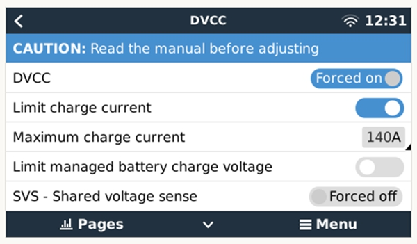

:::tip 最大充电电流计算
最大充电电流 = 电池组数量 × 0.5 × 单组电池容量（Ah）。请根据您实际使用的电池数量和容量进行计算。
:::

### 3. 设备识别确认

完成上述设置后，电池设备将出现在设备列表中，您可以在 **Battery Parameters** 页面中查看电池的实时数据。

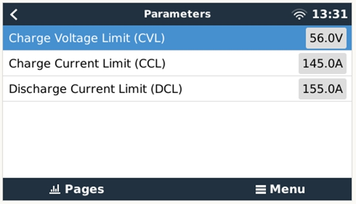

## VictronConnect App 设置

使用 VictronConnect 手机应用程序对 Victron 设备进行配置。

### 1. Victron MPPT 太阳能充电控制器设置

在 VictronConnect App 中选择 MPPT 设备，按以下参数配置：

|           设置项            |                值                 |
| :-------------------------: | :-------------------------------: |
| Charger Enabled（充电器启用） |                ON                 |
| Battery preset（电池预设）   |    User defined（用户自定义）     |
| Absorption Voltage（吸收电压） | 等于 Charge Voltage Limit (CVL)   |
|   Float voltage（浮充电压）  |  略低于 Absorption Voltage（吸收电压）  |
| Low temperature cut-off（低温切断） |           Disabled（禁用）        |

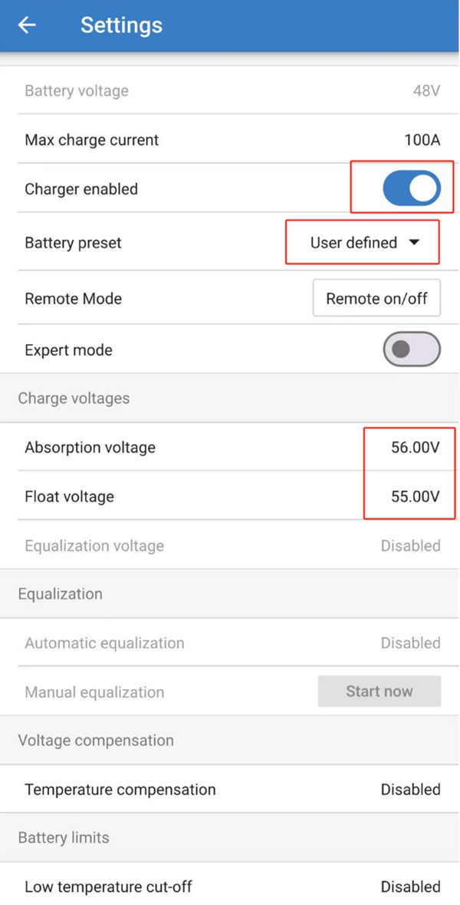

### 2. Victron 逆变器/充电器设置

在 VictronConnect App 中选择逆变器/充电器设备，按以下参数进行 **Charger（充电器）** 设置：

|            设置项             |                值                 |
| :---------------------------: | :-------------------------------: |
|  Enable Charger（启用充电器）   |                ON                 |
| Absorption Voltage（吸收电压）  | 等于 Charge Voltage Limit (CVL)   |
|  Float voltage（浮充电压）     | 略低于 Absorption Voltage（吸收电压） |
| Low temperature cut-off（低温切断） |          Disabled（禁用）         |
| Charge Curve（充电曲线）       |          Fixed（固定）            |
| Lithium batteries（锂电池模式） |                ON                 |

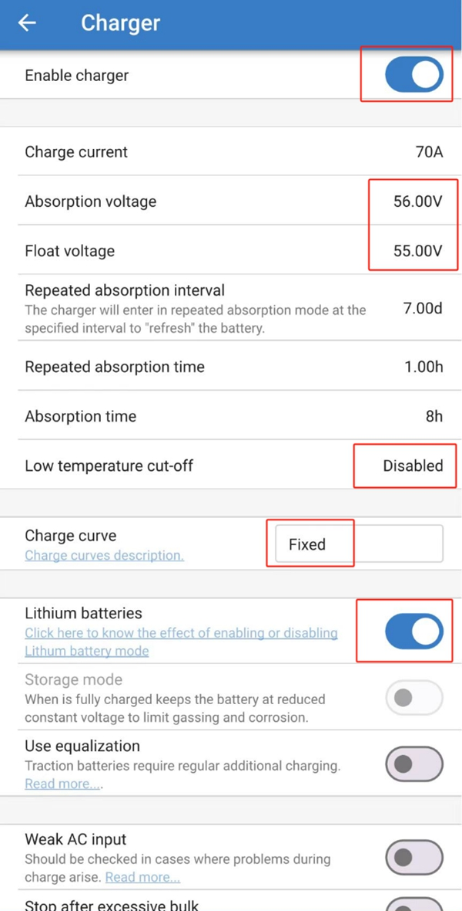

## VE Configuration Tools 设置

使用 Victron VE Configuration Tools 软件对逆变器/充电器进行高级配置。

### 1. 逆变器/充电器设置

#### 启用充电器

勾选 **Enable charger** 选项，启用充电器功能。

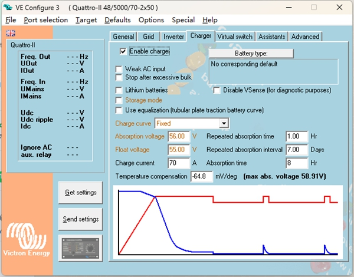

#### 锂电池模式

勾选 **Lithium batteries** 选项，启用锂电池模式。

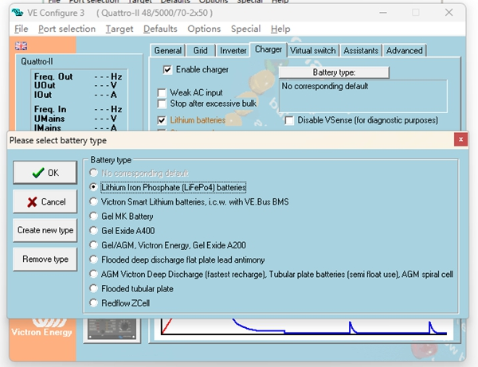

#### 其他设置

按以下参数进行配置：

|           设置项            |                值                 |
| :-------------------------: | :-------------------------------: |
| Charge curve（充电曲线）     |          Fixed（固定）            |
| Absorption voltage（吸收电压） | 等于 Charge Voltage Limit (CVL)   |
| Float voltage（浮充电压）    | 略低于 Absorption Voltage（吸收电压） |

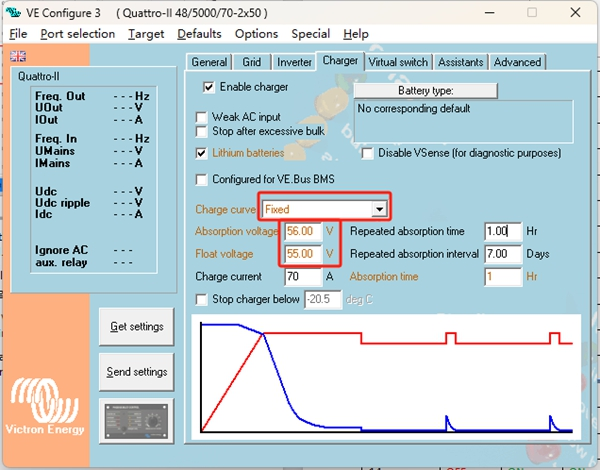

### 2. Virtual Switch（虚拟开关）设置

在 **Virtual switch** 选项卡中，选择 **Do not use VS**（不使用虚拟开关）。

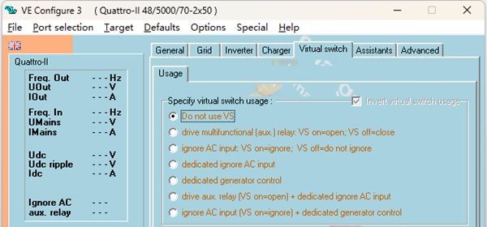

### 3. ESS（储能系统）助手设置 — 添加助手

在 **Assistant** 选项卡中，点击添加助手，选择 **ESS (Energy Storage System)**。

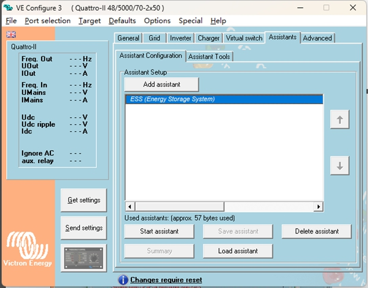

### 4. ESS 助手设置 — 配置参数

#### 选择系统类型

点击 **Start assistant**，在选项中选择第 5 项。

#### 设置总容量

输入电池系统的总容量。

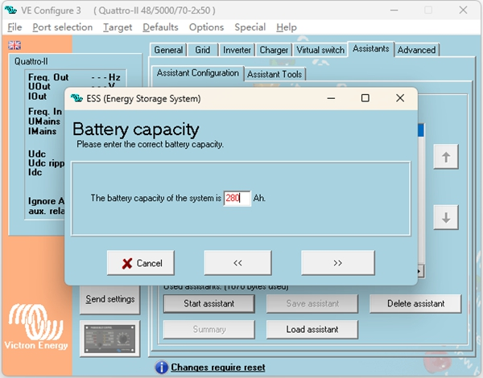

#### 电池类型

选择 **Do not change battery type**（不更改电池类型）。

#### 设置 Sustain 电压

将 **Sustain voltage** 设置为 **51V**。

#### 设置 Dynamic Cut-off（动态切断）

按以下对应关系设置动态切断电压：

|   放电倍率    |  切断电压  |
| :-----------: | :--------: |
|    0.005C     |    49V     |
|     0.25C     |    48V     |
|     0.7C      |    48V     |
|      2C       |    47V     |

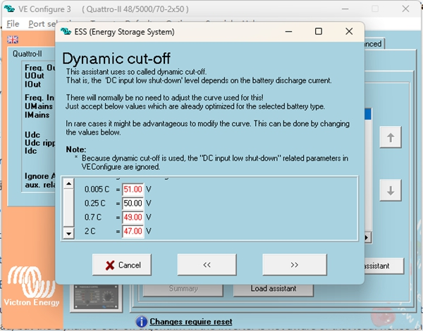

#### Restart Offset（重启偏移）

使用默认的 **Restart offset** 值，无需修改。

:::tip 设置完成
完成以上所有配置后，GP-PC200B BMS 电池系统即与 Victron 逆变器成功建立通讯和控制连接。您可在 Cerbo GX 设备列表中确认电池状态是否正常。
:::
