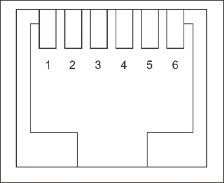

# GP-PC200B BMS 通讯连接手册

本手册适用于 **Gobel Power GP-PC200B** 电池管理系统（BMS），指导用户完成多电池并联通讯、逆变器连接以及通讯协议设置。

## 产品简介

GP-PC200B 是 Gobel Power 出品的一款电池管理系统（BMS），内置完善的通讯接口，支持多电池并联运行以及与主流品牌逆变器的通讯对接。

### 主要功能

- **多电池并联通讯**：支持最多 63 个从机并联，通过拨码开关或自动分配地址，实现多电池组协同管理
- **逆变器通讯**：通过 RS485 或 CAN 接口与逆变器通讯，适配多种逆变器协议
- **上位机监控**：通过 RS232 接口连接电脑上位机软件，实时查看电池状态、设置参数
- **灵活协议切换**：可通过屏幕或上位机软件切换逆变器通讯协议，兼容多种品牌逆变器

### 通讯接口一览

|         接口          |       用途       | 接口类型 |
| :-------------------: | :--------------: | :------: |
|    **RS485A** / **CAN**     | 逆变器 BMS 通讯  |   RJ45   |
| **RS485B** / **RS485C** | 电池间并联通讯 |   RJ45   |
|       **RS232**        | 上位机调试通讯 |   RJ12   |

## 部件清单

|         编号          |           名称           | 规格/数量 |              图片              |
| :-------------------: | :----------------------: | :-------: | :----------------------------: |
| <a id="Part01">01</a> |  RJ45 并联通讯线缆  |    1根    |  |
| <a id="Part02">02</a> | RJ45 逆变器通讯线缆 |    1根    |  |
| <a id="Part03">03</a> | USB 转 RS232 上位机通讯线缆 |    1根    |  |

:::note
- **RJ45 并联通讯线缆（[01](#Part01)）** 和 **RJ45 逆变器通讯线缆（[02](#Part02)）** 外观相同，均为 RJ45 接口网线。请根据线缆标签或包装区分用途。
- 逆变器通讯线缆两端针脚定义为对称直连。如果 BMS 端针脚定义与逆变器端不一致，需自行制作线缆或从逆变器厂商购买专用线缆。
:::

## 产品通信接口说明

### RS485A / CAN 端口

RS485A 和 CAN 共用同一个 RJ45 物理端口，用于与逆变器进行 BMS 通讯。根据逆变器支持的协议类型选择使用 RS485A 或 CAN 接口。

**RS485A 针脚定义（RJ45，8P8C）：**

| 针脚 | 信号 |
| :--: | :--: |
|  1   |  B   |
|  2   |  A   |
|  3   | GND  |
|  4   |  NC  |
|  5   |  NC  |
|  6   | GND  |
|  7   |  A   |
|  8   |  B   |

**CAN 针脚定义（RJ45，8P8C）：**

| 针脚 | 信号  |
| :--: | :---: |
|  1   |  NC   |
|  2   |  GND  |
|  3   |  NC   |
|  4   | CAN-H |
|  5   | CAN-L |
|  6   |  NC   |
|  7   |  NC   |
|  8   |  NC   |

### RS232 端口

RS232 端口用于连接电脑上位机软件，进行参数设置和状态监控。

**RS232 针脚定义（RJ12，6P6C）：**

| 针脚 | 信号 |
| :--: | :--: |
|  1   |  NC  |
|  2   |  NC  |
|  3   | TXD  |
|  4   | RXD  |
|  5   | GND  |
|  6   |  NC  |

### RS485B / RS485C 端口

RS485B 和 RS485C 用于电池间并联通讯。RS485B 为输出端口，RS485C 为输入端口。

**RS485B / RS485C 针脚定义（RJ45，8P8C）：**

| 针脚 | 信号 |
| :--: | :--: |
|  1   |  B   |
|  2   |  A   |
|  3   | GND  |
|  4   |  NC  |
|  5   |  NC  |
|  6   | GND  |
|  7   |  A   |
|  8   |  B   |

:::tip 针脚说明
- **A / B**：RS485 差分信号线
- **CAN-H / CAN-L**：CAN 总线差分信号线
- **TXD / RXD**：RS232 发送与接收信号线
- **GND**：信号地
- **NC**：未连接（No Connection），该针脚无功能
:::

## 并联步骤

### 拨号设置

在进行并联接线之前，需要先为每个电池设置通讯地址。BMS 支持两种拨号方式：

#### 自动拨号

将所有 BMS 的拨码开关全部拨到 **OFF** 位置（即 OFF OFF OFF OFF OFF OFF），BMS 系统将自动为各电池分配通讯地址。

:::tip 推荐
自动拨号方式操作简便，适用于大多数场景。推荐优先使用自动拨号。
:::

#### 手动拨号

如需手动指定每个电池的通讯地址，请参考附录中的拨码开关设置表，逐一为每个电池设置地址。

- **地址 01**：主机（Master），一台并联系统中必须有且仅有一台主机
- **地址 02–63**：从机（Slave），其余电池均设为从机，地址不能重复

### 并联接线

拨号设置完成后，使用 **RJ45 并联通讯线缆（[01](#Part01)）** 将各电池的 **RS485B** 和 **RS485C** 端口依次串联。

接线规则：

- 将第一台电池的 **RS485B** 端口连接至第二台电池的 **RS485C** 端口
- 将第二台电池的 **RS485B** 端口连接至第三台电池的 **RS485C** 端口
- 以此类推，直至连接完所有电池

:::info 端口方向
RS485B 为输出端口，RS485C 为输入端口。数据从第一台电池的 RS485B 输出，经第二台电池的 RS485C 输入，再由其 RS485B 输出至下一台，形成菊花链拓扑。
:::

## 逆变器连接

并联接线完成后，使用 **RJ45 逆变器通讯线缆（[02](#Part02)）** 将电池组与逆变器连接。

操作步骤：

1. 确认逆变器使用的通讯协议类型（RS485 或 CAN），参考逆变器产品说明书
2. 将线缆一端插入第一台电池（主机）的对应端口：
   - 若逆变器使用 RS485 协议，插入 **RS485A** 端口
   - 若逆变器使用 CAN 协议，插入 **CAN** 端口
3. 将线缆另一端插入逆变器的 BMS 通讯接口

:::caution 针脚匹配
产品附带的 **RJ45 逆变器通讯线缆（[02](#Part02)）** 两端为对称直连。连接前请务必核对以下两项：

- BMS 端 **RS485A** 或 **CAN** 端口的针脚定义
- 逆变器端 BMS 通讯接口的针脚定义（参见逆变器产品说明书）

若两端针脚定义不一致，需自行制作匹配的通讯线缆，或从逆变器厂商购买专用线缆（如 Victron 逆变器需使用其专用线缆）。
:::

## 协议设置

完成物理接线后，需要在第一台电池（主机）上设置与逆变器匹配的通讯协议。有两种设置方式：

### 通过屏幕设置

在第一台电池（主机）的显示屏菜单中，找到 **逆变器协议设置** 选项，从协议列表中选择与当前逆变器品牌和型号对应的通讯协议。

### 通过上位机软件设置

1. 使用 **USB 转 RS232 上位机通讯线缆（[03](#Part03)）** 将第一台电池（主机）的 **RS232** 端口连接至电脑
2. 打开电脑上的 BMS 上位机软件
3. 在软件中找到逆变器协议设置选项，选择对应的逆变器协议
4. 保存设置后断开线缆

:::tip
如果不确定选择哪个协议，请查阅逆变器产品说明书中的 BMS 通讯章节，或联系逆变器厂商获取技术支持。
:::

## 附录

### 拨码开关设置表

下表列出所有拨码开关组合。各电池的地址必须唯一，系统中仅允许一个主机（地址 01），其余为从机（地址 02–63）。

| 地址 | SW1 | SW2 | SW3 | SW4 | SW5 | SW6 | 角色 |
| :--: | :-: | :-: | :-: | :-: | :-: | :-: | :--: |
| 00 | OFF | OFF | OFF | OFF | OFF | OFF | 无效 |
| 01 | ON | OFF | OFF | OFF | OFF | OFF | 主机 |
| 02 | OFF | ON | OFF | OFF | OFF | OFF | 从机 |
| 03 | ON | ON | OFF | OFF | OFF | OFF | 从机 |
| 04 | OFF | OFF | ON | OFF | OFF | OFF | 从机 |
| 05 | ON | OFF | ON | OFF | OFF | OFF | 从机 |
| 06 | OFF | ON | ON | OFF | OFF | OFF | 从机 |
| 07 | ON | ON | ON | OFF | OFF | OFF | 从机 |
| 08 | OFF | OFF | OFF | ON | OFF | OFF | 从机 |
| 09 | ON | OFF | OFF | ON | OFF | OFF | 从机 |
| 10 | OFF | ON | OFF | ON | OFF | OFF | 从机 |
| 11 | ON | ON | OFF | ON | OFF | OFF | 从机 |
| 12 | OFF | OFF | ON | ON | OFF | OFF | 从机 |
| 13 | ON | OFF | ON | ON | OFF | OFF | 从机 |
| 14 | OFF | ON | ON | ON | OFF | OFF | 从机 |
| 15 | ON | ON | ON | ON | OFF | OFF | 从机 |
| 16 | OFF | OFF | OFF | OFF | ON | OFF | 从机 |
| 17 | ON | OFF | OFF | OFF | ON | OFF | 从机 |
| 18 | OFF | ON | OFF | OFF | ON | OFF | 从机 |
| 19 | ON | ON | OFF | OFF | ON | OFF | 从机 |
| 20 | OFF | OFF | ON | OFF | ON | OFF | 从机 |
| 21 | ON | OFF | ON | OFF | ON | OFF | 从机 |
| 22 | OFF | ON | ON | OFF | ON | OFF | 从机 |
| 23 | ON | ON | ON | OFF | ON | OFF | 从机 |
| 24 | OFF | OFF | OFF | ON | ON | OFF | 从机 |
| 25 | ON | OFF | OFF | ON | ON | OFF | 从机 |
| 26 | OFF | ON | OFF | ON | ON | OFF | 从机 |
| 27 | ON | ON | OFF | ON | ON | OFF | 从机 |
| 28 | OFF | OFF | ON | ON | ON | OFF | 从机 |
| 29 | ON | OFF | ON | ON | ON | OFF | 从机 |
| 30 | OFF | ON | ON | ON | ON | OFF | 从机 |
| 31 | ON | ON | ON | ON | ON | OFF | 从机 |
| 32 | OFF | OFF | OFF | OFF | OFF | ON | 从机 |
| 33 | ON | OFF | OFF | OFF | OFF | ON | 从机 |
| 34 | OFF | ON | OFF | OFF | OFF | ON | 从机 |
| 35 | ON | ON | OFF | OFF | OFF | ON | 从机 |
| 36 | OFF | OFF | ON | OFF | OFF | ON | 从机 |
| 37 | ON | OFF | ON | OFF | OFF | ON | 从机 |
| 38 | OFF | ON | ON | OFF | OFF | ON | 从机 |
| 39 | ON | ON | ON | OFF | OFF | ON | 从机 |
| 40 | OFF | OFF | OFF | ON | OFF | ON | 从机 |
| 41 | ON | OFF | OFF | ON | OFF | ON | 从机 |
| 42 | OFF | ON | OFF | ON | OFF | ON | 从机 |
| 43 | ON | ON | OFF | ON | OFF | ON | 从机 |
| 44 | OFF | OFF | ON | ON | OFF | ON | 从机 |
| 45 | ON | OFF | ON | ON | OFF | ON | 从机 |
| 46 | OFF | ON | ON | ON | OFF | ON | 从机 |
| 47 | ON | ON | ON | ON | OFF | ON | 从机 |
| 48 | OFF | OFF | OFF | OFF | ON | ON | 从机 |
| 49 | ON | OFF | OFF | OFF | ON | ON | 从机 |
| 50 | OFF | ON | OFF | OFF | ON | ON | 从机 |
| 51 | ON | ON | OFF | OFF | ON | ON | 从机 |
| 52 | OFF | OFF | ON | OFF | ON | ON | 从机 |
| 53 | ON | OFF | ON | OFF | ON | ON | 从机 |
| 54 | OFF | ON | ON | OFF | ON | ON | 从机 |
| 55 | ON | ON | ON | OFF | ON | ON | 从机 |
| 56 | OFF | OFF | OFF | ON | ON | ON | 从机 |
| 57 | ON | OFF | OFF | ON | ON | ON | 从机 |
| 58 | OFF | ON | OFF | ON | ON | ON | 从机 |
| 59 | ON | ON | OFF | ON | ON | ON | 从机 |
| 60 | OFF | OFF | ON | ON | ON | ON | 从机 |
| 61 | ON | OFF | ON | ON | ON | ON | 从机 |
| 62 | OFF | ON | ON | ON | ON | ON | 从机 |
| 63 | ON | ON | ON | ON | ON | ON | 从机 |
