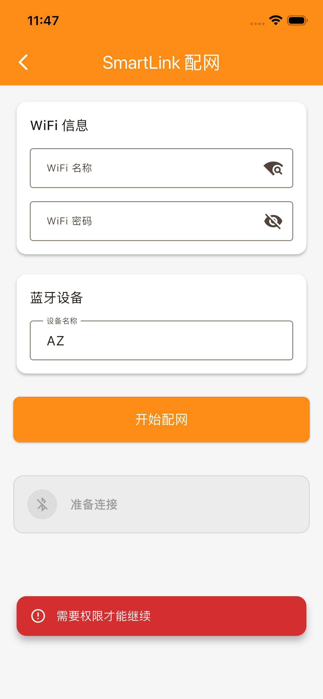

# LP-21700 常见问题

## 一般问题

### Q: LP-21700 和 18650 有什么区别？
A: LP-21700 容量更大 (5000mAh vs 2500mAh)，尺寸更大，循环寿命更长。

### Q: 可以用普通锂电池充电器吗？
A: 不可以，必须使用磷酸铁锂专用充电器，充电电压不同。

### Q: 电池发热正常吗？
A: 轻微发热是正常的，如果过热请停止充电并检查。

## 技术问题

### Q: 最大可以串联多少节？
A: 建议最多 16 节串联，需要配合 BMS 使用。

### Q: 如何判断电池是否损坏？
A: 使用万用表测量内阻，如果超过 30mΩ 可能需要更换。

### Q: 存储时需要充满电吗？
A: 长期存储建议保持 45%~55% SOC (约 3.2V)。

## 安全问题

### Q: 电池起火怎么办？
A: 立即切断电源，使用干粉灭火器或沙土覆盖，不要用水。

### Q: 电池可以寄送吗？
A: 电池属于危险品，需要按照 IATA 规定进行特殊包装和申报。
