# GP-SRA-PC314 组装手册

**品牌：** Gobel Power

**产品型号：** GP-SRA-PC314

**手册类型：** 组装手册

**适用产品：** 磷酸铁锂高压电池 DIY 套件

## 安全须知

:::danger 电气安全
- 系统电压最高可达 1000V，在安装调试和使用期间，必须按相关安全规定做好安全防护措施，避免安全事故的发生
- **严禁在高压箱上电的情况下连接从控 BMU**，避免可能损坏 BMS
- 安装及调试人员所使用的工具须有绝缘防护
- 在安装调试及维护时必须戴绝缘橡胶手套，视情况穿戴护目镜、绝缘橡胶靴，尽可能避免安全事故的发生
- 需要维护时，必须将主断路器断开，切断电池组与 PCS 直流总线的连接
:::

:::danger 电池安全
- 安装调试及维护过程中产生的线头金属等如掉入电池间，请务必使用绝缘工具取出，不能将杂物留置
- 确保正负极连接正确，避免短路损坏电池或 BMS
:::

:::warning 消防安全
- 如遇储能柜周围起火，请务必使用干粉灭火器或者消防沙进行灭火
- **若使用液体灭火可能导致电击**
- 如长期不使用系统，请务必断开电池柜的主断路器
:::

:::warning 一般安全
- 工作环境应保持干燥、通风、无易燃物
- 儿童及无关人员应远离安装区域
- 请使用合格且有绝缘防护的工具进行操作
:::

## 产品简介

GP-SRA-PC314 是 Gobel Power 推出的磷酸铁锂高压电池 DIY 套件，由高压箱、BMU 和电池包三大部分组成。

### 主要特点

- **电芯规格**：使用 314Ah LiFePO4 磷酸铁锂电芯
- **连接方式**：1P18S 串联（18 串并）
- **系统配置**：该高压系统至少需要 5 个电池包，最多 15 个电池包串联
- **BMU 功能**：每个电池包装一个 BMU，可检测 18 个电芯的电压，配备 8 个 NTC 温度传感器
- **高压箱性能**：
  - 最大支持 200A 电流
  - 可连接逆变器、上位机、EMS
  - 提供过充保护、过放保护、过流保护、过温保护、低温保护及多级告警机制
  - 可与总控进行实时通信，上传电池数据
  - 具有电池状态和数据存储功能
  - 具备 RS485、CAN 隔离通信功能
  - 可外接 6 个继电器，适应工商业储能、UPS 供电系统及其他应用

## 部件清单

:::note
下表中标注"N"的数量表示每个电池包所需的数量，高压箱和某些公共部件只需要 1 件。
:::

|         编号          |       名称       |    规格/数量    |             图片             |
| :-------------------: | :--------------: | :-------------: | :--------------------------: |
| <a id="part01">01</a> |     箱体外壳     |     1 件/N      |    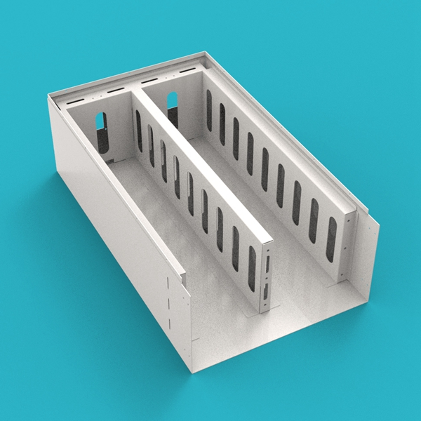    |
| <a id="part02">02</a> |    电芯压缩板    |     1 件/N      |      |
| <a id="part03">03</a> |     电芯压条     |     1 件/N      |      |
| <a id="part04">04</a> |   底部环氧板     |     2 件/N      |      |
| <a id="part05">05</a> |   侧部环氧板     |     4 件/N      |      |
| <a id="part06">06</a> |   电芯环氧板     |    20 件/N      |      |
| <a id="part07">07</a> |   压条环氧板     |     2 件/N      |      |
| <a id="part08">08</a> |   电芯连接片     |    17 件/N      |    |
| <a id="part09">09</a> | 正负极接线片     |     2 件/N      |   |
| <a id="part10">10</a> |    正极铜排      |     1 件/N      |      |
| <a id="part11">11</a> |    负极铜排      |     1 件/N      |      |
| <a id="part12">12</a> |    箱体盖子      |     1 件/N      |      |
| <a id="part13">13</a> |    箱体面板      |     1 件/N      |   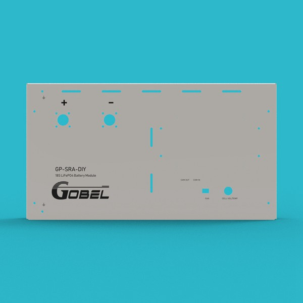   |
| <a id="part14">14</a> |      风扇        |     2 件/N      |   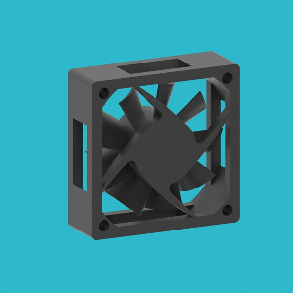   |
| <a id="part15">15</a> |   风扇固定板     |     2 件/N      |  |
| <a id="part16">16</a> |  风扇防护罩      |     2 件/N      |  |
| <a id="part17">17</a> |      BMU         |     1 件/N      |    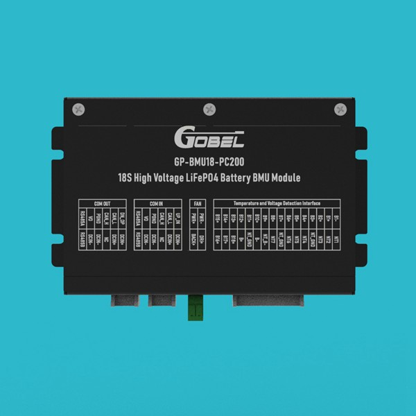    |
| <a id="part18">18</a> |     高压箱       |   1 件 (系统)   |      |
| <a id="part19">19</a> |  BMU 通讯线       |     1 件/N      |   |
| <a id="part20">20</a> |  风扇连接线      |     1 件/N      |  |
| <a id="part21">21</a> | 高压箱-BMU 通讯线 |   1 件 (系统)   | 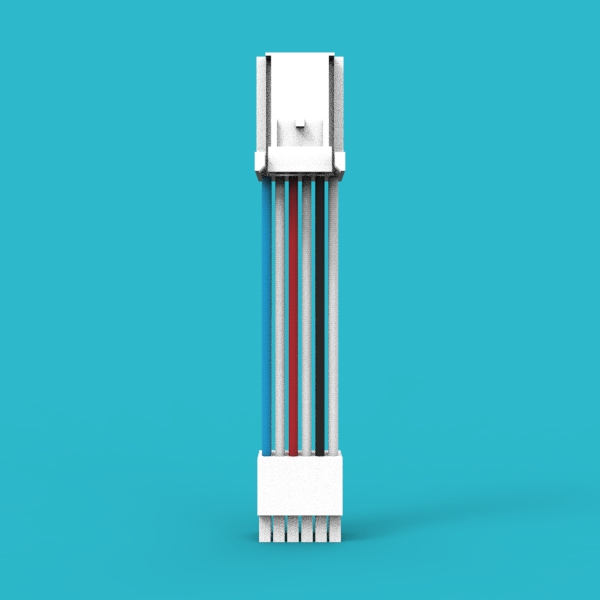 |
| <a id="part22">22</a> |  上位机通讯线    |   1 件 (系统)   |   |
| <a id="part23">23</a> |  正极端子底座    |     1 件/N      | 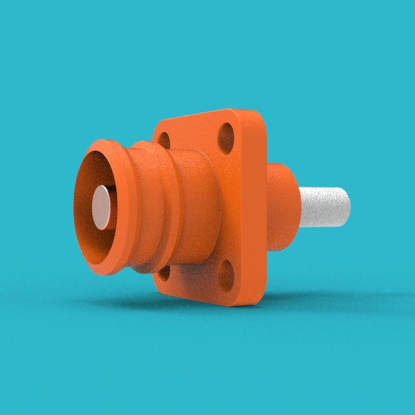 |
| <a id="part24">24</a> |  负极端子底座    |     1 件/N      | 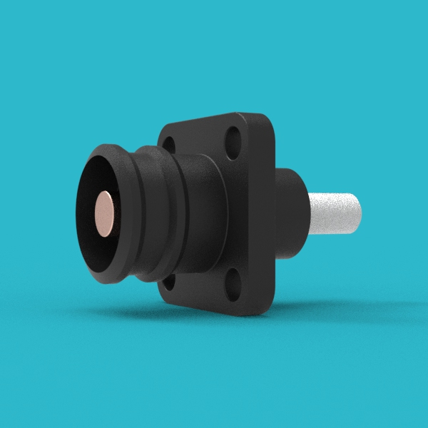 |
| <a id="part25">25</a> |  正极端子插头    |   (1 件 +2)/N   |  |
| <a id="part26">26</a> |  负极端子插头    |   (1 件 +2)/N   |  |
| <a id="part27">27</a> |      把手        |     2 件/N      |        |
| <a id="part28">28</a> |  箱体固定耳      |     2 件/N      |  |
| <a id="part29">29</a> |  电压检测线      |     1 件/N      |   |
| <a id="part30">30</a> | 逆变器通讯线     |   1 件 (系统)   |  |

## 工具与材料准备

:::note
以下工具和材料不随产品附带，需用户自备。
:::

| 工具/材料 | 规格/要求 | 用途 |
| :--------: | :-------: | :--: |
| 绝缘螺丝刀套装 | 包含常用规格 | 紧固螺丝 |
| 扭矩扳手 | M6/M8/M10 套筒 | 按扭矩要求紧固螺丝 |
| 线缆压接钳 | 适用于 300A 端子 | 压接正负极端子插头 |
| 万用表 | 绝缘等级符合高压要求 | 检测电压、通断 |
| 绝缘橡胶手套 | 高压防护等级 | 人身安全防护 |
| 护目镜 | 防冲击 | 保护眼睛 |
| 绝缘橡胶靴 | 高压防护 | 人身安全防护 |
| 干粉灭火器或消防沙 | — | 消防应急 |
| 线缆剪切工具 | 适用于高压线缆 | 裁剪合适长度的线缆 |
| 绝缘胶带 | 高压绝缘等级 | 绝缘保护 |

## 螺丝扭矩要求

:::warning
请务必使用扭矩扳手按以下标准紧固螺丝，过松或过紧都可能导致连接不良或部件损坏。
:::

| 螺丝规格 |   扭矩要求   |
| :------: | :----------: |
|   **M6** |   **8N·m**   |
|   **M8** |  **15N·m**   |
|  **M10** | **15-20N·m** |

## 组装步骤

### 风扇总成预装

**步骤 1：** 组装风扇总成

将 **风扇（[14](#part14)）**、**风扇固定板（[15](#part15)）** 和 **风扇防护罩（[16](#part16)）** 组装在一起。共需组装 2 个总成待用。

:::note 注意事项
- 注意风扇标签文字朝向防护罩方向
- 确保风扇安装牢固，无松动
:::

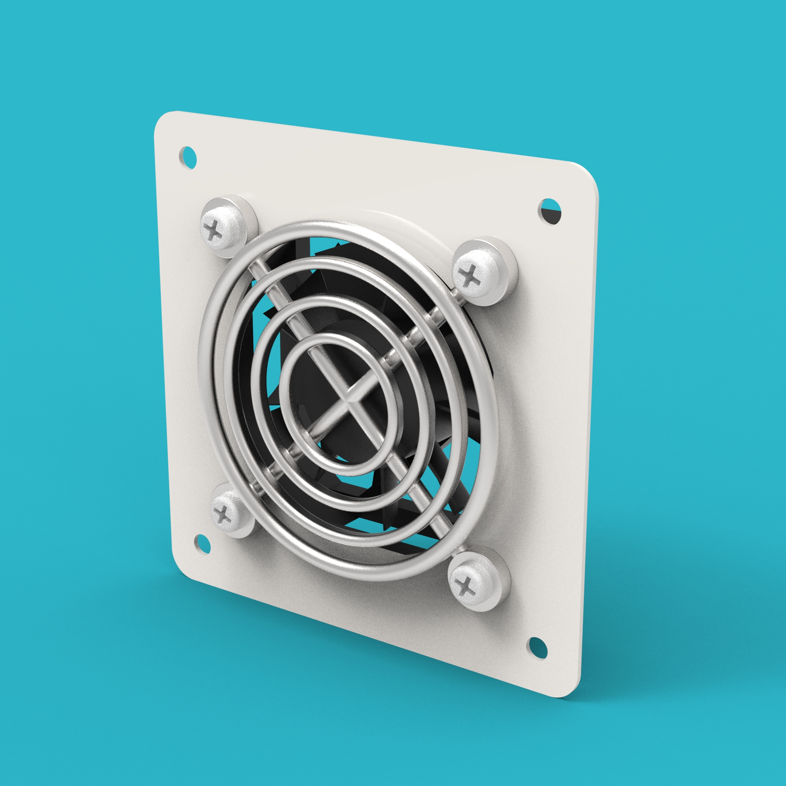

### 箱体面板总成预装

**步骤 2：** 组装箱体面板总成

将 **箱体面板（[13](#part13)）**、**正极端子底座（[23](#part23)）**、**负极端子底座（[24](#part24)）**、**BMU（[17](#part17)）** 和 **把手（[27](#part27)）** 组装在一起待用。

:::tip
建议在工作台上预先排列好各部件位置，确保安装时对齐准确。
:::

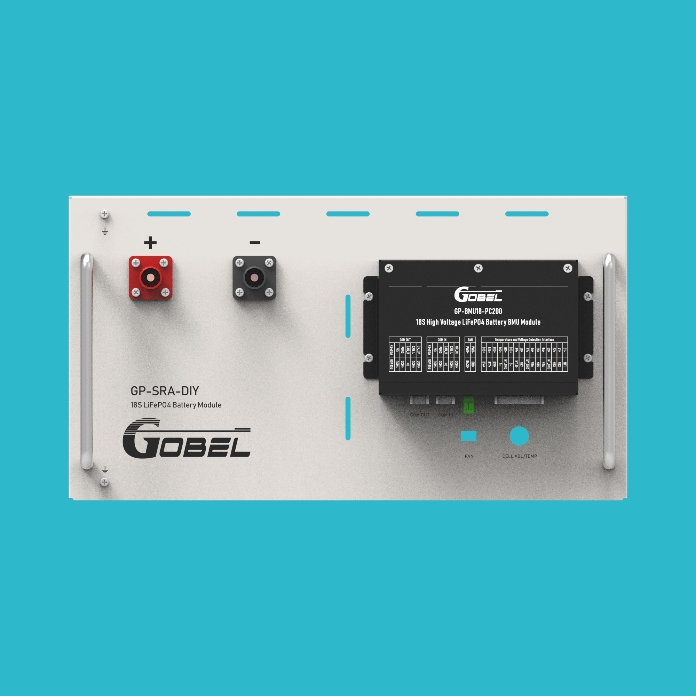

### 串联线预装

**步骤 3：** 组装电池包间串联线

使用线缆压接钳和合适长度的线缆压接 **正极端子插头（[25](#part25)）** 和 **负极端子插头（[26](#part26)）**，组成电池包间串联线。

:::note
- 确保压接牢固，无松动
- 线缆长度应根据实际电池包间距确定
:::

**步骤 4：** 组装电池包与高压箱正极连接线

使用线缆压接钳和合适长度的线缆压接两个 **正极端子插头（[25](#part25)）**，组成电池包与高压箱正极连接线。

**步骤 5：** 组装电池包与高压箱负极连接线

使用线缆压接钳和合适长度的线缆压接两个 **负极端子插头（[26](#part26)）**，组成电池包与高压箱负极连接线。

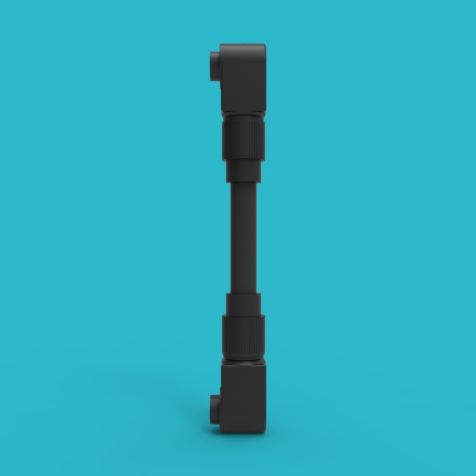

### 电池包主体组装

**步骤 6：** 安装风扇总成到箱体

将风扇总成装到 **箱体外壳（[01](#part01)）** 上，风扇的线从箱体框架上的孔中穿出。

:::note
- 确保风扇标签面朝外
- 风扇线应从箱体框架预留孔穿出，避免挤压
:::

**步骤 7：** 安装底部和侧部环氧板

将 **底部环氧板（[04](#part04)）** 和 **侧部环氧板（[05](#part05)）** 放入箱体。

**步骤 8：** 安装电芯到箱体

将电芯放入 **箱体外壳（[01](#part01)）**，注意电芯正负极方向。

:::warning 注意
电芯正负极方向必须正确，否则会导致后续连接错误。
:::

**步骤 9：** 安装电芯压缩板

将 **电芯压缩板（[02](#part02)）** 安装于电芯端部，防止电芯膨胀。

**步骤 10：** 安装压条环氧板

将 **压条环氧板（[07](#part07)）** 安装于电芯上方。

**步骤 11：** 安装电芯压条

将 **电芯压条（[03](#part03)）** 安装于压条环氧板上方。

### 电气连接

**步骤 12：** 安装电芯连接片和正负极接线片

安装 **电芯连接片（[08](#part08)）** 和 **正负极接线片（[09](#part09)）**。

:::warning 高压危险
- 此步骤涉及高压连接，请确保操作前已做好绝缘防护
- 连接片安装应牢固，接触面应紧密
:::

**步骤 13：** 安装箱体面板总成

将组装好的箱体面板总成安装到箱体。安装前先把 **电压检测线（[29](#part29)）** 和 **风扇连接线（[20](#part20)）** 从面板孔中穿入。

**步骤 14：** 安装箱体固定耳

将 **箱体固定耳（[28](#part28)）** 安装到箱体。

**步骤 15：** 连接电压检测线和风扇连接线

- 将 **电压检测线（[29](#part29)）** 连接到对应的电芯上
- 将 **风扇连接线（[20](#part20)）** 连接到风扇引出线上
- 电压检测线另一端接 BMU 上的 **CELL VOLT/TEMP** 端口
- 风扇连接线另一端接 BMU 上的 **FAN** 端口

:::note
- 确保电压检测线按顺序连接到每个电芯
- 风扇连接线注意正负极对应
:::

**步骤 16：** 安装正负极铜排

安装 **正极铜排（[10](#part10)）** 和 **负极铜排（[11](#part11)）**。

:::warning
- 铜排连接必须紧固到位，使用扭矩扳手按标准扭矩紧固
- 确保铜排与其他金属部件保持安全距离
:::

### 总装完成

**步骤 17：** 安装箱体盖子

将 **箱体盖子（[12](#part12)）** 安装到箱体上。

:::note
- 安装前检查箱体内无遗留工具或杂物
- 确保盖子密封良好
:::

**步骤 18：** 电池包组装完成

电池包组装完毕。检查所有连接是否牢固，确认无遗漏步骤后方可进行下一步系统连接。

:::tip 组装完成检查
- 检查所有螺丝是否按扭矩要求紧固
- 检查所有电气连接是否正确、牢固
- 检查箱体内无遗留金属杂物
- 检查风扇转动是否正常
:::

## 连接步骤

:::note
以下连接步骤用于将多个电池包与高压箱连接成完整的高压系统。系统至少需要 5 个电池包，最多 15 个电池包串联。
:::

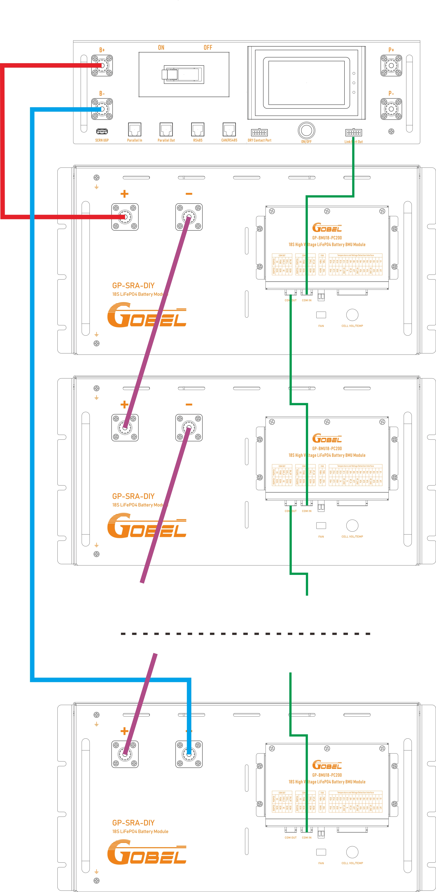

**步骤 1：** 电池包间串联连接

将第一个电池包的正极与第二个电池包的负极用 **电池包间串联线** 连接。以此类推，将所有电池包串联。

**步骤 2：** 高压箱与第一个电池包 BMU 通讯连接

将高压箱的 **Link Port Out** 端口与第一个电池包的 **COM IN** 端口用 **高压箱-BMU 通讯线（[21](#part21)）** 连接。

**步骤 3：** 电池包间 BMU 通讯连接

将第一个电池包的 **COM OUT** 端口与第二个电池包的 **COM IN** 端口用 **BMU 通讯线（[19](#part19)）** 连接。以此类推，将所有电池包的 BMU 通讯口串联。

**步骤 4：** 高压箱与第一个电池包正极连接

将高压箱的 **B+** 端口与第一个电池包的正极用 **电池包与高压箱正极连接线** 连接。

**步骤 5：** 高压箱与最后一个电池包负极连接

将最后一个电池包的负极与高压箱的负极用 **电池包与高压箱负极连接线** 连接。

:::danger 高压危险
- 连接前请确保所有断路器处于断开状态
- 连接完成后检查所有接线是否正确、牢固
- 首次上电前请使用万用表检查总电压是否正常
:::

## 端口示意图

### 电池包端口示意图

### 高压箱端口示意图

### BMU 端口示意图

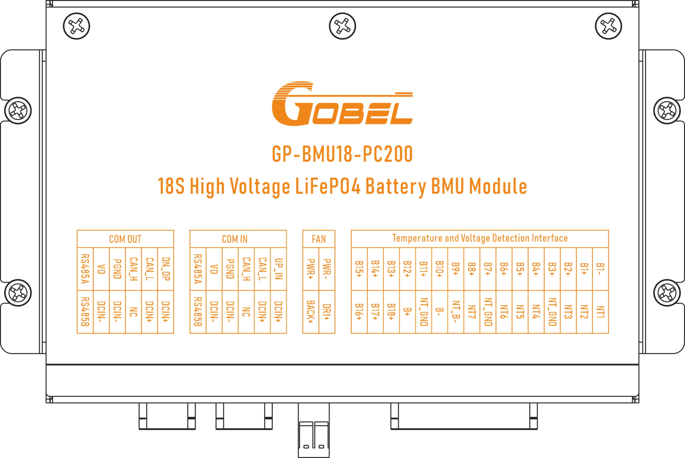

## 联系方式

如遇到无法解决的故障，请联系 Gobel Power 技术支持：

- **官方网站：** www.gobelpower.com
- **技术支持邮箱：** cs@gobelpower.com
