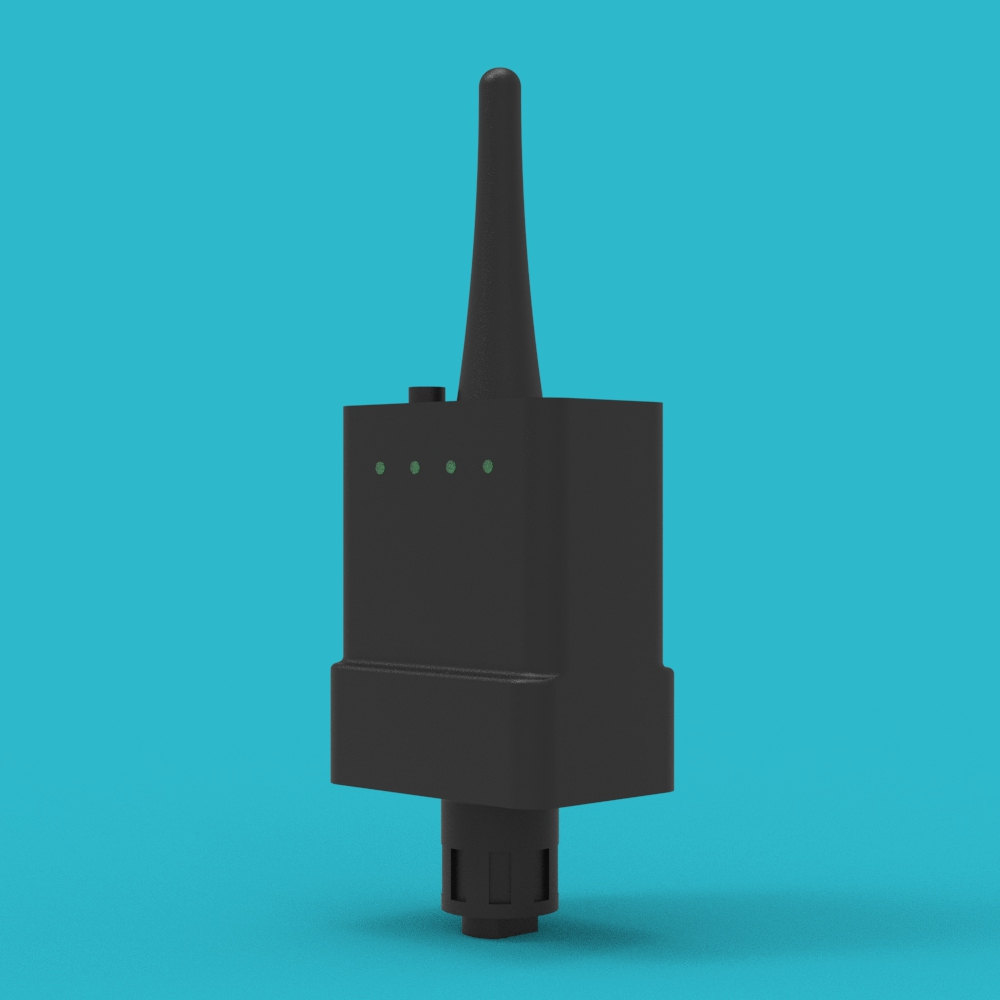
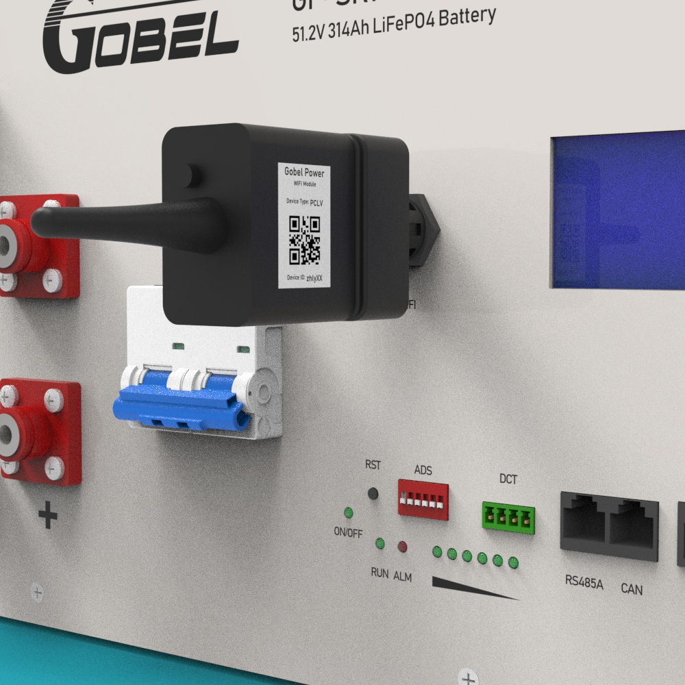
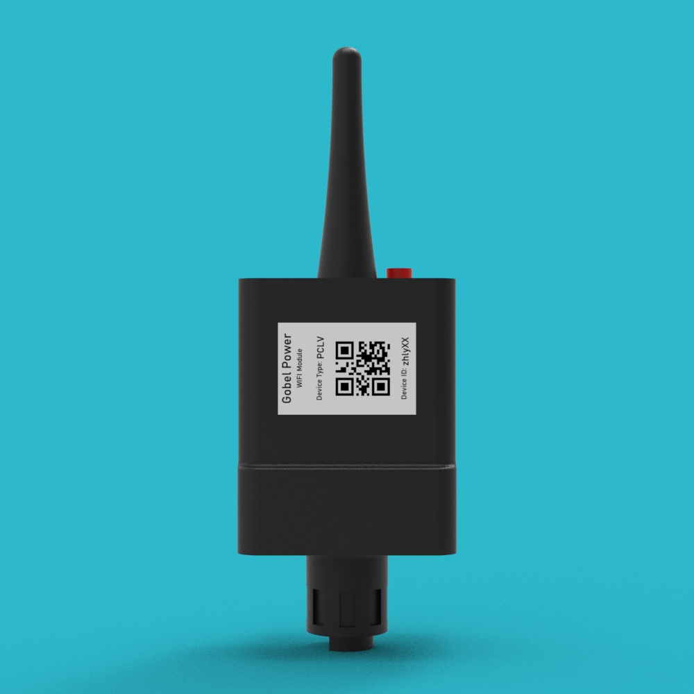

# GP-PWB1-PC200B WIFI模块安装与配置手册

## 目录

## 安全须知

:::danger 电气安全
在插入或拔出 WIFI 模块之前，请确保电池处于关机状态，以防止带电插拔可能导致的电弧或接口损坏。
:::

:::warning 一般安全
1. 请勿在潮湿、高温或充满腐蚀性气体的环境中使用或存放模块。
2. 模块为精密电子部件，请避免剧烈震动、撞击或坠落。
3. 确保安装在模块上的密封盖已拧紧，以防止灰尘和水分进入电池端子。
:::

## 产品简介

GP-PWB1-PC200B WIFI模块是专为配备有 WIFI 端口的最新的 GP-PC200B BMS 电池设计的远程通讯适配器。

该模块与 Gobel VRM 在线平台及 Gobel VRM App（支持 Android 和 iOS）配合使用，可实现对单体电池或多达 63 个并联电池组的集中监控与管理。

### 主要功能特点
- **实时监控**：记录并显示每个电池的电流、电压、温度以及各电芯的单体电压。
- **参数设置**：允许用户设置向逆变器请求的最大电压、最大充电电流及最大放电电流。
- **高频更新**：数据更新频率最快可达 10 秒/次。
- **历史回溯**：云端历史记录可保存长达 6 个月。
- **多机并联**：仅需一个模块即可监控整个并联电池系统。

## 部件清单

|         编号          |         名称          | 规格/数量 |             图片             |
| :-------------------: | :-------------------: | :-------: | :--------------------------: |
| <a id="part01">01</a> | **WIFI通讯模块** |    1个    |  |

:::tip 部件说明
该模块包含集成的 2.4GHz WIFI 天线和 LED 状态指示灯，用于显示配网和运行状态。
:::

## 安装步骤

### 1. 确认端口
确认电池面板上具有专用的 WIFI 端口（WIFI Connecter）。

### 2. 插入模块
将 **WIFI通讯模块（[01](#part01)）** 按照接口键位的特定方向完全插入到电池面板上的 WIFI 端口中。

### 3. 固定密封盖
顺时针方向拧紧 **WIFI通讯模块（[01](#part01)）** 自带的密封盖，确保物理连接牢固且达到防护要求。

### 4. 确认安装
将电池开启电源，观察 **WIFI通讯模块（[01](#part01)）** 上的指示灯是否亮起。指示灯亮起即表示模块安装物理连接完成。

## 配置及配网流程

:::tip 注意事项
1. WIFI 模块仅支持 2.4GHz WIFI 网络（不支持 5GHz）。
2. 请在 Google Play 或 App Store 下载 **Gobel VRM** App 后再开始操作。
:::

### 1. 软件准备
打开手机上的 Gobel VRM App。点击 App 底部的 **更多（More）** 标签，然后点击 **Smart Link**。

### 2. 模式激活
短按模块顶部的圆形配置按钮（按住约 1-2s）。此时模块指示灯应开始快速闪烁，表明模块已进入等待配置（Provisioning）模式。

### 3. WIFI 登录
在 **Smart Link** 页面输入需要连接的 2.4GHz WIFI 热点名称和密码。您可以点击 WIFI 图标来扫描并从中选择可用的 2.4GHz WIFI 热点。

### 4. 自动配网
点击 **开始配网（Start Provisioning）** 按钮。系统将自动对 **WIFI通讯模块（[01](#part01)）** 进行 WIFI 配网设置。

### 5. 状态确认
配网成功后，模块上的指示灯将由快速闪烁变为常亮或正常通讯状态（指示灯停止快速闪烁）。

### 6. 添加设备
返回到 App 的 **More** 页面，点击 **添加设备（Add Device）**。在开始下一步之前，请在 **WIFI通讯模块（[01](#part01)）** 的侧面标签上找到 **设备ID（Device ID）** 和 **设备类型（Device Type）**。

### 7. 数据录入
在 **Add Device** 页面输入以下信息：
- **设备ID（Device ID）**：建议点击二维码图标进行扫描输入。
- **安装名称（Installation Name）**：您可以自定义该系统的名称。
- **设备类型（Device Type）**：请选择与模块标签一致的设备类型。

### 8. 完成配置
点击 **Add** 按钮完成添加。现在您可以在 **Installations** 页面实时查看电池的监控信息。

## 常见问题与说明 (FAQ)

### 1. 多个电池并联时如何使用？
当多个电池进行并联时，**只需要使用一个 WIFI 模块**。将其插入到并联系统中设置为主机（Master）的电池 WIFI 端口即可监控整个集群。

### 2. 在旧款 GP-PC200 BMS 上使用
旧款 GP-PC200 BMS 本身没有配置 WIFI 端口，无法直接安装该模块。但通过并联技术，您可以将一台使用最新 GP-PC200B BMS 的电池作为主电池并安装模块，从而读取系统下并联的所有旧款 GP-PC200 BMS 电池的数据。

### 3. 如何混合使用旧款和新款 BMS 达到 16 台以上的并联？
旧款 GP-PC200 BMS 具有 4 位拨码开关（地址 1-16），而新款 GP-PC200B BMS 具有 6 位拨码开关（地址 1-63）。
- **混用原则**：必须将一台 GP-PC200B BMS 电池设置为 **1 号主电池**。
- **地址分配**：将旧款 BMS 电池设置为 2-16 号机。从 17 号机开始，必须再次使用新款 GP-PC200B BMS 电池。
- **配置要求**：必须对所有参与并联的电池（无论新旧款）进行手动拨号分配唯一 ID 地址。
