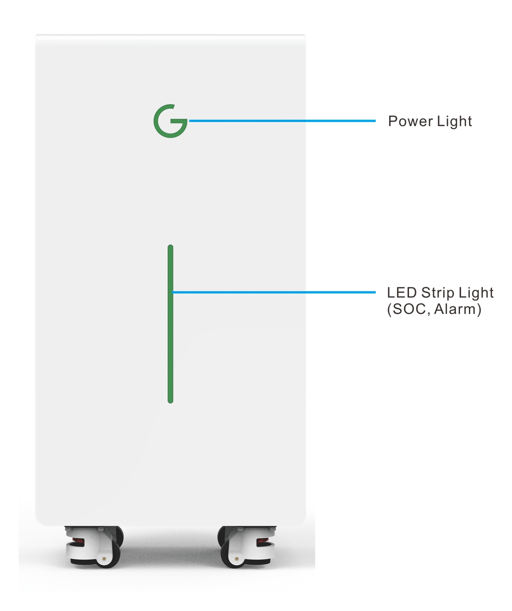
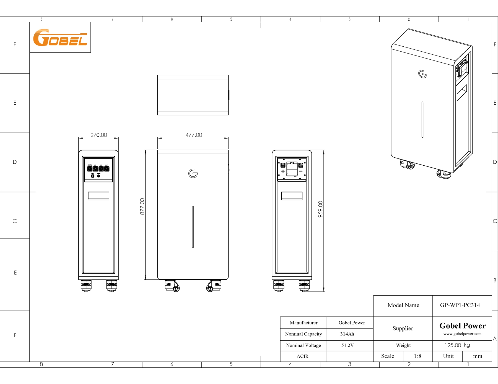
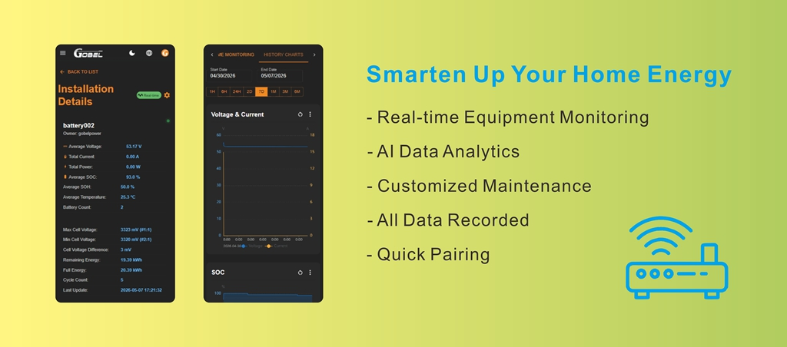

# GP-WP1-PC314 产品规格书

## 产品简介

GP-WP1-PC314 是 Gobel Power 推出的高性能低压储能电池，采用磷酸铁锂（LiFePO4）电芯，具有高安全性、长循环寿命和高能量密度的特点。单台标称能量为 16.1kWh，最大支持 63 台并联，系统总能量可达 1012kWh。产品内置 GP-PC200B 电池管理系统（BMS），支持多种通讯协议，可兼容主流逆变器，具备 IP65 防水等级，适用于并网、备电、离网以及家庭储能、小型工商业储能等多种应用场景。

### 产品特点

- **IP65 防水等级**：具备防尘防水能力，可安装在室外环境
- **智能 BMS 管理**：搭载 GP-PC200B BMS，提供全面的电池保护与监控功能（BMS 规格书详见 [GP-PC200B 产品页面](https://docs.gobelpower.com/docs/bms/GP-PC200B/Datasheet/)）
- **远程 WiFi 监控**：支持接入 Gobel VRM 平台，通过 WiFi 实现远程实时监控（详见 [WiFi 模块使用说明](https://docs.gobelpower.com/docs/low-voltage-battery/GP-SR1-PC314/WIFI-Module/)）
- **自动并联**：最大支持 63 台电池并联，系统自动拨号，无需手动设置
- **2A 主动均衡**：内置 2A 主动均衡功能，有效延长电池组寿命
- **广泛兼容**：兼容主流常见逆变器品牌（详见 [逆变器兼容列表](https://docs.gobelpower.com/docs/bms/GP-PC200B/Inverter_Protocols/)）

### 应用场景

本产品适用于以下场景：

- **并网储能**：配合光伏系统，实现自发自用、余电上网
- **并网+备电**：在市电中断时自动切换为备用电源，保障关键负载供电
- **离网供电**：作为独立电源系统，适用于无电网覆盖的偏远地区

## 技术参数

### 系统参数 (System Parameters)

| 参数名称 | 参数值 |
| :------: | :----: |
| 标称电压 (Nominal Voltage) | 51.2V |
| 工作电压范围 (Operating Voltage Range) | 44V – 58.4V |
| 标称能量 (Nominal Energy) | 16.1kWh |
| 可用能量 (Usable Energy) | >16.1kWh [^1] |
| 最大持续放电电流 (Max Continuous Discharge Current) | 150A [^2] |
| 最大持续充电电流 (Max Continuous Charge Current) | 140A [^2] |
| 推荐放电深度 (Recommended DOD) | 90% |
| 电芯类型 (Cell Type) | LiFePO4（磷酸铁锂） |
| 主动均衡电流 (Active Balancing Current) | 2A |
| 断路器规格 (Circuit Breaker) | 2P 125A（共 250A） |
| 显示屏 (Display) | LED 灯带（显示 SOC、告警信息） |
| 通讯接口 (Communication Interfaces) | RS485 / CAN / RS232 / WiFi |

### 性能规格 (Performance Specifications)

| 参数名称 | 参数值 |
| :------: | :----: |
| 往返效率 (Round-trip Efficiency) | ≥95% |
| 循环寿命 (Cycle Life) | 10000 次（25°C，70% EOL） |
| 扩展能力 (Scalability) | 最大 63 台并联（系统总能量可达 1012kWh） |

### 环境参数 (Environmental Parameters)

| 参数名称 | 参数值 |
| :------: | :----: |
| 工作温度（充电）(Operating Temperature – Charge) | 0°C 至 +50°C |
| 工作温度（放电）(Operating Temperature – Discharge) | -20°C 至 +50°C |
| 存储温度 (Storage Temperature) | 0°C 至 +35°C |
| 相对湿度 (Relative Humidity) | ≤95%（无冷凝） |
| 海拔 (Altitude) | ≤4000m |
| 防水等级 (Ingress Protection) | IP65 |

### 合规信息 (Compliance Information)

| 参数名称 | 参数值 |
| :------: | :----: |
| 认证标准 (Certifications) | CE / UN38.3 |

### 机械参数 (Mechanical Parameters)

| 参数名称 | 参数值 |
| :------: | :----: |
| 外形尺寸 (Dimensions) | 960 × 480 × 270 mm（高/宽/深） |
| 重量 (Weight) | 125kg |
| 安装方式 (Installation Method) | 地面站立 |
| 质保 (Warranty) | 10 年 [^3] |

[^1]: 测试条件：25°C±2°C，寿命初期，0.5C 充放电，100% DOD。
[^2]: 电流受温度和 SOC 影响，实际值可能低于标称值。
[^3]: 具体条款参见 Gobel Power 质保函。

## 附录

### 接口示意图

前视图：

左视图：

右视图：

### 系统连接示意

以下为 GP-WP1-PC314 在典型储能系统中的连接示意图：

### 产品尺寸

GP-WP1-PC314 外形尺寸为 960 × 480 × 270 mm（高/宽/深），详见下方尺寸图：

### Gobel VRM 远程监控平台

Gobel VRM 是一款专为锂电池储能系统打造的远程监控应用。

- **全时远程监控**： 通过 Wi-Fi 实时连接您的储能系统，无论身在何处，电池电压、电流、SOC（剩余电量）及健康状态（SOH）均可一手掌握。

- **深度数据可视化**： 提供精细的实时功率流向图与历史数据曲线，直观展示充放电趋势，助您优化能源使用效率。

- **电芯级精准管理**： 深入监控每一个单体电芯的状态，包括温控警报、压差分析及 BMS 实时保护状态，确保系统长效安全运行。

- **智能告警通知**： 系统异常第一时间推送提醒，涵盖过压、过流、高温等关键风险，为您家庭能源安全保驾护航。

### 相关文档

- [GP-PC200B BMS 规格书](https://docs.gobelpower.com/docs/bms/GP-PC200B/Datasheet/)
- [WiFi 模块监控使用说明](https://docs.gobelpower.com/docs/low-voltage-battery/GP-SR1-PC314/WIFI-Module/)
- [逆变器兼容列表](https://docs.gobelpower.com/docs/bms/GP-PC200B/Inverter_Protocols/)
