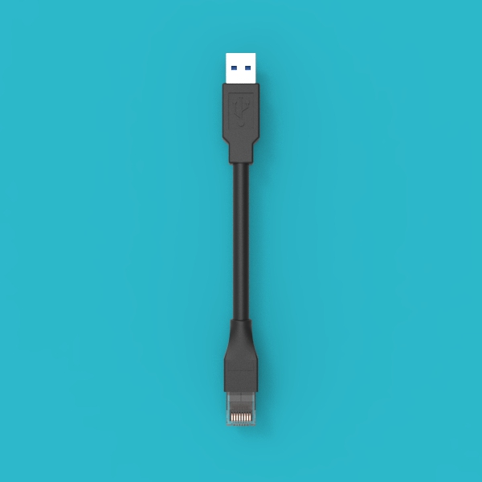
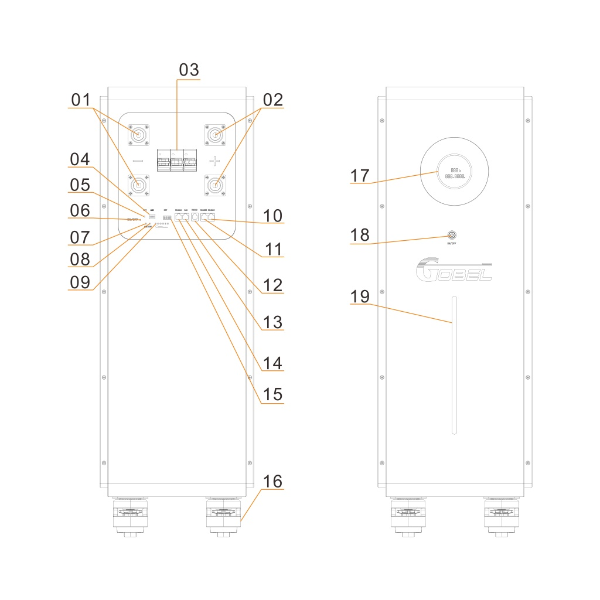
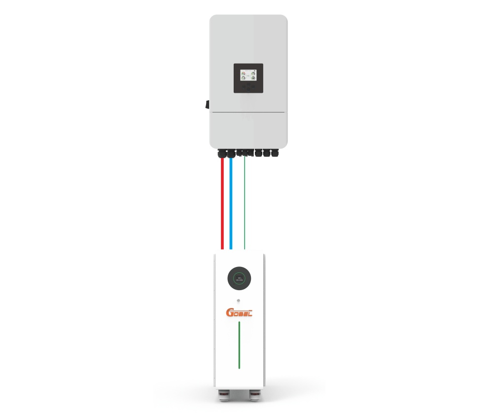
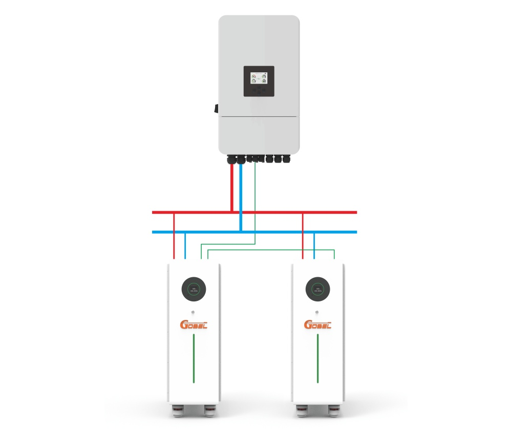
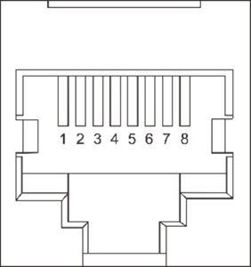

# GP-PB5-PC628 安装手册

## 产品一览

| 项目 | 规格 |
| :--- | :--- |
| 产品型号 | GP-PB5-PC628 |
| 品牌 | Gobel Power |
| 产品类型 | 51.2V 628Ah 磷酸铁锂低压储能电池 |
| 电芯配置 | 314Ah 磷酸铁锂（LFP）电芯，16S2P 连接 |
| 额定电压 | 51.2V |
| 额定容量 | 628Ah |
| 电池管理系统 | GP-PC300 BMS |
| 外形尺寸（长×宽×高） | 764 × 316 × 920mm |
| 重量 | 320kg |

## 安全须知

在安装、使用和维护本产品之前，请仔细阅读并理解以下安全须知。不遵守这些说明可能导致人身伤害、设备损坏或财产损失。

:::danger 电击危险
本产品为高压储能设备，操作不当可能导致严重电击事故。在进行任何电气连接或维护操作前，务必断开电池断路器并关闭 BMS 弱电开关。
:::

:::caution 电池安全
- 禁止短路电池正负极端子，短路会产生极高电流，可能导致火灾或爆炸
- 操作前确认电池正负极连接正确，反接将损坏设备
- 不要在电池附近使用明火或产生火花的设备
- 如发现电池外壳变形、漏液或异常发热，立即停止使用并联系技术支持
:::

:::caution 搬运安全
本产品重量达 320kg，搬运和移动时需使用合适的搬运工具，并由多人协作完成。移动时注意脚下障碍物，防止设备倾倒造成人身伤害。
:::

:::note 操作人员要求
安装和维护操作应由具备电气知识的专业人员进行。不熟悉电气设备操作的人员请勿自行安装。
:::

:::note 工作环境要求
- 安装场所应保持干燥、通风良好
- 远离易燃易爆物品
- 环境温度：0°C ~ 50°C
- 相对湿度：不超过 95% RH（无凝露）
:::

## 产品简介

本产品为 GP-PB5-PC628 51.2V 628Ah 磷酸铁锂（LiFePO₄）低压储能电池，采用高性能 314Ah 磷酸铁锂电芯，通过 16S2P（16 串 2 并）方式连接，并配备 **GP-PC300 BMS（[电池管理系统](#Product-Introduction)**），实现对电池的全面监控和保护。

### 主要特点

- **高容量储能**：额定容量 628Ah，满足家庭及小型工商业储能需求
- **安全可靠**：磷酸铁锂电芯化学性质稳定，热稳定性优异
- **智能 BMS 管理**：实时监控电池电压、电流、温度、SOC（剩余电量）等参数，提供过充、过放、过温、短路等多重保护
- **灵活扩展**：支持多台电池并联使用，扩容方便
- **标准接口**：提供 RS485、RS232、CAN 等多种通讯接口，适配主流逆变器

### 适用场景

- 家庭光伏储能系统
- 小型工商业储能系统
- 备用电源（UPS）系统
- 离网储能系统

## 部件清单

开箱后请对照下表清点产品及配件，确认所有部件齐全完好。

| 编号 | 名称 | 规格/数量 | 图片 |
| :---: | :---: | :---: | :---: |
| <a id="Part01">01</a> | GP-PB5-PC628 储能电池 | 51.2V 628Ah，1台 |  |
| <a id="Part02">02</a> | 正极电源连接线 | 红色，两端 M10 铜鼻子，1根（是否包含依据订单） |  |
| <a id="Part03">03</a> | 负极电源连接线 | 黑色，两端 M10 铜鼻子，1根（是否包含依据订单） |  |
| <a id="Part04">04</a> | RS232 通信线缆 | RJ12 转 USB，1根 |  |
| <a id="Part05">05</a> | 逆变器通讯线缆 | 两端 RJ45，1根（也可用作并联线缆） |  |

:::note
**正极电源连接线（[02](#Part02)）** 和 **负极电源连接线（[03](#Part03)）** 是否随产品附送请以订单为准。如未附送，请自行准备规格匹配的电源连接线。
:::

## 产品接口说明

下图为电池面板各接口、指示灯及操作部件的说明（图中数字编号对应下表）：

| 编号 | 名称 | 说明 |
| :---: | :---: | :--- |
| 1 | 输出负极 | 300A 端子，M10 螺孔 |
| 2 | 输出正极 | 300A 端子，M10 螺孔 |
| 3 | 断路器 | 电池主回路通断控制 |
| 4 | 拨码开关（ADS） | 4 位拨码开关，用于设置电池并联地址 |
| 5 | 复位开关（RST） | 长按可复位 BMS 状态 |
| 6 | 开关指示灯（ON/OFF） | 指示电池开关状态 |
| 7 | 运行指示灯（RUN） | 指示电池运行状态 |
| 8 | 告警指示灯（ALM） | 电池故障或告警时点亮 |
| 9 | SOC 指示灯 | 指示电池剩余电量状态 |
| 10 | RS485C 接口 | 并联通讯接口 |
| 11 | RS485B 接口 | 并联通讯接口 |
| 12 | RS232 接口 | 上位机通讯接口 |
| 13 | CAN 接口 | 逆变器通讯接口 |
| 14 | RS485A 接口 | 逆变器通讯接口 |
| 15 | 干接点（DRY） | 干接点输出接口 |
| 16 | 脚轮 | 底部移动脚轮，便于移动和固定 |
| 17 | 显示屏 | 显示充放电状态及 SOC 信息 |
| 18 | 弱电开关 | 开启或关闭 BMS |
| 19 | SOC 灯条 | 直观显示电池剩余电量 |

各通讯接口的引脚定义详见[附录](#Appendix)中的[产品通信引脚定义](#Communication-Pin-Definitions)章节。

## 安装要求

### 安装环境

- **地面**：安装地面应平整、坚固，具备足够的承重能力（产品重 320kg）
- **通风**：安装场所应通风良好，避免热量积聚
- **环境条件**：干燥、清洁，无腐蚀性气体或粉尘；环境温度 0°C ~ 50°C，相对湿度不超过 95% RH（无凝露）
- **安全距离**：远离易燃易爆物品及水源

### 安装间距

为保证散热和维护操作空间，电池与墙壁或其他设备之间应保持足够的间距：

- 电池两侧与墙壁距离 ≥ 100mm
- 电池顶部与上方障碍物距离 ≥ 300mm
- 电池前方应预留至少 800mm 的操作空间

### 工具准备

安装前请准备以下工具和仪表：

- 扭力扳手
- 螺丝刀套装
- 万用表
- 绝缘手套
- Windows 系统电脑（用于协议设置）

### 螺丝扭矩要求

进行电气连接时，请按照下表规定的扭矩值拧紧螺丝：

| 螺丝规格 | 扭矩要求 |
| :------: | :------: |
| M6 | 8N·m |
| M8 | 15N·m |
| M10 | 15 ~ 20N·m |

## 安装前检查

收到产品后，请按以下步骤进行开箱检查：

1. 将储能电池（[01](#Part01)）从木箱中取出，检查外包装及产品外观是否完好。

2. 对照[部件清单](#Parts-List)检查产品及配件是否有缺失或损坏。

3. 按下面板上的[**弱电开关**](#Product-Interface)开机，观察[**显示屏**](#Product-Interface)及[**SOC 灯条**](#Product-Interface)显示是否正常。

4. 将[**断路器**](#Product-Interface)拨到 ON 位置，使用万用表测量电池[**正极**](#Product-Interface)和[**负极**](#Product-Interface)端子的电压，正常电压应在 40V ~ 58V 之间。

5. 如检查结果全部正常，即可进行下一步安装操作。

:::caution
如发现产品外观破损、配件缺失或电压异常，请勿继续安装，及时联系 Gobel Power 技术支持。
:::

## 安装

1. 将储能电池（[01](#Part01)）的[**断路器**](#Product-Interface)关闭，并按[**弱电开关**](#Product-Interface)关机。

2. 将电池推移到预先确定的安装位置，锁紧底部的[**脚轮**](#Product-Interface)防止移动。

:::caution
移动电池时注意地面平整度，避免倾斜角度过大。电池重达 320kg，移动时务必注意安全，防止倾倒伤人。
:::

## 逆变器与电池电力连接

1. 确保逆变器等其他设备已安装到位，并将逆变器关机断电。请同时查阅逆变器手册中与电池连接相关的部分。

2. 将**正极电源连接线（[02](#Part02)）** 一端连接至电池**正极**端子，另一端连接至逆变器电池输入正极；将**负极电源连接线（[03](#Part03)）** 一端连接至电池**负极**端子，另一端连接至逆变器电池输入负极。

:::caution
连接时务必确认正负极对应正确，反接会导致设备严重损坏。
:::

3. 如果有多台电池并联使用，需要将电池并联后再与逆变器连接。每台电池有两对正负极端子，每个端子最大承载电流为 300A，因此分两种情况：

   - **情况一**：如果逆变器输入输出电流小于 300A，可以用正负极线缆将相邻两台电池的正负极端子相互连接，然后将两端电池连接到逆变器。

   - **情况二**：如果逆变器输入输出电流大于 300A，需要将每台电池的正负极端子与汇流排连接，然后将汇流排连接到逆变器。

连接示意图请参考[附录](#Appendix)中的[电池与逆变器连接示意图](#Connection-Diagrams)。

## 逆变器与电池通讯连接

1. **拨码开关设置**。如果只有一台电池，则其为主机，将[**拨码开关**](#Product-Interface)拨为 ON、OFF、OFF、OFF；如果有多台电池并联，则选其中一台作为主机，其拨码开关拨为 ON、OFF、OFF、OFF，其他电池作为从机，从机的拨码开关设置请参考[附录](#Appendix)中的[拨码开关设置表](#DIP-Switch-Settings)。

2. **并联通讯连接**。多台电池并联时，需要用并联通讯线缆将各电池的 RS485B 与 RS485C 接口依次连接：第一台电池的 RS485B 连接第二台电池的 RS485C，第二台电池的 RS485B 连接第三台电池的 RS485C，以此类推。

3. **逆变器通讯连接**。将**逆变器通讯线缆（[05](#Part05)）** 一端接到主机电池的[**RS485A 接口**](#Product-Interface)或[**CAN 接口**](#Product-Interface)上（具体接哪个接口需查看逆变器手册，确认逆变器使用 RS485 还是 CAN 协议与电池通讯），另一端接到逆变器的 BMS 通信接口。

:::caution
请确认逆变器 BMS 通讯接口的引脚定义以及电池 RS485A 或 CAN 接口的引脚定义是否一致。本产品附带的逆变器通讯线缆两端为对称线序，如果逆变器与电池的引脚定义不同，需要自行制作对应线序的通讯线缆或向逆变器厂商购买适配线缆（如 Victron 逆变器）。
:::

各通讯接口的引脚定义请参考[附录](#Appendix)中的[产品通信引脚定义](#Communication-Pin-Definitions)章节。

## 协议设置

1. 按下主机电池的[**弱电开关**](#Product-Interface)启动电池，保持[**断路器**](#Product-Interface)处于关闭状态。

2. 使用 **RS232 通信线缆（[04](#Part04)）** 连接 Windows 系统电脑与主机电池：将线缆 RJ12 一端接至电池[**RS232 接口**](#Product-Interface)，USB 一端插入电脑 USB 接口。在电脑上找到电池上位机程序软件并运行。

:::note
上位机详细操作请参见上位机操作流程文档（预留上位机详细操作指南链接）。
:::

3. 在上位机软件中选择与逆变器匹配的通讯协议。

## 检查连接与开机

1. 检查电力连接和通讯连接是否正常，确保各线缆连接牢固、无松动。

2. 将所有电池开机并打开[**断路器**](#Product-Interface)，然后打开逆变器的电源开关。

3. 在逆变器中设置电池类型为锂电池。

4. 检查逆变器中显示的电池信息，确认是否正确从电池 BMS 获取到了数据（如电池电压、电池 SOC、温度等）。

5. 如果逆变器中可正确读取数据，则安装完成，可进行充放电测试。

:::tip
开机后如发现逆变器无法读取电池数据，请检查通讯线缆连接是否正常，以及协议设置是否正确。
:::

## 产品维护

如果电池长期不使用，请按以下要求进行维护：

- 将电池充满电，然后关闭[**断路器**](#Product-Interface)和[**弱电开关**](#Product-Interface)（关闭 BMS）。
- 至少每 3 个月检查一次电池电压。如果电压低于 51V，需及时充电。

:::danger
未及时充电导致的电池损坏不在保修范围。长期存放不充电会导致电池过度放电，造成不可逆的容量损失甚至电池报废。
:::

## 附录

### 电池与逆变器连接示意图

**单台电池与一台逆变器连接示意图**

:::note
图中红色线缆为正极电源连接线，黑色线缆为负极电源连接线，绿色线缆为通讯线缆。
:::

**一台逆变器与多台电池连接示意图**

:::note
图中红色线缆为正极电源连接线，黑色线缆为负极电源连接线，绿色线缆为通讯线缆。
:::

### 产品尺寸图

外形尺寸（长 × 宽 × 高）：764 × 316 × 920mm
重量：320kg

### 产品通信引脚定义

#### RS485A 端口

| 引脚 | 定义 |
| :--: | :--: |
| 1 | B |
| 2 | A |
| 3 | GND |
| 4 | NC |
| 5 | NC |
| 6 | GND |
| 7 | A |
| 8 | B |

#### CAN 端口

| 引脚 | 定义 |
| :--: | :--: |
| 1 | NC |
| 2 | GND |
| 3 | NC |
| 4 | CAN-H |
| 5 | CAN-L |
| 6 | NC |
| 7 | NC |
| 8 | NC |

#### RS232 端口

| 引脚 | 定义 |
| :--: | :--: |
| 1 | NC |
| 2 | NC |
| 3 | TXD |
| 4 | RXD |
| 5 | GND |
| 6 | NC |

#### RS485B 和 RS485C 端口

| 引脚 | 定义 |
| :--: | :--: |
| 1 | B |
| 2 | A |
| 3 | GND |
| 4 | NC |
| 5 | NC |
| 6 | GND |
| 7 | A |
| 8 | B |

### 拨码开关设置表

| 地址 | 拨码开关状态（1-2-3-4） | 说明 |
| :--: | :---------------------: | :--: |
| 00 | OFF-OFF-OFF-OFF | 无效地址 |
| 01 | ON-OFF-OFF-OFF | 主机 |
| 02 | OFF-ON-OFF-OFF | 从机 |
| 03 | ON-ON-OFF-OFF | 从机 |
| 04 | OFF-OFF-ON-OFF | 从机 |
| 05 | ON-OFF-ON-OFF | 从机 |
| 06 | OFF-ON-ON-OFF | 从机 |
| 07 | ON-ON-ON-OFF | 从机 |
| 08 | OFF-OFF-OFF-ON | 从机 |
| 09 | ON-OFF-OFF-ON | 从机 |
| 10 | OFF-ON-OFF-ON | 从机 |
| 11 | ON-ON-OFF-ON | 从机 |
| 12 | OFF-OFF-ON-ON | 从机 |
| 13 | ON-OFF-ON-ON | 从机 |
| 14 | OFF-ON-ON-ON | 从机 |
| 15 | ON-ON-ON-ON | 从机 |

## 联系方式

如遇到无法解决的故障或需要技术支持，请联系 Gobel Power：

| 项目 | 信息 |
| :--- | :--- |
| 官方网站 | [www.gobelpower.com](http://www.gobelpower.com) |
| 技术支持邮箱 | [cs@gobelpower.com](mailto:cs@gobelpower.com) |
