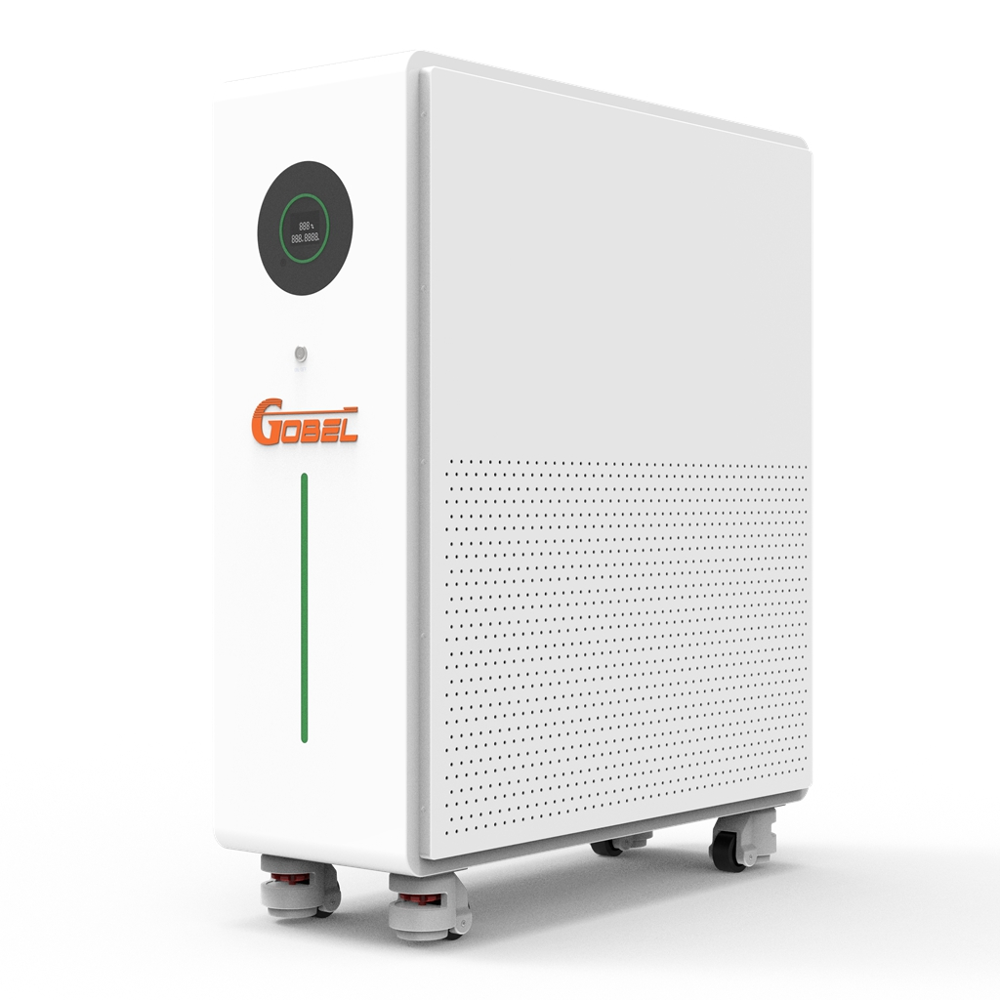
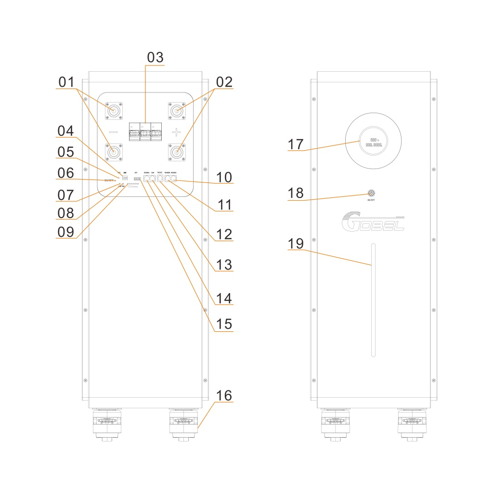
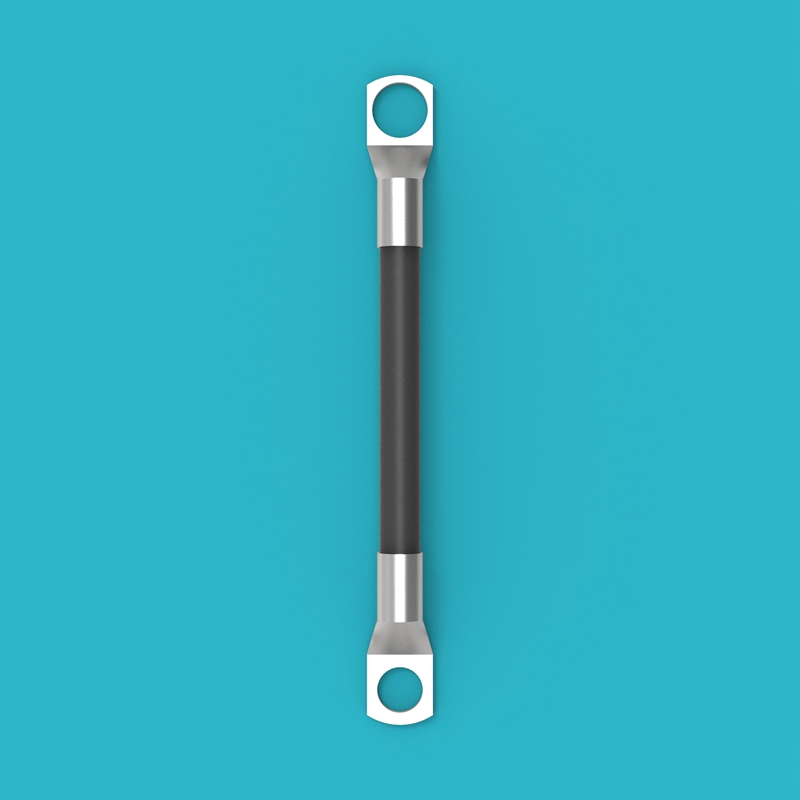
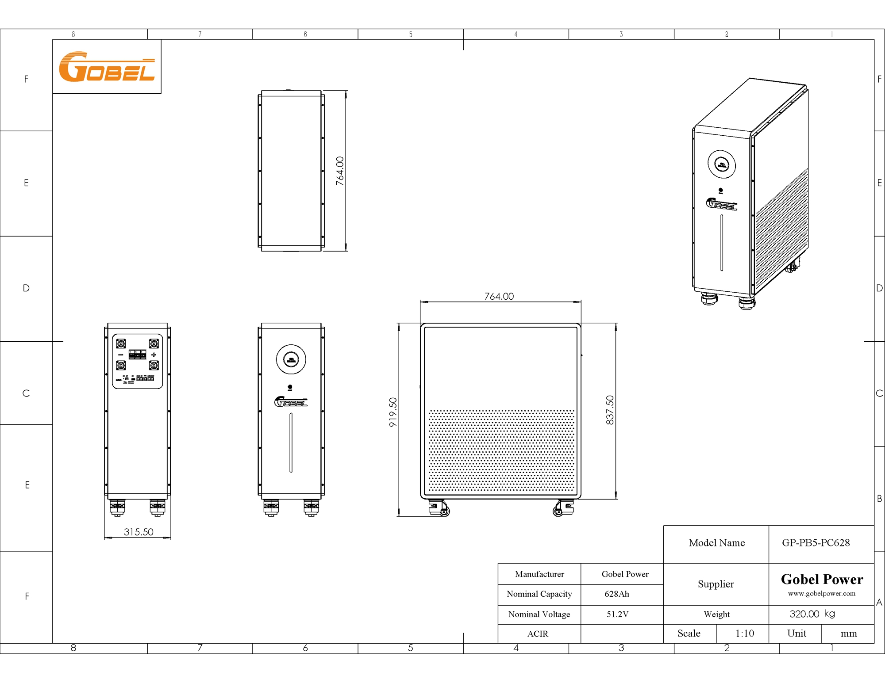

# GP-PB5-PC628 安装手册

## 1. 产品简介

本产品为 GP-PB5-PC628 51.2V 628Ah 磷酸铁锂（LiFePO₄）低压储能电池，采用高性能 314Ah 磷酸铁锂电芯，通过 16S2P（16 串 2 并）方式连接，并配备 **GP-PC300 BMS（[电池管理系统](#Product-Introduction)**），实现对电池的全面监控和保护。

### 1.1 产品一览

| 项目 | 规格 |
| :--- | :--- |
| 产品型号 | GP-PB5-PC628 |
| 品牌 | Gobel Power |
| 产品类型 | 51.2V 628Ah 磷酸铁锂低压储能电池 |
| 电芯配置 | 314Ah 磷酸铁锂（LFP）电芯，16S2P 连接 |
| 额定电压 | 51.2V |
| 额定容量 | 628Ah |
| 电池管理系统 | GP-PC300 BMS |
| 外形尺寸（长×宽×高） | 764 × 316 × 920mm |
| 重量 | 320kg |

### 1.2 产品特点

- **高容量储能**：额定容量 628Ah，满足家庭及小型工商业储能需求
- **安全可靠**：磷酸铁锂电芯化学性质稳定，热稳定性优异
- **智能 BMS 管理**：实时监控电池电压、电流、温度、SOC（剩余电量）等参数，提供过充、过放、过温、短路等多重保护
- **灵活扩展**：支持多台电池并联使用，扩容方便
- **标准接口**：提供 RS485、RS232、CAN 等多种通讯接口，适配主流逆变器

### 1.3 适用场景

- 家庭光伏储能系统
- 小型工商业储能系统
- 备用电源（UPS）系统
- 离网储能系统

### 1.4 产品外观与接口

下图为电池面板各接口、指示灯及操作部件的说明（图中数字编号对应下表）：

| 编号 | 名称 | 说明 |
| :---: | :---: | :--- |
| 1 | 输出负极 | 300A 端子，M10 螺孔 |
| 2 | 输出正极 | 300A 端子，M10 螺孔 |
| 3 | 断路器 | 电池主回路通断控制 |
| 4 | 拨码开关（ADS） | 4 位或 6 位拨码开关（依产品配置），用于设置电池并联地址 |
| 5 | 复位开关（RST） | 长按可复位 BMS 状态 |
| 6 | 开关指示灯（ON/OFF） | 指示电池开关状态 |
| 7 | 运行指示灯（RUN） | 指示电池运行状态 |
| 8 | 告警指示灯（ALM） | 电池故障或告警时点亮 |
| 9 | SOC 指示灯 | 指示电池剩余电量状态 |
| 10 | RS485C 接口 | 并联通讯接口 |
| 11 | RS485B 接口 | 并联通讯接口 |
| 12 | RS232 接口 | 上位机通讯接口 |
| 13 | CAN 接口 | 逆变器通讯接口 |
| 14 | RS485A 接口 | 逆变器通讯接口 |
| 15 | 干接点（DRY） | 干接点输出接口 |
| 16 | 脚轮 | 底部移动脚轮，便于移动和固定 |
| 17 | 显示屏 | 显示充放电状态及 SOC 信息 |
| 18 | 弱电开关 | 开启或关闭 BMS |
| 19 | SOC 灯条 | 直观显示电池剩余电量 |

各通讯接口的引脚定义详见[附录](#Appendix)中的[产品通信引脚定义](#Communication-Pin-Definitions)章节。

## 2. 安全须知

在安装、使用和维护本产品之前，请仔细阅读并理解以下安全须知。不遵守这些说明可能导致人身伤害、设备损坏或财产损失。请勿遮盖、涂改或撕除产品上的警示标识和参数铭牌。

### 2.1 操作人员与防护要求

:::note 操作人员要求
安装和维护操作应由具备电气知识的专业人员进行。不熟悉电气设备操作的人员请勿自行安装。
:::

:::warning 个人防护
- 操作时请使用绝缘工具并佩戴绝缘手套，摘下手表、戒指等金属饰品
- 不要在电池上放置工具或金属零件，防止端子接触裸露导线或金属物体
- 相邻的带电部件应加以遮盖或防护
- 设备故障时部件可能变得极热，请勿触碰，以防烫伤
:::

### 2.2 安全注意事项

:::danger 电击危险
本产品为储能设备，操作不当可能导致严重电击事故。在进行任何电气连接或维护操作前，务必断开电池断路器并关闭 BMS 弱电开关。
:::

:::caution 电池安全
- 禁止短路电池正负极端子，短路会产生极高电流，可能导致火灾或爆炸
- 操作前确认电池正负极连接正确，反接将损坏设备
- 不要在电池附近使用明火或产生火花的设备
- 如发现电池外壳变形、漏液或异常发热，立即停止使用并联系技术支持
:::

:::caution 电解液处理
电解液对皮肤和眼睛有害且可能有毒，请勿触碰。若电解液不慎接触眼睛或皮肤，请立即用清水持续冲洗至少 10 分钟，并尽快就医。
:::

:::danger 禁止擅自拆解
除厂家授权人员外，任何人不得打开、维修或拆解电池。电池内部无可维修部件，擅自拆解、改装将导致质保失效并可能引发安全事故。建议在产品附近设置警示标识或围栏，防止误操作。
:::

:::caution 报废与回收
- 破损、鼓包或漏液的电池应立即停用，存放于干燥阴凉、防潮避光的环境中；不要自行修复或拆解，请联系安装商、销售商或专业回收机构处理
- 废旧电池不得作为生活垃圾丢弃，请按当地法规交由指定的回收点处理，处置前请先清除产品上的隐私相关信息
:::

:::warning 灭火要求
电池发生火灾时，只能使用干粉灭火器灭火，严禁使用液体灭火器。请勿将电池置于明火、加热器等高温热源附近。
:::

:::caution 搬运安全
本产品重量达 320kg，禁止强行单人搬运，搬运和移动时需使用合适的搬运工具并由多人协作完成。产品上重下轻，禁止侧放和倒置，移动时防止设备倾倒造成人身伤害。搬运方法详见[运输与搬运](#Transportation-Handling)章节。
:::

## 3. 运输与搬运

### 3.1 运输要求

- 运输过程中防止剧烈振动、冲击和挤压，避免阳光直射、雨淋和受潮，做好防雨、防潮和防晒措施
- 运输、装卸区域内严禁吸烟；未经许可，货运人员不得擅自打开电池包装
- 锂离子电池属于 9 类危险品（UN3480），跨境海运、陆运、空运须符合相应危险品运输法规，并按规定张贴危险品标签
- 运输前如发现电池有异味、漏液、冒烟、起火或其他异常，严禁运输
- 运输操作应由经过培训的专业人员进行，搬运人员须佩戴防护手套和安全鞋
- 产品到达安装现场前，请勿拆除运输包装

### 3.2 搬运方式

#### 3.2.1 人工搬运

- 产品重达 320kg，禁止强行单人搬运；搬运前确认人员身体状况良好，佩戴防滑手套、安全鞋等防护装备，注意尖锐金属面板和重物
- 搬运前清理搬运路径并确认地面安全；经过坡道、狭窄空间和楼梯时应减速慢行，并安排专人协助
- 产品上重下轻，禁止侧放、倒置和无固定搬运，移动过程中应采取措施防止倾倒
- 仅可通过产品指定的把手或底部边缘推行或抬起，不得抓握安装在设备内部的部件
- 短距离平地移动可利用底部[**脚轮**](#Product-Interface)由多人配合推行，移动到位后锁紧脚轮
- 搬运时贴近设备、屈膝平稳发力，用腿部而非腰部力量起升，不要猛拉或扭转身体；转弯时移动脚步而非扭转腰部
- 平稳匀速移动设备并轻抬轻放，防止碰撞、跌落、刮擦或损坏部件和线缆
- 搬运完成后确认设备放置稳固，防止倾倒伤人

#### 3.2.2 使用搬运设备

- 使用叉车等搬运设备时，须由持证专业人员操作，遵守设备操作要求；无关人员应远离作业区至少 2m，禁止站在或骑坐在叉车或货物上，禁止超载
- 搬运设备的额定载重应大于产品重量的两倍（本产品重 320kg，即大于 640kg），叉臂长度应不小于产品宽度
- 控制行驶速度，禁止急转弯；倒车前确认后方安全，狭窄空间内应安排专人指挥
- 禁止在坡度 ≥5° 的坡道上作业；路面不平时应减速慢行
- 搬运过程中禁止倾斜或倒置产品；若不可避免发生倾斜，应尽快恢复直立并静置 2 小时后方可通电

## 4. 安装

### 4.1 安装前准备

#### 4.1.1 安装环境要求

- **地面**：安装地面应平整、坚固，具备足够的承重能力（产品重 320kg）
- **通风**：安装场所应通风良好，避免热量积聚；不要遮挡设备通风口或散热结构，远离设备出风口
- **环境条件**：干燥、清洁，无腐蚀性气体或粉尘；环境温度 0°C ~ 50°C，相对湿度不超过 95% RH（无凝露）；建议安装海拔不超过 3000m
- **安全距离**：远离易燃易爆物品及水源；远离热源、明火及高温物体，不得在存在易燃易爆气体或烟雾的环境中安装或运行，设备周围不得存放易燃易爆材料
- **防水防雨**：本产品不防水，不得安装在室外露天位置，严禁雨淋、水溅或积雪覆盖；不得安装在可能被水淹没的位置，远离液体以及易发生冷凝或渗水的区域
- **腐蚀环境**：避免磁性粉尘、挥发性或腐蚀性气体、有机溶剂、导电金属粉尘及盐雾环境
- **电磁与振动**：避免强烈振动、噪声和电磁干扰的场所
- **其他**：不得将设备安装在船舶、火车、汽车等移动载体上；安装位置应远离儿童及日常生活、工作区域

为保证散热和维护操作空间，电池与墙壁或其他设备之间应保持足够的间距：

- 电池两侧与墙壁距离 ≥ 100mm
- 电池顶部与上方障碍物距离 ≥ 300mm
- 电池前方应预留至少 800mm 的操作空间

:::caution
安装及通电前请清除安装区域内的粉尘和铁屑；安装前确认场地具备足够的承重能力并做好防静电措施；不得将设备安装在封闭、通风不良且无消防设施，或消防人员无法进入的场所。
:::

#### 4.1.2 工具与扭矩要求

安装前请准备以下工具和仪表：

- 扭力扳手
- 螺丝刀套装
- 万用表
- 绝缘手套
- 安全鞋、护目镜（推荐配备）
- Windows 系统电脑（用于协议设置）

进行电气连接时，请按照下表规定的扭矩值拧紧螺丝：

| 螺丝规格 | 扭矩要求 |
| :------: | :------: |
| M6 | 8N·m |
| M8 | 15N·m |
| M10 | 15 ~ 20N·m |

:::note 扭矩说明
- 表中扭矩值适用于常规装配条件下的标准螺丝；高振动或恶劣环境等特殊工况下请酌情调整。
- 请使用经过校准的扭力扳手，避免螺丝过紧或过松。
:::

### 4.2 开箱与检查

#### 4.2.1 部件清单

开箱后请对照下表清点产品及配件，确认所有部件齐全完好。

| 编号 | 名称 | 规格/数量 | 图片 |
| :---: | :---: | :---: | :---: |
| <a id="Part01">01</a> | GP-PB5-PC628 储能电池 | 51.2V 628Ah，1台 |  |
| <a id="Part02">02</a> | 正极电源连接线 | 红色，两端 M10 铜鼻子，1根（是否包含依据订单） |  |
| <a id="Part03">03</a> | 负极电源连接线 | 黑色，两端 M10 铜鼻子，1根（是否包含依据订单） |  |
| <a id="Part04">04</a> | RS232 通信线缆 | RJ12 转 USB，1根 |  |
| <a id="Part05">05</a> | 逆变器通讯线缆 | 两端 RJ45，1根（也可用作并联线缆） |  |

:::note
**正极电源连接线（[02](#Part02)）** 和 **负极电源连接线（[03](#Part03)）** 是否随产品附送请以订单为准。如未附送，请自行准备规格匹配的电源连接线。
:::

#### 4.2.2 开箱检查步骤

收到产品后，请按以下步骤进行开箱检查：

1. 将储能电池（[01](#Part01)）从木箱中取出，检查外包装及产品外观是否完好。

2. 对照[部件清单](#Parts-List)检查产品及配件是否有缺失或损坏。

3. 按下面板上的[**弱电开关**](#Product-Interface)开机，观察[**显示屏**](#Product-Interface)及[**SOC 灯条**](#Product-Interface)显示是否正常。

4. 将[**断路器**](#Product-Interface)拨到 ON 位置，使用万用表测量电池[**正极**](#Product-Interface)和[**负极**](#Product-Interface)端子的电压，正常电压应在 40V ~ 58V 之间。

5. 如检查结果全部正常，即可进行下一步安装操作。

:::caution
如发现产品外观破损、配件缺失或电压异常，请勿继续安装，及时联系 Gobel Power 技术支持。
:::

:::note 开箱提示
- 产品运抵安装现场前，请勿提前拆除运输包装；开箱时小心操作，避免划伤设备
- 开箱前检查外包装是否破损、冲击指示器是否已触发；若已触发，则不能排除运输损坏的可能
- 组装前请清洁所有部件；搬运和存放过程中防止碰撞和划伤，并做好防潮、防锈措施
- 系统应在交付后 6 个月内完成安装调试；长期闲置存放会加速电池容量衰减
:::

### 4.3 安装步骤

本产品重达 320kg，仅支持室内落地安装，通过底部[**脚轮**](#Product-Interface)移动就位并锁紧固定，不支持壁挂或支架安装。

1. 将储能电池（[01](#Part01)）的[**断路器**](#Product-Interface)关闭，并按[**弱电开关**](#Product-Interface)关机。

2. 将电池推移到预先确定的安装位置，锁紧底部的[**脚轮**](#Product-Interface)防止移动。

:::caution
移动电池时注意地面平整度，避免倾斜角度过大。电池重达 320kg，移动时务必注意安全，防止倾倒伤人。
:::

:::caution 安装纪律
- 安装必须严格按照本说明书和设计要求进行，禁止擅自更改安装步骤或技术参数
- 安装及接线过程中所有开关保持 OFF 位置，严禁带电作业
- 所有螺丝和固定件均需牢固拧紧；钻孔时防止粉尘进入电池，注意避开墙内或地下的管线，钻孔后清理现场碎屑
:::

### 4.4 安装后检查

安装完成后，确认以下各项正常：

- 电池外观完好，无变形、磕碰或划伤
- 设备放置稳固，[**脚轮**](#Product-Interface)已锁紧
- 周围通道畅通，无易燃易爆物品
- 警示标识和参数铭牌完整、清晰
- 现场消防设备就位且符合要求

## 5. 电气连接

### 5.1 安全注意事项

:::warning 接线要求
本产品仅支持并联连接，严禁串联。串联可能导致设备损坏或安全隐患。
:::

:::warning 电气安全注意事项
- 电池断电后端子间可能仍有残余电压，接线操作前请等待至少 10 分钟，并用万用表确认无电压
- 严禁将电池直接连接至交流电网或光伏（PV）直流线路，电池只能连接至匹配的逆变器等电力转换设备
- 请勿使用故障或与电池不匹配的逆变器等电力转换设备；连接前确认电池系统参数与所连接设备完全兼容
- 请勿在沙尘暴天气或周围相对湿度超过 95% 的环境下进行电气连接
- 接线操作请由具备电气知识的专业人员按第 2 章要求佩戴防护装备后进行
:::

### 5.2 连接准备

#### 5.2.1 线缆准备

连接前请确认以下线缆和部件准备就绪：

- **正极电源连接线（[02](#Part02)）**：红色，两端 M10 铜鼻子；是否随产品附送以订单为准，未附送时请自行准备规格匹配的电源连接线
- **负极电源连接线（[03](#Part03)）**：黑色，两端 M10 铜鼻子；是否随产品附送以订单为准
- **逆变器通讯线缆（[05](#Part05)）**：两端 RJ45（也可用作并联线缆）
- **RS232 通信线缆（[04](#Part04)）**：RJ12 转 USB，用于连接 Windows 系统电脑设置通讯协议

同时请确认逆变器等其他设备已安装到位，并将逆变器关机断电；请同时查阅逆变器手册中与电池连接相关的部分。

#### 5.2.2 电池拨码开关设置

如果只有一台电池，则其为主机，将[**拨码开关**](#Product-Interface)拨为 ON、OFF、OFF、OFF（6 位拨码开关则为 ON、OFF、OFF、OFF、OFF、OFF）；如果有多台电池并联，则选其中一台作为主机，其他电池作为从机，各地址的拨码开关设置请参考[附录](#Appendix)中的[拨码开关设置表](#DIP-Switch-Settings)。6 位拨码开关的产品还可将所有电池的拨码开关全部拨为 OFF，由系统自动分配地址。

### 5.3 线缆连接

#### 5.3.1 接地连接

- 电池系统必须可靠接地，接地电阻应小于 1Ω，接地连接方式请遵循当地电气规范及逆变器的要求
- 确保系统所在场合已安装过压保护装置

#### 5.3.2 电力线缆连接

将**正极电源连接线（[02](#Part02)）** 一端连接至电池**正极**端子，另一端连接至逆变器电池输入正极；将**负极电源连接线（[03](#Part03)）** 一端连接至电池**负极**端子，另一端连接至逆变器电池输入负极。端子螺丝请按[工具与扭矩要求](#Tool-Requirements)中的规定扭矩拧紧（M10 为 15 ~ 20N·m）。

:::caution
连接时务必确认正负极对应正确，反接会导致设备严重损坏。
:::

:::note 线缆敷设
请勿用力拉扯线缆，为线缆预留足够的弯曲空间，并使用合适的固定件减小线缆应力。
:::

#### 5.3.3 通讯线缆连接

将**逆变器通讯线缆（[05](#Part05)）** 一端接到主机电池的[**RS485A 接口**](#Product-Interface)或[**CAN 接口**](#Product-Interface)上（具体接哪个接口需查看逆变器手册，确认逆变器使用 RS485 还是 CAN 协议与电池通讯），另一端接到逆变器的 BMS 通信接口。多台电池并联时的通讯接线方式详见[多台电池并联连接](#Multi-Pack-Parallel-Connection)章节。

:::caution
请确认逆变器 BMS 通讯接口的引脚定义以及电池 RS485A 或 CAN 接口的引脚定义是否一致。本产品附带的逆变器通讯线缆两端为对称线序，如果逆变器与电池的引脚定义不同，需要自行制作对应线序的通讯线缆或向逆变器厂商购买适配线缆（如 Victron 逆变器）。
:::

各通讯接口的引脚定义请参考[附录](#Appendix)中的[产品通信引脚定义](#Communication-Pin-Definitions)章节。

### 5.4 多台电池并联连接

:::caution
严禁将不同型号、不同规格的电池并联混用；多台电池连接时，线缆应沿指定路径敷设，不得随意更改布线走向。
:::

#### 5.4.1 并联电力连接

如果有多台电池并联使用，需要将电池并联后再与逆变器连接。每台电池有两对正负极端子，每个端子最大承载电流为 300A，因此分两种情况：

- **情况一**：如果逆变器输入输出电流小于 300A，可以用正负极线缆将相邻两台电池的正负极端子相互连接，然后将两端电池连接到逆变器。

- **情况二**：如果逆变器输入输出电流大于 300A，需要将每台电池的正负极端子与汇流排连接，然后将汇流排连接到逆变器。

:::note
连接示意图请参考[附录](#Appendix)中的[电池与逆变器连接示意图](#Connection-Diagrams)章节。
:::

#### 5.4.2 并联通讯连接

多台电池并联时，需要用并联通讯线缆将各电池的 RS485B 与 RS485C 接口依次连接：第一台电池的 RS485B 连接第二台电池的 RS485C，第二台电池的 RS485B 连接第三台电池的 RS485C，以此类推。

:::note
并联通讯接线前，请先完成主机与从机的[拨码开关设置](#DIP-Switch-Settings)；6 位拨码开关的产品也可将所有电池全部拨为 OFF，由系统自动分配地址。
:::

:::warning 4 位与 6 位拨码开关产品混用
如果 4 位拨码开关与 6 位拨码开关的产品并联使用：

- 不允许使用自动地址分配，所有 6 位拨码开关的产品均须手动拨码
- 主机必须为 6 位拨码开关的产品
- 地址 2 ~ 15 的从机可以是 4 位或 6 位拨码开关的产品
- 地址 16 及以后的从机必须是 6 位拨码开关的产品
:::

### 5.5 连接后检查

全部线缆连接完成后，请逐项确认：

- 每完成一处连接后，检查连接是否正确、牢固，无松动或接触不良；所有螺栓、螺丝等紧固件均已完全拧紧
- 正负极线缆极性正确、端子牢固可靠，防护罩已正确安装
- 防止端子接触裸露导线或金属物体，相邻带电部件应加以遮盖
- 清除设备周围的异物，尤其是金属碎屑，防止造成短路

## 6. 运行操作

### 6.1 开机前检查

:::caution 开机前检查
- [连接后检查](#Post-Connection-Inspection)各项均已确认无误
- 工作区域应清空，无关人员和动物应远离设备
:::

### 6.2 逆变器通讯协议设置

1. 按下主机电池的[**弱电开关**](#Product-Interface)启动电池，保持[**断路器**](#Product-Interface)处于关闭状态。

2. 使用 **RS232 通信线缆（[04](#Part04)）** 连接 Windows 系统电脑与主机电池：将线缆 RJ12 一端接至电池[**RS232 接口**](#Product-Interface)，USB 一端插入电脑 USB 接口。在电脑上找到电池上位机程序软件并运行。

:::note
上位机详细操作请参见上位机操作流程文档（预留上位机详细操作指南链接）。
:::

3. 在上位机软件中选择与逆变器匹配的通讯协议。

### 6.3 开机

1. 检查电力连接和通讯连接是否正常，确保各线缆连接牢固、无松动。

2. 将所有电池开机并打开[**断路器**](#Product-Interface)，然后打开逆变器的电源开关。

3. 在逆变器中设置电池类型为锂电池。

4. 检查逆变器中显示的电池信息，确认是否正确从电池 BMS 获取到了数据（如电池电压、电池 SOC、温度等）。

5. 如果逆变器中可正确读取数据，则安装完成，可进行充放电测试。

:::tip
开机后如发现逆变器无法读取电池数据，请检查通讯线缆连接是否正常，以及通讯协议设置是否正确。更多常见故障处理方法见[附录一](#Troubleshooting)。
:::

### 6.4 关机

如需关闭系统，请按以下顺序操作：

1. 关闭逆变器及其所带负载。

2. 将所有电池的[**断路器**](#Product-Interface)拨到 OFF 位置。

3. 按[**弱电开关**](#Product-Interface)关闭各电池的 BMS。

:::caution
关机后端子间可能仍有残余电压，请勿立即触碰端子；如需进行维护操作，请遵循[维护安全注意事项](#Maintenance-Safety)。
:::

## 7. 产品监控

### 7.1 面板状态指示

可通过面板上的指示灯和显示屏了解电池的运行状态：

| 部件 | 说明 |
| :--- | :--- |
| 开关指示灯（ON/OFF） | 指示电池开关状态 |
| 运行指示灯（RUN） | 指示电池运行状态 |
| 告警指示灯（ALM） | 电池故障或告警时点亮 |
| SOC 指示灯 | 指示电池剩余电量状态 |
| SOC 灯条 | 直观显示电池剩余电量 |
| 显示屏 | 显示充放电状态及 SOC 信息 |

告警指示灯（ALM）点亮时，请及时排查故障原因；无法解决时请联系 Gobel Power 技术支持，常见故障处理方法见[附录一](#Troubleshooting)。

### 7.2 上位机软件监控

1. 使用 **RS232 通信线缆（[04](#Part04)）** 连接 Windows 系统电脑与电池：将线缆 RJ12 一端接至电池[**RS232 接口**](#Product-Interface)，USB 一端插入电脑 USB 接口。

2. 在电脑上运行电池上位机程序软件，可查看电池电压、电流、温度、SOC 等运行状态。

:::note
上位机详细操作请参见上位机操作流程文档（预留上位机详细操作指南链接）。
:::

## 8. 维护与存放

### 8.1 维护安全注意事项

- 维护前必须将电池完全断电（断开电网及电池侧电源），遵循"断电 → 防止误合闸 → 验证无电压 → 接地与短路保护 → 遮挡相邻带电部件"的原则
- 在开关位置悬挂"禁止合闸"警示牌，防止误送电
- 维护前断开电池所有端子及电路连接器，并为端子装上保护帽；使用绝缘工具，禁止佩戴首饰、手表等金属饰品

### 8.2 日常维护要求

- 更换部件时必须使用同类型、同规格的备件
- 不得对电池内外部件喷涂油漆，不得使用清洁溶剂清洁电池
- 发现任何异常情况，请在 24 小时内联系供应商
- 日常使用中请保持电池 SOC 高于 5%，满放电后 48 小时内及时充电，避免过放

### 8.3 维护后要求

- 维护完成后清理工具和材料，确认电池内部及顶部没有遗留金属异物
- 确认端子保护帽、防护罩等均已恢复到位后方可重新通电

### 8.4 长期存放

如果电池长期不使用，请按以下要求进行存放和维护：

- 将电池充满电，然后关闭[**断路器**](#Product-Interface)和[**弱电开关**](#Product-Interface)（关闭 BMS）。
- 至少每 3 个月检查一次电池电压。如果电压低于 51V，需及时充电。
- 电池应存放于干燥、清洁、通风良好的室内场所，避免阳光直射和雨淋，远离高温热源、明火及易燃易爆物品
- 存放期间电池应与外部设备完全断开，确保所有指示灯熄灭
- 存放区域地面应平整坚实，并配备合格的消防设施（如干粉灭火器、消防沙）
- 搬运存放时轻拿轻放，禁止跌落、碰撞、翻倒、侧放和倾斜

:::danger
未及时充电导致的电池损坏不在保修范围。长期存放不充电会导致电池过度放电，造成不可逆的容量损失甚至电池报废。
:::

## 9. 产品规格

| 项目 | 参数 |
| :--- | :--- |
| 产品型号 | GP-PB5-PC628 |
| 品牌 | Gobel Power |
| 产品类型 | 51.2V 628Ah 磷酸铁锂低压储能电池 |
| 电芯配置 | 314Ah 磷酸铁锂（LFP）电芯，16S2P 连接 |
| 额定电压 | 51.2V |
| 额定容量 | 628Ah |
| 电池管理系统 | GP-PC300 BMS |
| 端子电压正常范围 | 40V ~ 58V |
| 输出端子 | 正负极端子，300A，M10 螺孔 |
| 通讯接口 | RS485A / CAN（逆变器）、RS485B / RS485C（并联）、RS232（上位机）、干接点（DRY） |
| 连接方式 | 仅支持多台并联，严禁串联 |
| 安装方式 | 仅限室内落地安装（底部脚轮），不防水 |
| 工作环境温度 | 0°C ~ 50°C |
| 工作环境湿度 | ≤95% RH（无凝露） |
| 建议安装海拔 | ≤3000m |
| 外形尺寸（长×宽×高） | 764 × 316 × 920mm |
| 重量 | 320kg |

### 9.1 产品尺寸图

## 附录

### 附录一 常见故障与排除

| 现象 | 可能原因 | 处理方法 |
| :--- | :--- | :--- |
| 逆变器无法读取电池数据 | 通讯线缆连接松动或断路；两端引脚定义不匹配；通讯协议设置错误 | 检查通讯线缆连接；核对两端引脚定义（见[附录四](#Communication-Pin-Definitions)）；重新设置通讯协议（见[逆变器通讯协议设置](#Protocol-Settings)） |
| 开箱测得端子电压异常（低于 40V 或高于 58V） | 电量过低或产品异常 | 请勿继续安装或使用，联系 Gobel Power 技术支持 |
| 告警指示灯（ALM）点亮 | 电池故障或告警 | 停止使用并排查故障原因，必要时联系 Gobel Power 技术支持 |
| 电池外壳变形、漏液或异常发热 | 电池内部异常 | 立即停止使用并联系技术支持，处置方法见[附录二](#Emergency-Handling) |
| 长期存放后电压低于 51V | 存放期间自放电 | 及时充电后再投入使用（见[长期存放](#Storage-Precautions)） |

### 附录二 应急处理

:::danger
发生触电、火灾、电解液泄漏等紧急情况时，应优先确保人身安全，及时疏散人员并拨打相应紧急电话；未经专业检查和合格测试，不得操作受损设备。
:::

#### 触电事故

- 在确保自身安全的前提下立即切断电源
- 使用绝缘物体使触电者脱离电源，并实施包括心肺复苏（CPR）在内的急救，同时立即拨打急救电话
- 保护好事故现场，以便调查取证
- 事故后须由专业人员对系统进行检查，经维修或更换并测试合格后方可重新投入使用

#### 火灾或爆炸风险

- 立即撤离现场并拨打火警电话，远离燃烧产生的烟气；灭火时只能使用干粉灭火器，严禁使用液体灭火器
- 在确保自身安全的前提下切断上游电源，并佩戴呼吸防护装备
- 在安全的前提下隔离事故区域，防止无关人员进入；事后处理须由专业人员完成

#### 电解液泄漏与化学危害

- 发生电解液泄漏时，立即疏散人员并通知相关人员，泄漏物须由专业人员安全收集和处置
- 电池燃烧或损坏时可能释放有毒气体，应立即撤离至安全区域；如人员暴露或受伤，请立即就医
- 处理泄漏物时请佩戴呼吸防护装备、防护服等安全装备

#### 机械伤害

- 设备倾倒、电池跌落或部件脱落时，立即断电并停止系统运行
- 如有人员受伤，先行止血、包扎等急救处理，并立即拨打急救电话
- 发现异味、破损、冒烟或起火等异常时，立即撤离并报警；异常电池应由专业人员转移至空旷安全区域，静置至少 1 小时并监控其温度

#### 自然灾害

- 发生地震、台风、洪水、山火等自然灾害时，立即断电并停止系统运行
- 系统被水淹或浸泡后，请勿触摸，远离积水区域；被水浸泡的电池不得继续使用，应联系专业回收机构报废处理
- 山火逼近前，可在系统周围设置防火隔离带，并准备灭火器、消防沙等消防器材
- 灾后由专业人员检查支撑结构、电气连接等部件，经维修或更换并测试合格后方可重新使用

### 附录三 电池与逆变器连接示意图

**单台电池与一台逆变器连接示意图**

:::note
图中红色线缆为正极电源连接线，蓝色线缆为负极电源连接线，绿色线缆为通讯线缆。
:::

**一台逆变器与多台电池连接示意图**

:::note
图中红色线缆为正极电源连接线，蓝色线缆为负极电源连接线，绿色线缆为通讯线缆。
:::

### 附录四 产品通信引脚定义

#### RS485A 端口

| 引脚 | 定义 |
| :--: | :--: |
| 1 | B |
| 2 | A |
| 3 | GND |
| 4 | NC |
| 5 | NC |
| 6 | GND |
| 7 | A |
| 8 | B |

#### CAN 端口

| 引脚 | 定义 |
| :--: | :--: |
| 1 | NC |
| 2 | GND |
| 3 | NC |
| 4 | CAN-H |
| 5 | CAN-L |
| 6 | NC |
| 7 | NC |
| 8 | NC |

#### RS232 端口

| 引脚 | 定义 |
| :--: | :--: |
| 1 | NC |
| 2 | NC |
| 3 | TXD |
| 4 | RXD |
| 5 | GND |
| 6 | NC |

#### RS485B 和 RS485C 端口

| 引脚 | 定义 |
| :--: | :--: |
| 1 | B |
| 2 | A |
| 3 | GND |
| 4 | NC |
| 5 | NC |
| 6 | GND |
| 7 | A |
| 8 | B |

### 附录五 拨码开关设置表

请根据产品 BMS 实际配备的拨码开关位数选择对应的设置表。

#### 4 位拨码开关设置表

| 地址 | 拨码开关状态（1-2-3-4） | 说明 |
| :--: | :---------------------: | :--: |
| 00 | OFF-OFF-OFF-OFF | 无效地址 |
| 01 | ON-OFF-OFF-OFF | 主机 |
| 02 | OFF-ON-OFF-OFF | 从机 |
| 03 | ON-ON-OFF-OFF | 从机 |
| 04 | OFF-OFF-ON-OFF | 从机 |
| 05 | ON-OFF-ON-OFF | 从机 |
| 06 | OFF-ON-ON-OFF | 从机 |
| 07 | ON-ON-ON-OFF | 从机 |
| 08 | OFF-OFF-OFF-ON | 从机 |
| 09 | ON-OFF-OFF-ON | 从机 |
| 10 | OFF-ON-OFF-ON | 从机 |
| 11 | ON-ON-OFF-ON | 从机 |
| 12 | OFF-OFF-ON-ON | 从机 |
| 13 | ON-OFF-ON-ON | 从机 |
| 14 | OFF-ON-ON-ON | 从机 |
| 15 | ON-ON-ON-ON | 从机 |

#### 6 位拨码开关设置表

6 位拨码开关的地址范围为 0 ~ 63：地址 0（全部 OFF）为自动地址分配模式，地址 1 为主机，地址 2 ~ 63 为从机。

:::caution
4 位与 6 位拨码开关的产品混用并联时，有额外的设置限制，请参考[多台电池并联连接](#Multi-Pack-Parallel-Connection)章节中的并联通讯连接部分。
:::

| 地址 | #1 | #2 | #3 | #4 | #5 | #6 | 说明 |
| :--: | :--: | :--: | :--: | :--: | :--: | :--: | :--: |
| 0 | OFF | OFF | OFF | OFF | OFF | OFF | 自动地址分配 |
| 1 | ON | OFF | OFF | OFF | OFF | OFF | 主机 |
| 2 | OFF | ON | OFF | OFF | OFF | OFF | 从机 |
| 3 | ON | ON | OFF | OFF | OFF | OFF | 从机 |
| 4 | OFF | OFF | ON | OFF | OFF | OFF | 从机 |
| 5 | ON | OFF | ON | OFF | OFF | OFF | 从机 |
| 6 | OFF | ON | ON | OFF | OFF | OFF | 从机 |
| 7 | ON | ON | ON | OFF | OFF | OFF | 从机 |
| 8 | OFF | OFF | OFF | ON | OFF | OFF | 从机 |
| 9 | ON | OFF | OFF | ON | OFF | OFF | 从机 |
| 10 | OFF | ON | OFF | ON | OFF | OFF | 从机 |
| 11 | ON | ON | OFF | ON | OFF | OFF | 从机 |
| 12 | OFF | OFF | ON | ON | OFF | OFF | 从机 |
| 13 | ON | OFF | ON | ON | OFF | OFF | 从机 |
| 14 | OFF | ON | ON | ON | OFF | OFF | 从机 |
| 15 | ON | ON | ON | ON | OFF | OFF | 从机 |
| 16 | OFF | OFF | OFF | OFF | ON | OFF | 从机 |
| 17 | ON | OFF | OFF | OFF | ON | OFF | 从机 |
| 18 | OFF | ON | OFF | OFF | ON | OFF | 从机 |
| 19 | ON | ON | OFF | OFF | ON | OFF | 从机 |
| 20 | OFF | OFF | ON | OFF | ON | OFF | 从机 |
| 21 | ON | OFF | ON | OFF | ON | OFF | 从机 |
| 22 | OFF | ON | ON | OFF | ON | OFF | 从机 |
| 23 | ON | ON | ON | OFF | ON | OFF | 从机 |
| 24 | OFF | OFF | OFF | ON | ON | OFF | 从机 |
| 25 | ON | OFF | OFF | ON | ON | OFF | 从机 |
| 26 | OFF | ON | OFF | ON | ON | OFF | 从机 |
| 27 | ON | ON | OFF | ON | ON | OFF | 从机 |
| 28 | OFF | OFF | ON | ON | ON | OFF | 从机 |
| 29 | ON | OFF | ON | ON | ON | OFF | 从机 |
| 30 | OFF | ON | ON | ON | ON | OFF | 从机 |
| 31 | ON | ON | ON | ON | ON | OFF | 从机 |
| 32 | OFF | OFF | OFF | OFF | OFF | ON | 从机 |
| 33 | ON | OFF | OFF | OFF | OFF | ON | 从机 |
| 34 | OFF | ON | OFF | OFF | OFF | ON | 从机 |
| 35 | ON | ON | OFF | OFF | OFF | ON | 从机 |
| 36 | OFF | OFF | ON | OFF | OFF | ON | 从机 |
| 37 | ON | OFF | ON | OFF | OFF | ON | 从机 |
| 38 | OFF | ON | ON | OFF | OFF | ON | 从机 |
| 39 | ON | ON | ON | OFF | OFF | ON | 从机 |
| 40 | OFF | OFF | OFF | ON | OFF | ON | 从机 |
| 41 | ON | OFF | OFF | ON | OFF | ON | 从机 |
| 42 | OFF | ON | OFF | ON | OFF | ON | 从机 |
| 43 | ON | ON | OFF | ON | OFF | ON | 从机 |
| 44 | OFF | OFF | ON | ON | OFF | ON | 从机 |
| 45 | ON | OFF | ON | ON | OFF | ON | 从机 |
| 46 | OFF | ON | ON | ON | OFF | ON | 从机 |
| 47 | ON | ON | ON | ON | OFF | ON | 从机 |
| 48 | OFF | OFF | OFF | OFF | ON | ON | 从机 |
| 49 | ON | OFF | OFF | OFF | ON | ON | 从机 |
| 50 | OFF | ON | OFF | OFF | ON | ON | 从机 |
| 51 | ON | ON | OFF | OFF | ON | ON | 从机 |
| 52 | OFF | OFF | ON | OFF | ON | ON | 从机 |
| 53 | ON | OFF | ON | OFF | ON | ON | 从机 |
| 54 | OFF | ON | ON | OFF | ON | ON | 从机 |
| 55 | ON | ON | ON | OFF | ON | ON | 从机 |
| 56 | OFF | OFF | OFF | ON | ON | ON | 从机 |
| 57 | ON | OFF | OFF | ON | ON | ON | 从机 |
| 58 | OFF | ON | OFF | ON | ON | ON | 从机 |
| 59 | ON | ON | OFF | ON | ON | ON | 从机 |
| 60 | OFF | OFF | ON | ON | ON | ON | 从机 |
| 61 | ON | OFF | ON | ON | ON | ON | 从机 |
| 62 | OFF | ON | ON | ON | ON | ON | 从机 |
| 63 | ON | ON | ON | ON | ON | ON | 从机 |

## 联系方式

如遇到无法解决的故障或需要技术支持，请联系 Gobel Power：

| 项目 | 信息 |
| :--- | :--- |
| 官方网站 | [www.gobelpower.com](http://www.gobelpower.com) |
| 技术支持邮箱 | [cs@gobelpower.com](mailto:cs@gobelpower.com) |
