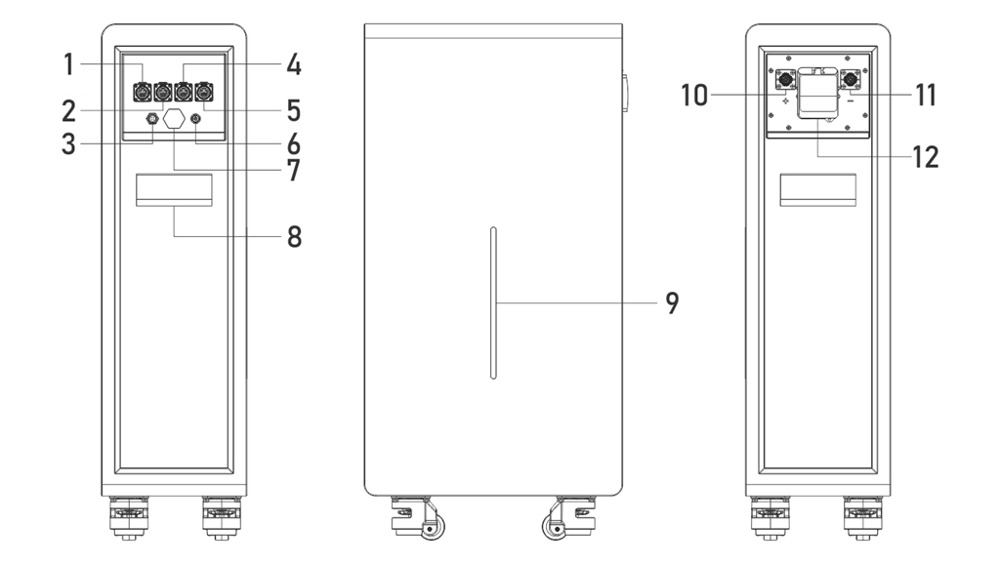
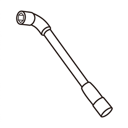
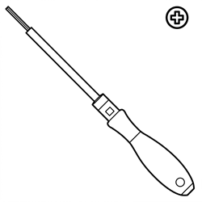
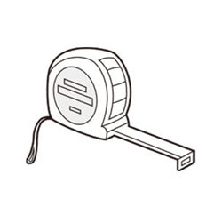
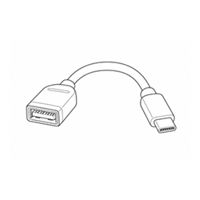
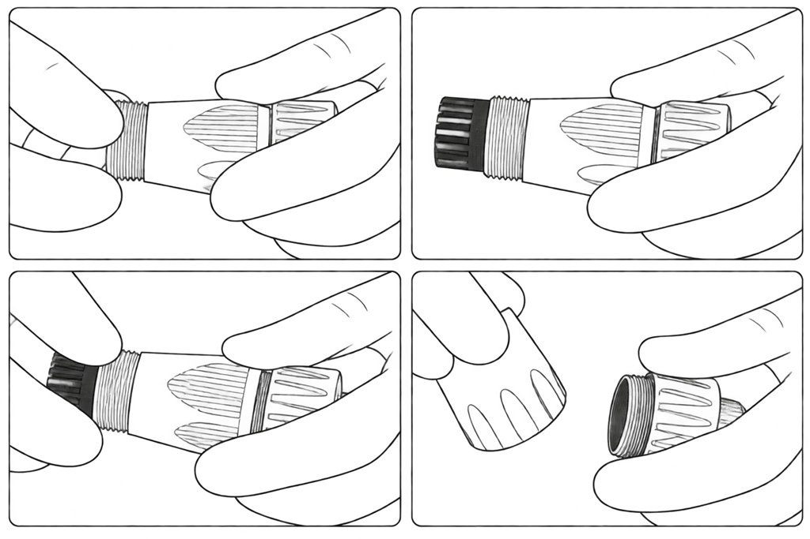

# Gobel PowerCarol 16 安装手册

本手册适用于 Gobel Power Carol 16 系列（型号 GP-WP1-16K-PC200B）。

## 1. 产品简介

本产品为 Gobel Power Carol 16（型号 GP-WP1-16K-PC200B）51.2V 314Ah 磷酸铁锂（LiFePO₄）低压储能电池，采用高性能 314Ah 磷酸铁锂电芯，落地式结构，底部带脚轮、侧面带把手，防护等级 IP65，室内外均可安装，并配备高性能电池管理系统（BMS），实现对电池的全面监控和保护。

### 1.1 产品一览

| 项目 | 规格 |
| :--- | :--- |
| 产品名称 | Gobel PowerCarol 16 |
| 产品型号 | GP-WP1-16K-PC200B |
| 品牌 | Gobel Power |
| 产品类型 | 51.2V 314Ah 磷酸铁锂低压储能电池 |
| 额定电压 | 51.2V |
| 额定容量 | 314Ah（约 16kWh） |
| 防护等级 | IP65 |
| 安装方式 | 落地安装（带脚轮和把手） |
| 外形尺寸 | 详见[产品尺寸图](#Product-Dimensions) |
| 重量 | 125kg |

### 1.2 产品特点

- **高容量储能**：额定容量 314Ah（约 16kWh），满足家庭及小型工商业储能需求
- **安全可靠**：磷酸铁锂电芯化学性质稳定，热稳定性优异
- **智能 BMS 管理**：实时监控电池电压、电流、温度、SOC（剩余电量）等参数，提供过充、过放、过温、短路等多重保护
- **灵活扩展**：最多支持 63 台电池并联，扩容方便；并联地址由系统自动分配（自动拨号），无需手动拨码
- **室内外皆宜**：防护等级 IP65，落地式安装，室内外均可安装
- **移动方便**：底部带脚轮、侧面带把手，单人即可短距离移动设备
- **在线监控**：内置 WiFi 接口，兼容 Gobel VRM 在线监控平台，并支持接入 Home Assistant、ioBroker 等平台
- **手机 APP 管理**：可使用 Gobel Console APP 对电池进行一键配置和升级
- **标准接口**：提供 RS485A/CAN（逆变器）、RS232（电脑/手机）、RS485B/RS485C（并联）等多种通讯接口，适配主流逆变器

### 1.3 适用场景

- 家庭光伏储能系统
- 小型工商业储能系统
- 备用电源（UPS）系统
- 离网储能系统
- 室外储能系统（IP65 防护）

### 1.4 产品外观与接口

下图为电池面板各接口、指示灯及操作部件的说明（图中数字编号对应下表）：

| 编号 | 名称 | 说明 |
| :---: | :---: | :--- |
| 1 | RS485A/CAN 端口 | 逆变器通讯接口 |
| 2 | RS232 端口 | 连接电脑或手机，用于上位机监控和参数设置 |
| 3 | WiFi 接口 | 无线通讯接口，连接 Gobel VRM 在线监控平台、Home Assistant、ioBroker 等 |
| 4 | RS485B 端口 | 电池并联通讯接口 |
| 5 | RS485C 端口 | 电池并联通讯接口 |
| 6 | ON/OFF 开关 | 开启或关闭电池 BMS |
| 7 | 排气阀 | 内部压力异常时自动泄压，请勿遮挡 |
| 8 | 把手 | 用于移动和搬运电池 |
| 9 | LED 灯条 | 指示 SOC（剩余电量）、Run（运行）及 Alarm（告警）状态 |
| 10 | 正极端子 | 正极储能快插接线端子，最大承载电流 200A |
| 11 | 负极端子 | 负极储能快插接线端子，最大承载电流 200A |
| 12 | 断路器 | 电池主回路通断控制 |

各通讯接口的引脚定义详见[附录](#Appendix)中的[产品通信引脚定义](#Communication-Pin-Definitions)章节。

## 2. 安全须知

在安装、使用和维护本产品之前，请仔细阅读并理解以下安全须知。不遵守这些说明可能导致人身伤害、设备损坏或财产损失。请勿遮盖、涂改或撕除产品上的警示标识和参数铭牌。

### 2.1 操作人员与防护要求

:::note 操作人员要求
安装和维护操作应由具备电气知识的专业人员进行。不熟悉电气设备操作的人员请勿自行安装。
:::

:::warning 个人防护
- 操作时请使用绝缘工具并佩戴绝缘手套，摘下手表、戒指等金属饰品
- 不要在电池上放置工具或金属零件，防止端子接触裸露导线或金属物体
- 相邻的带电部件应加以遮盖或防护
- 设备故障时部件可能变得极热，请勿触碰，以防烫伤
:::

### 2.2 安全注意事项

:::danger 电击危险
本产品为储能设备，操作不当可能导致严重电击事故。在进行任何电气连接或维护操作前，务必断开电池断路器并通过 ON/OFF 开关关闭 BMS。
:::

:::caution 电池安全
- 禁止短路电池正负极端子，短路会产生极高电流，可能导致火灾或爆炸
- 操作前确认电池正负极连接正确，反接将损坏设备
- 不要在电池附近使用明火或产生火花的设备
- 如发现电池外壳变形、漏液或异常发热，立即停止使用并联系技术支持
:::

:::caution 电解液处理
电解液对皮肤和眼睛有害且可能有毒，请勿触碰。若电解液不慎接触眼睛或皮肤，请立即用清水持续冲洗至少 10 分钟，并尽快就医。
:::

:::danger 禁止擅自拆解
除厂家授权人员外，任何人不得打开、维修或拆解电池。电池内部无可维修部件，擅自拆解、改装将导致质保失效并可能引发安全事故。建议在产品附近设置警示标识或围栏，防止误操作。
:::

:::caution 报废与回收
- 破损、鼓包或漏液的电池应立即停用，存放于干燥阴凉、防潮避光的环境中；不要自行修复或拆解，请联系安装商、销售商或专业回收机构处理
- 废旧电池不得作为生活垃圾丢弃，请按当地法规交由指定的回收点处理，处置前请先清除产品上的隐私相关信息
:::

:::warning 灭火要求
电池发生火灾时，只能使用干粉灭火器灭火，严禁使用液体灭火器。请勿将电池置于明火、加热器等高温热源附近。
:::

:::caution 搬运安全
本产品重量达 125kg，禁止强行单人搬运，搬运和移动时需使用合适的搬运工具并由多人协作完成。产品上重下轻，禁止侧放和倒置，移动时防止设备倾倒造成人身伤害。搬运方法详见[运输与搬运](#Transportation-Handling)章节。
:::

## 3. 运输与搬运

### 3.1 运输要求

- 运输过程中防止剧烈振动、冲击和挤压，避免阳光直射、雨淋和受潮，做好防雨、防潮和防晒措施
- 运输、装卸区域内严禁吸烟；未经许可，货运人员不得擅自打开电池包装
- 锂离子电池属于 9 类危险品（UN3480），跨境海运、陆运、空运须符合相应危险品运输法规，并按规定张贴危险品标签
- 运输前如发现电池有异味、漏液、冒烟、起火或其他异常，严禁运输
- 运输操作应由经过培训的专业人员进行，搬运人员须佩戴防护手套和安全鞋
- 产品到达安装现场前，请勿拆除运输包装

### 3.2 搬运方式

#### 3.2.1 人工搬运

- 产品重达 125kg，禁止强行单人搬运；搬运前确认人员身体状况良好，佩戴防滑手套、安全鞋等防护装备，注意尖锐金属面板和重物
- 搬运前清理搬运路径并确认地面安全；经过坡道、狭窄空间和楼梯时应减速慢行，并安排专人协助
- 产品上重下轻，禁止侧放、倒置和无固定搬运，移动过程中应采取措施防止倾倒
- 短距离平地移动可利用侧面[**把手**](#Product-Interface)配合底部[**脚轮**](#Product-Interface)推行，移动到位后锁紧脚轮
- 搬运时贴近设备、屈膝平稳发力，用腿部而非腰部力量起升，不要猛拉或扭转身体；转弯时移动脚步而非扭转腰部
- 平稳匀速移动设备并轻抬轻放，防止碰撞、跌落、刮擦或损坏部件和线缆
- 搬运完成后确认设备放置稳固，防止倾倒伤人

#### 3.2.2 使用搬运设备

- 使用叉车等搬运设备时，须由持证专业人员操作，遵守设备操作要求；无关人员应远离作业区至少 2m，禁止站在或骑坐在叉车或货物上，禁止超载
- 搬运设备的额定载重应大于产品重量的两倍（本产品重 125kg，即大于 250kg），叉臂长度应不小于产品深度
- 控制行驶速度，禁止急转弯；倒车前确认后方安全，狭窄空间内应安排专人指挥
- 禁止在坡度 ≥5° 的坡道上作业；路面不平时应减速慢行
- 搬运过程中禁止倾斜或倒置产品；若不可避免发生倾斜，应尽快恢复直立并静置 2 小时后方可通电

## 4. 安装

### 4.1 安装前准备

#### 4.1.1 安装环境要求

- **地面**：安装地面应平整、坚固，具备足够的承重能力（产品重 125kg）
- **通风**：安装场所应通风良好，避免热量积聚；不要遮挡设备通风口或散热结构，远离设备出风口
- **环境条件**：干燥、清洁，无腐蚀性气体或粉尘；环境温度 0°C ~ 50°C，相对湿度不超过 95% RH（无凝露）；建议安装海拔不超过 3000m
- **安全距离**：远离易燃易爆物品；远离热源、明火及高温物体，不得在存在易燃易爆气体或烟雾的环境中安装或运行，设备周围不得存放易燃易爆材料
- **防水防雨**：本产品防护等级为 IP65，室内外均可安装；但仍不得安装在可能被水淹没的位置，应远离易发生积水、冷凝或渗水的区域，避免长时间浸泡
- **腐蚀环境**：避免磁性粉尘、挥发性或腐蚀性气体、有机溶剂、导电金属粉尘及盐雾环境
- **电磁与振动**：避免强烈振动、噪声和电磁干扰的场所
- **其他**：不得将设备安装在船舶、火车、汽车等移动载体上；安装位置应远离儿童及日常生活、工作区域

为保证散热和维护操作空间，电池与墙壁或其他设备之间应保持足够的间距：

- 电池两侧与墙壁距离 ≥ 100mm
- 电池顶部与上方障碍物距离 ≥ 300mm
- 电池前方（接口面板一侧）应预留至少 800mm 的操作空间

:::caution
安装及通电前请清除安装区域内的粉尘和铁屑；安装前确认场地具备足够的承重能力并做好防静电措施；不得将设备安装在封闭、通风不良且无消防设施，或消防人员无法进入的场所。
:::

#### 4.1.2 工具要求

安装前请准备以下工具和仪表：

| 工具/仪表 | 用途 | 图片 |
| :--- | :--- | :---: |
| 套筒扳手 | 紧固逆变器侧动力端子（按逆变器要求） |  |
| 活动扳手 | 紧固逆变器侧端子螺母 |  |
| 十字螺丝刀 | 紧固逆变器侧接线螺丝等 |  |
| 万用表 | 测量端子电压 |  |
| 压线钳 | 自制动力线缆，压接储能快插接线端子 |  |
| 网线压线钳 | 室外安装时重新压接水晶头 |  |
| 卷尺 | 测量线缆长度及安装距离 |  |
| 记号笔 | 标记测量位置 |  |
| 水平尺 | 确认设备安放水平 |  |
| 绝缘手套 | 操作防护 |  |
| 绝缘鞋 | 操作防护 |  |
| 护目镜 | 作业防护（推荐配备） |  |
| Windows 系统电脑 | 用于上位机协议设置 | — |
| 智能手机 | 用于 Gobel Console APP 配置 | — |

:::note
自制动力线缆（压接储能快插接线端子）的完整操作步骤见[制作动力线缆](#Power-Cable-Assembly)。
:::

### 4.2 开箱与检查

#### 4.2.1 部件清单

开箱后请对照下表清点产品及配件，确认所有部件齐全完好。

| 编号 | 名称 | 规格/数量 | 图片 |
| :---: | :---: | :---: | :---: |
| <a id="Part01">01</a> | Gobel PowerCarol 16 储能电池 | 51.2V 314Ah，1台 |  |
| <a id="Part02">02</a> | 正/负极储能快插接线端子（cable side power connector） | 200A，正负极各 1 个（需自行压接线缆） |  |
| <a id="Part03">03</a> | 通讯网线 | 两端 RJ45，对称线序，1根（可作并联线或逆变器通讯线） |  |
| <a id="Part04">04</a> | RS232-USB 通讯线 | 1根（连接电脑上位机） |  |
| <a id="Part05">05</a> | USB-Type C 数据线 | 1根（连接手机） |  |
| <a id="Part06">06</a> | RJ45 防水格兰头（RJ45 Cable Waterproof Gland） | 2个（室外安装防水用） |  |
| <a id="Part07">07</a> | 水晶头（RJ45 插头） | 4个（室外安装重新压接用） |  |

#### 4.2.2 开箱检查步骤

收到产品后，请按以下步骤进行开箱检查：

1. 将储能电池（[01](#Part01)）从包装中取出，检查外包装及产品外观是否完好。

2. 对照[部件清单](#Parts-List)检查产品及配件是否有缺失或损坏。

3. 按面板上的 [**ON/OFF 开关**](#Product-Interface)开机，观察 [**LED 灯条**](#Product-Interface)显示是否正常。

4. 将[**断路器**](#Product-Interface)拨到 ON 位置，使用万用表测量电池[**正极端子**](#Product-Interface)和[**负极端子**](#Product-Interface)的电压，正常电压应在 40V ~ 58V 之间。

5. 如检查结果全部正常，即可进行下一步安装操作。

:::caution
如发现产品外观破损、配件缺失或电压异常，请勿继续安装，及时联系 Gobel Power 技术支持。
:::

:::note 开箱提示
- 产品运抵安装现场前，请勿提前拆除运输包装；开箱时小心操作，避免划伤设备
- 开箱前检查外包装是否破损、冲击指示器是否已触发；若已触发，则不能排除运输损坏的可能
- 安装前请清洁所有部件；搬运和存放过程中防止碰撞和划伤，并做好防潮、防锈措施
- 系统应在交付后 6 个月内完成安装调试；长期闲置存放会加速电池容量衰减
:::

### 4.3 安装步骤

本产品为落地式结构，底部带脚轮、侧面带把手，移动方便。安装步骤如下：

1. 将储能电池（[01](#Part01)）的[**断路器**](#Product-Interface)关闭，并按[**ON/OFF 开关**](#Product-Interface)关机。

2. 利用侧面[**把手**](#Product-Interface)配合底部[**脚轮**](#Product-Interface)将电池移动到预先确定的安装位置（建议两人配合，防止倾倒），移动到位后锁紧脚轮。

3. 使用水平尺确认设备安放水平；如地面不平，请调整设备位置或垫平，确保设备稳固不晃动。

:::caution
移动电池时注意地面平整度，避免倾斜角度过大。电池重达 125kg，移动时务必注意安全，防止倾倒伤人。接口面板一侧应朝向便于接线和维护的方向。
:::

:::caution 安装纪律
- 安装必须严格按照本说明书和设计要求进行，禁止擅自更改安装步骤或技术参数
- 安装及接线过程中所有开关保持 OFF 位置，严禁带电作业
- 所有紧固件均需牢固可靠
:::

### 4.4 安装后检查

安装完成后，确认以下各项正常：

- 电池外观完好，无变形、磕碰或划伤
- 设备放置稳固，脚轮已锁紧
- 周围通道畅通，无易燃易爆物品
- 警示标识和参数铭牌完整、清晰
- 现场消防设备就位且符合要求

## 5. 电气连接

### 5.1 安全注意事项

:::warning 接线要求
本产品仅支持并联连接，严禁串联，最多支持 63 台并联。串联可能导致设备损坏或安全隐患。
:::

:::warning 电气安全注意事项
- 电池断电后端子间可能仍有残余电压，接线操作前请等待至少 10 分钟，并用万用表确认无电压
- 严禁将电池直接连接至交流电网或光伏（PV）直流线路，电池只能连接至匹配的逆变器等电力转换设备
- 请勿使用故障或与电池不匹配的逆变器等电力转换设备；连接前确认电池系统参数与所连接设备完全兼容
- 请勿在沙尘暴天气或周围相对湿度超过 95% 的环境下进行电气连接
- 接线操作请由具备电气知识的专业人员按第 2 章要求佩戴防护装备后进行
:::

### 5.2 连接准备

#### 5.2.1 线缆准备

连接前请确认以下线缆和部件准备就绪：

- **正/负极储能快插接线端子（[02](#Part02)）**：200A，正负极各 1 个，需自行压接线缆
- **通讯网线（[03](#Part03)）**：两端 RJ45、对称线序，可作并联通讯线或逆变器通讯线
- **RS232-USB 通讯线（[04](#Part04)）**：用于连接 Windows 系统电脑，进行上位机监控和协议设置
- **USB-Type C 数据线（[05](#Part05)）**：用于连接手机，使用 Gobel Console APP 进行配置
- **RJ45 防水格兰头（[06](#Part06)）及水晶头（[07](#Part07)）**：室外安装时用于制作防水通讯线缆

同时请确认逆变器等其他设备已安装到位，并将逆变器关机断电；请同时查阅逆变器手册中与电池连接相关的部分。

#### 5.2.2 制作动力线缆

动力线缆需自行制作，请自配合适长度的 50mm² 动力线缆，并按以下步骤将线缆压接到正/负极储能快插接线端子（[02](#Part02)）：

1. 拧下正/负极储能快插接线端子的尾盖（电缆护套夹紧螺母），将 50mm² 线缆一端穿过尾盖。
2. 按端子压接铜环的压接长度要求剥除线缆端部绝缘层（注意勿损伤铜芯），将剥出的铜芯全部插入端子压接铜环底部。
3. 使用与 50mm² 线缆匹配的压线钳及对应压模，在压接铜环的规定压接位置施压压接，压接后目视检查压接部位并轻拉线缆，确认压接牢固、导通良好。
4. 将尾盖重新拧回端子并拧紧，使尾盖可靠夹紧线缆护套，防止线缆被拉拽时受力传导至压接部位。

   

5. 线缆另一端根据实际连接对象压接对应端子：直接连接逆变器时，按逆变器输入端子规格压接（如 M8 OT 端子）；多台电池经汇流排并联时，按汇流排连接方式压接（如 M8/M10 OT 端子），并按逆变器或汇流排手册要求的扭矩紧固。

:::danger
压接不良会导致端子接触电阻增大、异常发热甚至烧毁。压接作业请由具备相应资质的人员使用合格工具完成；压接后务必逐项检查确认牢固后方可投入使用的连接。
:::

#### 5.2.3 制作防水通讯线缆

室外安装时，通讯线缆连接电池的一端（并联线为两端）需使用附件中的 RJ45 防水格兰头（[06](#Part06)）和水晶头（[07](#Part07)）做防水处理。按线缆用途分为两种情况：

- **逆变器通讯线（电池 → 逆变器）**：使用 1 个格兰头，装配在连接电池的一端；另一端根据逆变器的要求处理。

- **并联通讯线（电池 → 电池）**：使用 2 个格兰头，两端各装配 1 个。

格兰头的装配步骤如下：

1. 拧下 RJ45 防水格兰头首尾两端的盖（首端防水盖和尾端锁紧盖），将拆下的尾盖套入网线；
2. 剪去水晶头后的网线穿过尾盖并插入格兰头本体；
3. 重新压接上水晶头（[07](#Part07)）；
4. 将首端防水盖重新拧回格兰头首端并拧紧；
5. 将格兰头首端对准面板上的防水端子插入，拧紧尾盖使格兰头锁紧固定并夹紧网线护套，实现防水密封。

:::note
制作并联通讯线时，另一端无需剪线：将第二个格兰头的尾盖和本体从剪掉水晶头的一端套入网线，推至保留原水晶头的一端，使原水晶头从格兰头首端穿出，拧紧该格兰头的尾盖即可。
:::

#### 5.2.4 电池地址说明

本产品无需手动拨码，并联地址由系统自动分配（自动拨号）。多台电池并联时，系统会自动指定主机与从机；逆变器通讯协议只需在主机上设置，详见[逆变器通讯协议设置](#Protocol-Settings)章节。

### 5.3 线缆连接

#### 5.3.1 接地连接

- 请按照当地电气规范及逆变器的要求，完成电池系统的接地连接
- 确保系统所在场合已安装过压保护装置

#### 5.3.2 电力线缆连接

将自制动力线的正极储能快插接线端子（[02](#Part02)）插入电池[**正极端子**](#Product-Interface)并锁紧到位，另一端连接至逆变器电池输入正极；将负极储能快插接线端子插入电池[**负极端子**](#Product-Interface)并锁紧到位，另一端连接至逆变器电池输入负极。

:::caution
连接时务必确认正负极对应正确，反接会导致设备严重损坏。每个端子最大承载电流为 200A，请根据系统实际电流确认端子和线缆的载流能力是否满足要求。插入端子时请确保锁紧到位，连接后轻拉线缆确认无松动。
:::

:::note 线缆敷设
请勿用力拉扯线缆，为线缆预留足够的弯曲空间，并使用合适的固定件减小线缆应力。
:::

#### 5.3.3 通讯线缆连接

将**通讯网线（[03](#Part03)）** 一端接到主机电池的 [**RS485A/CAN 端口**](#Product-Interface)上，另一端接到逆变器的 BMS 通信接口（具体使用 RS485 还是 CAN 协议，需查看逆变器手册并与电池的协议设置保持一致）。根据安装环境的不同，通讯线缆的接线方式如下：

- **室内安装**：可不使用 RJ45 防水格兰头，直接将网线水晶头插入 RS485A/CAN、RS485B、RS485C 或 RS232 通讯端口。

- **室外安装**：需使用附件中的 RJ45 防水格兰头（[06](#Part06)）制作防水通讯线缆，制作步骤见[制作防水通讯线缆](#Waterproof-Cable-Assembly)。

  RS232 端口由于用于连接上位机、不会一直连接，可不使用 RJ45 防水格兰头。

:::caution
请确认逆变器 BMS 通讯接口的引脚定义以及电池 RS485A/CAN 端口的引脚定义是否一致。本产品附带的通讯网线两端为对称线序，如果逆变器与电池的引脚定义不同，需要使用网线压线钳自行制作对应线序的通讯线缆或向逆变器厂商购买适配线缆（如 Victron 逆变器）。
:::

各通讯接口的引脚定义请参考[附录](#Appendix)中的[产品通信引脚定义](#Communication-Pin-Definitions)章节。

### 5.4 多台电池并联连接

:::caution
严禁将不同型号、不同规格的电池并联混用；本产品最多支持 63 台并联；多台电池连接时，线缆应沿指定路径敷设，不得随意更改布线走向。
:::

#### 5.4.1 并联电力连接

如果有多台电池并联使用，需要将每台电池的正负极端子通过动力线与汇流排连接，然后将汇流排连接到逆变器。

:::note
连接示意图请参考[附录四](#Connection-Diagrams)中的[电池与逆变器连接示意图](#Connection-Diagrams)章节。
:::

#### 5.4.2 并联通讯连接

多台电池并联时，需要用并联通讯线缆将各电池的 RS485B 与 RS485C 接口依次连接：第一台电池的 RS485B 连接第二台电池的 RS485C，第二台电池的 RS485B 连接第三台电池的 RS485C，以此类推。室外安装时，并联通讯线缆同样建议使用 RJ45 防水格兰头制作（见[制作防水通讯线缆](#Waterproof-Cable-Assembly)）。

:::note
并联通讯连接无需手动设置地址，系统自动分配（自动拨号）。
:::

### 5.5 连接后检查

全部线缆连接完成后，请逐项确认：

- 每完成一处连接后，检查连接是否正确、牢固，无松动或接触不良；快插端子锁紧到位，紧固件均已完全拧紧
- 正负极动力线极性正确、连接牢固可靠
- 防止端子接触裸露导线或金属物体，相邻带电部件应加以遮盖
- 清除设备周围的异物，尤其是金属碎屑，防止造成短路

## 6. 运行操作

### 6.1 开机前检查

:::caution 开机前检查
- [连接后检查](#Post-Connection-Inspection)各项均已确认无误
- 工作区域应清空，无关人员和动物应远离设备
:::

### 6.2 逆变器通讯协议设置

多台电池并联时，只需设置**主机**电池的通讯协议，从机无需设置。可以通过以下三种方式中的任意一种进行设置：

1. **连接电脑上位机设置**：使用 **RS232-USB 通讯线（[04](#Part04)）** 连接 Windows 系统电脑与主机电池，在电脑上位机程序软件中选择与逆变器匹配的通讯协议。

   :::note
   上位机详细操作请参见[参考文件](#Reference-Documents)章节中的《PCBMS软件使用说明》。
   :::

2. **连接手机 APP 设置**：使用 **USB-Type C 数据线（[05](#Part05)）** 连接手机与主机电池，在 Gobel Console APP 中选择与逆变器匹配的通讯协议。

3. **在 Gobel VRM 平台或 APP 上设置**：电池接入网络后，可在 Gobel VRM 平台或 APP 上选择与逆变器匹配的通讯协议。

:::note WiFi 配置
电池的 WiFi 配置及在线监控平台接入请参见《WiFi 使用说明书》。
:::

:::note 逆变器兼容性
设置通讯协议前，请先确认所用逆变器的品牌和型号与电池兼容。已验证兼容的逆变器列表请参见[参考文件](#Reference-Documents)章节中的《逆变器兼容列表》。
:::

### 6.3 开机

开机请按以下顺序操作：**BMS 开机（ON/OFF 开关）→ 等待 → 断路器 ON → 逆变器开机**。

1. 检查电力连接和通讯连接是否正常，确保各线缆连接牢固、无松动。

2. 按所有电池的 [**ON/OFF 开关**](#Product-Interface)开机（BMS ON），等待电池系统完成自检、[**LED 灯条**](#Product-Interface)显示正常且无告警。

3. 将所有电池的[**断路器**](#Product-Interface)拨到 ON 位置。

4. 打开逆变器的电源开关。

5. 在逆变器中设置电池类型为锂电池。

6. 检查逆变器中显示的电池信息，确认是否正确从电池 BMS 获取到了数据（如电池电压、电池 SOC、温度等）。

7. 如果逆变器中可正确读取数据，则安装完成，可进行充放电测试。

:::warning 开机顺序
请勿在开启断路器之前或同时打开逆变器，也不得跳过等待步骤直接闭合断路器，否则可能产生较大的冲击电流，导致设备损坏或触发保护。
:::

:::tip
开机后如发现逆变器无法读取电池数据，请检查通讯线缆连接是否正常，以及通讯协议设置是否正确。更多常见故障处理方法见[附录一](#Troubleshooting)。
:::

### 6.4 关机

关机请按以下顺序操作：**逆变器关机（Inverter OFF）→ 等待 → 断路器 OFF → BMS 关机（ON/OFF 开关）**。

1. 关闭逆变器及其所带负载，等待逆变器完全停止工作。

2. 将所有电池的[**断路器**](#Product-Interface)拨到 OFF 位置。

3. 按 [**ON/OFF 开关**](#Product-Interface)关闭各电池的 BMS。

:::caution
关机后端子间可能仍有残余电压，请勿立即触碰端子；如需进行维护操作，请遵循[维护安全注意事项](#Maintenance-Safety)。
:::

## 7. 产品监控

### 7.1 面板状态指示

可通过面板上的 [**LED 灯条**](#Product-Interface)了解电池的运行状态：

| 部件 | 说明 |
| :--- | :--- |
| LED 灯条 | 指示 SOC（剩余电量）、Run（运行）及 Alarm（告警）状态 |

告警（Alarm）指示点亮时，请及时排查故障原因；无法解决时请联系 Gobel Power 技术支持，常见故障处理方法见[附录一](#Troubleshooting)。

### 7.2 上位机及远程监控

本产品支持多种监控方式：

1. **电脑上位机监控**：使用 **RS232-USB 通讯线（[04](#Part04)）** 连接 Windows 系统电脑与电池，在电脑上运行电池上位机程序软件，可查看电池电压、电流、温度、SOC 等运行状态。

2. **手机 APP 监控**：使用 **USB-Type C 数据线（[05](#Part05)）** 连接手机与电池，通过 Gobel Console APP 查看电池状态，并可对电池进行一键配置和升级。

3. **WiFi 在线监控**：通过电池内置的 [**WiFi 接口**](#Product-Interface)接入网络后，可兼容 Gobel VRM 在线监控平台，并支持接入 Home Assistant、ioBroker 等平台实现远程监控。WiFi 配置方法请参见《WiFi 使用说明书》。

:::note
上位机详细操作请参见[参考文件](#Reference-Documents)章节中的《PCBMS软件使用说明》。
:::

## 8. 维护与存放

### 8.1 维护安全注意事项

- 维护前必须将电池完全断电（断开电网及电池侧电源），遵循"断电 → 防止误合闸 → 验证无电压 → 接地与短路保护 → 遮挡相邻带电部件"的原则
- 在开关位置悬挂"禁止合闸"警示牌，防止误送电
- 维护前断开电池所有端子及电路连接器，并为端子装上保护帽；使用绝缘工具，禁止佩戴首饰、手表等金属饰品

### 8.2 日常维护要求

- 更换部件时必须使用同类型、同规格的备件
- 不得对电池内外部件喷涂油漆，不得使用清洁溶剂清洁电池
- 发现任何异常情况，请在 24 小时内联系供应商
- 日常使用中请保持电池 SOC 高于 5%，满放电后 48 小时内及时充电，避免过放

### 8.3 维护后要求

- 维护完成后清理工具和材料，确认电池内部及顶部没有遗留金属异物
- 确认端子保护帽、防护罩等均已恢复到位后方可重新通电

### 8.4 长期存放

如果电池长期不使用，请按以下要求进行存放和维护：

- 将电池充满电，然后关闭[**断路器**](#Product-Interface)和 [**ON/OFF 开关**](#Product-Interface)（关闭 BMS）。
- 至少每 3 个月检查一次电池电压。如果电压低于 51V，需及时充电。
- 电池应存放于干燥、清洁、通风良好的场所，避免阳光直射和雨淋，远离高温热源、明火及易燃易爆物品
- 存放期间电池应与外部设备完全断开，确保 LED 灯条熄灭
- 存放区域地面应平整坚实，并配备合格的消防设施（如干粉灭火器、消防沙）
- 搬运存放时轻拿轻放，禁止跌落、碰撞、翻倒、侧放和倾斜

:::danger
未及时充电导致的电池损坏不在保修范围。长期存放不充电会导致电池过度放电，造成不可逆的容量损失甚至电池报废。
:::

## 9. 产品规格

### 9.1 技术参数

| 项目 | 参数 |
| :--- | :--- |
| 产品名称 | Gobel PowerCarol 16 |
| 产品型号 | GP-WP1-16K-PC200B |
| 品牌 | Gobel Power |
| 产品类型 | 51.2V 314Ah 磷酸铁锂低压储能电池 |
| **主要参数** | |
| 电芯类型 | 磷酸铁锂（LiFePO₄） |
| 额定容量 | 314Ah [1] |
| 并联扩展 | 最多 63 台并联 [2]，严禁串联 |
| 标称电压 | 51.2V |
| 工作电压 | 44.8V ~ 58.4V |
| 标称能量 | 16kWh |
| 可用能量 | 16kWh [1] |
| 最大输出功率 | 7.68kW |
| 充电电流 [3] | 最大持续 150A；峰值 200A（25 秒） |
| 放电电流 [3] | 最大持续 150A；峰值 200A（25 秒） |
| 主动均衡 | 是 |
| **其他参数** | |
| 最大放电深度 | 100% DOD |
| 外形尺寸（宽×高×深） | 477 × 959 × 270 mm |
| 重量 | 约 125kg |
| 显示 | LED 灯条（SOC、告警） |
| 防护等级 | IP65 |
| 工作温度 | 充电：0°C ~ 55°C；放电：-20°C ~ 55°C |
| 存放温度 | 0°C ~ 35°C |
| 相对湿度 | 95%（无凝露） |
| 海拔 | ≤3000m |
| 循环寿命 | ≥8000 次（25°C±2°C，70% EOL） |
| 电气隔离保护 | 内置断路器 |
| 安装方式 | 落地式（带脚轮和把手） |
| 通讯接口 | CAN、RS485、RS232、WiFi |
| 能量吞吐 | 50MWh [4] |

[1] 测试条件：25°C±2°C，生命周期初期（BOL），0.5C 充电 / 0.5C 放电，100% DOD。
[2] 电池模块上电后自动组网，无需拨码开关。
[3] 电流受温度和 SOC 影响。
[4] 能量吞吐指电池在整个使用寿命周期内累计充放电的总能量。

### 9.2 产品尺寸图

## 附录

### 附录一 常见故障与排除

| 现象 | 可能原因 | 处理方法 |
| :--- | :--- | :--- |
| 逆变器无法读取电池数据 | 通讯线缆连接松动或断路；两端引脚定义不匹配；通讯协议设置错误 | 检查通讯线缆连接；核对两端引脚定义（见[附录三](#Communication-Pin-Definitions)）；重新设置通讯协议（见[逆变器通讯协议设置](#Protocol-Settings)） |
| 开箱测得端子电压异常（低于 40V 或高于 58V） | 电量过低或产品异常 | 请勿继续安装或使用，联系 Gobel Power 技术支持 |
| 告警（Alarm）指示点亮 | 电池故障或告警 | 停止使用并排查故障原因，必要时联系 Gobel Power 技术支持 |
| 电池外壳变形、漏液或异常发热 | 电池内部异常 | 立即停止使用并联系技术支持，处置方法见[附录二](#Emergency-Handling) |
| WiFi 或手机 APP 无法连接电池 | WiFi 未配置或配置错误 | 参见《WiFi 使用说明书》重新配置 |
| 长期存放后电压低于 51V | 存放期间自放电 | 及时充电后再投入使用（见[长期存放](#Storage-Precautions)） |
| 快插端子连接处异常发热 | 端子未插紧到位或压接不良 | 断电后重新插紧端子，必要时按[制作动力线缆](#Power-Cable-Assembly)重新压接 |

### 附录二 应急处理

:::danger
发生触电、火灾、电解液泄漏等紧急情况时，应优先确保人身安全，及时疏散人员并拨打相应紧急电话；未经专业检查和合格测试，不得操作受损设备。
:::

#### 触电事故

- 在确保自身安全的前提下立即切断电源
- 使用绝缘物体使触电者脱离电源，并实施包括心肺复苏（CPR）在内的急救，同时立即拨打急救电话
- 保护好事故现场，以便调查取证
- 事故后须由专业人员对系统进行检查，经维修或更换并测试合格后方可重新投入使用

#### 火灾或爆炸风险

- 立即撤离现场并拨打火警电话，远离燃烧产生的烟气；灭火时只能使用干粉灭火器，严禁使用液体灭火器
- 在确保自身安全的前提下切断上游电源，并佩戴呼吸防护装备
- 在安全的前提下隔离事故区域，防止无关人员进入；事后处理须由专业人员完成

#### 电解液泄漏与化学危害

- 发生电解液泄漏时，立即疏散人员并通知相关人员，泄漏物须由专业人员安全收集和处置
- 电池燃烧或损坏时可能释放有毒气体，应立即撤离至安全区域；如人员暴露或受伤，请立即就医
- 处理泄漏物时请佩戴呼吸防护装备、防护服等安全装备

#### 机械伤害

- 设备倾倒、电池跌落或部件脱落时，立即断电并停止系统运行
- 如有人员受伤，先行止血、包扎等急救处理，并立即拨打急救电话
- 发现异味、破损、冒烟或起火等异常时，立即撤离并报警；异常电池应由专业人员转移至空旷安全区域，静置至少 1 小时并监控其温度

#### 自然灾害

- 发生地震、台风、洪水、山火等自然灾害时，立即断电并停止系统运行
- 系统被水淹或浸泡后，请勿触摸，远离积水区域；被水浸泡的电池不得继续使用，应联系专业回收机构报废处理
- 山火逼近前，可在系统周围设置防火隔离带，并准备灭火器、消防沙等消防器材
- 灾后由专业人员检查支撑结构、电气连接等部件，经维修或更换并测试合格后方可重新使用

### 附录三 产品通信引脚定义

#### RS485A/CAN 端口

**RS485A/CAN 模式引脚定义：**

| 引脚 | 定义 |
| :--: | :--: |
| 1 | B |
| 2 | A |
| 3 | GND |
| 4 | CAN-H |
| 5 | CAN-L |
| 6 | GND |
| 7 | A |
| 8 | B |

#### RS232 端口

| 引脚 | 定义 |
| :--: | :--: |
| 1 | NC |
| 2 | NC |
| 3 | TXD |
| 4 | RXD |
| 5 | GND |
| 6 | NC |

#### RS485B 和 RS485C 端口

| 引脚 | 定义 |
| :--: | :--: |
| 1 | B |
| 2 | A |
| 3 | GND |
| 4 | NC |
| 5 | NC |
| 6 | GND |
| 7 | A |
| 8 | B |

### 附录四 电池与逆变器连接示意图

**单台电池与逆变器连接示意图**

:::note
图中实线为动力线缆，点线为通讯线缆。
:::

**多台电池与逆变器连接示意图**

:::note
图中实线为动力线缆及汇流排，点线为逆变器通讯线缆，点划线（-.-.-）为电池并联通讯线缆。
:::

### 参考文件

除本说明书外，请根据需要参阅以下配套文档：

| 文档名称 | 说明 | 链接 |
| :--- | :--- | :--- |
| WiFi 使用说明书 | 电池 WiFi 配置及 Gobel VRM、Home Assistant、ioBroker 等在线监控平台接入 | 预留 WiFi 使用说明书链接 |
| PCBMS软件使用说明 | 电脑上位机软件的安装与详细操作说明 | 预留上位机详细操作指南链接 |
| Gobel Console使用说明 | 手机 APP 的连接、一键配置和升级操作 | 预留 Gobel Console使用说明链接 |
| 逆变器兼容列表 | 已验证兼容的逆变器品牌和型号清单 | 预留逆变器兼容列表链接 |

## 联系方式

如遇到无法解决的故障或需要技术支持，请联系 Gobel Power：

| 项目 | 信息 |
| :--- | :--- |
| 官方网站 | [www.gobelpower.com](http://www.gobelpower.com) |
| 技术支持邮箱 | [cs@gobelpower.com](mailto:cs@gobelpower.com) |
