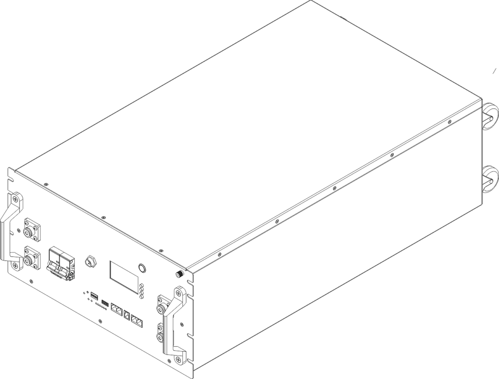

# Gobel PowerFable 16 产品简介

PowerFable 16 是 Gobel Power 推出的 51.2V 314Ah（约 16kWh）磷酸铁锂（LiFePO₄）低压储能电池。它采用高性能 314Ah 磷酸铁锂电芯，标准 6U 机架式结构，底部带脚轮，并配备高性能电池管理系统（BMS），实现对电池的全面监控和保护，适用于家庭及小型工商业储能场景。

## 产品特点

- **高容量储能**：额定容量 314Ah（约 16kWh），满足家庭及小型工商业储能需求
- **安全可靠**：磷酸铁锂电芯化学性质稳定，热稳定性优异
- **智能 BMS 管理**：实时监控电池电压、电流、温度、SOC（剩余电量）等参数，提供过充、过放、过温、短路等多重保护
- **灵活扩展**：最多支持 63 台电池并联，扩容方便；拨码开关支持自动地址分配，无需逐台手动拨码
- **多种安装方式**：6U 标准机架式设计，带脚轮，支持机架安装、堆叠安装（最多 3 层）及落地安装
- **在线监控**：内置 WiFi 接口，兼容 Gobel VRM 在线监控平台，并支持接入 Home Assistant、ioBroker 等平台
- **手机 APP 管理**：可使用手机 APP 对电池进行一键配置和升级
- **标准接口**：提供 RS485A/CAN（逆变器）、RS232（电脑/手机）、RS485B/RS485C（并联）等多种通讯接口，适配主流逆变器

## 版本说明

PowerFable 16 系列按所用 BMS 分为两个子版本，电气参数与安装方式相同，BMS 相关功能（通讯协议设置、上位机软件、手机 APP）不同：

| 项目 | PCBMS 版 | JKBMS 版 |
| :--- | :--- | :--- |
| 产品型号 | GP-SR1-16K-PC200B | GP-SR1-16K-JK200 |
| 曾用型号 | GP-SR1-PC314 | GP-SR1-JK314 |
| BMS 类型 | PCBMS | JKBMS |
| 通讯协议设置 | 屏幕菜单 / PCBMS 上位机 / Gobel Console APP | 屏幕菜单 / JKBMS 上位机 / JKBMS APP |

:::note 如何确认版本
请以产品铭牌或面板上的型号为准：型号以 **PC200B** 结尾为 PCBMS 版，以 **JK200** 结尾为 JKBMS 版。曾用型号 **GP-SR1-PC314** 对应现 PCBMS 版，**GP-SR1-JK314** 对应现 JKBMS 版。
:::

## 规格概览

| 项目 | 规格 |
| :--- | :--- |
| 品牌名称 | Gobel PowerFable 16 |
| 产品类型 | 51.2V 314Ah 磷酸铁锂低压储能电池 |
| 额定电压 | 51.2V |
| 额定容量 | 314Ah（约 16kWh） |
| 防护等级 | IP21 |
| 安装方式 | 机架安装 / 堆叠安装（≤3 层）/ 落地安装 |
| 外形尺寸 | 482.6 × 241.3 × 773mm（宽 × 高 × 深） |
| 重量 | 120kg |

:::note 完整规格
完整电气参数请参见安装手册中的产品规格章节。
:::

## 适用场景

- 家庭光伏储能系统
- 小型工商业储能系统
- 备用电源（UPS）系统
- 离网储能系统
