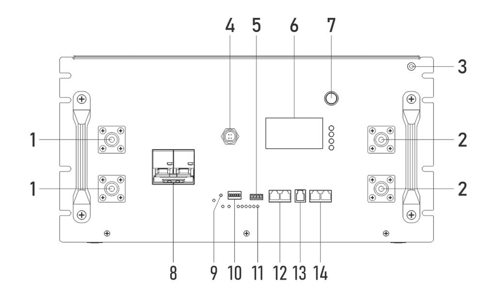

# GP-SR1-16K-PC200B 快速安装指南（PCBMS 版）

本指南适用于 Gobel Power PowerFable 16 系列 **PCBMS 版本**（型号 GP-SR1-16K-PC200B），面向有经验的安装人员，仅列出关键步骤与要点。完整的安装说明、安全须知与故障处理请参见《GP-SR1-16K-PC200B 安装手册（PCBMS 版）》。JKBMS 版本（GP-SR1-16K-JK200）请使用其对应的文档。

## 1. 产品关键参数

| 项目 | 参数 |
| :--- | :--- |
| 产品型号 | Gobel PowerFable 16（GP-SR1-16K-PC200B）PCBMS 版 |
| 额定电压/容量 | 51.2V / 314Ah（约 16kWh） |
| 输出端子 | 正极端子一对、负极端子一对，M8 螺孔，单个端子最大 200A |
| 连接方式 | 仅支持并联（最多 63 台），严禁串联 |
| 安装方式 | 机架安装 / 堆叠安装（≤3 层）/ 落地安装，底部带脚轮 |
| 尺寸/重量 | 482.6 × 241.3 × 773mm，120kg |
| 工作环境 | 0°C ~ 50°C，≤95% RH（无凝露），IP21（不可室外露天安装） |

## 2. 面板关键部件

| 编号 | 名称 | 用途 |
| :---: | :--- | :--- |
| 1 / 2 | 正极/负极端子 | M8，各一对，动力线连接 |
| 3 | 接地端子 | 系统接地 |
| 6 | 显示屏及按键 | 查看状态、设置通讯协议 |
| 7 | ON/OFF 开关 | 开启/关闭 BMS |
| 8 | 断路器 | 电池主回路通断 |
| 10 | 拨码开关（ADS） | 并联地址设置（支持自动拨号） |
| 12 | RS485A/CAN 端口 | 逆变器通讯 |
| 13 | RS232 端口 | 连接电脑上位机 |
| 14 | RS485B/RS485C 端口 | 电池并联通讯 |

## 3. 安全要点

:::danger 电击危险
操作前务必断开电池断路器并按 ON/OFF 开关关闭 BMS；断电后端子间可能仍有残余电压，等待至少 10 分钟并用万用表确认无电压后再接线。
:::

:::caution
- 严禁短路正负极端子，严禁反接；严禁串联电池
- 本产品重 120kg，禁止单人搬运，禁止侧放和倒置
- 使用绝缘工具，佩戴绝缘手套，摘下金属饰品
- IP21 不防水，严禁室外露天安装、雨淋和水溅
- 除厂家授权人员外严禁拆解电池
:::

## 4. 安装

1. **选择安装方式**（三选一）：
   - **机架安装**：装上机架固定耳（左右耳），多人配合推入 19 英寸机架并固定
   - **堆叠安装**：最多 **3 层**，各层对齐、平稳放置
   - **落地安装**：脚轮推到位后锁紧，可选配墙体固定支架固定到墙体

2. **环境要求**：地面承重足够、通风良好、干燥清洁；电池两侧距墙 ≥100mm，顶部 ≥300mm，前方预留 ≥800mm 操作空间。

3. **开箱检查**：对照部件清单清点；按 ON/OFF 开机、闭合断路器，用万用表测正负极端子电压，正常应在 **40V ~ 58V** 之间。异常请勿安装，联系技术支持。

## 5. 电气连接

### 5.1 接地

用接地线将接地端子可靠接地，接地电阻应小于 1Ω。

### 5.2 电力连接

- 正极动力线（M8 端子）→ 逆变器电池输入正极；负极动力线 → 逆变器电池输入负极
- M8 端子螺丝按 **15N·m** 扭矩拧紧
- 单个端子最大 200A：逆变器电流 >200A 时须通过汇流排连接（详见安装手册附录五连接示意图）

:::caution
连接前确认逆变器已关机断电；务必确认正负极对应正确，反接会导致设备严重损坏。
:::

### 5.3 拨码开关（并联地址）

- **单台电池**：拨为 ON、OFF、OFF、OFF、OFF、OFF（地址 1，主机）
- **多台并联**：任选一台作主机（地址 1），其余按地址 2~63 拨码；或将**所有电池拨码全部拨为 OFF**，由系统自动分配地址（自动拨号，推荐）
- 拨码设置表见安装手册附录四

### 5.4 通讯连接

- **逆变器通讯**：通讯网线一端接**主机**电池的 RS485A/CAN 端口，另一端接逆变器 BMS 通信接口（RS485 或 CAN 视逆变器而定）
- **并联通讯**（多台时）：第一台的 RS485B 接第二台的 RS485C，第二台的 RS485B 接第三台的 RS485C，依次链式连接
- 随附网线为对称线序；若与逆变器引脚定义不匹配，须自制线缆（如 Victron 逆变器），引脚定义见安装手册附录三

:::note
图中实线为动力线及汇流排，点线为逆变器通讯线，点划线（-.-.-）为电池并联通讯线。
:::

## 6. 通讯协议设置

多台并联时只需设置**主机**。三种方式任选其一：

1. **屏幕设置**：通过显示屏及按键进入设置菜单，选择与逆变器匹配的协议
2. **电脑上位机**：RS232-USB 通讯线连接 Windows 电脑设置
3. **手机 APP**：USB-Type C 数据线连接手机，在 Gobel Console APP 中设置

:::note
设置前请先确认逆变器与电池兼容（兼容列表见安装手册"参考文件"章节）。
:::

## 7. 开机

**BMS 开机（ON/OFF 开关）→ 等待自检完成 → 断路器 ON → 逆变器开机**

1. 确认所有线缆连接牢固、区域无人员和异物
2. 按所有电池的 ON/OFF 开关开机，等待显示屏正常且无告警
3. 将所有电池的断路器拨到 ON
4. 打开逆变器电源，设置电池类型为锂电池
5. 确认逆变器能正确读取电池数据（电压、SOC、温度等），即可进行充放电测试

:::warning
请勿在断路器闭合之前或同时打开逆变器，不得跳过等待步骤，否则可能产生冲击电流损坏设备。
:::

## 8. 关机

**逆变器关机 → 等待完全停止 → 断路器 OFF → BMS 关机（ON/OFF 开关）**

:::caution
关机后端子间可能仍有残余电压，请勿立即触碰端子。
:::

## 9. 常见问题速查

| 现象 | 处理方法 |
| :--- | :--- |
| 逆变器无法读取电池数据 | 检查通讯线连接；核对引脚定义；重设通讯协议 |
| 告警灯（ALM）点亮 | 排查故障原因，无法解决联系技术支持 |
| 电压低于 40V 或高于 58V | 停止安装使用，联系技术支持 |
| WiFi/APP 无法连接 | 参见《WiFi 使用说明书》重新配置 |
| 存放后电压低于 51V | 及时充电（长期存放须至少每 3 个月检查一次） |

详细故障处理、应急处理及通信引脚定义请参见安装手册附录。

## 10. 更多文档

- 《GP-SR1-16K-PC200B 安装手册（PCBMS 版）》（完整版）
- 《WiFi 使用说明书》《上位机操作流程文档》《Gobel Console APP 使用说明》《逆变器兼容列表》（见安装手册"参考文件"章节）

## 联系方式

| 项目 | 信息 |
| :--- | :--- |
| 官方网站 | [www.gobelpower.com](http://www.gobelpower.com) |
| 技术支持邮箱 | [cs@gobelpower.com](mailto:cs@gobelpower.com) |
